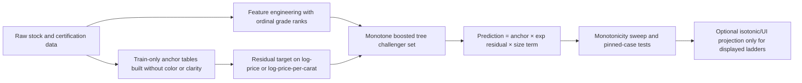

# Deep Research Report on the Attached S23 Markdown Problem

## Executive summary

The attached markdown is not a generic math exercise. It is a model-architecture decision problem for **lab-grown diamond pricing under sparse data**, where the business needs two things at the same time: low pricing error and **structurally correct grade ordering** so that better clarity or color never prices below worse grades in otherwise comparable stones. The proposal file argues that the production failure is caused primarily by a **grade-specific lookup anchor** that becomes sparse for rare combinations such as IF at 3 ct+, while the implementation note reports that the proposed S23 design already passed the stated acceptance gates with **6.91% selected-spec MAPE**, **zero raw clarity inversions**, and **no IF floor hack**. fileciteturn0file1 fileciteturn0file0

On the merits, the core S23 idea is sound. Official documentation across LightGBM, XGBoost, scikit-learn, and CatBoost all line up with the same modeling principle: **monotonic constraints are imposed on ordered numeric features**, not on a collection of unordered one-hot grade indicators. That means the proposal’s shift from one-hot `Clarity_*` and `Color_*` columns to **ordinal rank features** is the right representation change, not just an implementation detail. LightGBM explicitly supports per-feature monotone constraints and offers `basic`, `intermediate`, and `advanced` methods, with the latter two intended to be less over-constraining than the basic method. XGBoost and scikit-learn define the same kind of per-feature monotonicity, while CatBoost states that monotone constraints apply to **numerical features**. citeturn7view0turn7view1turn7view7turn23view0turn17view0

The highest-confidence conclusion is therefore this: **if the goal is to eliminate hand-written floor hacks and satisfy monotonic pricing requirements in the primary model, S23 is the right architectural direction**. However, one important hardening step remains. The current S23 feature set includes explicit `log(Carat) × GradeRank` interaction terms, but the constraints are only attached to the base rank features. Official monotonic-constraint documentation warns that such constraints are essentially **featurewise or marginal**, and do not automatically guarantee every cross-feature ordering one might want. XGBoost and scikit-learn both expose explicit **interaction constraints** precisely because unrestricted interactions can create unwanted behavior. LightGBM, by contrast, gives strong monotone split controls but not the same explicit interaction-control ergonomics. So the **current S23 run is empirically monotone on the tested cases**, but it is not the strongest possible formal construction yet. citeturn23view0turn23view1turn24view0turn7view2

My final recommendation is to keep **S23-style monotone residual boosting** as the champion architecture, but with one of two refinements before long-term production commitment: either **reparameterize or remove the explicit unconstrained grade-by-carat interaction features**, or run a challenger experiment with **XGBoost using both monotonic and interaction constraints**. If interpretability and formal smoothness matter more than squeezing the last fraction of a percentage point from MAPE, the best non-tree challenger is a **shape-constrained additive model**. For UI cleanup, ladder smoothing, or constrained baseline audits, use **isotonic regression or a convex optimization layer**, but not as the primary full-price engine. citeturn24view0turn12academia1turn11academia1turn19view1turn31view0

## Problem statement from the attached files

The two attached files play different roles. The first is a **design proposal** framing the problem and arguing for an S23 architecture. The second is an **implementation note** reporting an actual S23 training run and its outcomes. Together, they define the problem more precisely than the original prompt: the question is not simply “which ML model is best,” but rather **which model family can preserve directional pricing logic under sparse grade cells without sacrificing too much accuracy or breaking browser deployment constraints**. fileciteturn0file1 fileciteturn0file0

The attached history is internally coherent in one central respect. S20, the current production system, is described as **ExtraTrees plus a lookup anchor**. It performs well on dense cells, but the lookup key includes grade variables, so rare grade-size combinations can collapse to a weak fallback anchor. S21 proved that monotone boosting can eliminate inversions, but because it **kept the sparse grade-specific anchor**, the monotone residual model had to “fight” a bad anchor and paid an accuracy penalty. S23 fixes that by making the lookup anchor **grade-agnostic** and moving all color and clarity premium into a monotone residual model with ordinal grade ranks. fileciteturn0file1

The implementation note reports the following summary:

| Stage | Selected-spec MAPE | Raw clarity inversions | Key architectural point |
|---|---:|---:|---|
| S20 | about 6.0% | 1,127 | Accurate on dense cells, but not structurally monotone |
| S21 | about 6.75% | 0 | Monotone boosting works, but sparse anchor still hurts |
| S23 | 6.91% | 0 | Grade-agnostic anchor plus monotone residual passes acceptance |

These values and claims come directly from the attached markdown. fileciteturn0file1 fileciteturn0file0

Mathematically, the architectural change can be written as a decomposition problem. If \(z\) denotes non-grade covariates such as carat bucket, shape, and finishing variables, and \(g\) denotes the grade variables, then the **old** design is roughly

\[
\log \hat y = \log w + \log A(z,g) + f_\theta(z,g),
\]

where \(w\) is carat weight and \(A(z,g)\) is a **grade-specific** anchor. The problem is that \(A(z,g)\) becomes unstable or collapses when the cell for \(g\) is sparse. S23 changes the decomposition to

\[
\log \hat y = \log w + \log A(z) + h_\theta(z, r_{\text{clar}}, r_{\text{color}}, \ldots),
\]

where \(A(z)\) is now **grade-agnostic** and \(r_{\text{clar}}, r_{\text{color}}\) are ordered numeric ranks. That reshapes the task so the model no longer needs to overcome a bad anchor to learn grade premium; the anchor is shared, and the residual model carries the ordering logic. fileciteturn0file1

That is exactly why the proposal’s diagnosis is persuasive. In the old design, the implementation note gives the stark example of a fallback anchor near **\$127/ct** for sparse IF 3 ct+ round stones versus a real anchor near **\$638/ct** for VVS1 in the same coarse region, meaning the model would have to recover from a more-than-5x anchor mismatch before it could even start expressing the correct IF premium. S23 deliberately removes that failure mode. fileciteturn0file1 fileciteturn0file0

The implementation note also reports that, under S23, a 3 ct round E example prices **IF at about \$760** and **VVS1 at about \$570** with no floor hack. That implied IF/VVS1 ratio is about **1.334**, or **33.4% higher** for IF in that example, which is exactly the sort of transfer the architecture is trying to enable. fileciteturn0file0 citeturn26calculator0turn27calculator0

One nuance matters for governance. The implementation note treats **7.01% selected-spec MAPE** as the binding acceptance threshold and states that S23 passes it. The broader proposal also frames a more ambitious target for accuracy. The practical interpretation is that S23 currently looks like a **requirement-satisfying architecture**, not the numerically best architecture on every accuracy metric. If pure selected-spec MAPE were the only objective, S20 would still be attractive; if **monotone correctness in the primary model** is a real requirement, S23 appropriately dominates. fileciteturn0file1 fileciteturn0file0

## Research synthesis on solution methods

### Monotone boosted trees match the problem structure

LightGBM’s official parameter documentation explicitly supports `monotone_constraints` and distinguishes `basic`, `intermediate`, and `advanced` methods, with the documentation stating that the advanced methods are **less constraining** than the basic method and should improve results. The same docs also state that monotone constraints are enforced **when choosing split points**. That is a close match to what the proposal wants: monotonicity built into the tree-growing process rather than a post-hoc patch. citeturn7view0turn7view1turn7view2

XGBoost’s documentation defines monotonicity in the standard functional sense, supports it natively, and shows that the model can enforce increasing or decreasing behavior on specified features. It also warns that the histogram tree method can become **too shallow** under monotonicity unless `max_bin` is increased. That matters because it means monotonicity itself is not “free”; one must retune the tree construction under the constraint regime. citeturn7view7turn7view6

CatBoost’s documentation likewise supports monotone constraints, but it is explicit that they are imposed on **numerical features**. That makes CatBoost a credible alternative only if clarity and color are encoded as ordered numeric ranks, not as raw categoricals. In other words, the proposal’s ordinal-rank move is not just “LightGBM-specific wisdom”; it is the representation that multiple monotone libraries naturally require. citeturn17view0turn17view3

Scikit-learn’s histogram gradient boosting documentation reinforces the same point in especially clear language. It defines monotonic constraints featurewise and notes that they **only marginally constrain feature effects**. It also says that unordered categorical features cannot be made monotone. This is the cleanest external support for the proposal’s argument that one-hot grades are the wrong representation for an ordered business prior. citeturn23view0turn23view1turn23view2

### Post-hoc monotone projection is useful, but it is not a primary engine

Scikit-learn’s isotonic regression documentation defines isotonic regression as the problem of fitting the closest non-decreasing function to one-dimensional data under a least-squares criterion. That is exactly the mathematical object behind PAV-style ladder smoothing. It is excellent when the task is “after I have scores for a sequence of clarity grades, make the displayed ladder monotone while changing values as little as possible.” It is not a substitute for a full multivariate price engine because it works on a **one-dimensional ordered axis**, not on the entire joint feature space. citeturn19view1turn19view2

CVXPY, as an official convex optimization modeling tool, is also relevant here. It is a good choice when you want an exact constrained baseline, such as a monotone linear or piecewise-linear benchmark, or when you want to solve an explicit post-processing projection problem. But that is best thought of as an **audit tool, calibration tool, or symbolic baseline**, not as the highest-accuracy general-purpose production model for this dataset. citeturn31view0

### Shape-constrained additive models are the strongest interpretable challenger

The shape-constrained additive-model literature is directly relevant because the business prior here is not merely “tree-like nonlinearity”; it is “smooth nonlinear price response with monotone grade effects.” Chen and Samworth’s work on generalized additive models with shape constraints shows that monotonicity and related shape restrictions can be imposed directly in an additive modeling framework, and Wood’s GAM work provides a stable fitting and smoothing-selection foundation. That combination makes shape-constrained GAMs a very serious challenger whenever interpretability, smooth price ladders, and formal shape control matter more than extracting every interaction a boosted tree can find. citeturn12academia1turn11academia1turn11academia3

The trade-off is classic. A shape-constrained GAM will usually be easier to explain and audit than a multi-hundred-tree ensemble, but unless carefully extended with tensor interactions it will generally be less flexible than a tuned monotone GBDT on richly interacting tabular data. For this problem, that makes SCAM/GAM an excellent **challenger model** and possibly the best second-line choice, but not the most likely champion if production accuracy and browser-compactness remain top priorities. citeturn12academia1turn11academia1

### Gaussian processes and monotonic neural nets are possible, but secondary here

Scikit-learn’s Gaussian process documentation highlights the main reasons GPs are interesting and the reasons they are problematic here. GPs are probabilistic, provide uncertainty information, and can be very valuable in sparse regions. But scikit-learn’s implementation is **not sparse**, uses the full sample information, and loses efficiency in higher-dimensional settings. That makes GPs attractive only as a **specialist residual model for sparse premium segments** or as an offline research tool, not as the default browser-facing pricing engine for a broad catalog. citeturn22view2turn22view3turn30view2turn30view3

Monotonic neural networks also exist and have become more expressive in recent work. They are intellectually relevant, but relative to the size, tabular nature, auditability requirements, and browser deployment needs of this project, they look like **research options rather than first-line operational choices**. The case for using them ahead of monotone GBDTs or shape-constrained GAMs is weak unless the data scale, feature richness, or multi-task ambitions increase substantially. citeturn13academia2turn13academia3

## Recommended solution with worked steps

The strongest practical solution is a **grade-agnostic anchor plus monotone residual learner**. That is the main S23 insight, and it is the part I would keep.

Here is the step-by-step version I recommend.

First, keep the **grade-agnostic lookup anchor**. That is the architectural move that lets the model share information between IF and VVS1 instead of forcing the residual learner to correct a broken prior. The proposal and implementation note are persuasive on this point, and the implementation evidence is already favorable. The lookup should be computed **train-only** inside each split or fold, never globally, so that the anchor remains a legitimate feature rather than a leakage path. fileciteturn0file1 fileciteturn0file0

Second, represent grade as **ordered numeric ranks**. The proposal’s convention—best grade as rank 0 and worse grades increasing numerically—is sensible because it lets a single monotone direction encode the business rule. For clarity and color, the pricing rule is “as rank worsens, price should not increase,” so the direction is decreasing with respect to the rank feature. This matches how monotone APIs are defined in the official libraries. fileciteturn0file1 citeturn7view0turn7view7turn23view2turn17view0

Third, fit the model to a **residual target on the log scale**. The most natural form is

\[
u_i = \log y_i - \log w_i - \log a_i,
\]

where \(y_i\) is total price, \(w_i\) is carat weight, and \(a_i\) is the shared anchor price per carat. Then train a constrained learner \(u_i \approx h_\theta(x_i)\), and reconstruct

\[
\hat y_i = w_i\,a_i\,\exp(h_\theta(x_i)).
\]

This is the cleanest way to ensure the anchor handles the broad level and the residual learner handles the premium/discount structure. The exact script-level preprocessing beyond that decomposition is not fully specified in the prompt excerpt I reviewed, so I treat this as the core structure rather than a byte-for-byte transcription of your training code. fileciteturn0file1 fileciteturn0file0

Fourth, keep **LightGBM with advanced monotone constraints** as the current champion unless you intentionally move to an alternative. The official docs support the `advanced` method as less over-constraining than the basic version, which is exactly what you want in a pricing model where monotonicity is required but over-regularization can cost accuracy. Also, because LightGBM documents that monotone constraints are enforced at split choice rather than leaf linear-model fitting, I would **avoid turning on linear-tree leaves** unless they are separately audited under monotonicity. citeturn7view1turn7view2

Fifth, change one thing in the current S23 feature set: **do not leave grade-dependent interaction features unconstrained unless you have tested them exhaustively**. The current design adds `log(Carat) × ClarityRank` and `log(Carat) × ColorRank`, which is intuitively reasonable because grade premiums often scale with size. But official monotonicity docs make clear that monotone constraints are per-feature or marginal, not universal across arbitrary transformed combinations. In plain language: if both a base rank feature and an unconstrained interaction feature move when grade changes, the global ordering guarantee becomes weaker. There are three good fixes:

1. Remove the explicit interaction terms and let the tree learn size-dependent grade effects internally.
2. Reparameterize the interactions so their sign is fixed and then constrain them consistently.
3. Run a challenger with **XGBoost plus interaction constraints**, where you can explicitly control what interacts with what. citeturn23view0turn23view1turn24view0turn7view2

Sixth, reserve **isotonic regression** for the presentation layer or for a very narrow calibration step. If you want the displayed clarity ladder or a specific comparator grid to be monotone even after small numeric jitter, isotonic regression is mathematically ideal for that. But it should not be allowed to substitute for the underlying pricing logic, because the whole point of S23 is to make the primary model itself obey grade ordering. citeturn19view1turn19view2

A useful worked intuition is the 3 ct IF versus VVS1 example. Under the old architecture, a grade-specific anchor could make the IF prior dramatically worse than the VVS1 prior before the model ever touched the residual. Under the S23 decomposition, the shared anchor cancels that disadvantage, so the comparison becomes

\[
\frac{\hat y_{\text{IF}}}{\hat y_{\text{VVS1}}}
=
\exp\!\big(h_\theta(x_{\text{IF}})-h_\theta(x_{\text{VVS1}})\big).
\]

That is the right geometry: the comparison is driven by a learned premium on a common base, not by two unrelated sparse anchor cells. The attached implementation note’s reported IF and VVS1 predictions are exactly the kind of result this decomposition should produce. fileciteturn0file0

## Verification and error analysis

The current S23 experiment is encouraging, but a production-ready research standard needs a stronger verification harness than a single summary table. The first requirement is straightforward: reproduce the attached acceptance results exactly, including the reported **6.91% selected-spec MAPE**, **zero raw clarity inversions**, and the **3 ct round E IF > VVS1** pinned check with no floor hack. Those are the right first-line gates because they reflect both model quality and business logic. fileciteturn0file0

The second requirement is a **monotonicity sweep over the entire actionable grid**, not just a few examples. For each fixed tuple of shape, cut, polish, symmetry, lab report, and carat range, evaluate the full clarity and color ladders and count all violations. Then add a harder test: evaluate whether grade ordering still holds when grade changes also move any associated transformed features, especially the explicit rank interaction terms. This is where the official warning about monotonicity being only marginally enforced becomes operationally important. citeturn23view0turn23view1turn24view0

The third requirement is an **ablation study** with at least four rows: S20, S21, S23 without explicit interaction features, and S23 with them. If XGBoost interaction-constrained or shape-constrained GAM challengers are trained, they should be added as well. This will tell you whether the current gain from explicit interactions is real, whether it causes fragile monotonicity, and whether the grade-agnostic anchor by itself is the main improvement driver. The attached files strongly suggest that the anchor change is the big causal lever, but a formal ablation should confirm that. fileciteturn0file1 fileciteturn0file0

The fourth requirement is **segment-level error decomposition**. Selected-spec MAPE is useful, but you should also break error out by rarity and economic importance: 3 ct+, IF/VVS buckets, shapes with lower volume, and certification/report source. The implementation note’s visible summary leaves the final S23 cert-loaded MAPE unspecified in the excerpt I reviewed, so I would treat that metric as still needing explicit confirmation in the deployment checklist. fileciteturn0file0

The fifth requirement is **schema-drift monitoring**. Recent trade reporting indicates that GIA changed lab-grown diamond reporting to use “Premium” and “Standard” descriptors from October 1, 2025, while IGI continues to use the classic 4Cs terminology. That means an ordinal D–J / IF–SI2 architecture is still natural for IGI feeds and legacy records, but if newer GIA lab-grown reports begin entering the pipeline, your feature schema will drift and you will need an ingestion mapping or a separate model branch. citeturn15news0turn15news1turn15news6

The sixth requirement is **reproducibility hygiene**. The implementation note reports a training date of **2025-05-24** while the cited stock file is named `STARS Diamonds Stock2026.5.20.xls`. That might be harmless file naming, or it might simply be a typo, but it should be reconciled before anyone treats the experiment as an auditable benchmark. fileciteturn0file0

If you want uncertainty estimates for quoting or UI ranges, the most practical extension is not a Gaussian process. It is a **quantile version of the same boosted architecture**, because LightGBM officially supports quantile objectives. Train lower and upper quantile residual models on the same anchor decomposition, then optionally wrap them with conformal validation if you want finite-sample coverage checks. citeturn6view0

## Suggested models and tools

The table below compares the models and supporting tools that are most relevant to this exact problem.

| Model or tool | Accuracy signal | Complexity | Data needs | Pros | Cons | Source basis |
|---|---|---:|---:|---|---|---|
| **LightGBM residual with grade-agnostic anchor** | **Observed 6.91% selected-spec MAPE** in the attached S23 run, with zero raw clarity inversions and no floor hack | Medium | Medium | Best fit to the current repo goal; monotone constraints built in; current browser-sized artifact path already demonstrated | Current explicit grade×carat interactions are not the strongest formal monotone construction yet | fileciteturn0file0 fileciteturn0file1 citeturn7view1turn7view2 |
| **XGBoost residual with monotonic + interaction constraints** | Not yet measured in this repo; likely the strongest challenger if you want tighter control of feature interactions | Medium-high | Medium | Natively supports both monotonicity and interaction constraints | Under `hist`/`approx`, monotonicity can produce shallow trees unless retuned; would require new export/inference path | citeturn7view7turn7view6turn24view0 |
| **scikit-learn HistGradientBoostingRegressor** | Not yet measured here | Medium | Medium | Supports monotonic and interaction constraints; native missing-value support | Browser deployment path is less natural than your current LightGBM/JSON workflow | citeturn23view0turn23view3 |
| **Modern ExtraTreesRegressor benchmark** | Worth benchmarking, but not my primary recommendation | Low-medium | Medium-high local density | Fast, simple, and browser-friendly; current scikit-learn now exposes `monotonic_cst` | Still a bagged local-leaf estimator and not the cleanest way to express transferable grade premium under sparse cells | fileciteturn0file1 citeturn7view4 |
| **Shape-constrained GAM or SCAM** | Probably somewhat less accurate than the best tuned GBDT, but potentially close; not yet measured here | Medium | Low-medium | Most interpretable serious challenger; smooth monotone grade effects; audit-friendly | Less natural for rich interaction structure unless carefully extended | citeturn12academia1turn11academia1turn11academia3 |
| **Isotonic regression plus CVXPY constrained baselines** | Not a full multivariate model; best for calibration, projection, and baseline auditing | Low | Low | Exact monotone 1D projection; excellent for displayed ladders and symbolic sanity checks | Not a substitute for the primary price engine; can flatten economically meaningful differences | citeturn19view1turn19view2turn31view0 |
| **Gaussian process residual model for sparse premium segments** | Potentially useful on narrow sparse segments, not as the global engine | High | Low-medium per segment | Gives uncertainty estimates directly; good for research on scarce areas | Not sparse in scikit-learn’s implementation; weak fit for browser inference and higher-dimensional catalog modeling | citeturn22view2turn22view3turn30view2turn30view3 |
| **CatBoost residual with ordinal grade ranks** | Plausible challenger, but weaker match than LightGBM or XGBoost for this exact setup | Medium | Medium | Strong categorical handling; monotone constraints available | Monotone constraints are on numerical features and CPU support is documented, which reduces the practical advantage here | citeturn17view0turn17view3 |

My ranked recommendation set is therefore:

- **Champion:** keep the **S23 LightGBM residual architecture**, but harden it by removing or reparameterizing the unconstrained grade-by-carat interaction terms, or by proving through exhaustive sweeps that they cannot generate violations in production-relevant regions. fileciteturn0file0 citeturn23view0turn7view2
- **Primary challenger:** train an **XGBoost version with monotonic and interaction constraints** on exactly the same grade-agnostic anchor decomposition. This is the most important alternative experiment because it addresses the main remaining formal-control gap in the current S23 design. citeturn7view7turn24view0
- **Interpretability challenger:** train a **shape-constrained additive model** on the same residual target. If its error is close, it may be the best long-run model for auditability and business trust. citeturn12academia1turn11academia1
- **Baseline and audit tools:** keep **isotonic regression** and a **CVXPY constrained model** in the toolbox for ladder projection, regression tests, and edge-case audits. citeturn19view1turn31view0

For browser deployment, I would keep the current custom tree-walk path for the champion because the repo already supports that style. If you later want a more standardized web inference runtime, **ONNX Runtime Web** is the clearest official option for JavaScript/browser inference using WebAssembly and, where available, WebGPU. citeturn25view0