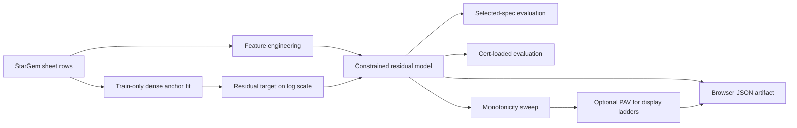
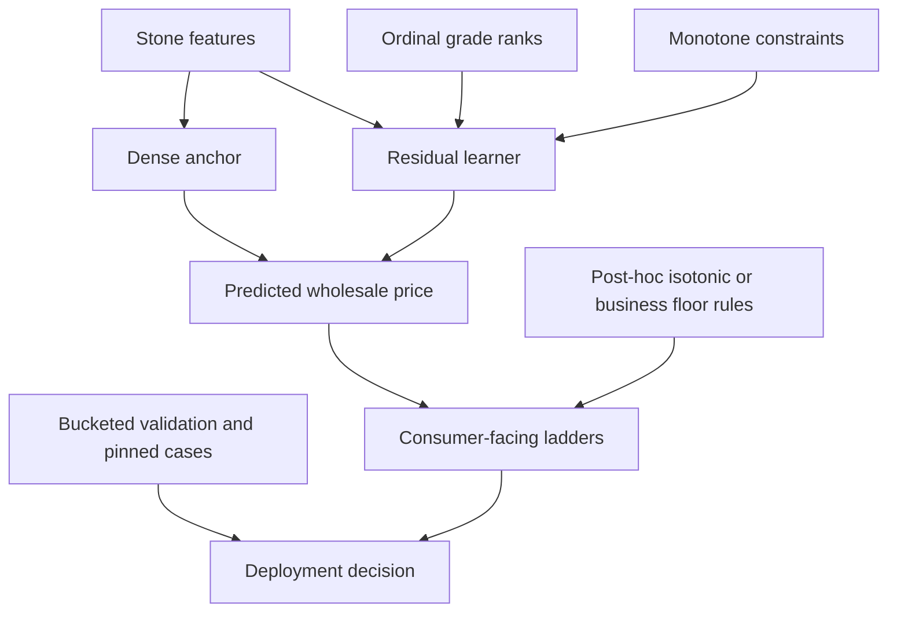

# Deep Research Report on the Attached MD Problem

## Executive summary

The attached markdown file is **not** a molecular-dynamics or maximum-diversity optimization problem. It is a **model-design problem for browser-deployed machine-learning pricing of lab-grown diamonds**, centered on how to predict white-diamond wholesale prices from sparse tabular data while preserving grade monotonicity and acceptable browser runtime. The attachment repeatedly discusses ExtraTrees, LightGBM, MAPE, monotone constraints, lookup anchors, IGI-style diamond grades, and static JSON deployment, which makes the intended interpretation clear. fileciteturn0file0

The core technical issue is well diagnosed in the attachment, but it can be stated more precisely: the current architecture leaks too much of the grade signal into **sparse, grade-specific lookup anchors** and **disconnected categorical representations**, so the model cannot reliably transfer a learned premium such as **IF over VVS1** from dense regions to sparse regions like larger stones. The evidence in the attachment is strong: the current S20 ExtraTrees system can achieve good aggregate error while producing many ladder inversions, and the S21 LightGBM system can drive those inversion counts to zero while still failing important sparse “pinned” cases. The proposed S23 change—**grade-agnostic dense anchor + ordinal grade ranks + monotone LightGBM residual model**—is therefore directionally correct and is also consistent with the literature on constrained tree boosting, shape-constrained additive models, and regularized encodings for sparse categorical structure. fileciteturn0file0 citeturn5view0turn6view1turn23view1turn37view1turn36view1

The best near-term production path is a **two-stage residual model**: first fit a dense train-only anchor on broad, data-rich structure such as carat bucket, shape, and growth; then fit a **monotone residual learner** on ordinal color and clarity ranks and the remaining tabular features. Among realistic production candidates, the strongest primary choice is **LightGBM with monotone constraints** on ordinal grade ranks, followed by a more interpretable but potentially slightly less accurate **shape-constrained GAM or EBM-style additive model**. A **hierarchical Bayesian partial-pooling model** is the best research option if uncertainty quantification and sparse-cell borrowing strength become more important than deployment simplicity. A **deep lattice network** is a viable stretch option if exact multivariate monotonicity is needed and the deployment stack can support it. citeturn11view0turn6view3turn6view1turn36view1turn40view0turn36view0

One important update relative to the attachment is that **modern scikit-learn ExtraTreesRegressor now does support monotonic constraints** through `monotonic_cst`, added in version 1.4. However, those constraints are not supported for regressions trained on data with missing values, and ExtraTrees still does not solve the attachment’s deeper representation problem: sparse grade cells remain weakly connected unless the features and anchor are redesigned. So ExtraTrees is still best treated as a benchmark, not the main recommended production model. fileciteturn0file0 citeturn33view0turn33view1turn29view2

A final domain note matters for feature governance. The attachment uses **IGI-style color and clarity grades for lab-grown stones**, which is still operationally appropriate if the product inputs come from IGI reports. That said, **GIA changed its lab-grown grading framework in late 2025**, replacing traditional LGD color/clarity nomenclature with broader “premium” and “standard” descriptors, while IGI continues to present lab-grown reports in 4C terms. If upstream data sources shift toward GIA’s newer scheme, the white-diamond feature contract will need a normalization layer. citeturn16view5turn27news0

## Interpreting the attachment

The acronym **MD** is ambiguous in the user prompt, but the attachment itself strongly disambiguates it. The file is titled **“S23 Model Architecture Proposal — What ML Approach Actually Works for Lab Diamond Pricing”** and describes a browser-only pricing stack for lab-grown diamonds, using supplier-sheet training labels, lookup anchors, ExtraTrees, LightGBM, monotonicity sweeps, and deployment artifacts. I therefore interpret “MD” here as the **model-design problem** described by the attachment, not molecular dynamics or maximum diversity. fileciteturn0file0

The conventional alternatives do **not** match the attachment. A molecular-dynamics document would normally involve particles, forces, timesteps, integrators, thermostats, or trajectories; a maximum-diversity document would normally specify a subset-selection objective over pairwise distances or dissimilarities. None of that appears here. Instead, the document focuses on diamond attributes, wholesale prices, machine-learning regressors, monotone ladder checks, and static JSON delivery. fileciteturn0file0

No standalone image files were attached in the material available to me. The markdown itself, however, contains embedded **mermaid workflow diagrams**, equations, parameter tables, and implementation checklists. The key extracted equations are the residual-price reconstruction equation and the transferred-grade-premium equation:
\[
\widehat{P}
=
\exp(r(x))\cdot A(x)\cdot T(c)\cdot c,
\]
where \(A(x)\) is a hierarchical lookup anchor in rate-per-carat units, \(T(c)\) is the large-carat tail multiplier, \(c\) is carat weight, and \(r(x)\) is the learned log residual; and, conceptually,
\[
\text{premium(IF vs VVS1)} \approx \exp(-\beta_{\text{clarity}}),
\]
with the attachment explicitly using a monotone constraint direction that makes worse clarity ranks reduce price. fileciteturn0file0

The attachment also provides the most important operational constraints. The white-diamond model is trained on a StarGem supplier snapshot with roughly **28,394** priced rows, uses **browser-only inference on static JSON**, targets held-out **MAPE** plus zero grade inversions on ladder sweeps, and must handle both **selected-spec** mode and **cert-loaded** mode. It further records that the S20 ladder sweep produced **1,127 clarity inversions** and **869 color inversions**, while the S21 constrained path reduced those to **0 / 0**, yet sparse pinned cases remained problematic. fileciteturn0file0

The following workflow restates the architecture implicit in the attachment and the recommended research framing. fileciteturn0file0



## Problem restatement

The problem is to predict a **wholesale dollar price per stone and per carat for loose lab-grown white diamonds** from structured tabular inputs such as carat, shape, color, clarity, cut, growth method, and possibly certificate-derived dimensions and measurements, under a hard product requirement that the displayed pricing ladders should be **monotone in color and clarity** and a deployment requirement that inference remain **serverless and browser-native**. The attachment’s training labels are supplier prices, not consumer retail prices, and the model is only one layer in a broader pricing stack that also includes reconciliation with comps and policy rules. fileciteturn0file0

The essential assumptions are the following. First, white-diamond pricing is treated as a **static hedonic-style regression problem** on characteristics rather than a time-series forecast. Second, diamond quality axes such as **color** and **clarity** are naturally **ordinal**, not nominal. Third, large portions of the input space are sparse, especially at larger carat sizes and top clarities, so the model must **borrow strength across nearby cells** rather than memorize only dense buckets. Fourth, browser delivery constrains model size, runtime, and serialization format. Fifth, ladder monotonicity is a trust requirement that can be enforced either in-model, post-hoc, or both. fileciteturn0file0

The unknowns that matter most are not just the price function itself but also the **right decomposition of price signal**. The attachment is really asking: which structure should be learned by the lookup anchor, which by the ML residual, which by explicit monotonic constraints, and which by post-hoc adjustments such as PAV or an IF floor rule? That is the true “MD problem” in this document. fileciteturn0file0

The desired outputs are therefore broader than a single regressor. The production deliverable is a model family and evaluation program that simultaneously achieves: strong selected-spec and cert-loaded accuracy; zero or near-zero color/clarity inversions on the shipping ladder path; sensible transfer into sparse segments such as larger IF stones; browser-feasible artifacts; and operational parity between Python training and JavaScript inference. The attachment also makes clear that “best model” is not equivalent to lowest aggregate MAPE alone. fileciteturn0file0

A second workflow makes the factorization clearer. It also shows why the problem is better understood as a **representation-and-transfer problem** than as a simple choice between random forests and boosting. fileciteturn0file0



## Background and literature

From a domain perspective, this is a **hedonic pricing** problem for a differentiated good. A recent wholesale-diamond case study explicitly models diamond prices in exactly that spirit, and the attachment’s feature schema aligns with the standard value-setting axes used in gemological grading. GIA’s official materials emphasize the global use of the **D-to-Z color scale**, the **11-grade clarity scale**, and “magic sizes” around 1.00, 1.50, and 2.00 carats, which supports the attachment’s choice to treat color and clarity as ordered axes and carat as strongly nonlinear. citeturn34view0turn16view0turn15view0turn31view0

That nonlinearity matters technically. GIA notes that carat is weight, not size, and that specific carat thresholds can have significantly different prices despite being visually close. This supports the attachment’s insistence on a **carat-sensitive anchor** and on avoiding a simplistic global linear price-per-carat assumption. It also suggests that monotonicity should be imposed most aggressively on **ordered quality ranks**, not necessarily on raw carat effects at the rate-per-carat level. citeturn31view0

On the ML side, the attachment’s historical baseline of **ExtraTrees** is a standard randomized-tree ensemble. scikit-learn describes it as fitting many randomized decision trees and averaging them to improve predictive accuracy and control overfitting; its documentation cites Geurts, Ernst, and Wehenkel’s original 2006 paper. That is consistent with the attachment’s observation that ExtraTrees can do very well on dense tabular data. But randomized-tree ensembles also make it easy to memorize local buckets without learning a coherent ordered effect across sparse grade cells. citeturn29view2turn29view4

The attachment’s move toward **LightGBM** is also well grounded. Microsoft’s LightGBM project and documentation emphasize histogram-based training, leaf-wise growth, sparse optimization, and explicit monotone constraints. The docs also state something especially important for this problem: **the output cannot be monotonically constrained with respect to a categorical feature**. That gives a strong theoretical justification for S23’s switch from one-hot or disconnected grade categories toward **ordinal numeric ranks** for color and clarity. It is not just a feature-engineering preference; it is how one unlocks the constraint mechanism cleanly. citeturn11view0turn6view3turn6view2turn23view1

The literature on monotone tree constraints additionally supports caution. LightGBM’s own documentation distinguishes between `basic`, `intermediate`, and `advanced` monotone-constraint methods and notes that the basic method over-constrains predictions. Auguste, Malory, and Smirnov go further, arguing that greedy monotone split selection can be suboptimal and proposing improved methods that outperform the then-current LightGBM implementation. XGBoost’s monotonicity tutorial likewise warns that histogram-based construction under monotone constraints can lead to unnecessarily shallow trees unless split granularity is increased. All of that supports the attachment’s use of the **advanced** LightGBM option and its emphasis on careful leaf and child-size tuning rather than disabling monotonicity when sparse tails are difficult. citeturn6view1turn37view3turn32view0

For alternative model families, three literatures are particularly relevant. **Isotonic regression** provides exact one-dimensional monotone fitting and is available off the shelf; scikit-learn describes it as fitting a nondecreasing function that solves a weighted least-squares problem under order constraints. **Shape-constrained additive models** offer stronger statistical structure: Chen and Samworth show that generalized additive models with monotonicity and related restrictions can be estimated nonparametrically and prove uniform consistency under mild conditions. **Monotonic Gaussian processes** and **deep lattice networks** offer two richer function classes: the former are attractive near data edges and extrapolation regions, while the latter provide exact monotonicity guarantees in a flexible neural architecture. citeturn7view0turn36view1turn37view0turn36view0

A final literature thread concerns sparse categorical structure. The attachment’s complaint that the current trees are “too loosely connected” is close in spirit to work on **regularized target encoding** and **Bayesian categorical encoders**, both of which exist to share statistical strength across sparse categories and avoid the brittleness of naive one-hot or integer encodings. Pargent et al. find that regularized target encoding consistently outperforms traditional encodings on high-cardinality features, and Slakey et al. show that conjugate-Bayesian category encoders can be both accurate and computationally efficient in real production systems. Those results do not imply that target encoding is the right production representation for ordered diamond grades, but they strongly support the attachment’s more general thesis that **sparse categories need shrinkage and structural sharing**, not disconnected dummy variables. citeturn37view1turn37view2

## Proposed methods

The table below compares the most defensible solution families for this problem. The comparison draws on the attachment, official LightGBM and scikit-learn documentation, XGBoost’s monotonicity tutorial, and the cited research on shape-constrained additive models, Gaussian processes, Bayesian multilevel models, and deep lattice networks. fileciteturn0file0 citeturn11view0turn6view1turn33view0turn36view1turn40view0turn36view0turn37view0

| Method | Sparse-cell transfer | Monotonicity handling | Optimization behavior | Deployment fit | Overall assessment |
|---|---|---|---|---|---|
| Grade-agnostic anchor + monotone LightGBM residual | Strong if anchor is broad and grades are ordinal | Native monotone constraints on rank features | Greedy stagewise boosting; practical but not globally optimal | Very good for current stack | **Best primary recommendation** |
| Shape-constrained GAM or EBM-style additive model | Good if effects are mostly additive | Native shape restrictions; very interpretable | Better-behaved statistical structure; additive bias possible | Good if exported as tables/shape functions | **Best interpretability-first alternative** |
| Hierarchical Bayesian partial-pooling model | Excellent | Priors or shape restrictions can encode order | Rich multilevel inference; operationally heavier | Moderate to weak for browser-only deployment | **Best research / uncertainty model** |
| Deep lattice network | Good | Exact monotonicity guarantees | SGD-based; flexible but more complex | Moderate if TFJS-compatible | **Promising stretch option** |
| ExtraTrees with modern monotonic support | Limited unless representation changes | `monotonic_cst` exists in modern scikit | Ensemble averaging; still weak on sparse transfer | Good if existing tree runtime retained | **Useful benchmark, weaker mainline choice** |
| Post-hoc isotonic calibration only | Weak by itself | Excellent for one-dimensional ladders | Simple and cheap | Excellent | **Useful as final display calibrator, not enough alone** |

### Recommended production method

The strongest production approach is the attachment’s **S23 concept**, slightly sharpened. Fit a **dense, train-only anchor**
\[
A(x)=A(\text{carat bucket}, \text{shape}, \text{growth}, \ldots)
\]
without color and clarity in the most granular anchor levels unless the cell is demonstrably dense. Then fit a residual target
\[
y^{*}=\log P-\log A(x)-\log T(c)-\log c,
\]
and learn \(y^{*}\) with LightGBM using ordinal grade ranks and monotone constraints on those ranks. This retains the attachment’s architecture while directly addressing the sparse-transfer failure. It also aligns with LightGBM’s constraint machinery, which works on numeric ordered features and not categorical features. fileciteturn0file0 citeturn5view0turn23view1turn11view0

Why this works is straightforward. The anchor captures bulk market level, carat regime, and gross shape/growth structure. The monotone residual model then learns **shared grade premiums** that can transfer across carat or shape regions, instead of requiring every grade-specific bucket to be populated. The attachment’s own worked example makes exactly this point: a learned IF-vs-VVS1 premium from dense 1 ct data can be applied sensibly to a sparse 3 ct IF case when the anchor is no longer grade specific. fileciteturn0file0

The method’s main weakness is that boosting is still a **greedy** learner. LightGBM’s monotone modes improve behavior, but the monotone split literature shows that greedily optimal local splits need not be globally best. In practice, however, the tradeoff is usually worth it here because the deployment stack already supports tree-based browser inference and the current team workflow is built around LightGBM artifacts. citeturn6view1turn37view3

### Interpretable additive alternative

A **shape-constrained GAM** or an **EBM-style additive model** is the cleanest interpretability-first alternative. The natural specification is
\[
\log P
=
\alpha
+
f_{\text{anchor}}(\cdot)
+
f_{\text{carat}}(\cdot)
+
f_{\text{clarity-rank}}(\cdot)
+
f_{\text{color-rank}}(\cdot)
+
\sum_j f_j(x_j)
+
\text{selected interactions},
\]
with \(f_{\text{clarity-rank}}\) and \(f_{\text{color-rank}}\) constrained to be monotone decreasing in worse ranks. Chen and Samworth’s results make this family theoretically attractive because the estimators are nonparametric, shape constrained, and uniformly consistent under mild conditions. Recent EBM literature also frames boosted additive models as a “glass-box” compromise between accuracy and interpretability. citeturn36view1turn38academia1

This family is especially appealing if business stakeholders want to inspect and edit shape functions directly. It is also a good way to reduce the risk that the model learns implausible high-order interactions in sparse regions. The cost is that purely additive structure can underfit if the real pricing surface depends strongly on interactions such as shape-by-carat-by-growth or cut-style-by-elongation. In this problem, that means a GAM/EBM is sometimes best as a **strong challenger model**, not necessarily the only production candidate. fileciteturn0file0 citeturn36view1turn38academia1

### Hierarchical partial-pooling model

If the main pain point is sparse premium estimation for rare grade-size-shape cells, the statistically most principled answer is a **hierarchical multilevel model**. Think of cell-level effects for shape, carat bucket, growth, and even interaction terms as random effects or partially pooled coefficients, with ordered priors or monotone transforms for clarity and color. Bürkner’s overview of multilevel modeling with `brms` and Stan shows that this family can support multilevel structure, splines, Gaussian processes, and distributional regression in one coherent framework. citeturn40view0

This route is best when you need **uncertainty intervals**, **shrinkage in rare cells**, and careful handling of distribution tails. It also naturally supports the attachment’s business reality that some segments, especially large stones and top-grade combinations, are data-poor and should not be treated like dense commodity buckets. The downside is operational: hierarchical Bayesian models are much heavier to train, inspect, and deploy in a browser-native stack than compact tree ensembles or additive shape tables. For this reason, I would treat this as a **research or audit model** first, and only later as a production candidate if uncertainty becomes a first-class product requirement. fileciteturn0file0 citeturn40view0turn37view2

### Worked example

The attachment already contains the right intuition. Suppose the dense anchor says a sparse 3 ct round stone should start near **\$212/ct**, and dense smaller-stone data imply that IF carries a positive premium over VVS1. If the residual learner represents clarity as an ordered rank and enforces monotonicity, then the model can apply that learned IF premium on top of the 3 ct anchor even when 3 ct IF training rows are scarce, yielding a plausible value around **\$222/ct** instead of collapsing back toward the non-IF anchor. Under one-hot disconnected grade features and grade-specific anchors, by contrast, the sparse 3 ct IF case has little statistical support and often reverts toward poorly calibrated local buckets. fileciteturn0file0

### Pseudocode

```python
# train_s23_like_model.py

# 1. Split by bucket/group using train-only leakage control
train, valid = grouped_holdout(
    rows,
    group_fields=["shape", "carat_bucket", "color", "clarity", "cut"]
)

# 2. Fit a dense anchor on broad cells only
anchor = fit_hierarchical_anchor(
    train,
    levels=[
        ["carat_bucket", "shape", "growth"],
        ["carat_bucket", "shape"],
        ["shape"],
        []
    ],
    target="price_per_ct",
    stat="median"
)

# 3. Build residual target
y_train = log(train.price_usd) - log(anchor(train)) - log(train.carat) - log(tail(train.carat))
y_valid = log(valid.price_usd) - log(anchor(valid)) - log(valid.carat) - log(tail(valid.carat))

# 4. Use ordinal ranks for ordered grades
X_train = engineer_features(train, use_ordinal_grade_ranks=True)
X_valid = engineer_features(valid, use_ordinal_grade_ranks=True)

# 5. Fit monotone LightGBM residual model
model = LightGBMRegressor(
    n_estimators=400,
    num_leaves=63,
    learning_rate=0.04,
    min_child_samples=20,
    subsample=0.8,
    colsample_bytree=0.8,
    monotone_constraints={
        "clarity_rank": -1,
        "color_rank": -1
    },
    monotone_constraints_method="advanced"
)
model.fit(X_train, y_train)

# 6. Reconstruct prices
pred_valid = exp(model.predict(X_valid)) * anchor(valid) * tail(valid.carat) * valid.carat

# 7. Evaluate both product modes
eval_selected_spec(pred_valid, valid)
eval_cert_loaded(pred_valid, valid)
run_monotonicity_sweep(model, anchor)
fit_optional_pav_display_calibrators()
export_browser_json(model, anchor)
```

This pseudocode is directly consistent with the attachment’s residual formulation, the documented LightGBM monotone APIs, and the attachment’s starting hyperparameters. fileciteturn0file0 citeturn5view0turn6view1

## Experiments and validation plan

The validation program should match the product, not just the regression metric. The attachment already defines the right principle: always report both **selected-spec** and **cert-loaded** views, do **bucket-balanced or grouped holdout** so dense round 1 ct rows do not dominate, and maintain a **monotonicity sweep** plus a **pinned sparse-case set**. That logic should remain unchanged. fileciteturn0file0

The primary dataset should remain the StarGem white-diamond training sheet because the attachment explicitly forbids training the white model directly on unadjusted Messi prices. Internal comp pools, reconciler logs, and other derived intelligence artifacts are useful for diagnostics and downstream blending, but not as substitute labels unless they are supplier-adjusted and quality-controlled. Fancy color should remain a parallel modeling track rather than being pooled into the white model. fileciteturn0file0

The most useful experiment grid is an **ablation study** around representation, not just algorithm name. Specifically, compare: current S20 baseline; S21 constrained LightGBM; S23 anchor redesign only; S23 ordinal-rank redesign only; S23 full model; shape-constrained GAM on the same residual target; and a hierarchical partial-pooling prototype on a subset. That will tell you whether the gain comes from the learner, the anchor, the ordered representation, or the interaction among the three. fileciteturn0file0 citeturn23view1turn36view1turn40view0

The experiment matrix below is the minimum rigor I would require before shipping. It is derived from the attachment’s own regression gates and extended with sparse-transfer tests. fileciteturn0file0

| Test block | What to measure | Ship criterion |
|---|---|---|
| Global regression | Selected-spec MAPE, cert-loaded MAPE, MAE | Beat S20/S21 or stay within agreed gate |
| Order consistency | Color and clarity inversions on shipping ladder path | Zero in production path |
| Sparse transfer | Explicit IF > VVS1 checks at 3 ct round E and similar pinned cases | Must pass |
| Segment robustness | Slices by carat bucket, shape, growth, rare top grades | No catastrophic pockets |
| JS parity | Python vs browser prediction fixtures | Stable within attachment’s parity thresholds |
| Size/runtime | JSON size, load time, per-stone latency | Within browser budget |

Parameter-wise, the attachment’s suggested LightGBM starting point is good: `n_estimators=400`, `num_leaves=63`, `learning_rate=0.04`, `min_child_samples=20`, `subsample=0.8`, `colsample_bytree=0.8`, and `monotone_constraints_method="advanced"`. I would sweep `num_leaves`, `min_child_samples`, and anchor granularity first. I would **not** loosen monotonicity on color or clarity to rescue sparse tails; if tail behavior is poor, the first fixes should be **better anchor pooling**, **more robust residual features**, or **segment-specific shrinkage**, not weaker business rules. fileciteturn0file0 citeturn6view1turn37view3

One subtle but important experimental choice concerns carat. Because GIA explicitly notes discontinuities around “magic sizes,” raw linear monotonicity in rate-per-carat is not the right assumption. Use carat buckets, splines, or piecewise smooth effects; reserve strict monotone enforcement mainly for ordered quality ranks and perhaps total-price monotonic sanity checks, not naive rate-per-carat monotonicity across all sizes. citeturn31view0

## Results interpretation and recommendations

If the full S23 design wins, the correct interpretation is **not** merely “LightGBM is better than ExtraTrees.” It is that the pricing problem needed a representation that could **share grade information across sparse cells** while respecting order constraints. In other words, the dominant issue was **statistical coupling of sparse ordered categories**, not simply choice of ensemble type. That conclusion is important because it tells you where future gains will come from: better anchors, better ordered representations, and better shrinkage, not an endless search over black-box regressors. fileciteturn0file0 citeturn37view1turn37view2turn36view1

If a shape-constrained additive model gets close in MAPE while materially improving explainability and artifact compactness, that is also a positive result. For this product, “near-best accuracy with transparently monotone grade effects” may be preferable to “slightly better MAPE but harder-to-debug interactions,” especially because the attachment already documents that good aggregate MAPE can coexist with bad user-facing ladder behavior. fileciteturn0file0 citeturn36view1turn38academia1

If a hierarchical partial-pooling model substantially improves sparse IF and large-stone behavior, interpret that as evidence that the remaining failure mode is true **data scarcity**, not just learner bias. In that case, the production answer may still be LightGBM for deployment reasons, but the hierarchical model becomes extremely valuable as an offline teacher, audit system, or uncertainty estimator. citeturn40view0

There are also important limitations and open questions. The attachment leaves some design choices effectively open, including the exact S23 anchor levels, the right degree of shape-by-carat interaction, and the best treatment of missing certificate fields at selected-spec time. The document also makes fancy color a separate track, which is sensible because hue and intensity introduce a different monotonicity structure. Finally, the external standards environment is shifting: GIA’s newer lab-grown categories are less aligned with the IGI-style ordinal grade features used in the current white-diamond stack. fileciteturn0file0 citeturn16view5turn27news0

The practical next steps are therefore clear. First, implement the S23 ablation suite exactly as a representation study. Second, keep a strong GAM/EBM challenger in the benchmark set to quantify the price of interpretability. Third, build a small hierarchical prototype focused only on the rarest and most expensive segments to decide whether partial pooling is worth the operational complexity. Fourth, preserve optional post-hoc isotonic/PAV calibration only for **consumer-facing ladder display**, not as a substitute for a structurally correct core model. fileciteturn0file0 citeturn7view0

### Suggested models

By the end of this review, these are the specific models I recommend:

- **Primary production model:** **Grade-agnostic hierarchical lookup anchor + monotone LightGBM residual model** on ordinal `clarity_rank` and `color_rank`, with optional PAV only for final ladder display. This is the best fit to the attachment’s problem, the current browser stack, and the monotone-constraint literature. fileciteturn0file0 citeturn5view0turn6view1turn23view1

- **Best interpretability-first challenger:** **Shape-constrained GAM or EBM-style additive residual model** using the same anchor and ordinal ranks. Use this if you want compact artifacts and easily auditable shape functions. citeturn36view1turn38academia1

- **Best research / uncertainty model:** **Hierarchical Bayesian partial-pooling regression** with ordered grade effects and shared shrinkage across sparse size-shape-grade cells. Use this offline first, especially for large-stone and top-grade sparse segments. citeturn40view0turn37view2

- **Stretch model:** **Deep lattice network** if exact multivariate monotonicity becomes a hard requirement and the deployment stack can absorb TF-style inference artifacts. citeturn36view0

- **Benchmark only:** **Modern ExtraTrees with `monotonic_cst`** as a diagnostic baseline, not the main recommendation. It now supports monotonic constraints in current scikit-learn, but that does not solve the core sparse-transfer problem, and missing-value limitations can matter in this application. citeturn33view0turn33view1turn29view2