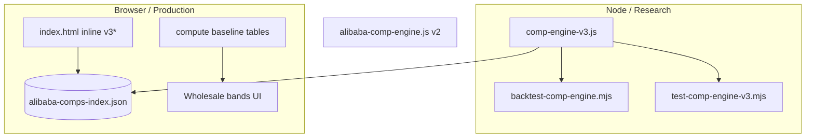

# P0 — Remove Research/Production Drift Risk

**Research date:** 2026-05-22  
**Status:** Deep research / implementation plan (no code changes in this pass)  
**Related:** `comp-engine-v3-remaining-work.md`, `comp-engine-v3-gap-fixes-implementation.md`, `comp-engine-v3-p0-p1-p1b-implementation.md`, `estimation-algo-improvement-priorities.md`, `comp-engine-v3-implementation-critique.md`

---

## Executive Summary

The Gem Appraise comp engine v3 exists in **two parallel implementations**:

1. **Research canonical:** `research/comp-engine-v3.js` (~1,690 lines, ES module, Node-tested, backtested).
2. **Production mirror:** `index.html` inline `v3*` functions (~750 lines, ~1126–1891), loaded in the browser without importing the module.

A May 2026 gap-fix pass **manually mirrored** P0/P1/P1b behavior into `index.html`, which reduced immediate divergence but **did not eliminate structural drift risk**. Any future change to slopes, fancy transfer, supplier caps, or calibration that lands in only one file will make the backtest lie about what users see.

**Recommendation (ordered):**

| Priority | Approach | Effort | Durability |
|----------|----------|--------|------------|
| 1 | **Golden parity harness** (CI gate) | Low–medium | High — catches drift even if mirror persists |
| 2 | **Shared ES module** imported by production | Medium | Highest — single source of truth |
| 3 | **Codegen sync** (extract mirror from module) | Medium | Good — automates mirror, still two artifacts |

**Minimum bar for P0 done:** Option 1 **plus** either Option 2 or documented codegen. Option 1 alone is acceptable if full module import is blocked by GitHub Pages / `file://` constraints.

---

## Table of Contents

1. [Problem statement and evidence](#1-problem-statement-and-evidence)
2. [Current architecture audit](#2-current-architecture-audit)
3. [What prior docs already proposed](#3-what-prior-docs-already-proposed)
4. [Pricing contract to keep in parity](#4-pricing-contract-to-keep-in-parity)
5. [Solution A — Shared importable module](#5-solution-a--shared-importable-module)
6. [Solution B — Golden parity harness](#6-solution-b--golden-parity-harness)
7. [Solution C — Codegen / sync script](#7-solution-c--codegen--sync-script)
8. [Representative parity fixtures (acceptance cases)](#8-representative-parity-fixtures-acceptance-cases)
9. [Tolerance specification](#9-tolerance-specification)
10. [CI and local test integration](#10-ci-and-local-test-integration)
11. [Why this will work](#11-why-this-will-work)
12. [Risks and mitigations](#12-risks-and-mitigations)
13. [Implementation phases](#13-implementation-phases)
14. [Appendix — duplication inventory](#14-appendix--duplication-inventory)

---

## 1. Problem statement and evidence

### 1.1 Operational risk

The leave-one-supplier-out backtest (`research/scripts/backtest-comp-engine.mjs`) imports **only** `research/comp-engine-v3.js`:

```javascript
const { loadIndex, resolveAlibabaComp, supplierKey, inferFancyFamilyKey } =
  await import(join(ROOT, 'research/comp-engine-v3.js'));
```

The calculator UI calls **`resolveAlibabaComp(ct)`** defined inline in `index.html` (comment at line 1127 points to the research file but does not import it).

If these diverge:

- A 0.5% slope tuning that improves white MdAPE in research may **never ship** to users.
- A fancy transfer penalty may **only** affect backtest metrics.
- Interval calibration (`SIGMA_CALIBRATION_FACTOR = 2.0`) may read as “honest P80” in docs while the UI still uses pre-calibration sigmas.

### 1.2 Evidence from gap-fixes doc

`comp-engine-v3-gap-fixes-implementation.md` explicitly states:

> This is still a mirrored implementation, not a true shared module import. The operational risk is reduced, but not eliminated.

### 1.3 Evidence from implementation critique (historical)

Before the mirror pass, `comp-engine-v3-p0-p1-p1b-implementation.md` documented that `index.html` lacked:

- `SIGMA_SYSTEMATIC_FLOOR`, `SIGMA_CALIBRATION_FACTOR`
- `MAX_SUPPLIER_WEIGHT_FRAC` with correct final-weight math
- `fitLocalCaratSlope` / `localCaratCurve`
- `sourceConcentration` with `finalDominantFrac`

That critique was accurate at the time; the mirror pass closed many gaps but **the pattern remains**: two hand-maintained copies.

### 1.4 Third engine: legacy v2

`research/alibaba-comp-engine.js` is a **separate** v2-style matcher (exact → nearest → best_available, linear scoring). It is not production-critical if the UI uses v3 inline, but it adds confusion for contributors. P0 scope should **not** require v2 parity unless something still imports v2 in production (verify: production uses inline v3, not v2).

---

## 2. Current architecture audit



### 2.1 Duplication pattern (naming mirror)

| Research (`comp-engine-v3.js`) | Production (`index.html`) |
|-------------------------------|---------------------------|
| `AXIS_SIGMA` | `V3_AXIS_SIGMA` |
| `compErrorScore` | `v3CompErrorScore` |
| `adjustCompToQuery` | `v3AdjustToQuery` |
| `blendComps` | `v3Blend` |
| `fitLocalCaratSlope` | `v3FitLocalCaratSlope` |
| `resolveAlibabaComp` | `resolveAlibabaComp` (same name, different function body) |
| `FANCY_LABEL_MAP` | `FANCY_LABEL_MAP` (duplicate const) |
| `supplierKey` | `v3SupplierKey` |

Approximate **~20 mirrored functions** plus duplicated reference tables (`WHITE_GRADE_MULT`, `FANCY_COLOR_BASE`, shape mults, etc.).

### 2.2 Intentional production-only behavior (not drift if documented)

These exist only in `index.html` baseline `compute()` path, **not** in comp engine v3:

- `rMult` retail multipliers on `fancyColorBase`
- Magic-weight carat discounts on white anchor curve
- China / auction fair multipliers
- Cert cost add-ons
- Messi round ladder fallback when `matchType === 'none'`

**Parity scope for P0:** `resolveAlibabaComp` / `alibabaComp` object only, not full `compute()` wholesale bands.

### 2.3 Deployment constraints

- No `package.json` in repo root — static site pattern.
- `index.html` uses classic `<script>` blocks, not `type="module"` for app logic (only PDF.js CDN).
- GitHub Pages and local `file://` preview affect whether `import './research/comp-engine-v3.js'` works without a server.

These constraints explain why mirroring was chosen; they do not remove the need for automated parity checks.

---

## 3. What prior docs already proposed

| Document | Proposal |
|----------|----------|
| `comp-engine-v3-remaining-work.md` P0 | Single shared module **or** golden parity test with five representative cases |
| `estimation-algo-improvement-priorities.md` P0 | Fix test drift, parser drift, research/production drift before deeper algo work |
| `comp-engine-v3-implementation-critique.md` | Golden-case tests comparing `index.html` vs research for white, fancy, exact, nearest, best_available |
| `comp-engine-v3-gap-fixes-implementation.md` | “Durable fix is shared module or golden parity tests” |
| `alibaba-comp-matcher-igi-app-implementation.md` | Deprecate `alibabaComps[]` after parity testing |

**Consensus:** Parity is P0 because it gates trust on every subsequent P1/P2 change.

---

## 4. Pricing contract to keep in parity

The harness must compare a **stable JSON contract** returned by both engines for the same query + index snapshot.

### 4.1 Required top-level fields

```javascript
// Parity contract (subset of resolveAlibabaComp return)
{
  matchType: 'exact' | 'nearest' | 'best_available' | 'none',
  estimate: number | null,
  low: number | null,
  high: number | null,
  perCt: number | null,
  confidence: 'high' | 'medium' | 'low' | null,
  warnings: string[],                    // order-insensitive set compare
  calibrationNote: string | null,
  sourceConcentration: {
    dominated: boolean,
    dominantSupplier: string | null,
    rawDominantFrac: number | null,
    finalDominantFrac: number | null,
    capApplied: boolean,
    capPossible: boolean,
    supplierFracs: Record<string, number>,
  } | null,
  localCaratCurve: {
    slope: number,
    rawSlope: number,
    n: number,
    confidence: string,
    queryIsExtrapolated: boolean,
    normalized: boolean,
  } | null,
  supportComps: Array<{
    row: { productId, url, carat, shape, clarity, priceUsd, section },
    score: number,
    estimatedPrice: number,
    sigmaLog: number,
  }>,
  rejectedComps: Array<{ row: { productId, carat }, reason: string }>,
}
```

### 4.2 Legacy fields (optional parity tier)

`primary`, `alternatives` — UI compatibility; compare if easy, but **supportComps** is the scientific record of the blend.

---

## 5. Solution A — Shared importable module

### 5.1 Target layout

```
research/
  comp-engine-v3.js          # canonical (already exists)
  comp-engine-v3.browser.js    # optional: IIFE bundle for non-module pages
index.html
  <script type="module">
    import { loadIndex, resolveAlibabaComp } from './research/comp-engine-v3.js';
    window.resolveAlibabaComp = (q) => resolveAlibabaComp({ ...q, carat: ct });
  </script>
```

### 5.2 Browser entry shim (proposed)

```html
<!-- index.html — replace inline v3 block with module import -->
<script type="module">
  import {
    loadIndex,
    resolveAlibabaComp as resolveCompV3,
  } from './research/comp-engine-v3.js';

  const COMP_INDEX_URL = 'research/data/alibaba-comps-index.json';

  let indexReady = loadIndex(COMP_INDEX_URL);

  window.resolveAlibabaComp = async function resolveAlibabaComp(ct) {
    await indexReady;
    const q = buildQueryFromState(ct); // existing state → query mapper
    return resolveCompV3(q);
  };
</script>
```

```javascript
// buildQueryFromState — keep in index.html (UI-specific)
function buildQueryFromState(ct) {
  return {
    carat: ct,
    shape: state.shape,
    colorFamily: state.colorFamily,
    whiteGrade: state.whiteGrade,
    colorFamily_key: state.colorFamily === 'fancy' ? state.fancyKey : undefined,
    clarity: state.clarity,
  };
}
```

### 5.3 Node/browser dual export (already mostly present)

`comp-engine-v3.js` ends with:

```javascript
export {
  loadIndex,
  resolveAlibabaComp,
  runTests,
  // ...
};
```

For older browsers, add **optional** build:

```bash
# package.json (dev-only) — proposed
npx esbuild research/comp-engine-v3.js \
  --bundle --format=iife --global-name=CompEngineV3 \
  --outfile=research/comp-engine-v3.bundle.js
```

### 5.4 Why module import is the best end state

- One edit surface for P1 slope gates, P1 fancy penalties, P1b source quality.
- `runTests()` and parity harness call the **same** function object.
- Deletes ~750 lines from `index.html`, reducing review burden.

### 5.5 Blockers to resolve before choosing A

| Blocker | Mitigation |
|---------|------------|
| GitHub Pages relative import paths | Serve from repo root; use `./research/comp-engine-v3.js` |
| `file://` local open | Document `python -m http.server` (already used in gap-fixes smoke test on port 8766) |
| Async `loadIndex` vs sync today | `compute()` already async-friendly if `alibabaComp` awaits resolver |
| Supplemental JSON merge paths | Module already merges `messi-comps.json` etc. in Node; ensure browser `fetch` base URL matches |

---

## 6. Solution B — Golden parity harness

### 6.1 Design

A Node script loads:

1. Research engine via `import '../comp-engine-v3.js'`
2. Production engine by **extracting** the inline `resolveAlibabaComp` + dependencies from `index.html`, **or** by driving a headless browser, **or** by maintaining a thin `research/comp-engine-v3.production-extract.js` regenerated by codegen (see Solution C)

**Preferred for maintainability:** parse `index.html` with a regex/AST extract of the `v3` block into a temp file, `import()` it in Node with mocked `fetch`/`state`.

Pragmatic v1: **duplicate invocation via vm** — compile production functions from extracted script string.

### 6.2 Proposed file: `research/scripts/parity-research-production.mjs`

```javascript
#!/usr/bin/env node
/**
 * parity-research-production.mjs
 * Compare research/comp-engine-v3.js vs production extract for golden queries.
 */
import { readFileSync } from 'fs';
import { pathToFileURL } from 'url';
import path from 'path';
import vm from 'vm';

const ROOT = path.resolve(import.meta.dirname, '../..');
const INDEX_PATH = path.join(ROOT, 'index.html');
const INDEX_JSON = path.join(ROOT, 'research/data/alibaba-comps-index.json');

// ── 1. Load research engine ─────────────────────────────────────
const research = await import(pathToFileURL(path.join(ROOT, 'research/comp-engine-v3.js')).href);

// ── 2. Load production extract (see codegen script) ─────────────
const prodPath = path.join(ROOT, 'research/comp-engine-v3.production-sandbox.js');
const prodSrc = readFileSync(prodPath, 'utf8');
const sandbox = {
  console,
  Math, JSON, Map, Set, Array, Object, Number, String, Boolean, Error,
  SPECIALTY_SHAPE_KEYS: new Set([/* filled by extract */]),
};
vm.runInNewContext(prodSrc + '\n;this.exports = { resolveAlibabaComp, loadIndex };', sandbox);
const production = sandbox.exports;

// ── 3. Shared index snapshot ────────────────────────────────────
const index = JSON.parse(readFileSync(INDEX_JSON, 'utf8'));
await research.loadIndex(index);
await production.loadIndex(index);

// ── 4. Golden fixtures ────────────────────────────────────────
import { GOLDEN_PARITY_CASES } from './parity-golden-cases.mjs';

let failed = 0;
for (const tc of GOLDEN_PARITY_CASES) {
  const r = await research.resolveAlibabaComp(tc.query);
  const p = await production.resolveAlibabaComp(tc.query);
  const diff = diffContracts(r, p, tc.tolerances);
  if (diff.length) {
    failed++;
    console.error(`FAIL ${tc.id}:`, diff);
  } else {
    console.log(`OK   ${tc.id}`);
  }
}
process.exit(failed ? 1 : 0);
```

### 6.3 Contract diff function (proposed)

```javascript
function diffContracts(research, production, tol = {}) {
  const errs = [];
  const priceTol = tol.estimatePct ?? 0.005;      // 0.5% on estimate
  const boundTol = tol.intervalPct ?? 0.01;       // 1% on low/high
  const scoreTol = tol.score ?? 0.001;

  if (research.matchType !== production.matchType)
    errs.push(`matchType: ${research.matchType} vs ${production.matchType}`);

  if (research.estimate != null && production.estimate != null) {
    const rel = Math.abs(research.estimate - production.estimate) / research.estimate;
    if (rel > priceTol)
      errs.push(`estimate: ${research.estimate} vs ${production.estimate} (${(rel*100).toFixed(2)}%)`);
  } else if (research.estimate !== production.estimate) {
    errs.push(`estimate null mismatch`);
  }

  // support comp set equality by productId + rounded estimatedPrice
  const rIds = new Set(research.supportComps?.map(c => c.row.productId));
  const pIds = new Set(production.supportComps?.map(c => c.row.productId));
  for (const id of rIds) if (!pIds.has(id)) errs.push(`missing support comp in production: ${id}`);

  if (research.sourceConcentration?.finalDominantFrac != null &&
      production.sourceConcentration?.finalDominantFrac != null) {
    const df = Math.abs(
      research.sourceConcentration.finalDominantFrac -
      production.sourceConcentration.finalDominantFrac
    );
    if (df > (tol.sourceFrac ?? 0.02)) errs.push(`finalDominantFrac delta ${df}`);
  }

  // warnings: compare as sorted sets
  const rw = [...(research.warnings || [])].sort().join('|');
  const pw = [...(production.warnings || [])].sort().join('|');
  if (rw !== pw) errs.push(`warnings differ`);

  return errs;
}
```

### 6.4 Alternative: Playwright parity (heavier)

Drive real `index.html` in browser, read `alibabaComp` from DOM/JS global. Pros: 100% production fidelity. Cons: CI complexity, flaky timing, async index load.

Use only if sandbox extract proves too brittle.

---

## 7. Solution C — Codegen / sync script

### 7.1 `research/scripts/sync-v3-to-index.mjs` (proposed)

```javascript
/**
 * Reads research/comp-engine-v3.js and rewrites the index.html v3 section.
 * Transformation rules:
 *   - Prefix exported function names with v3 where needed
 *   - AXIS_SIGMA → V3_AXIS_SIGMA
 *   - Strip export/import lines
 *   - Inject into markers: // BEGIN V3 ENGINE SYNC ... // END V3 ENGINE SYNC
 */
import { readFileSync, writeFileSync } from 'fs';

const ENGINE = readFileSync('research/comp-engine-v3.js', 'utf8');
const TRANSFORMED = transformForInline(ENGINE); // implement AST or regex pipeline
const INDEX = readFileSync('index.html', 'utf8');
const OUT = INDEX.replace(
  /\/\/ BEGIN V3 ENGINE SYNC[\s\S]*\/\/ END V3 ENGINE SYNC/,
  `// BEGIN V3 ENGINE SYNC\n${TRANSFORMED}\n// END V3 ENGINE SYNC`
);
writeFileSync('index.html', OUT);
```

### 7.2 When to use codegen

- Module import blocked for another release cycle.
- Team wants zero runtime behavior change in browser.
- Parity harness validates extract **matches** research before each commit.

**Risk:** Transform bugs create **synchronized wrong code**. Mitigate by parity harness + code review of diff hunks.

---

## 8. Representative parity fixtures (acceptance cases)

These map directly to `comp-engine-v3-remaining-work.md` acceptance criteria.

### 8.1 `research/scripts/parity-golden-cases.mjs` (proposed)

```javascript
export const GOLDEN_PARITY_CASES = [
  // ── 1. White exact / near-exact ─────────────────────────────
  {
    id: 'white-exact-1ct-d-vs1-round',
    query: { carat: 1.0, shape: 'round', colorFamily: 'white', whiteGrade: 'D', clarity: 'VS1' },
    expect: { matchType: ['exact'], minSupport: 1 },
    tolerances: { estimatePct: 0.005 },
  },
  {
    id: 'white-near-2ct-d-vvs2-oval',
    query: { carat: 2.0, shape: 'oval', colorFamily: 'white', whiteGrade: 'D', clarity: 'VVS2' },
    expect: { matchType: ['exact', 'nearest'] },
  },

  // ── 2. White large-carat extrapolation ──────────────────────
  {
    id: 'white-large-6ct-d-vs1-emerald',
    query: { carat: 6.0, shape: 'emerald', colorFamily: 'white', whiteGrade: 'D', clarity: 'VS1' },
    expect: {
      localCaratCurve: { queryIsExtrapolated: true }, // or null if sparse
      warningsInclude: ['local comp range', 'extrapolation'],
    },
    tolerances: { estimatePct: 0.01 },
  },

  // ── 3. Fancy vivid pink sparse (T16 regression) ─────────────
  {
    id: 'fancy-vivid-pink-3.8ct-radiant',
    query: { carat: 3.8, shape: 'radiant', colorFamily: 'fancy', colorFamily_key: 'pink_fv', clarity: 'VVS2' },
    expect: {
      estimateBetween: [500, 8000],
      primaryNotProductId: null, // set at runtime: brownish 0.89ct row pid if known
      supportExcludesColorSubstring: 'brownish',
    },
    tolerances: { estimatePct: 0.01 },
  },

  // ── 4. Single-source-only estimate ──────────────────────────
  {
    id: 'white-single-source-concentration',
    // Pick a query known to resolve with only one supplier in supportComps
    // (discover via backtest flag --verbose or index analysis script)
    query: { carat: 4.5, shape: 'portuguese', colorFamily: 'white', whiteGrade: 'D', clarity: 'VS1' },
    expect: {
      sourceConcentration: { capPossible: false },
      warningsInclude: ['no cross-source cap was possible'],
    },
  },

  // ── 5. Multi-source blend with supplier cap ─────────────────
  {
    id: 'white-multi-source-cap',
    query: { carat: 1.0, shape: 'round', colorFamily: 'white', whiteGrade: 'D', clarity: 'VS1' },
    expect: {
      // Messi + starsgem often co-exist on round D ladders
      sourceConcentration: { capPossible: true },
      maxFinalDominantFrac: 0.66,
    },
  },
];
```

### 8.2 T16 alignment with built-in tests

`comp-engine-v3.js` `runTests()` already includes T16 pink case. Parity harness should import the **same query object** from a shared JSON fixture file so `runTests`, `test-comp-engine-v3.mjs`, and parity script do not diverge.

```javascript
// research/fixtures/t16-pink-radiant.json
{
  "desc": "T16 — 3.8ct FVP radiant must not anchor on 0.89ct brownish pink",
  "query": { "carat": 3.8, "shape": "radiant", "colorFamily": "fancy", "colorFamily_key": "pink_fv", "clarity": "VVS2" },
  "assertions": {
    "estimateMin": 500,
    "estimateMax": 8000,
    "forbiddenPrimaryColorSubstrings": ["brownish"]
  }
}
```

---

## 9. Tolerance specification

| Field | Tolerance | Rationale |
|-------|-----------|-----------|
| `estimate`, `low`, `high` | ±0.5% relative (default) | Integer rounding in `Math.round` may differ by $1 on $10k stones — use relative |
| `perCt` | ±0.5% or ±$1/ct | Derived from estimate |
| `supportComps[].score` | ±0.001 absolute | Floating sqrt aggregation |
| `supportComps[].estimatedPrice` | ±0.5% | Per-comp adjustment path must match |
| `supportComps` set | Same `productId` multiset | Order may differ |
| `warnings` | Set equality (ignore order) | String build order may differ |
| `sourceConcentration.finalDominantFrac` | ±0.02 absolute | Weight normalization |
| `localCaratCurve.slope` | ±0.01 absolute | OLS + shrink should be deterministic |
| `matchType` | Exact match | Categorical — zero tolerance |
| `calibrationNote` | Exact string | Versioning label |

**Hard fail (zero tolerance):** `matchType`, presence of `sourceConcentration.capPossible` when fixture expects it, T16 forbidden primary comp.

---

## 10. CI and local test integration

### 10.1 Proposed npm scripts (devDependencies only)

```json
{
  "scripts": {
    "test:engine": "node research/scripts/test-comp-engine-v3.mjs",
    "test:parity": "node research/scripts/parity-research-production.mjs",
    "test:all": "npm run test:engine && npm run test:parity"
  }
}
```

### 10.2 GitHub Actions workflow (proposed)

```yaml
name: comp-engine
on: [push, pull_request]
jobs:
  test:
    runs-on: ubuntu-latest
    steps:
      - uses: actions/checkout@v4
      - uses: actions/setup-node@v4
        with: { node-version: '20' }
      - run: node research/scripts/test-comp-engine-v3.mjs
      - run: node research/scripts/parity-research-production.mjs
      - run: node research/comp-engine-v3.js  # if runTests CLI added
```

### 10.3 Pre-commit hook (optional)

```bash
#!/bin/sh
# .git/hooks/pre-commit — proposed
node research/scripts/parity-research-production.mjs || {
  echo "Parity failed. Update index.html mirror or comp-engine-v3.js."
  exit 1
}
```

### 10.4 Integration with existing suites

| Suite | Role after P0 |
|-------|----------------|
| `test-comp-engine-v3.mjs` (133 assertions) | Unit + integration on **research** module |
| `comp-engine-v3.js` `runTests()` (23 fixtures) | Behavioral regression on **research** module |
| `parity-research-production.mjs` | **Cross-implementation** gate |
| `backtest-comp-engine.mjs` | Model quality (not parity) — stays on research only until unified |

---

## 11. Why this will work

1. **Fixtures are stable:** Queries are pure functions of `(carat, shape, colorFamily, grades)` + frozen index JSON committed to git. Deterministic engines produce deterministic outputs.

2. **Drift becomes visible immediately:** A developer editing only `comp-engine-v3.js` gets a red `test:parity` on the next run — exactly the failure mode P0 targets.

3. **Low false positive rate with relative tolerances:** Rounding differences at integer dollars are absorbed by 0.5% bands; categorical fields (`matchType`, cap flags) stay strict.

4. **Codegen optional:** Even if production stays inline for months, parity + sync markers prevent silent skew.

5. **Unblocks P1/P1b velocity:** Slope tuning and fancy penalties can ship with confidence that UI matches backtest once parity is green.

---

## 12. Risks and mitigations

| Risk | Mitigation |
|------|------------|
| Sandbox extract diverges from real browser (`state` mapping) | Phase 2: thin `buildQueryFromState` tested separately; Playwright spot checks |
| Index load path differs (supplemental files) | Parity uses identical merged index object injected via `loadIndex(object)` |
| Flaky warnings text | Compare normalized warning codes (`WARN_EXTRAPOLATION`) instead of full strings — refactor warnings to structured codes in P0.5 |
| Maintaining two solutions (module + parity) | Long-term: module import makes parity trivial (same function twice is identity) |
| Large index JSON slows CI | Use fixture index slice `research/data/parity-index-slice.json` (~50 comps) for parity; full index weekly |

---

## 13. Implementation phases

### Phase 0 — Inventory (0.5 day)

- [ ] Mark `index.html` with `// BEGIN V3 ENGINE SYNC` / `// END V3 ENGINE SYNC`
- [ ] Script: `diff-v3-names.sh` comparing function list research vs inline

### Phase 1 — Golden harness (1–2 days)

- [ ] Add `parity-golden-cases.mjs` + `parity-research-production.mjs`
- [ ] Generate `comp-engine-v3.production-sandbox.js` via extract script
- [ ] Wire `npm test` / CI

### Phase 2 — Module import (1–2 days)

- [ ] Convert `compute()` to await `resolveAlibabaComp`
- [ ] `type="module"` import from `research/comp-engine-v3.js`
- [ ] Delete inline v3 block
- [ ] Parity becomes identity check (optional keep smoke)

### Phase 3 — Hardening (0.5 day)

- [ ] Structured warning codes
- [ ] Document local server requirement in README
- [ ] Deprecate `alibabaComps[]` ceiling path where index covers

---

## 14. Appendix — duplication inventory

### Lines of duplicated logic (approximate)

| Artifact | Lines (approx) |
|----------|----------------|
| `research/comp-engine-v3.js` | 1,690 |
| `index.html` v3 inline block | 765 |
| Shared reference tables in both | ~200 |

### Constants that must stay synchronized

```javascript
// Research — research/comp-engine-v3.js
const SIGMA_SYSTEMATIC_FLOOR = 0.10;
const SIGMA_CALIBRATION_FACTOR = 2.0;
const MAX_SUPPLIER_WEIGHT_FRAC = 0.65;
const SCORE_HARD_CUTOFF = 0.60;

// Production — index.html (must match)
const V3_SIGMA_SYSTEMATIC_FLOOR = 0.10;
const V3_SIGMA_CALIBRATION_FACTOR = 2.0;
const V3_MAX_SUPPLIER_WEIGHT_FRAC = 0.65;
const V3_SCORE_CUTOFF = 0.60;
```

### Supplier cap — logic that must be identical

Research `blendComps` (post gap-fix):

```javascript
if (capPossible) {
  const cappedW = (MAX_SUPPLIER_WEIGHT_FRAC * otherW) / (1 - MAX_SUPPLIER_WEIGHT_FRAC);
  const scale = Math.min(1, cappedW / dominantW);
  weights = rawWeights.map((w, i) => {
    const sk = accepted[i].row ? supplierKey(accepted[i].row) : '_unknown';
    return sk === dominantSk ? w * scale : w;
  });
}
```

Parity tests must assert `finalDominantFrac <= 0.65 + ε` when `capPossible === true`.

---

## Definition of done (P0)

- [ ] **One** of: production imports `comp-engine-v3.js` OR codegen sync is automated with CI.
- [ ] Golden parity cases (5 categories) pass in CI and locally.
- [ ] `estimate`, `low`, `high`, `supportComps`, `warnings`, `sourceConcentration` within tolerances.
- [ ] README documents how to run `node research/scripts/parity-research-production.mjs`.
- [ ] Any PR touching v3 logic updates parity or fails CI.

**Explicit non-goals for P0:** Baseline `compute()` table unification, v2 engine removal, full interval empirical calibration (that's P2).
