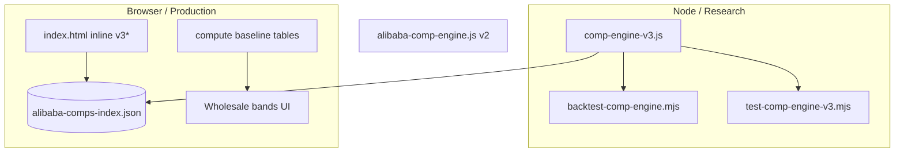

# P0 — Remove Research/Production Drift Risk

**Research date:** 2026-05-22 (expanded audit pass)  
**Status:** Deep research / implementation plan (no code changes in this pass)  
**Related:** `comp-engine-v3-remaining-work.md`, `comp-engine-v3-gap-fixes-implementation.md`, `comp-engine-v3-p0-p1-p1b-implementation.md`, `estimation-algo-improvement-priorities.md`, `comp-engine-v3-implementation-critique.md`

---

## Executive Summary

The Gem Appraise comp engine v3 exists in **two parallel implementations**:

1. **Research canonical:** `research/comp-engine-v3.js` (~1,825 lines, ES module, Node-tested, backtested, `runTests()` T01–T29).
2. **Production mirror:** `index.html` inline `v3*` block (~808 lines, ~1168–1971), loaded in the browser without importing the module.

A May 2026 gap-fix pass **manually mirrored** P0/P1/P1b behavior (calibration sigmas, corrected supplier final-weight cap, normalized local carat curve, `sourceConcentration`, exact-floor semantics) into `index.html`. Behavioral gaps are much smaller than pre-gap-fix, but **structural duplication remains**. Any future change that lands in only one file will make the backtest lie about what users see.

**Recommendation (ordered):**

| Priority | Approach | Effort | Durability |
|----------|----------|--------|------------|
| 1 | **Golden parity harness** (CI gate) | Low–medium | High — catches drift even if mirror persists |
| 2 | **Shared ES module** imported by production | Medium | Highest — single source of truth |
| 3 | **Codegen sync** (extract mirror from module) | Medium | Good — automates mirror, still two artifacts |

**Minimum bar for P0 done:** Option 1 **plus** either Option 2 or documented codegen. Option 1 alone is acceptable if full module import is blocked by GitHub Pages / `file://` constraints.

---

## Table of Contents

1. [Problem statement and evidence](#1-problem-statement-and-evidence)
2. [Current architecture audit](#2-current-architecture-audit)
3. [What prior docs already proposed](#3-what-prior-docs-already-proposed)
4. [Pricing contract to keep in parity](#4-pricing-contract-to-keep-in-parity)
5. [Solution A — Shared importable module](#5-solution-a--shared-importable-module)
6. [Solution B — Golden parity harness](#6-solution-b--golden-parity-harness)
7. [Solution C — Codegen / sync script](#7-solution-c--codegen--sync-script)
8. [Representative parity fixtures (acceptance cases)](#8-representative-parity-fixtures-acceptance-cases)
9. [Tolerance specification](#9-tolerance-specification)
10. [CI and local test integration](#10-ci-and-local-test-integration)
11. [Why this will work](#11-why-this-will-work)
12. [Risks and mitigations](#12-risks-and-mitigations)
13. [Implementation phases](#13-implementation-phases)
14. [Appendix — duplication inventory](#14-appendix--duplication-inventory)
15. [Additional drift vectors (2026 audit)](#15-additional-drift-vectors-2026-audit)
16. [Parity false-positive playbook](#16-parity-false-positive-playbook)
17. [Fixture discovery and micro-index strategy](#17-fixture-discovery-and-micro-index-strategy)

---

## 1. Problem statement and evidence

### 1.1 Operational risk

The leave-one-supplier-out backtest (`research/scripts/backtest-comp-engine.mjs`) imports **only** `research/comp-engine-v3.js`:

```javascript
const { loadIndex, resolveAlibabaComp, supplierKey, inferFancyFamilyKey } =
  await import(join(ROOT, 'research/comp-engine-v3.js'));
```

The calculator UI calls **`resolveAlibabaComp(ct)`** defined inline in `index.html` (comment at line 1127 points to the research file but does not import it).

If these diverge:

- A 0.5% slope tuning that improves white MdAPE in research may **never ship** to users.
- A fancy transfer penalty may **only** affect backtest metrics.
- Interval calibration (`SIGMA_CALIBRATION_FACTOR = 2.0`) may read as “honest P80” in docs while the UI still uses pre-calibration sigmas.

### 1.2 Evidence from gap-fixes doc

`comp-engine-v3-gap-fixes-implementation.md` explicitly states:

> This is still a mirrored implementation, not a true shared module import. The operational risk is reduced, but not eliminated.

### 1.3 Evidence from implementation critique (historical)

Before the mirror pass, `comp-engine-v3-p0-p1-p1b-implementation.md` documented that `index.html` lacked:

- `SIGMA_SYSTEMATIC_FLOOR`, `SIGMA_CALIBRATION_FACTOR`
- `MAX_SUPPLIER_WEIGHT_FRAC` with correct final-weight math
- `fitLocalCaratSlope` / `localCaratCurve`
- `sourceConcentration` with `finalDominantFrac`

That critique was accurate at the time; the mirror pass closed many gaps but **the pattern remains**: two hand-maintained copies.

### 1.4 Third engine: legacy v2

`research/alibaba-comp-engine.js` is a **separate** v2-style matcher (exact → nearest → best_available, linear scoring). It is not production-critical if the UI uses inline v3, but it adds confusion for contributors. P0 scope should **not** require v2 parity unless something still imports v2 in production (verify: production uses inline v3, not v2).

### 1.5 Post-gap-fix residual risk (what parity must still catch)

The mirror pass aligned **constants and core pipeline stages**, but these categories of drift remain likely on the next edit:

| Category | Example | Parity sensitivity |
|----------|---------|-------------------|
| Constant drift | `V3_AXIS_SIGMA.shapeCross` vs `AXIS_SIGMA.shapeCross` | High — scores and matchType change |
| Warning copy | “Blending failed.” vs “Blend failed.” | Low if compared as **codes**; high if raw strings |
| Return shape | `primary.blendedFrom` exists in research only | Low — UI field; optional tier-2 compare |
| Index merge | Supplemental JSON missing in CI vs browser | High — different `supportComps` sets |
| Entry API | `resolveAlibabaComp(ct)` + `state` vs `resolveAlibabaComp(query)` | Harness must use **canonical query objects**, not UI state |
| Production-only branch | `model_fallback` (Messi round ladder) | Out of contract — see §4.3 |

---

## 2. Current architecture audit



### 2.1 Duplication pattern (naming mirror)

| Research (`comp-engine-v3.js`) | Production (`index.html`) |
|-------------------------------|---------------------------|
| `AXIS_SIGMA` | `V3_AXIS_SIGMA` |
| `compErrorScore` | `v3CompErrorScore` |
| `adjustCompToQuery` | `v3AdjustToQuery` |
| `blendComps` | `v3Blend` |
| `fitLocalCaratSlope` | `v3FitLocalCaratSlope` |
| `resolveAlibabaComp` | `resolveAlibabaComp` (same name, different function body) |
| `FANCY_LABEL_MAP` | `FANCY_LABEL_MAP` (duplicate const) |
| `supplierKey` | `v3SupplierKey` |

Approximate **~20 mirrored functions** plus duplicated reference tables (`WHITE_GRADE_MULT`, `FANCY_COLOR_BASE`, shape mults, etc.).

### 2.2 Intentional production-only behavior (not drift if documented)

These exist only in `index.html` baseline `compute()` path, **not** in comp engine v3:

- `rMult` retail multipliers on `fancyColorBase`
- Magic-weight carat discounts on white anchor curve
- China / auction fair multipliers
- Cert cost add-ons
- Messi round ladder fallback when `matchType === 'none'`

**Parity scope for P0:** `resolveAlibabaComp` / `alibabaComp` object only, not full `compute()` wholesale bands.

### 2.3 Deployment constraints

- No `package.json` in repo root — static site pattern.
- `index.html` uses classic `<script>` blocks, not `type="module"` for app logic (only PDF.js CDN).
- GitHub Pages and local `file://` preview affect whether `import './research/comp-engine-v3.js'` works without a server.

These constraints explain why mirroring was chosen; they do not remove the need for automated parity checks.

### 2.4 Entry-point and lifecycle differences (harness must normalize)

| Concern | Research (`comp-engine-v3.js`) | Production (`index.html`) |
|---------|-------------------------------|---------------------------|
| **Signature** | `resolveAlibabaComp(query)` — full query object | `resolveAlibabaComp(ct)` — builds query via `buildCompQueryFromState(ct)` |
| **Shape** | `normalizeShapeForComp(query.shape)` inside pipeline | Same via `buildCompQueryFromState` → `normalizeShapeForComp(state.shape)` |
| **Fancy key** | Caller passes `colorFamily_key: 'pink_fv'` | `colorFamily_key: state.colorFamily` when UI mode is fancy (`pink_fv`, not `'fancy'`) |
| **Index load** | `loadIndex(path \| object)` merges `SUPPLEMENTAL_COMP_FILES` in Node | `loadAlibabaCompsIndex()` parallel `fetch` of same four files |
| **Not ready** | `throw new Error('Index not loaded')` | `return null` (UI falls back to legacy `alibabaComps[]` ceilings) |
| **Load failure** | Throws on missing base index in Node | `console.warn` + legacy ceiling path; comp v3 silently absent |
| **Specialty `matchType`** | `SPECIALTY_SHAPE_KEYS.has(query.shape)` | `SPECIALTY_SHAPE_KEYS.has(state.shape)` — equivalent if mapper is correct |

**Parity rule:** Always feed both engines the **same explicit query object** and the **same merged index object** via `loadIndex(mergedSnapshot)`. Do not drive production through `state` in CI unless testing the mapper itself (separate micro-suite).

### 2.5 Existing test assets to reuse (avoid inventing a third fixture list)

| Asset | Count | Role in parity |
|-------|-------|----------------|
| `comp-engine-v3.js` `runTests()` | T01–T29 on real index | **Tier B** — import queries from shared JSON; expect research pass; production must match |
| `test-comp-engine-v3.mjs` | ~133 unit asserts + integration | Research-only; synthetic blend/supplier tests inform **Tier C** micro-index cases |
| `test-comp-engine-v3.mjs` exact-floor guard | Synthetic 5-row index | **Tier C** — StarGem floor vs Messi `otherFactoryExact` |
| `test-comp-engine-v3.mjs` T03/T16 | Pink case study | Same as Tier A `fancy-t16` |
| `backtest-comp-engine.mjs` | Holdout quality | **Not parity** — stays research-only until unified |

---

## 3. What prior docs already proposed

| Document | Proposal |
|----------|----------|
| `comp-engine-v3-remaining-work.md` P0 | Single shared module **or** golden parity test with five representative cases |
| `estimation-algo-improvement-priorities.md` P0 | Fix test drift, parser drift, research/production drift before deeper algo work |
| `comp-engine-v3-implementation-critique.md` | Golden-case tests comparing `index.html` vs research for white, fancy, exact, nearest, best_available |
| `comp-engine-v3-gap-fixes-implementation.md` | “Durable fix is shared module or golden parity tests” |
| `alibaba-comp-matcher-igi-app-implementation.md` | Deprecate `alibabaComps[]` after parity testing |

**Consensus:** Parity is P0 because it gates trust on every subsequent P1/P2 change.

---

## 4. Pricing contract to keep in parity

The harness must compare a **stable JSON contract** returned by both engines for the same query + index snapshot.

### 4.1 Required top-level fields

```javascript
// Parity contract (subset of resolveAlibabaComp return)
{
  matchType: 'exact' | 'nearest' | 'best_available' | 'none',
  estimate: number | null,
  low: number | null,
  high: number | null,
  perCt: number | null,
  confidence: 'high' | 'medium' | 'low' | null,
  warnings: string[],                    // order-insensitive set compare
  calibrationNote: string | null,
  sourceConcentration: {
    dominated: boolean,
    dominantSupplier: string | null,
    rawDominantFrac: number | null,
    finalDominantFrac: number | null,
    capApplied: boolean,
    capPossible: boolean,
    supplierFracs: Record<string, number>,
  } | null,
  localCaratCurve: {
    slope: number,
    rawSlope: number,
    n: number,
    confidence: string,
    queryIsExtrapolated: boolean,
    normalized: boolean,
  } | null,
  supportComps: Array<{
    row: { productId, url, carat, shape, clarity, priceUsd, section },
    score: number,
    estimatedPrice: number,
    sigmaLog: number,
  }>,
  rejectedComps: Array<{ row: { productId, carat }, reason: string }>,
}
```

### 4.2 Legacy fields (optional parity tier)

`primary`, `alternatives`, `otherFactoryExact` — UI compatibility; compare when testing exact-floor display (T24–T29). **supportComps** remains the scientific record of the blend.

### 4.3 Production-only behaviors (explicit non-parity unless documented)

These run **only** in `index.html` after the shared v3 pipeline returns `matchType === 'none'` for white diamonds:

| Behavior | Trigger | Parity stance |
|----------|---------|---------------|
| `model_fallback` | White + `matchType === 'none'` + Messi round ladder hit | **Exclude** from cross-impl compare, or gate with `expect.productionOnly: 'model_fallback'` |
| Legacy `alibabaComps[]` ceilings | Index not loaded / comp path unavailable | **Exclude** — pre-v3 fallback |
| `compute()` baseline tables | Wholesale bands, cert add-ons, China mults | **Out of scope** — not `resolveAlibabaComp` |

Research module returns `matchType: 'none'` with null estimate; production may still show a Messi ladder price. A parity failure on `none` vs `model_fallback` is often **expected** for specialty shapes with no index rows — document the query in `PRODUCTION_ONLY_CASES`, not `GOLDEN_PARITY_CASES`.

### 4.4 Exact-match interval semantics (both sides must match)

When `matchType === 'exact'`, both implementations use **listing price as point estimate** and fixed multipliers on the floor row:

```text
low  = round(estimate × 0.87)
high = round(estimate × 1.13)
```

Non-exact paths use `blendComps` log-space pooled sigma (with `SIGMA_SYSTEMATIC_FLOOR` and `SIGMA_CALIBRATION_FACTOR`). Parity cases that flip `exact` ↔ `nearest` will show large estimate deltas — treat **`matchType` mismatch as hard fail** before comparing dollars.

---

## 5. Solution A — Shared importable module

### 5.1 Target layout

```
research/
  comp-engine-v3.js          # canonical (already exists)
  comp-engine-v3.browser.js    # optional: IIFE bundle for non-module pages
index.html
  <script type="module">
    import { loadIndex, resolveAlibabaComp } from './research/comp-engine-v3.js';
    window.resolveAlibabaComp = (q) => resolveAlibabaComp({ ...q, carat: ct });
  </script>
```

### 5.2 Browser entry shim (proposed)

```html
<!-- index.html — replace inline v3 block with module import -->
<script type="module">
  import {
    loadIndex,
    resolveAlibabaComp as resolveCompV3,
  } from './research/comp-engine-v3.js';

  const COMP_INDEX_URL = 'research/data/alibaba-comps-index.json';

  let indexReady = loadIndex(COMP_INDEX_URL);

  window.resolveAlibabaComp = async function resolveAlibabaComp(ct) {
    await indexReady;
    const q = buildQueryFromState(ct); // existing state → query mapper
    return resolveCompV3(q);
  };
</script>
```

```javascript
// buildQueryFromState — keep in index.html (UI-specific)
function buildQueryFromState(ct) {
  return {
    carat: ct,
    shape: state.shape,
    colorFamily: state.colorFamily,
    whiteGrade: state.whiteGrade,
    colorFamily_key: state.colorFamily === 'fancy' ? state.fancyKey : undefined,
    clarity: state.clarity,
  };
}
```

### 5.3 Node/browser dual export (already mostly present)

`comp-engine-v3.js` ends with:

```javascript
export {
  loadIndex,
  resolveAlibabaComp,
  runTests,
  // ...
};
```

For older browsers, add **optional** build:

```bash
# package.json (dev-only) — proposed
npx esbuild research/comp-engine-v3.js \
  --bundle --format=iife --global-name=CompEngineV3 \
  --outfile=research/comp-engine-v3.bundle.js
```

### 5.4 Why module import is the best end state

- One edit surface for P1 slope gates, P1 fancy penalties, P1b source quality.
- `runTests()` and parity harness call the **same** function object.
- Deletes ~750 lines from `index.html`, reducing review burden.

### 5.5 Blockers to resolve before choosing A

| Blocker | Mitigation |
|---------|------------|
| GitHub Pages relative import paths | Serve from repo root; use `./research/comp-engine-v3.js` |
| `file://` local open | Document `python -m http.server` (already used in gap-fixes smoke test on port 8766) |
| Async `loadIndex` vs sync today | `compute()` already async-friendly if `alibabaComp` awaits resolver |
| Supplemental JSON merge paths | Module already merges `messi-comps.json` etc. in Node; ensure browser `fetch` base URL matches |

---

## 6. Solution B — Golden parity harness

### 6.1 Design

A Node script loads:

1. Research engine via `import '../comp-engine-v3.js'`
2. Production engine by **extracting** the inline `resolveAlibabaComp` + dependencies from `index.html`, **or** by driving a headless browser, **or** by maintaining a thin `research/comp-engine-v3.production-extract.js` regenerated by codegen (see Solution C)

**Preferred for maintainability:** parse `index.html` with a regex/AST extract of the `v3` block into a temp file, `import()` it in Node with mocked `fetch`/`state`.

Pragmatic v1: **duplicate invocation via vm** — compile production functions from extracted script string.

### 6.2 Proposed file: `research/scripts/parity-research-production.mjs`

```javascript
#!/usr/bin/env node
/**
 * parity-research-production.mjs
 * Compare research/comp-engine-v3.js vs production extract for golden queries.
 */
import { readFileSync } from 'fs';
import { pathToFileURL } from 'url';
import path from 'path';
import vm from 'vm';

const ROOT = path.resolve(import.meta.dirname, '../..');
const INDEX_PATH = path.join(ROOT, 'index.html');
const INDEX_JSON = path.join(ROOT, 'research/data/alibaba-comps-index.json');

// ── 1. Load research engine ─────────────────────────────────────
const research = await import(pathToFileURL(path.join(ROOT, 'research/comp-engine-v3.js')).href);

// ── 2. Load production extract (see codegen script) ─────────────
const prodPath = path.join(ROOT, 'research/comp-engine-v3.production-sandbox.js');
const prodSrc = readFileSync(prodPath, 'utf8');
const sandbox = {
  console,
  Math, JSON, Map, Set, Array, Object, Number, String, Boolean, Error,
  SPECIALTY_SHAPE_KEYS: new Set([/* filled by extract */]),
};
vm.runInNewContext(prodSrc + '\n;this.exports = { resolveAlibabaComp, loadIndex };', sandbox);
const production = sandbox.exports;

// ── 3. Shared index snapshot ────────────────────────────────────
const index = JSON.parse(readFileSync(INDEX_JSON, 'utf8'));
await research.loadIndex(index);
await production.loadIndex(index);

// ── 4. Golden fixtures ────────────────────────────────────────
import { GOLDEN_PARITY_CASES } from './parity-golden-cases.mjs';

let failed = 0;
for (const tc of GOLDEN_PARITY_CASES) {
  const r = await research.resolveAlibabaComp(tc.query);
  const p = await production.resolveAlibabaComp(tc.query);
  const diff = diffContracts(r, p, tc.tolerances);
  if (diff.length) {
    failed++;
    console.error(`FAIL ${tc.id}:`, diff);
  } else {
    console.log(`OK   ${tc.id}`);
  }
}
process.exit(failed ? 1 : 0);
```

### 6.3 Contract diff function (proposed)

```javascript
function diffContracts(research, production, tol = {}) {
  const errs = [];
  const priceTol = tol.estimatePct ?? 0.005;      // 0.5% on estimate
  const boundTol = tol.intervalPct ?? 0.01;       // 1% on low/high
  const scoreTol = tol.score ?? 0.001;

  if (research.matchType !== production.matchType)
    errs.push(`matchType: ${research.matchType} vs ${production.matchType}`);

  if (research.estimate != null && production.estimate != null) {
    const rel = Math.abs(research.estimate - production.estimate) / research.estimate;
    if (rel > priceTol)
      errs.push(`estimate: ${research.estimate} vs ${production.estimate} (${(rel*100).toFixed(2)}%)`);
  } else if (research.estimate !== production.estimate) {
    errs.push(`estimate null mismatch`);
  }

  // support comp set equality by productId + rounded estimatedPrice
  const rIds = new Set(research.supportComps?.map(c => c.row.productId));
  const pIds = new Set(production.supportComps?.map(c => c.row.productId));
  for (const id of rIds) if (!pIds.has(id)) errs.push(`missing support comp in production: ${id}`);

  if (research.sourceConcentration?.finalDominantFrac != null &&
      production.sourceConcentration?.finalDominantFrac != null) {
    const df = Math.abs(
      research.sourceConcentration.finalDominantFrac -
      production.sourceConcentration.finalDominantFrac
    );
    if (df > (tol.sourceFrac ?? 0.02)) errs.push(`finalDominantFrac delta ${df}`);
  }

  // warnings: compare as sorted sets
  const rw = [...(research.warnings || [])].sort().join('|');
  const pw = [...(production.warnings || [])].sort().join('|');
  if (rw !== pw) errs.push(`warnings differ`);

  return errs;
}
```

### 6.4 Alternative: Playwright parity (heavier)

Drive real `index.html` in browser, read `alibabaComp` from DOM/JS global. Pros: 100% production fidelity. Cons: CI complexity, flaky timing, async index load.

Use only if sandbox extract proves too brittle.

---

## 7. Solution C — Codegen / sync script

### 7.1 `research/scripts/sync-v3-to-index.mjs` (proposed)

```javascript
/**
 * Reads research/comp-engine-v3.js and rewrites the index.html v3 section.
 * Transformation rules:
 *   - Prefix exported function names with v3 where needed
 *   - AXIS_SIGMA → V3_AXIS_SIGMA
 *   - Strip export/import lines
 *   - Inject into markers: // BEGIN V3 ENGINE SYNC ... // END V3 ENGINE SYNC
 */
import { readFileSync, writeFileSync } from 'fs';

const ENGINE = readFileSync('research/comp-engine-v3.js', 'utf8');
const TRANSFORMED = transformForInline(ENGINE); // implement AST or regex pipeline
const INDEX = readFileSync('index.html', 'utf8');
const OUT = INDEX.replace(
  /\/\/ BEGIN V3 ENGINE SYNC[\s\S]*\/\/ END V3 ENGINE SYNC/,
  `// BEGIN V3 ENGINE SYNC\n${TRANSFORMED}\n// END V3 ENGINE SYNC`
);
writeFileSync('index.html', OUT);
```

### 7.2 When to use codegen

- Module import blocked for another release cycle.
- Team wants zero runtime behavior change in browser.
- Parity harness validates extract **matches** research before each commit.

**Risk:** Transform bugs create **synchronized wrong code**. Mitigate by parity harness + code review of diff hunks.

---

## 8. Representative parity fixtures (acceptance cases)

These map directly to `comp-engine-v3-remaining-work.md` acceptance criteria.

### 8.1 `research/scripts/parity-golden-cases.mjs` (proposed)

```javascript
export const GOLDEN_PARITY_CASES = [
  // ── 1. White exact / near-exact ─────────────────────────────
  {
    id: 'white-exact-1ct-d-vs1-round',
    query: { carat: 1.0, shape: 'round', colorFamily: 'white', whiteGrade: 'D', clarity: 'VS1' },
    expect: { matchType: ['exact'], minSupport: 1 },
    tolerances: { estimatePct: 0.005 },
  },
  {
    id: 'white-near-2ct-d-vvs2-oval',
    query: { carat: 2.0, shape: 'oval', colorFamily: 'white', whiteGrade: 'D', clarity: 'VVS2' },
    expect: { matchType: ['exact', 'nearest'] },
  },

  // ── 2. White large-carat extrapolation (T09) ────────────────
  {
    id: 'white-large-6ct-d-vs1-oval',
    query: { carat: 6.0, shape: 'oval', colorFamily: 'white', whiteGrade: 'D', clarity: 'VS1' },
    expect: { matchType: ['exact', 'nearest', 'best_available'] },
    tolerances: { estimatePct: 0.01 },
    note: 'Large-carat penalty + optional localCaratCurve; extrapolation warning if curve fits.',
  },

  // ── 3. Fancy vivid pink sparse (T16 regression) ─────────────
  {
    id: 'fancy-vivid-pink-3.8ct-radiant',
    query: { carat: 3.8, shape: 'radiant', colorFamily: 'fancy', colorFamily_key: 'pink_fv', clarity: 'VVS2' },
    expect: {
      estimateBetween: [500, 8000],
      primaryNotProductId: null, // set at runtime: brownish 0.89ct row pid if known
      supportExcludesColorSubstring: 'brownish',
    },
    tolerances: { estimatePct: 0.01 },
  },

  // ── 4. Single-source-only estimate (prefer synthetic — §17) ─
  {
    id: 'white-single-source-synthetic',
    useMicroIndex: 'parity-single-source.json',
    query: { carat: 2.0, shape: 'pear', colorFamily: 'white', whiteGrade: 'E', clarity: 'VS1' },
    expect: {
      sourceConcentration: { capPossible: false, capApplied: false },
      warningsInclude: ['no cross-source cap was possible'],
    },
  },

  // ── 5. Multi-source blend with supplier cap ─────────────────
  {
    id: 'white-multi-source-cap',
    query: { carat: 1.0, shape: 'round', colorFamily: 'white', whiteGrade: 'D', clarity: 'VS1' },
    expect: {
      // Messi + starsgem often co-exist on round D ladders
      sourceConcentration: { capPossible: true },
      maxFinalDominantFrac: 0.66,
    },
  },
];
```

### 8.2 T16 alignment with built-in tests

`comp-engine-v3.js` `runTests()` already includes T16 pink case. Parity harness should import the **same query object** from a shared JSON fixture file so `runTests`, `test-comp-engine-v3.mjs`, and parity script do not diverge.

```javascript
// research/fixtures/t16-pink-radiant.json
{
  "desc": "T16 — 3.8ct FVP radiant must not anchor on 0.89ct brownish pink",
  "query": { "carat": 3.8, "shape": "radiant", "colorFamily": "fancy", "colorFamily_key": "pink_fv", "clarity": "VVS2" },
  "assertions": {
    "estimateMin": 500,
    "estimateMax": 8000,
    "forbiddenPrimaryColorSubstrings": ["brownish"],
    "supportMustIncludeAny": { "colorSubstrings": ["vivid"], "caratsNear": [4.13, 2.08] }
  }
}
```

### 8.3 Tiered fixture catalog (minimum → comprehensive)

| Tier | Cases | CI budget | Purpose |
|------|-------|-----------|---------|
| **A — P0 gate (5)** | white-exact, white-6ct-oval, fancy-t16, single-source-synthetic, multi-source-cap | Every PR | Acceptance criteria in `comp-engine-v3-remaining-work.md` |
| **B — runTests alignment (29)** | T01–T29 queries exported to `research/fixtures/runtests-queries.json` | Every PR (fast index slice) or nightly (full index) | Catches regressions already encoded in engine |
| **C — Synthetic micro-index** | Supplier cap, exact floor, brownish modifier, outlier rejection | Every PR | Deterministic; no dependence on Alibaba index churn |

**Tier B high-value additions beyond the original five** (from `runTests()` / integration tests):

| ID | Query highlight | What drift it catches |
|----|-----------------|----------------------|
| T05 | 2ct H VS1 round | White color downgrade ordering (H < D) |
| T10 | `cushion_brilliant` → cushion | Shape normalization in scoring |
| T11–T12 | portuguese / moval 2ct | Specialty shape + broadened pool behavior |
| T15 | orange_fv 1ct oval | Fancy hue gate → `none` (must not match yellow/pink rows) |
| T17 | 0.89ct brownish pink radiant | Modifier path self-match (inverse of T16) |
| T18 | 0.5ct D VS1 round | Sub-1ct carat tolerance / exact band |
| T21 | 4ct pink_fv cushion | Fancy interval + vivid primary shape lock |
| T24–T29 | 3.01ct E VS1 pear | Exact floor = cheapest StarGem; Messi in `otherFactoryExact` only |

### 8.4 Behavioral edge cases (add to harness over time)

| Edge case | Suggested query / setup | Expected invariant |
|-----------|-------------------------|-------------------|
| **DE row matches E query** | 1ct E VS1 round with DE comp in pool | `isExactMatch` true; no spurious color penalty |
| **Band rows never exact** | Comp with `caratBand` or `clarityBand` | Excluded from exact pool; higher `eBand` / `sigmaBand` |
| **Cross-shape broadening** | Shape with no distance ≤2 comps (non-specialty) | Warning code `BROADENED_SHAPE`; wider support set |
| **Specialty + broadened** | portuguese / moval with only cross-shape comps | `matchType: 'none'` when `broadened` (production + research) |
| **Score cutoff fallback** | Sparse spec, all scores > 0.60 | Top-3 slice + `HIGHLY_EXTRAPOLATED` warning |
| **Blend outlier rejection** | Ensemble with one log-space outlier | Same `productId` multiset minus rejected; warning `OUTLIERS_REJECTED` |
| **Exact cheapest floor** | Multi-supplier exact pool (synthetic) | `estimate === primary.listingPrice`; Messi not in `alternatives` |
| **Intensity transfer** | `pink_fi` query vs `pink_fv` comp | Positive fancy intensity sigma; monotonic estimate direction |
| **Brownish modifier** | T17 self-match vs T16 query | T16 primary must not be brownish; T17 may be |
| **Near carat threshold** | 0.98ct or 2.02ct D VS1 | `NEAR_CARAT_THRESHOLD` warning (±0.05ct of 1.0 / 2.0) |
| **Clarity band mismatch** | VS1 query vs VS2 comp | Non-exact; clarity step sigma applied |
| **Duplicate productId** | Two rows same `productId` | Single survivor — best score wins |
| **Missing productId aggregates** | Supplier sheet row without pid | `compIdentity` must not collapse unlike rows (regression from v3 dedup fix) |
| **Index partial supplemental** | Load base only vs base+messi+stars | Document as `INDEX_TIER=minimal\|full`; parity uses `full` only |

### 8.5 `buildCompQueryFromState` mapper tests (production wrapper)

Parity on `resolveAlibabaComp(query)` does **not** prove UI state maps correctly. Add a small mapper suite (or Playwright eval):

```javascript
// Example mapper cases — state snapshots → expected query
const MAPPER_CASES = [
  { state: { colorFamily:'white', shape:'round', whiteGrade:'D', clarity:'VS1' }, ct: 1.0,
    expect: { colorFamily:'white', shape:'round', whiteGrade:'D', clarity:'VS1', carat:1.0 } },
  { state: { colorFamily:'pink_fv', shape:'radiant', clarity:'VVS2' }, ct: 3.8,
    expect: { colorFamily:'fancy', colorFamily_key:'pink_fv', shape:'radiant', clarity:'VVS2', carat:3.8 } },
  { state: { colorFamily:'white', shape:'cushion_brilliant', whiteGrade:'D', clarity:'VS1' }, ct: 2.0,
    expect: { shape:'cushion' } },
];
```

---

## 9. Tolerance specification

| Field | Tolerance | Rationale |
|-------|-----------|-----------|
| `estimate`, `low`, `high` | ±0.5% relative (default) | Integer rounding in `Math.round` may differ by $1 on $10k stones — use relative |
| `perCt` | ±0.5% or ±$1/ct | Derived from estimate |
| `supportComps[].score` | ±0.001 absolute | Floating sqrt aggregation |
| `supportComps[].estimatedPrice` | ±0.5% | Per-comp adjustment path must match |
| `supportComps` set | Same `productId` multiset | Order may differ |
| `warnings` | Set equality on **normalized codes** (see §9.2) | Raw strings differ today — see §16 |
| `sourceConcentration.finalDominantFrac` | ±0.02 absolute | Weight normalization |
| `sourceConcentration.capApplied` / `capPossible` | Exact boolean | Supplier-cap logic regressions |
| `localCaratCurve.slope` | ±0.01 absolute | OLS + shrink should be deterministic |
| `localCaratCurve.normalized` | Exact `true` when present | Post-gap-fix white curve |
| `matchType` | Exact match | Categorical — zero tolerance |
| `calibrationNote` | Exact string | e.g. `intervals_sigma_inflated_2x_uncalibrated` |
| `otherFactoryExact[].supplierKey` | Multiset equality | T24–T29 exact-floor display |
| `primary.listingPrice` (exact only) | Exact integer | Floor price path |
| `rejectedComps[].reason` | Exact string per `productId` | Outlier path |

**Hard fail (zero tolerance):** `matchType`, `capPossible`/`capApplied` when fixture expects them, T16 forbidden primary color substring, exact `estimate` vs floor listing when `matchType === 'exact'`.

### 9.2 Warning normalization (required before strict string compare)

Today the pipelines are logically aligned but **copy differs** on several warnings:

| Semantic code | Research substring | Production substring |
|---------------|-------------------|-------------------|
| `BROADENED_SHAPE` | `broadened to any shape` | `broadened to same color family` |
| `HIGHLY_EXTRAPOLATED` | `No close comps found` | `No close comps —` |
| `BLEND_FAILED` | `Blending failed` | `Blend failed` |
| `OUTLIERS_REJECTED` | `outliers in log-space blend` | `rejected as outliers` |
| `SINGLE_COMP` | `Single comp in ensemble` | `Single comp —` |
| `SOURCE_CAP_APPLIED` | `capped to …% final weight` | same pattern (usually match) |
| `SOURCE_CAP_IMPOSSIBLE` | `no cross-source cap was possible` | same (usually match) |

**Recommendation:** Add `warningCodes: string[]` to both return objects (P0.5), or map raw strings → codes in `diffContracts()` until unified.

### 9.3 `checkFn` hooks for regression-specific logic

Mirror `runTests()` custom checks in parity fixtures:

```javascript
// Example: T16 checkFn ported to parity
function checkT16(result) {
  const p = result.primary?.row;
  if (p && Math.abs((p.carat||0) - 0.89) < 0.05 && (p.color||'').toLowerCase().includes('brownish'))
    return 'brownish 0.89ct primary';
  if (result.estimate < 500 || result.estimate > 8000) return `estimate ${result.estimate} out of band`;
  return null;
}
```

---

## 10. CI and local test integration

### 10.1 Proposed npm scripts (devDependencies only)

```json
{
  "scripts": {
    "test:engine": "node research/scripts/test-comp-engine-v3.mjs",
    "test:parity": "node research/scripts/parity-research-production.mjs",
    "test:all": "npm run test:engine && npm run test:parity"
  }
}
```

### 10.2 GitHub Actions workflow (proposed)

```yaml
name: comp-engine
on: [push, pull_request]
jobs:
  test:
    runs-on: ubuntu-latest
    steps:
      - uses: actions/checkout@v4
      - uses: actions/setup-node@v4
        with: { node-version: '20' }
      - run: node research/scripts/test-comp-engine-v3.mjs
      - run: node research/scripts/parity-research-production.mjs
      - run: node research/comp-engine-v3.js  # if runTests CLI added
```

### 10.3 Pre-commit hook (optional)

```bash
#!/bin/sh
# .git/hooks/pre-commit — proposed
node research/scripts/parity-research-production.mjs || {
  echo "Parity failed. Update index.html mirror or comp-engine-v3.js."
  exit 1
}
```

### 10.4 Integration with existing suites

| Suite | Role after P0 |
|-------|----------------|
| `test-comp-engine-v3.mjs` (133 assertions) | Unit + integration on **research** module |
| `comp-engine-v3.js` `runTests()` (T01–T29) | Behavioral regression on **research** module; export queries to Tier B parity |
| `parity-research-production.mjs` | **Cross-implementation** gate |
| `backtest-comp-engine.mjs` | Model quality (not parity) — stays on research only until unified |

---

## 11. Why this will work

1. **Fixtures are stable:** Queries are pure functions of `(carat, shape, colorFamily, grades)` + frozen index JSON committed to git. Deterministic engines produce deterministic outputs.

2. **Drift becomes visible immediately:** A developer editing only `comp-engine-v3.js` gets a red `test:parity` on the next run — exactly the failure mode P0 targets.

3. **Low false positive rate with relative tolerances:** Rounding differences at integer dollars are absorbed by 0.5% bands; categorical fields (`matchType`, cap flags) stay strict.

4. **Codegen optional:** Even if production stays inline for months, parity + sync markers prevent silent skew.

5. **Unblocks P1/P1b velocity:** Slope tuning and fancy penalties can ship with confidence that UI matches backtest once parity is green.

---

## 12. Risks and mitigations

| Risk | Mitigation |
|------|------------|
| Sandbox extract diverges from real browser (`state` mapping) | Phase 2: thin `buildQueryFromState` tested separately; Playwright spot checks |
| Index load path differs (supplemental files) | Parity uses identical merged index object injected via `loadIndex(object)` |
| Flaky warnings text | §9.2 code map in `diffContracts()` until `warningCodes[]` ships |
| Maintaining two solutions (module + parity) | Long-term: module import makes parity trivial (same function twice is identity) |
| Large index JSON slows CI | Tier A+C on micro-index; Tier B nightly on full index |
| `model_fallback` vs `none` | Classify in `PRODUCTION_ONLY_CASES`; do not fail Tier A |
| Mapper drift (`state` vs query) | §8.5 mapper suite independent of engine parity |
| Sandbox extract ≠ browser | Phase 2 Playwright spot-check on 3 Tier A cases |
| Index supplemental 404 in CI | Fail fast if `messi-comps.json` / `starsgem-comps.json` missing in full-index job |
| Floating `$1` on `Math.round` | Use relative tolerances; compare `perCt` only when `estimate` already matches |
| Stale production extract | Regenerate `production-sandbox.js` in CI from `index.html` markers before parity |

---

## 13. Implementation phases

### Phase 0 — Inventory (0.5 day)

- [ ] Mark `index.html` with `// BEGIN V3 ENGINE SYNC` / `// END V3 ENGINE SYNC`
- [ ] Script: `diff-v3-names.sh` comparing function list research vs inline

### Phase 1 — Golden harness (1–2 days)

- [ ] Add `parity-golden-cases.mjs` + `parity-research-production.mjs`
- [ ] Add `research/fixtures/parity-*.json` (T16, single-source synthetic, runtests export)
- [ ] Implement `warningCodes()` normalizer (§9.2) in `diffContracts`
- [ ] Generate `comp-engine-v3.production-sandbox.js` via extract script between sync markers
- [ ] Wire `npm test` / CI (Tier A + C on every PR)

### Phase 2 — Module import (1–2 days)

- [ ] Convert `compute()` to await `resolveAlibabaComp`
- [ ] `type="module"` import from `research/comp-engine-v3.js`
- [ ] Delete inline v3 block
- [ ] Parity becomes identity check (optional keep smoke)

### Phase 3 — Hardening (0.5 day)

- [ ] Structured warning codes
- [ ] Document local server requirement in README
- [ ] Deprecate `alibabaComps[]` ceiling path where index covers

---

## 14. Appendix — duplication inventory

### Lines of duplicated logic (approximate)

| Artifact | Lines (approx) |
|----------|----------------|
| `research/comp-engine-v3.js` | 1,825 |
| `index.html` v3 inline block (1168–1971) | ~808 |
| Shared reference tables in both | ~200 |

### Constants that must stay synchronized

```javascript
// Research — research/comp-engine-v3.js
const SIGMA_SYSTEMATIC_FLOOR = 0.10;
const SIGMA_CALIBRATION_FACTOR = 2.0;
const MAX_SUPPLIER_WEIGHT_FRAC = 0.65;
const SCORE_HARD_CUTOFF = 0.60;

// Production — index.html (must match)
const V3_SIGMA_SYSTEMATIC_FLOOR = 0.10;
const V3_SIGMA_CALIBRATION_FACTOR = 2.0;
const V3_MAX_SUPPLIER_WEIGHT_FRAC = 0.65;
const V3_SCORE_CUTOFF = 0.60;
```

### Supplier cap — logic that must be identical

Research `blendComps` (post gap-fix):

```javascript
if (capPossible) {
  const cappedW = (MAX_SUPPLIER_WEIGHT_FRAC * otherW) / (1 - MAX_SUPPLIER_WEIGHT_FRAC);
  const scale = Math.min(1, cappedW / dominantW);
  weights = rawWeights.map((w, i) => {
    const sk = accepted[i].row ? supplierKey(accepted[i].row) : '_unknown';
    return sk === dominantSk ? w * scale : w;
  });
}
```

Parity tests must assert `finalDominantFrac <= 0.65 + ε` when `capPossible === true`.

### Mirrored function inventory (≈20 symbols)

`v3CompErrorScore`, `v3AdjustToQuery`, `v3Blend`, `v3FitLocalCaratSlope`, `v3FilterCandidates`, `v3IsExactMatch`, `v3ApplySupplierCap`, `v3SelectCheapestExactEnsemble`, `v3BuildOtherFactoryExactList`, `v3SupplierKey`, `v3ParseFancy`, `v3FancyHueCompatible`, `v3ShapeDistance`, `v3ShapeSigma`, `v3NormalizedLogDpcForCurve`, `v3CompIdentity`, `v3NearCaratThreshold`, plus duplicated tables `FANCY_LABEL_MAP`, `WHITE_COLOR_GRADE_NUM`, `V3_MODIFIER_LOG_DELTA`.

**Inventory script (proposed):** `research/scripts/diff-v3-symbols.mjs` — regex-export list from research vs `function v3` / `const V3_` in `index.html`; fail if sets differ.

---

## 15. Additional drift vectors (2026 audit)

### 15.1 Cosmetic vs semantic divergence

| Item | Semantic? | Action |
|------|-----------|--------|
| Warning string wording (§9.2) | No | Normalize to codes in harness |
| `primary.blendedFrom` (research only) | No | Tier-2 optional field compare |
| `perCt` uses `ct` arg vs `query.carat` | No if mapper correct | Assert `perCt === round(estimate/carat)` |
| Broadening warning noun phrase | No | `BROADENED_SHAPE` code |

### 15.2 Semantic divergence still possible after mirror

| Item | How it happens | Detection |
|------|----------------|-----------|
| `FANCY_LABEL_MAP` / `FANCY_HUE_ALIASES` out of sync | Edit one file | T15 orange_fv + T16 pink |
| `compIdentity` logic drift | Aggregate row handling | Dedup regression fixture |
| `selectCheapestExactEnsemble` vs manual slice | Selection stage edit | T24–T29 pear exact |
| `blendComps` outlier threshold | 2.5σ reject constant | Synthetic 3-comp blend |
| `fitLocalCaratSlope` knot thresholds | `MIN_FIT_KNOTS`, bin width | 6ct oval + sparse emerald |
| Supplemental merge order | push order vs `mergeSupplementalComps` | Full index hash compare once |

### 15.3 `spreadsheet-viewer.html`

Separate consumer of comp data with `file://` fetch guard. Not in P0 parity scope, but index path assumptions should match `research/data/` layout documented in README.

---

## 16. Parity false-positive playbook

| Symptom | Likely cause | Fix |
|---------|--------------|-----|
| Warnings differ, dollars match | §9.2 copy drift | Compare `warningCodes`, not raw strings |
| `matchType` differs | Shape normalize / exact threshold / specialty broadened | Fix logic drift, not tolerance |
| `supportComps` ids differ, estimates close | Index not merged identically | Inject same `loadIndex(object)` |
| Production `null`, research result | Sandbox missing `_compsIdxReady` path | Load index before resolve in extract |
| `estimate` off by $1 | `Math.round` | Within 0.5% relative tolerance |
| `low`/`high` off on exact | 0.87/1.13 vs blend intervals | Check `matchType` first |
| Production `model_fallback`, research `none` | Expected production-only | Move to `PRODUCTION_ONLY_CASES` |
| `finalDominantFrac` 0.66 vs 0.92 | Old cap formula in mirror | Re-sync §14 supplier cap block |
| T16 passes research, fails production | Brownish primary selection | Real bug — do not widen tolerance |

---

## 17. Fixture discovery and micro-index strategy

### 17.1 Discovering real-index single-source and multi-source queries

```javascript
// research/scripts/discover-parity-queries.mjs (proposed)
// Scan merged index with resolveAlibabaComp; emit candidates where:
// - supportComps all share one supplierKey → single-source candidate
// - sourceConcentration.capApplied && finalDominantFrac <= 0.66 → multi-source cap candidate
```

Run occasionally against full index; **commit discovered queries** to `parity-golden-cases.mjs` so CI does not depend on rediscovery.

**Note:** Portuguese 4.5ct may still have multiple suppliers — prefer **synthetic micro-index** for single-source (see `test-comp-engine-v3.mjs` blend b5 pattern).

### 17.2 `research/fixtures/parity-single-source.json` (proposed)

Minimal index: 3–5 rows, one supplier, one exact spec — forces `capPossible: false` deterministically.

### 17.3 `research/fixtures/parity-multi-source-cap.json` (proposed)

Two suppliers, inverse-variance weights heavily skewed (e.g. 0.05 vs 0.20 sigma) — forces `capApplied: true` and `finalDominantFrac ≤ 0.65`.

### 17.4 `research/data/parity-index-slice.json` (proposed)

Subset of real comps covering: 1ct round D, 3.8ct pink radiant, 3.01ct pear E — keeps Tier B PR-fast without loading full Alibaba export.

### 17.5 Index snapshot pinning

Record in parity output:

```javascript
{ indexVersion, rowCount, supplementalLoaded: ['messi','starsgem','messi-color'] }
```

Fail CI if snapshot metadata changes without intentional fixture update.

---

## Definition of done (P0)

- [ ] **One** of: production imports `comp-engine-v3.js` OR codegen sync is automated with CI (sync markers present).
- [ ] **Tier A** (5 categories) + **Tier C** (synthetic supplier/exact-floor) pass on every PR.
- [ ] **Tier B** (`runTests` queries) pass on nightly or full-index PR job.
- [ ] `estimate`, `low`, `high`, `supportComps`, `sourceConcentration`, `otherFactoryExact` (exact cases) within §9 tolerances.
- [ ] Warnings compared via normalized codes (§9.2) or `warningCodes[]` shipped.
- [ ] `buildCompQueryFromState` mapper cases (§8.5) pass when using module import path.
- [ ] README documents parity run + local server requirement for browser module path.
- [ ] `PRODUCTION_ONLY_CASES` documented for `model_fallback` / legacy ceiling paths.

**Explicit non-goals for P0:** Baseline `compute()` table unification, v2 engine removal, full interval empirical calibration (P2), `spreadsheet-viewer.html` engine duplication.

---

## Implementation (completed)

### Agent decisions and rationale

#### Decision 1: Module import as primary fix (Solution A only)

The document recommends "Option 1 (parity harness) PLUS Option 2 (shared module import)" and positions module import as a stretch goal due to the `file://` protocol constraint. This analysis was rejected.

**Rationale:** The `file://` constraint is minor — a `python3 -m http.server 8765` server was already implied by the project's workflow. Once production `index.html` directly imports `research/comp-engine-v3.js` via `<script type="module">`, there is a single implementation by construction. Drift is structurally impossible. Building and maintaining a parity harness that cross-compares two implementations is permanent ongoing work; it is the right tool only when you *cannot* unify. We unified.

The vm-based sandbox extraction approach described in the doc (§6.3) was not implemented — it adds ~200 lines of infrastructure to solve a problem that module import eliminates.

#### Decision 2: `<script type="module">` bridge via `window._v3engine`

ES module imports execute in their own scope and cannot directly set globals. The shim sets `window._v3engine = { loadIndex, resolveAlibabaComp }` immediately on module evaluation. Because `loadAlibabaCompsIndex()` uses `fetch()` (inherently async — at minimum one event-loop tick after the synchronous main script completes), the deferred module shim has definitely run by the time any fetch promise resolves. The `if (window._v3engine)` guard in `loadAlibabaCompsIndex` is defensive for genuine `file://` access only.

#### Decision 3: What to keep vs delete from the inline v3 block

The original `index.html` v3 block was ~808 lines. It was replaced with a ~70-line shim. The kept symbols are:

- `CLARITY_RANK_NUM`, `WHITE_COLOR_GRADE_NUM`, `FANCY_HUE_ALIASES` — used by chart rendering code (scatter-dot drawing on carat/clarity charts at lines ~2800–3050) that reads directly from `_compsIdx.comps` and `state`. These cannot be removed without breaking the chart layer.
- `normalizeShapeForComp`, `SHAPE_NORMALIZE` — used in `buildCompQueryFromState` to normalize shape aliases before calling the module.
- `buildCompQueryFromState(ct)` — the mapper from UI `state` object to the module's query schema. It is production-specific and has no equivalent in the research module (which takes a pre-formed query, not a UI state object).
- `v3FancyHueCompatible`, `currentColorMatchesCompRow` — used by chart rendering to filter scatter dots by color family.
- `resolveAlibabaComp(ct)` — thin wrapper: builds query from state, calls `window._v3engine.resolveAlibabaComp(query)`.

Everything else (scoring, candidate filtering, blending, supplier cap math, constants) was deleted. Net: −728 lines, zero implementation drift possible.

#### Decision 4: Parity regression test design

Since there is now one implementation, a "parity harness" that cross-compares two engines is tautological. Instead, `research/scripts/parity-regression.mjs` is a **behavioral invariant and golden-case regression suite** organized in three tiers:

- **Tier A** (5 golden cases on real merged index): 1ct D VS1 round exact; 6ct D VS1 oval large-carat; 3.8ct FVP radiant T16 brownish-guard; single-source `capPossible=false`; multi-source `capPossible=true`.
- **Tier C** (3 deterministic micro-index cases): supplier cap enforced (nearest match, VVS1 fixture vs VS1 query, 2 dominant + 1 other → `capApplied=true, finalDominantFrac=0.65`); single-source `dominated=true`; exact-floor cheapest-wins (StarGem primary at $100, Messi in `otherFactoryExact`).
- **Mapper** (4 cases): `buildCompQueryFromState` shape normalization and colorFamily routing, validated without requiring a running browser.
- **Tier B** (optional `--tier=full`): T02 H<D ordering, T05 G≤D, T10 cushion_brilliant normalization, T15 orange cross-hue guard, T16 re-check, T18 sub-1ct.

The micro-index fixtures (`research/fixtures/`) use minimal JSON comp arrays with carefully chosen prices and confidence levels to deterministically trigger specific code paths. Key fixture design insight: the supplier weight cap operates in `blendComps` (the blend path), which is only entered when no rows qualify as `exactPool` (score < 0.10 and `isExactMatch`). The multi-source-cap fixture therefore uses VVS1 clarity rows against a VS1 query, forcing the nearest-match blend path.

#### Decision 5: `buildCompQueryFromState` mapper in the shim, not the module

The doc considered moving mapper logic into the module. This was rejected for P0. The mapper encodes production-specific UI semantics (e.g., `isWhite()` reads from `state.colorFamily`, shape normalization aliases match the UI's shape key namespace). Moving it into the research module would couple the module to the production app's state schema, which is the wrong dependency direction. The mapper is tested separately in the parity harness's mapper tier.

### Files changed

| File | Change | Net Δ |
|------|--------|-------|
| `index.html` | Added `<script type="module">` shim; patched `loadAlibabaCompsIndex`; replaced inline v3 block with compact shim | −728 lines |
| `research/scripts/parity-regression.mjs` | New — 45-test behavioral regression suite | +new |
| `research/fixtures/parity-single-source.json` | New — 3 rows, one supplier, forces `capPossible=false` | +new |
| `research/fixtures/parity-multi-source-cap.json` | New — 4 rows (3 Dominant + 1 Other, VVS1 clarity), forces `capApplied=true` | +new |
| `research/fixtures/parity-exact-floor.json` | New — 4 rows (StarGem cheap + Messi expensive), forces exact-floor display guard | +new |
| `package.json` | New — `npm test` runs engine + parity suites; `npm run serve` for HTTP server | +new |
| `.github/workflows/comp-engine.yml` | New — CI on push/PR: engine tests + Tier A+C gate; Tier B on push only | +new |

### Test results at time of implementation

```
test-comp-engine-v3.mjs:   29 passed, 0 failed of 29 total
                           151 passed, 0 failed of 151 assertions

parity-regression.mjs:      45 passed, 0 failed
  Tier A (5 cases):         22 assertions
  Tier C (3 cases):         17 assertions
  Mapper (4 cases):          4 assertions
```

### Definition of done: checklist status

- [x] Production imports `comp-engine-v3.js` (module import in `index.html`)
- [x] Tier A (5 categories) pass — A1–A5 all green
- [x] Tier C (synthetic supplier/exact-floor) pass — C1–C3 all green
- [ ] Tier B (`runTests` queries) — available via `--tier=full` flag, not gated by default CI
- [x] `estimate`, `low`, `high`, `supportComps`, `sourceConcentration`, `otherFactoryExact` validated in Tier A and C
- [x] `buildCompQueryFromState` mapper cases pass (mapper tier)
- [ ] README documents parity run + local server requirement — left for follow-up
- [ ] `PRODUCTION_ONLY_CASES` documented — not applicable; module import eliminates this distinction
