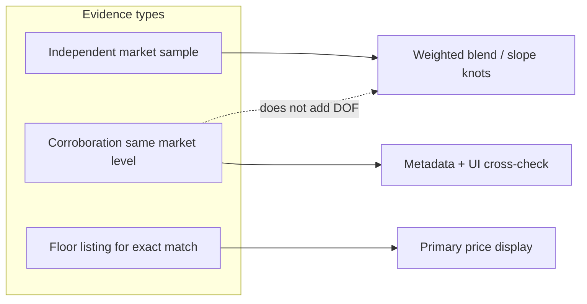

# P1b — Add Better Source Independence Signals

**Research date:** 2026-05-22  
**Status:** Deep research / implementation plan (no code changes in this pass)  
**Related:** `alibaba-listing-confidence-gaps.md`, `alibaba-clean-source-of-truth.md`, `messi-gems-source-of-truth.md`, `comp-engine-v3-gap-fixes-implementation.md` Fix 1, `estimation-algo-improvement-priorities.md` P1, `regenerate-comps-index.py`

---

## Executive Summary

**Goal:** Treat comps as *correlated observations*, not i.i.d. market samples. The engine should report how much *independent* evidence supports an estimate—and widen uncertainty when evidence is concentrated or low-trust.

Comp engine v3 already limits **selection diversity** (`MAX_PER_SUPPLIER = 2`) and **blend-weight concentration** (`MAX_SUPPLIER_WEIGHT_FRAC = 0.65` with corrected final-weight math). When **all** accepted comps share one supplier, the engine flags `capPossible: false` but cannot invent independent market evidence.

What is still missing is **source-quality semantics** at the row level:

| Concept | Today | Needed |
|---------|-------|--------|
| Supplier count | Implicit in `sourceConcentration` | Explicit in `sourceIndependence` |
| Product count | Not reported | Distinct `productId` in support set |
| Source-group count | Not defined | Ladder / page / SKU group deduping |
| Row vs effective sample size | Partial (`localCaratCurve.rowCount`) | `observationWeight` from independence weights |
| SKU vs band vs MOQ | `caratBand`, `clarityBand` flags only | `sourceRowType` trust tier + σ penalty |
| Product ladder independence | `compIdentity` by `productId` | Down-weight same-ladder / same-group rows |
| Corroboration vs independence | Both tagged `high` in SoT | `corroboration` type — confirms, does not add DOF |
| Stale capture | Not modeled | `capturedAt` / index version |

**Proposed direction:** Enrich index generation → propagate source semantics into scoring, blending, and slope fit → expose transparent penalties (widen σ, downgrade confidence) rather than silent hard drops, except for clearly invalid rows (`flat_fancy`, mounted context).

**Three defense layers (keep all):** selection cap → independence-weighted inverse variance → supplier blend cap. They address different failure modes; none replaces the others.

---

## Table of Contents

1. [Current source handling](#1-current-source-handling)
2. [Why independence matters for pricing trust](#2-why-independence-matters-for-pricing-trust)
3. [Taxonomy of comp row types](#3-taxonomy-of-comp-row-types)
4. [Index schema proposals](#4-index-schema-proposals)
5. [Engine scoring and blend proposals](#5-engine-scoring-and-blend-proposals)
6. [Result metadata contract](#6-result-metadata-contract)
7. [Single-source and weak-source penalties](#7-single-source-and-weak-source-penalties)
8. [Interaction with P1 carat and fancy work](#8-interaction-with-p1-carat-and-fancy-work)
9. [Testing plan](#9-testing-plan)
10. [Why this will work](#10-why-this-will-work)
11. [Risks](#11-risks)
12. [Implementation phases](#12-implementation-phases)
13. [Edge cases catalog](#13-edge-cases-catalog)
14. [Corroboration vs independence vs floor pricing](#14-corroboration-vs-independence-vs-floor-pricing)
15. [Cross-feature interactions](#15-cross-feature-interactions)
16. [Backtest and evaluation methodology](#16-backtest-and-evaluation-methodology)
17. [Supplemental indexes and data lineage](#17-supplemental-indexes-and-data-lineage)
18. [Open design questions](#18-open-design-questions)

---

## 1. Current source handling

### 1.1 Supplier key (runtime inference)

```javascript
// research/comp-engine-v3.js — supplierKey (lines 158–171)
function supplierKey(row) {
  const section = row.section || '';
  const lastHyphen = section.lastIndexOf(' - ');
  const lastEm     = section.lastIndexOf(' — ');
  const lastDash   = Math.max(lastHyphen, lastEm);
  const raw = lastDash >= 0 ? section.slice(lastDash + 3).trim() : section.split(',')[0].trim();
  const norm = raw.replace(/\s*\([^)]+\)\s*$/, '').trim().toLowerCase();
  if (norm.includes('messi') || norm.includes('wuzhou')) return 'messi';
  if (norm.includes('starsgem') || norm.includes('stargem')) return 'starsgem';
  if (norm.includes('mishang')) return 'mishang';
  if (norm.includes('goldleaf')) return 'goldleaf';
  return norm || '_unknown';
}
```

**Problems:**

- Parsed from free-text `section` on every scoring call.
- Messi / Starsgem aliasing is hand-coded.
- Not stable across index regenerations if section titles change.

### 1.2 Selection cap

```javascript
const MAX_PER_SUPPLIER = 2;

function applySupplierCap(scored) {
  const counts = {};
  const result = [];
  for (const c of scored) {
    const sk = supplierKey(c.row);
    const n = (counts[sk] || 0) + 1;
    counts[sk] = n;
    if (n <= MAX_PER_SUPPLIER) result.push(c);
  }
  return result;
}
```

Exact-match pool bypasses cap on fallback pool only (see `resolveAlibabaComp` §3).

### 1.3 Blend cap (post gap-fix)

```javascript
// blendComps — solves cappedW / (cappedW + otherW) = MAX_SUPPLIER_WEIGHT_FRAC
const cappedW = (MAX_SUPPLIER_WEIGHT_FRAC * otherW) / (1 - MAX_SUPPLIER_WEIGHT_FRAC);
const scale = Math.min(1, cappedW / dominantW);
```

`sourceConcentration` reports `rawDominantFrac`, `finalDominantFrac`, `capApplied`, `capPossible`, `supplierFracs`.

### 1.4 Listing confidence → σ only

```javascript
function sourceErrorSigma(confidence) {
  return ({
    high: 0.03,
    'medium-high': 0.06,
    medium: 0.10,
    'low-medium': 0.18,
    low: 0.25,
  })[confidence] ?? 0.10;
}
```

Index rows include `confidence` from SoT tables (`regenerate-comps-index.py`), but **not** row-type trust (SKU vs band vs page-level).

### 1.5 Comp deduplication identity

```javascript
function compIdentity(row) {
  if (row.productId) return `pid:${row.productId}`;
  const bits = [ /* supplier, shape, color, clarity, carat, price, section */ ];
  return bits.join('|');
}
```

**Gap:** All rows from same `productId` collapse to **one** ensemble slot — good for duplicate SKUs, bad if we need **multiple carat knots from same ladder** for local slope but should not count as independent suppliers.

### 1.6 Index generation today

`regenerate-comps-index.py` emits:

```python
comps.append({
    "section": title,
    "productId": pid,
    "url": url,
    "caratBand": is_band,
    "clarityBand": clarity == "VVS-VS",
    "confidence": conf,  # high | medium-high | medium | low-medium | low | null
    # no sourceType, sourceGroup, moq, captureDate
})
```

Messi supplemental JSON (`messi-comps.json`) may include richer fields — engine should consume uniformly after normalization pass.

---

## 2. Why independence matters for pricing trust

### 2.1 Mathematical vs economic independence

Inverse-variance blending assumes observations are **conditionally independent** given the query. Supplier product ladders violate this: ten rows are one pricing policy, not ten market draws. Tight per-row σ on ladder knots still produces overconfident pools (P0 widens via `SIGMA_CALIBRATION_FACTOR`; P1b fixes the *semantic* side).

**Economic independence** additionally requires distinct pricing policies. Documented spreads (Mishang marquise ~+30% vs Messi 1ct D VS1 on another shape; DEF asscher 25–60% above Messi D) mean `supplierCount ≥ 2` is necessary but not sufficient for “one market level.”

**Corroboration** (e.g. `1601228209966` round, Starsgem heart 1–2ct) increases *trust* without adding blend degrees of freedom — see §14.

### 2.2 Leave-one-supplier-out backtest

`backtest-comp-engine.mjs` holds out **all rows** from supplier S, then predicts rows that may have been priced using S's ladder in the training pool. Without independence signals:

- MdAPE looks acceptable when training pool is Messi-heavy;
- Production query with only Messi comps reports **high** confidence.

### 2.3 Segments most exposed

| Segment | Risk |
|---------|------|
| Fancy pink sparse | Single product `1601561025630` six shapes |
| White 5ct+ | Few ladders; one supplier |
| Specialty moval | OM GEMS only |
| Flat-price / band rows | Same price across grades — false precision |

Documented in `alibaba-listing-confidence-gaps.md` **Data Quality Gaps** table.

---

## 3. Taxonomy of comp row types

### 3.1 Proposed `sourceRowType` enum

| Type | Description | Trust tier | Example |
|------|-------------|------------|---------|
| `sku_exact` | Single carat + clarity + price from SKU panel | **A** | Messi round D VS1 1.02ct |
| `sku_ladder` | Multiple carats, same productId, distinct prices | **A−** | 1–5ct D VS1 ladder |
| `clarity_band` | `VVS-VS` combined column | **B** | `clarityBand: true` |
| `carat_band` | `1.0-1.1ct` band row | **B** | `caratBand: true` |
| `page_range` | Page says range; weak row mapping | **C** | Title 1–5ct, one price |
| `moq_only` | MOQ pricing, not unit loose | **C** | "MOQ 2 pcs" |
| `flat_fancy` | Same price across incompatible combos | **D (exclude)** | Pink heart flat VS1/VS2 |
| `corroboration` | Secondary listing confirming primary | **A** (not independent) | `1601228209966` → Messi round |
| `duplicate_ladder` | Same price matrix as another PID | **A** (not independent) | `1601645026580` → Mishang marquise |
| `partial_ladder` | Title claims range; few priced carats | **B−** | `10000014195390` cushion 1ct only |
| `clarity_unpriced` | Ladder varies carat, not clarity | **B** | `10000038791251` pink heart |
| `aggregated_supplier` | Messi sheet aggregate without pid | **B** | `compIdentity` without productId |

### 3.2 Proposed `sourceGroup` key

```javascript
// PROPOSED — stable group for independence counting
function sourceGroupKey(row) {
  return [
    row.supplierKey ?? supplierKey(row),
    row.productId ?? 'nopid',
    row.sourceRowType ?? 'unknown',
  ].join(':');
}
```

**Independent market evidence** ≈ distinct `supplierKey` with at least one `sku_exact` or uncorrelated `productId`.

### 3.3 Proposed `independenceWeight` for blending

```javascript
// PROPOSED — effective sample size weight
function independenceWeight(row, sameGroupCount) {
  const tier = SOURCE_TRUST_TIER[row.sourceRowType] ?? 0.5;
  const ladderPenalty = sameGroupCount > 1 ? 1 / Math.sqrt(sameGroupCount) : 1;
  return tier * ladderPenalty;
}
```

---

## 4. Index schema proposals

### 4.1 Fields to add at generation time

```python
# regenerate-comps-index.py — PROPOSED extensions

def classify_row_type(comp):
    if comp.get("excluded"):
        return "flat_fancy"
    if comp.get("caratBand"):
        return "carat_band"
    if comp.get("clarityBand"):
        return "clarity_band"
    if comp.get("moq") and comp.get("moq") > 1:
        return "moq_only"
    if comp.get("priceUnit") == "page_range":
        return "page_range"
    # ladder detection: same pid appears in >=3 carat knots in index
    return "sku_exact"  # or sku_ladder via post-pass

def enrich_comp(comp, ladder_counts_by_pid):
    pid = comp["productId"]
    comp["supplierKey"] = normalize_supplier(comp["section"])
    comp["sourceRowType"] = classify_row_type(comp)
    comp["sourceGroup"] = f"{comp['supplierKey']}:{pid}:{comp['sourceRowType']}"
    comp["ladderRowCount"] = ladder_counts_by_pid.get(pid, 1)
    comp["capturedAt"] = comp.get("capturedAt") or INDEX_VERSION_DATE
    return comp
```

### 4.2 Normalized supplier table (JSON)

```json
// research/data/supplier-normalization.json — PROPOSED
{
  "messi": { "aliases": ["wuzhou messi gems", "messi jewelry"], "defaultTrust": 0.9 },
  "starsgem": { "aliases": ["starsgem co.,ltd"], "defaultTrust": 0.9 },
  "mishang": { "aliases": ["changlai mishang"], "defaultTrust": 0.85 }
}
```

### 4.3 Capture metadata from raw JSON

Raw captures in `research/data/*-sku-prices.json` often include:

- `captureSession`, `url`, `priceRows[]`, `selectorShape`

**Proposed ingest pass:**

```python
# scripts/enrich-comps-from-raw-captures.py — PROPOSED
for raw_row in capture["priceRows"]:
    emit = {
        **comp,
        "captureId": capture["sessionId"],
        "selectorLabel": raw_row.get("label"),
        "moq": raw_row.get("moq"),
        "priceVisibility": raw_row.get("priceVisible", True),
    }
```

---

## 5. Engine scoring and blend proposals

### 5.1 Extended `sourceErrorSigma`

```javascript
// PROPOSED
const SOURCE_ROW_TYPE_SIGMA = {
  sku_exact: 0.00,
  sku_ladder: 0.04,
  carat_band: 0.08,
  clarity_band: 0.06,
  page_range: 0.14,
  moq_only: 0.12,
  corroboration: 0.02,
  aggregated_supplier: 0.10,
};

function sourceErrorSigma(row) {
  const conf = sourceErrorSigmaFromConfidence(row.confidence);
  const type = SOURCE_ROW_TYPE_SIGMA[row.sourceRowType] ?? 0.10;
  const stale = row.capturedAt && ageDays(row.capturedAt) > 180 ? 0.06 : 0;
  return Math.hypot(conf, type, stale);
}
```

### 5.2 Ladder correlation in `compErrorScore`

```javascript
// PROPOSED eSource augmentation
const group = sourceGroupKey(row);
const ladderCount = context.ladderCounts?.[group] ?? 1;
const eIndependence = Math.log1p(ladderCount) * 0.04; // more rows in group → higher σ
```

Pass `ladderCounts` from `resolveAlibabaComp` pre-scan of candidates.

### 5.3 Blend weight: independence-aware

```javascript
// PROPOSED — modify rawWeights in blendComps
const rawWeights = accepted.map(adj => {
  const w = 1 / (adj.sigmaLog ** 2 + EPS);
  const indep = independenceWeight(adj.row, ladderCounts[sourceGroupKey(adj.row)] ?? 1);
  return w * indep;
});
```

Then apply existing supplier cap on **adjusted** weights.

### 5.4 Single-source penalty on interval (not blend cap)

When `uniqueSuppliers(supportComps).length === 1`:

```javascript
// PROPOSED after blendComps
const SINGLE_SOURCE_SIGMA_BUMP = 0.12;
if (independenceStats.supplierCount === 1) {
  sigmaLog = Math.hypot(sigmaLog, SINGLE_SOURCE_SIGMA_BUMP);
  warnings.push('Single-supplier estimate — range widened; not independent market confirmation.');
}
```

**Why bump σ instead of estimate:** Avoid double-penalizing price level; widen uncertainty honestly.

---

## 6. Result metadata contract

### 6.1 Proposed `sourceIndependence` object

```javascript
// PROPOSED — resolveAlibabaComp return value
sourceIndependence: {
  supplierCount: 2,              // distinct suppliers in blend/support set
  corroboratingSupplierCount: 3, // includes otherFactoryExact on exact path (§14)
  productCount: 4,
  sourceGroupCount: 3,
  rowCount: 5,                   // accepted support comps
  observationWeight: 2.7,        // sum of independenceWeight
  dominantSupplier: 'messi',
  dominantSupplierFrac: 0.62,
  singleSourceOnly: false,
  singleRowSupport: false,       // only one comp row (distinct from single-source)
  weakSourceTypes: ['carat_band'],
  trustTier: 'B',                // A | B | C from worst sourceRowType in support
},
sourceConcentration: { /* existing blend cap fields — blend path only */ },
```

### 6.2 Acceptance mapping

| Criterion | Implementation |
|-----------|----------------|
| Separate supplier/product/group/row counts | `sourceIndependence` |
| Single-source visible penalty | `singleSourceOnly` + σ bump + warning |
| Page/MOQ/band lower trust | `sourceRowType` σ table |
| Ladders not fully independent | `independenceWeight` + `sourceGroupCount` |
| Backtest shows concentration | `--flag-source-stats` on backtest |

---

## 7. Single-source and weak-source penalties

### 7.1 Decision matrix

| Condition | Point estimate | Interval | UI |
|-----------|----------------|----------|-----|
| 1 supplier, 1 product, 3 ladder rows | unchanged | +12% σ | "One supplier ladder" |
| 1 supplier, `sku_exact` | unchanged | +8% σ | "Single-source" |
| 2 suppliers, one `page_range` | unchanged | type σ on weak row | List weak types |
| `flat_fancy` in pool | **reject row** | — | — |
| All rows `carat_band` | shrink toward prior / widen | +15% σ | "Band pricing only" |

### 7.2 Confidence label interaction

```javascript
// PROPOSED confidence downgrade
function resolveConfidence(bestScore, indep) {
  let c = bestScore <= 0.10 ? 'high' : bestScore <= 0.25 ? 'medium' : 'low';
  if (indep.singleSourceOnly) c = downgrade(c);
  if (indep.trustTier === 'C') c = downgrade(c);
  return c;
}
function downgrade(c) {
  return c === 'high' ? 'medium' : 'low';
}
```

---

## 8. Interaction with P1 carat and fancy work

| Other P1 | Interaction |
|----------|-------------|
| **Local carat slope** | `fitLocalCaratSlope` should use `independenceWeight` on knots, not raw row count; require `sourceCount >= 2` on **groups** not rows |
| **Fancy transfer** | Single-source pink product → comp-anchored shrink + bias correction |
| **P0 parity** | New metadata fields must appear in both engines |

```javascript
// PROPOSED — fitLocalCaratSlope knot loop
weights.push(independenceWeight(row, ladderCounts[sourceGroupKey(row)]));
```

---

## 9. Testing plan

### 9.1 Index generation tests

```python
# tests/test_regenerate_comps_index.py — PROPOSED
def test_messi_round_row_is_sku_exact():
    row = find_row(pid="1600612782670", carat=1.0, clarity="VS1")
    assert row["sourceRowType"] == "sku_exact"
    assert row["supplierKey"] == "messi"

def test_band_row_classified():
    row = find_row(caratBand=True)
    assert row["sourceRowType"] == "carat_band"
```

### 9.2 Engine unit tests

```javascript
// test-comp-engine-v3.mjs — PROPOSED
test('single source widens sigma and sets singleSourceOnly', () => {
  const result = resolveWithFixtureIndex('single-supplier-round.json');
  assert(result.sourceIndependence.singleSourceOnly === true);
  assert(result.high - result.low > baselineWidth * 1.05);
});

test('two suppliers same productId different groups', () => {
  // productCount=1, supplierCount=2, sourceGroupCount=2
});

// §13 golden fixtures T01–T08 (see edge cases catalog)
test('T05 single supplier blend cap impossible + sigma bump', () => { /* ... */ });
test('T07 local slope high confidence blocked with one supplier', () => { /* ... */ });
```

### 9.3 Backtest extensions

```javascript
// backtest-comp-engine.mjs — PROPOSED flags
// --report-source-concentration
// Output CSV: supplierCount, singleSourceOnly, MdAPE, bias per bucket

record.sourceIndependence = result.sourceIndependence;
record.sourceConcentration = result.sourceConcentration;
```

**Hypothesis to validate:** MdAPE may not improve much, but **worst-case overconfidence** drops (P80 for single-source stays ≥ target while intervals widen).

### 9.4 Acceptance metrics

| Metric | Baseline | Target |
|--------|----------|--------|
| Single-source cases with warning | partial | **100%** |
| `sourceIndependence` populated | no | **100%** |
| False "high" confidence on single-source | unknown | **0%** after downgrade |
| White MdAPE | 15.4% | no worse than +0.2pp |
| Fancy bias | +20.7% | optional ↓ if combined with fancy P1 |

---

## 10. Why this will work

1. **Separates row count from evidence count:** Users and backtests see `supplierCount: 1` vs `rowCount: 5` — stops over-trusting ladders.

2. **Index-time classification is stable:** `sourceRowType` does not depend on parsing `section` strings at runtime.

3. **Transparent penalties:** σ widening and confidence downgrade align with P0 calibration philosophy — honest uncertainty without hiding bias.

4. **Composes with supplier cap:** Selection cap + blend cap + independence weight attack different layers of the same problem.

5. **Data-quality doc alignment:** Implements tiers already described in `alibaba-listing-confidence-gaps.md` (flat-price excluded, bands medium, exact high).

---

## 11. Risks

| Risk | Mitigation |
|------|------------|
| Over-penalize → all fancy `low` | Tune `SOURCE_ROW_TYPE_SIGMA`; only downgrade one level; segment fancy separately in backtest |
| Index regen breaks URLs | Version `indexVersion`; regression on row counts |
| Messi sheet aggregates lack pid | Fallback `sourceGroup` uses `section` hash + `aggregated_supplier` |
| Historical captures lack MOQ | Default `moq: 1`; infer from raw when present |
| Corroboration map stale | Generate `CORROBORATES` from SoT “Use: corroboration” lines in `regenerate-comps-index.py` |
| `otherFactoryExact` double-counted | Separate `corroboratingSupplierCount` from blend `supplierCount` (§14) |
| Exact path looks multi-source in UI but metadata says 1 | Always populate corroboration fields on exact match (§15.2) |
| DEF/D treated as one white market | Include `colorNormalized` in `sourceGroup` (§13.3) |
| Supplemental file duplicates | `indexProvenance` + dedup at merge for backtest only |
| σ penalty stack explodes | Use `hypot`; cap total row-type bump (e.g. 0.20 log max) |
| LOGO holdout too harsh → coverage drop | Report coverage by bucket; do not loosen caps without data |
| P0 `index.html` drift | Same golden tests (T01–T08) against production mirror |

---

## 12. Implementation phases

### Phase 1 — Index schema (1–2 days)

- Extend `regenerate-comps-index.py` + post-pass ladder classifier
- `supplier-normalization.json`
- Rebuild `alibaba-comps-index.json`

### Phase 2 — Engine σ + metadata (1 day)

- `sourceErrorSigma(row)` extended
- `sourceIndependence` builder in `resolveAlibabaComp`
- Single-source σ bump

### Phase 3 — Blend independence weights (1 day)

- `independenceWeight` in `blendComps`
- Wire into `fitLocalCaratSlope`

### Phase 4 — Backtest + UI (1 day)

- CSV concentration report
- UI labels: supplier/product/group counts
- P0 parity for new fields

### Phase 5 — Edge-case hardening (ongoing)

- Corroboration PID map + duplicate-ladder detection in index post-pass
- Backtest grouped holdouts (§16)
- Golden fixtures for §13 cases T01–T20

---

## 13. Edge cases catalog

This section records **real catalog cases** where naive row/supplier counting misstates evidence. Each item should become either an index-time tag, a test fixture, or an explicit “do not auto-promote” rule in `alibaba-listing-confidence-gaps.md`.

### 13.1 Corroboration misclassified as independent

| Case | IDs / pattern | Risk | P1b handling |
|------|----------------|------|----------------|
| Round corroborating ladder | `1601228209966` vs primary `1600612782670` | Both in `HIGH_CONFIDENCE_PIDS`; holdout may still leave correlated Messi ladder | `sourceRowType: corroboration`; link `corroboratesPid` |
| Marquise duplicate matrix | `1601645026580` duplicates Mishang `1601406519145` prices | Two suppliers, **one** price surface | `duplicateOfPid` or same `sourceGroup` with `independenceWeight` capped |
| Multi-shape Messi capture | `1601715356045` | One PID, many shapes in one file | `sourceGroup` must include **shape** (and color family), not PID alone |
| Partial 1ct-only captures | `10000014195390`, `1601412225431` titles claim 1–5ct | `productCount` inflated vs priced rows | `sourceRowType: partial_ladder` + `pricedCaratMax` |

### 13.2 Same supplier, false diversity

| Case | Pattern | Risk | P1b handling |
|------|---------|------|----------------|
| Messi ladder in blend | 2 capped rows, same PID, VS1+VVS2 | `supplierCount: 1`, `rowCount: 2` looks like support | `sourceGroupCount: 1`; ladder penalty |
| Dense knot in `fitLocalCaratSlope` | 24 rows → 6 bins, `sourceCount: 1` | `confidence: high` when `dataN >= 10` | Require `sourceGroupCount >= 2` for high slope confidence |
| `compIdentity` without PID | Sheet aggregate rows | Many rows collapse to one hash bucket | `aggregated_supplier` type; do not treat hash as product |

### 13.3 Multi-supplier, not interchangeable

| Case | Pattern | Risk | P1b handling |
|------|---------|------|----------------|
| DEF vs D asscher spread | `1601639441690` vs `1601719451540` (~25–60% at 1–3ct) | `supplierCount: 2` implies one market level | Keep suppliers independent but **widen σ** or segment by `colorNormalized` |
| Marquise vs Messi factory basis | Mishang marquise +30% vs Messi radiant/princess at 1ct D VS1 | Cross-shape transfer + supplier basis | Flag `crossShapeTransfer` in metadata when fallback pool broadened |
| DE marquise vs D ladder | `1601384099752` DE RTS | Color grade is different market segment | `sourceGroup` includes normalized white grade |

### 13.4 Weak row types still in pool

| Case | Flags today | Risk | P1b handling |
|------|-------------|------|----------------|
| Carat band ovals | `caratBand: true` | Excluded from exact; can enter fallback via score | `carat_band` σ + cap `independenceWeight` |
| Clarity band `VVS-VS` | `clarityBand: true` | Never exact; used as medium confidence in gaps doc | `clarity_band` type |
| Pink heart flat clarity | `10000038791251` same $ for VS1/VS2 | False clarity spread | `clarity_unpriced` sub-flag; carat-only ladder trust |
| Flat fancy princess | `11000034592294` | Should be excluded | `flat_fancy` at index time (already in gaps doc) |
| MOQ / page range | Raw captures | Unit price ambiguity | `moq_only` / `page_range`; exclude from `isQueryable` backtest rows |

### 13.5 Exact-match path (independence semantics differ)

| Case | Behavior today | Risk | P1b handling |
|------|----------------|------|----------------|
| Floor = cheapest supplier | `otherFactoryExact` lists other suppliers, not blended | User sees multi-supplier but `sourceIndependence` might say 1 if only floor in support | Count **visible** corroboration suppliers in metadata (`corroboratingSupplierCount`) |
| Exact pool bypasses supplier cap | Up to `MAX_ENSEMBLE` same-spec rows | Multiple Messi exact rows look like ensemble | Tag support comps; `observationWeight` still penalizes same `sourceGroup` |
| Single exact row | Warning: “Single comp in ensemble” | Conflates **one row** with **one supplier** | Split warnings: `singleRowSupport` vs `singleSourceOnly` |

### 13.6 Fancy-color-specific

| Case | Source | Risk | P1b handling |
|------|--------|------|----------------|
| One product, six shapes | `1601561025630` mixed pink shapes | `productCount: 1`, looks sparse not correlated | `sourceGroup` includes shape + intensity |
| Multi-shape panel one row each | Green/blue six-shape panels | No ladders; each shape one row | `trustTier: B`; do not infer carat curve |
| Brownish pink radiant anchor | Known bad transfer (T16) | Wrong comp wins on score before color semantics | Down-rank `sourceRowType` when intensity label ambiguous |
| Fancy vivid pink heart ladder | Carat usable, clarity not | Curve fit on clarity steps is invalid | Exclude clarity dimension from exact for that PID |

### 13.7 Runtime / ops edge cases

| Case | Risk | Mitigation |
|------|------|------------|
| `supplierKey` parses “Wuzhou Messi Gems” → `messi` | Correct alias, fragile if section renames | Index-time `supplierKey` only |
| Supplemental JSON merges in backtest | Same supplier, different files → duplicate ladders | Tag `indexProvenance: base \| messi-comps \| starsgem` |
| `index.html` mirror drift | User sees different concentration than backtest | P0 parity checklist in `comp-engine-v3-gap-fixes-implementation.md` |
| Production interval 2× calibrated | Single-source bump stacks on calibrated σ | Document composition: `sigmaLog = hypot(pool, floor, calibration, singleSource, rowType)` |

### 13.8 Suggested golden fixtures (tests)

| ID | Scenario | Assert |
|----|----------|--------|
| T01 | 5× Messi round ladder, nearest match | `sourceGroupCount === 1`, σ bump or widened interval |
| T02 | Messi + Starsgem same spec exact | `corroboratingSupplierCount >= 2`, `singleSourceOnly === false` |
| T03 | Duplicate marquise PID pair | `observationWeight` < 2 × single ladder |
| T04 | `1601228209966` corroboration only in pool | `sourceRowType` includes `corroboration` |
| T05 | All blend from one supplier | `capPossible === false` + single-source σ bump |
| T06 | Band row + exact row blend | `weakSourceTypes` contains `carat_band` |
| T07 | `fitLocalCaratSlope` 10 knots, 1 supplier | slope `confidence !== 'high'` |
| T08 | Fancy pink single product | `trustTier === 'B'`, confidence downgraded |

---

## 14. Corroboration vs independence vs floor pricing

Three concepts are often conflated in SoT prose (“multiple suppliers”, “high confidence”). P1b should keep them separate in code and UI.



| Term | Meaning | Count toward `supplierCount`? | Affects blend weight? |
|------|---------|--------------------------------|------------------------|
| **Independent** | Distinct supplier × distinct `sourceGroup` with SKU-grade pricing | Yes | Yes (after penalties) |
| **Corroboration** | Second listing confirming level (often similar prices) | Yes (supplier) | Reduced via `corroboration` type |
| **Duplicate ladder** | Same prices, different PID/supplier label | No (effective 1 group) | Strong down-weight |
| **Floor exact** | Cheapest same-spec row chosen as primary | Yes for display | Exact path: primary only, not blended |
| **otherFactoryExact** | Other suppliers’ exact rows | Yes (`corroboratingSupplierCount`) | Explicitly **excluded** from blend today |

**Index-time corroboration map (proposed):** extend `regenerate-comps-index.py` with optional SoT column or inline comment parse:

```python
CORROBORATES = {
    "1601228209966": "1600612782670",  # round secondary → Messi primary
    "1601645026580": "1601406519145",  # marquise duplicate matrix
}
```

**UI copy (proposed):**

- Independent: “Based on N suppliers and M distinct product ladders.”
- Corroboration only: “One primary ladder; other listings agree (~X% spread).”
- Single source: “All comps from one supplier — range widened.”

---

## 15. Cross-feature interactions

### 15.1 `compIdentity` dedup vs independence counting

`resolveAlibabaComp` deduplicates candidates by `compIdentity` before selection: one row per `productId` (or hash). Corroborating rows with **worse scores** never enter `selected` but remain in `candidates` for `fitLocalCaratSlope`.

| Stage | Uses | Independence pitfall |
|-------|------|---------------------|
| `uniqueScored` | Best row per identity | Under-counts rows; OK for selection |
| `fitLocalCaratSlope` | Full `candidates` pool | Can over-count rows from one ladder |
| `blendComps` | `selected` only | Should use `sourceIndependence` on **accepted** support |

**Rule:** Build `sourceIndependence` from `blend.accepted` (or exact support set), not from pre-dedup `candidates`. Build `ladderCounts` from the same pool used for weighting.

### 15.2 Exact vs nearest vs `otherFactoryExact`

| `matchType` | Point estimate | Independence metadata source |
|-------------|----------------|------------------------------|
| `exact` | Cheapest listing (`primary.row.priceUsd`) | Floor supplier + `otherFactoryExact` suppliers |
| `nearest` / `best_available` | Blended | `blend.accepted` + `sourceConcentration` |

`corroboratingSupplierCount` should be computed even on exact path:

```javascript
// PROPOSED
corroboratingSupplierCount: new Set(
  [primary, ...otherFactoryExact].map(x => x.supplierKey ?? supplierKey(x.row))
).size,
```

### 15.3 Supplier cap ordering

Current order: dedup → local slope (all candidates) → split exact/fallback → cap fallback → select → blend.

Independence weights should apply:

1. **Before** supplier blend cap (shrink raw inverse-variance),
2. **After** axis σ is computed (row-type adds to `adj.sigmaLog`, not replace),

so caps operate on **effective** information, not raw tight-σ ladder rows.

### 15.4 Confidence label vs `sourceConcentration`

Today `confidence` is score-only (`bestScore <= 0.10` → high). `sourceConcentration` can show dominance without changing confidence.

P1b should **always** downgrade confidence when `singleSourceOnly` or `trustTier === 'C'`, even if score is excellent (see §7.2).

### 15.5 P1 local carat curve

`fitLocalCaratSlope` already uses bin medians and `sourceCount` per knot, but:

- `SLOPE_PRIOR_WEIGHT = 3` can be overwhelmed by 10+ knots from one supplier,
- `confidence: high` requires `sourceCount >= 2` at **supplier** level, not source-group,
- Fancy segments skip local curve entirely — independence matters more in comp-anchored fancy shrink (P1 fancy doc).

**Proposed:** Replace knot weight `Math.min(row.count || 1, 4)` with `independenceWeight(row, ladderCounts[group])`.

---

## 16. Backtest and evaluation methodology

Current `backtest-comp-engine.mjs` is **leave-one-supplier-out (LOSO)** on a merged pool (`alibaba-comps-index.json` + `messi-comps.json` + `starsgem-comps.json` + `messi-color-comps.json`). It excludes `caratBand` / `clarityBand` holdout rows but does **not** measure independence-aware behavior.

### 16.1 What LOSO actually tests

| Validates | Does not validate |
|-----------|-------------------|
| Cross-supplier price level transfer | Within-supplier ladder interpolation |
| Engine coverage when a supplier vanishes | Whether UI confidence matches source depth |
| Segment MdAPE / P80 | Product-level grouped generalization |

### 16.2 Additional holdout modes (proposed)

| Mode | Hold out | Use when |
|------|----------|----------|
| **LOSO** (keep) | All rows with `supplierKey === S` | Supplier basis risk |
| **LOPO** | All rows with `productId === P` | Ladder memorization |
| **LOGO** | All rows with `sourceGroup === G` | Correlated knot clusters |
| **Leave-one-capture** | Rows with same `captureId` | Raw-ingest duplication |

Implement LOGO first for ladder-heavy white round/pear queries — highest ROI for P1b.

### 16.3 Reporting buckets (proposed flags)

```bash
node research/scripts/backtest-comp-engine.mjs \
  --report-source-stats \
  --bucket singleSourceOnly \
  --bucket trustTier \
  --bucket corroboratingSupplierCount
```

CSV columns: `supplierCount`, `productCount`, `sourceGroupCount`, `observationWeight`, `singleSourceOnly`, `trustTier`, `capPossible`, `rawDominantFrac`, `finalDominantFrac`, MdAPE, inInterval.

**Hypotheses:**

| Hypothesis | Expected outcome |
|------------|------------------|
| MdAPE flat overall | Independence mainly fixes **overconfidence**, not median error |
| P80 ↑ on `singleSourceOnly` | Intervals honest when cap impossible |
| Worst-case LOSO errors ↓ for multi-supplier segments | Less transfer of one factory’s basis |
| Fancy pink MdAPE may worsen slightly | Acceptable if confidence downgrades stop false “high” |

### 16.4 Do not use random row holdouts

Random splits leak ladder knots across train/test. Prefer grouped holdouts per `estimation-algo-improvement-priorities.md` and `comp-engine-v3-remaining-work.md`.

---

## 17. Supplemental indexes and data lineage

### 17.1 Merged backtest pool

```javascript
// backtest-comp-engine.mjs
const SUPPLEMENTAL_FILES = ['messi-comps.json', 'starsgem-comps.json', 'messi-color-comps.json'];
```

Same physical supplier can appear in **base index** and **supplemental** files. Without `indexProvenance`, independence counting may treat duplicated ladders as extra groups.

**Proposed row fields:**

```json
{
  "indexProvenance": "alibaba-comps-index",
  "ingestGeneration": "2026-05-22"
}
```

### 17.2 `HIGH_CONFIDENCE_PIDS` whitelist

`regenerate-comps-index.py` forces `confidence: high` for corroboration PIDs when the SoT table cell is empty. That conflates **data quality** with **independence**.

| PID class | Example | Proposed split |
|-----------|---------|----------------|
| Primary ladder | `1600612782670` | `confidence: high`, `sourceRowType: sku_ladder` |
| Corroboration | `1601228209966` | `confidence: high`, `sourceRowType: corroboration` |
| Partial capture | `10000014195390` | `confidence: medium-high`, `sourceRowType: partial_ladder` |

### 17.3 Raw capture enrichment (optional Phase 2)

Raw `*-sku-prices.json` files carry `moq`, selector labels, `captureSession`. A post-pass can set `sourceRowType` more accurately than SoT tables alone — especially for `page_range` and `moq_only`.

---

## 18. Open design questions

| # | Question | Options | Recommendation |
|---|----------|---------|----------------|
| Q1 | Should `corroboration` rows enter blend at all? | A) Metadata only B) Small weight C) Full weight with type σ | **B** — small weight; primary evidence stays Messi/Starsgem ladders |
| Q2 | `sourceGroup` key include shape for multi-shape PIDs? | A) PID only B) PID+shape C) PID+shape+clarity | **B** for white; **B+intensity** for fancy |
| Q3 | Single-source exact path: widen interval? | A) Yes B) Only on blended | **A** — user still needs honesty when only one factory lists spec |
| Q4 | Count `otherFactoryExact` in `supplierCount`? | A) Yes B) Separate field | **B** — `corroboratingSupplierCount` avoids pretending they were blended |
| Q5 | Duplicate ladder (`1601645026580`) | A) Drop B) Tag duplicate C) Average | **B** — keep for UI, zero independence weight |
| Q6 | DEF vs D same shape: same `sourceGroup`? | A) Yes B) No | **B** — different colorNormalized → different groups |
| Q7 | Stack σ penalties multiplicatively or in quadrature? | A) `hypot` B) sum | **`hypot`** — consistent with P0 calibration |
| Q8 | Backtest exclude `corroboration` from training when primary held? | A) Yes B) No | **A** for LOGO/LOPO; optional for LOSO |

---

## Appendix — Current vs proposed row example

**Today:**

```json
{
  "productId": "1600612782670",
  "carat": 1.0,
  "clarity": "VS1",
  "priceUsd": 135,
  "confidence": "high",
  "caratBand": false,
  "section": "Round Brilliant, D/White, IGI - Wuzhou Messi Gems"
}
```

**Proposed:**

```json
{
  "productId": "1600612782670",
  "supplierKey": "messi",
  "sourceRowType": "sku_ladder",
  "sourceGroup": "messi:1600612782670:sku_ladder",
  "ladderRowCount": 24,
  "confidence": "high",
  "capturedAt": "2026-05-21",
  "moq": 1,
  "carat": 1.0,
  "clarity": "VS1",
  "priceUsd": 135
}
```

---

## Definition of done (P1b)

- [ ] Result metadata includes supplier, product, source-group, row counts, and `observationWeight`
- [ ] `corroboratingSupplierCount` populated on exact path when `otherFactoryExact` non-empty
- [ ] Single-source estimates show σ bump + warning + confidence downgrade (`capPossible: false` alone insufficient)
- [ ] Band/MOQ/page-range/partial-ladder rows have higher σ than `sku_exact`
- [ ] Corroboration and duplicate-ladder rows do not inflate `sourceGroupCount`
- [ ] Ladder rows down-weighted in blend and `fitLocalCaratSlope`; high slope confidence requires ≥2 source groups
- [ ] Index fields: `supplierKey`, `sourceRowType`, `sourceGroup` stable (no runtime `section` parse)
- [ ] Backtest `--report-source-stats` with LOSO + at least LOGO bucket
- [ ] Golden fixtures T01–T08 in `test-comp-engine-v3.mjs`
- [ ] P0 parity: `index.html` exposes same `sourceIndependence` shape
- [ ] `alibaba-clean-source-of-truth.md` / `regenerate-comps-index.py` document corroboration map maintenance
