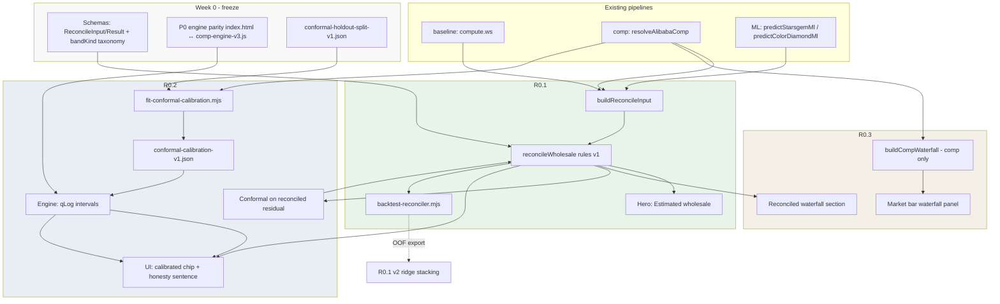

# R0 Master Implementation Roadmap — Gem Appraise

**Document version:** 2026-05-28  
**Status:** Planning only — no implementation in this document  
**Audience:** Implementers, PM, ML reviewers, future coding agents  
**Source of truth (in-repo):**

| Item | Primary spec |
|------|----------------|
| R0.1 Reconciliation | [`research/roadmap-expansion-r0.1-reconciliation-layer.md`](roadmap-expansion-r0.1-reconciliation-layer.md) |
| R0.2 Conformal calibration | [`research/roadmap-expansion-r0.2-conformal-calibration.md`](roadmap-expansion-r0.2-conformal-calibration.md) (supersedes shorter [`roadmap-r0.2-conformal-calibration-plan.md`](roadmap-r0.2-conformal-calibration-plan.md)) |
| R0.3 Explainability waterfall | [`research/roadmap-r0.3-explainability-waterfall-expansion.md`](roadmap-r0.3-explainability-waterfall-expansion.md) |
| As-built pricing | [`research/current-pricing-model-how-it-works.md`](current-pricing-model-how-it-works.md) |
| Gap analysis | [`research/claude-app-ml-improvement.md`](claude-app-ml-improvement.md), [`research/app-improvement-analysis-2026-05.md`](app-improvement-analysis-2026-05.md) |
| Evaluation discipline | [`research/estimation-algo-improvement-priorities.md`](estimation-algo-improvement-priorities.md) |

**External research used:** split conformal prediction ([Lei et al. / Tibshirani](https://www.stat.cmu.edu/~ryantibs/papers/conformal.pdf), [Berkeley Stat 230 notes](https://www.stat.berkeley.edu/~ryantibs/statlearn-s23/lectures/conformal.pdf), [Barber et al. 2023 — non-exchangeable data](http://jmlr.org/papers/volume25/23-1553/23-1553.pdf)); stacking ([HOML Ch. 15](https://bradleyboehmke.github.io/HOML/stacking.html), [MetricGate stacking doc](https://metricgate.com/docs/stacking-ensemble-meta-learner/)); trust UX ([Google PAIR — Explainability + Trust](https://pair.withgoogle.com/chapter/explainability-trust/), [NN/g confidence intervals](https://www.nngroup.com/articles/confidence-interval/)); pricing transparency ([SitePoint calculators](https://www.sitepoint.com/stop-guessing-why-transparent-pricing-calculators-are-the-future-of-web-agencies/)).

---

## 1. Executive Summary

### What problem R0 solves

Gem Appraise today runs **four independent pricing pipelines** (hand-authored baseline, comp-engine v3, StarGem ML, lookup reconstruction) and surfaces them as **competing headline numbers** with **mislabeled uncertainty**. On reference specs (e.g. 3ct ROUND E VS1), spreads of **~30–45%** are common. The comp engine advertises an “80%” band while empirical holdout coverage was **~20–30%** pre-fix and remains **`uncalibrated`** even after `SIGMA_CALIBRATION_FACTOR = 2.0`. Sellers must mentally reconcile prices; the product cannot honestly claim one defensible wholesale answer.

**R0** is the Tier-0 program that fixes this in three coordinated moves:

1. **R0.1** — One **reconciled wholesale estimate** (point + heuristic band + weights + warnings) from baseline, comp, and ML.
2. **R0.2** — **Empirically calibrated** intervals (split conformal on holdout) with honest coverage language — replacing heuristic “80%” claims.
3. **R0.3** — **Explainability waterfall** so users see how comp (and later reconciled) prices were built.

Together they establish: **one estimand**, **one honest band**, **one auditable story**.

### Why the three items belong together

| Layer | Without the others |
|-------|-------------------|
| R0.1 alone | One number, but band may still lie; “show the math” still fragmented |
| R0.2 alone | Honest comp band, but hero may still disagree with ML/baseline tiles |
| R0.3 alone | Transparent comp path, but hero number may not match what was explained |

R0.1 creates the **single object** to calibrate (R0.2) and decompose (R0.3). R0.2 prevents **trust junk** — pretty explanations around overconfident ranges ([Wall et al., Trust Onion](https://emilywall.github.io/media/papers/TrustOnionPACVIS24.pdf)). R0.3 delivers **progressive disclosure** without new modeling ([Google PAIR](https://pair.withgoogle.com/chapter/explainability-trust/)).

Internal priority doc aligns: **calibration before explainability** (`estimation-algo-improvement-priorities.md`: “explainability should follow calibration”).

### Why implementation order matters

- **Wrong order → false confidence:** Blending three sources (R0.1) then narrowing σ (pre-R0.2) looks tight while still wrong.
- **Wrong order → narrative mismatch:** Waterfall (R0.3) tied to comp hero while reconciled hero (R0.1) shows something else.
- **Wrong order → unmeasurable success:** Conformal on comp-only while UI hero shows unreconciled baseline/ML.

### Recommended program order

> **Recommended order:** Freeze shared contracts (Week 0) → **R0.1** rules reconciler + hero UI + `ReconcileResult.weights` → **R0.3** comp waterfall MVP in parallel once weights shape is frozen → **R0.2** holdout split + comp conformal (can start early) → **R0.2** conformal on **reconciled** residuals + hero band → **R0.3** reconciled “Show the math” + calibrated footnotes → **R0.1 v2** OOF ridge stacking (optional P1).

This is supported by dependency analysis below: **R0.3 comp-only work can start before R0.1 ships**, but **program completion** requires R0.1 before reconciled band/explanation; **R0.2 v1 on comp-engine** can run in parallel with R0.1, but **R0.2 on the hero band** should follow a stable reconciled point estimate.

### Highest-risk assumptions

| # | Assumption | If wrong |
|---|------------|----------|
| A1 | “Fair wholesale” = factory-list–anchored USD **before** channel toggles | Hero number wrong for importer-sourced sellers |
| A2 | Holdout truth = **supplier catalog/list price**, not paid transaction | Honesty sentence true statistically but business-misleading |
| A3 | LOSO supplier holdout ≈ exchangeable enough for conformal | Live query coverage drifts; need monitoring/recalibration |
| A4 | Baseline / comp / ML errors are **imperfectly correlated** | R0.1 blend gains ≈ 0; disagreement stays high |
| A5 | `index.html` ↔ `comp-engine-v3.js` stay in sync | Bands/coverage measured in research, wrong in production |
| A6 | Users interpret bands as **guides**, not guarantees | Over-trust → reputational harm ([choice overload in pricing UI](https://atticusli.com/blog/posts/when-more-pricing-information-backfires-choice-overload/)) |

---

## 2. R0 Items Restated

| Item | Priority | Goal | Main output | Depends on | Can start before dependency? |
|------|----------|------|-------------|------------|------------------------------|
| **R0.1** Reconciliation layer | P0 | Merge baseline, comp-engine, and ML into **one** fair-wholesale estimate with heuristic spread, subjective confidence, and source weights | `reconcileWholesale()` → `{ estimate, low, high, confidence, weights, inputs, warnings, bandKind: "heuristic", method }` | `compute()`, `resolveAlibabaComp()`, ML predictors; config JSON | **Partial:** contract/schema + stubs can start immediately; full logic needs live pipeline outputs |
| **R0.2** Conformal calibration | P0 | Replace/validate heuristic uncertainty; publish **measured** marginal coverage; fix “80%” language | `conformal-calibration-v1.json` + engine `calibration` metadata + hero/disclosure copy | Holdout harness (`backtest-comp-engine.mjs`); stable point predictor | **Yes (comp-only):** fit `qLog` on comp residuals without R0.1. **No (hero band):** reconciled conformal needs R0.1 point estimate |
| **R0.3** Explainability waterfall | P0 | Surface comp adjustment ladder, blend, rejections; later reconciled weights | `buildCompWaterfall(ac)` + UI panel; later `buildReconciledWaterfall(reconciled)` | `resolveAlibabaComp` return shape; for full story: `ReconcileResult` | **Yes (comp waterfall):** engine already returns `primary`, `supportComps`, `rejectedComps`, `parts`. **No (reconciled waterfall):** needs R0.1 `weights` |

---

## 3. Dependency Analysis

### Direct answers

| Question | Answer |
|----------|--------|
| **Does R0.2 require R0.1 first?** | **Not for comp-engine calibration v1.** Specs explicitly allow calibrating `blendComps` intervals first. **Yes for the integrated R0 product goal** (one hero number + one calibrated band around **that** number). |
| **Does R0.3 require R0.1 first?** | **No for comp-scoped waterfall v1.** **Yes** for hero-linked “how **this estimate** was built” spanning baseline + comp + ML weights. |
| **Can R0.3 work before R0.2?** | **Yes — recommended.** Show match-quality chips and **uncalibrated** interval footnote until R0.2 ships measured coverage copy. |
| **What contract must R0.1 expose for R0.2/R0.3?** | See [§4 Data contracts](#4-data-contracts-freeze-first). Minimum: `estimate`, `bandKind`, `weights`, `inputs`, `disagreementRatio`, `confidence`, `warnings`, `reconcilerVersion`. R0.2 adds `low`/`high` with `bandKind: "conformal"` + `calibration` block. |
| **If R0.2 before R0.1?** | Comp intervals become honest, but UI may still show **four competing tiles**; hero “What they paid” may be comp band while ML card stays point-only → **partial trust fix**, narrative still broken. |
| **If R0.3 before R0.1?** | Comp path becomes transparent; users may think waterfall explains **hero wholesale** when hero is still baseline/comp/ML mosaic → **mitigate with copy**: “Comp market path” vs “Combined estimate”. |
| **What to mock/stub for parallel work?** | `reconcileWholesale` stub with fixed `weights`; `conformal-calibration-v1.json` fixture for UI chip; frozen `ReconcileInput` golden JSON; comp waterfall from recorded `resolveAlibabaComp` snapshots. |

### Contract R0.1 must expose (blocking surface)

```typescript
// Freeze in research/schemas/reconcile-result.schema.json
type ReconcileResultV1 = {
  reconcilerVersion: string;
  method: 'rules_v1' | 'stacking_v2';
  estimate: number;       // USD total
  perCt: number;
  low: number;
  high: number;
  confidence: 'high' | 'medium' | 'low';
  weights: { baseline: number; comp: number; ml: number }; // sum ≈ 1
  inputs: { baseline: number | null; comp: number | null; ml: number | null };
  disagreementRatio: number;
  bandKind: 'heuristic' | 'conformal';
  warnings: string[];
  // R0.2 extension (nullable until shipped):
  calibration?: {
    targetCoverage: 0.8;
    segment: 'white' | 'fancy';
    qLog: number;
    reportingCoverage: number;
    nReport: number;
    method: string;
    runId: string;
    calibratedAt: string;
  };
};
```

R0.3 reconciled panel consumes: `weights`, `inputs`, `warnings`, `confidence`, `method` — not internal σ tables.

### Mermaid — program dependencies



### Parallelization matrix

| Workstream | Can run in parallel with | Must wait for |
|------------|--------------------------|---------------|
| Schema + golden fixtures | Everything | — |
| P0 engine drift / parity CI | R0.1, R0.2 fit script | — |
| R0.1 `reconcile-price.js` + tests | R0.3 `buildCompWaterfall` | Schema freeze |
| R0.3 UI panel (comp-only) | R0.1 hero wiring | Engine field audit |
| R0.2 holdout split + fit script (comp) | R0.1 implementation | Split config |
| R0.2 engine consume artifact | R0.1 | Artifact format freeze |
| R0.2 conformal on reconciled | R0.1 rules v1 + `backtest-reconciler` scores | Stable reconciled point on holdout |
| R0.3 reconciled section | R0.1 `weights` in production | `ReconcileResult` freeze |
| R0.1 v2 stacking | R0.1b backtest OOF export | Phase 2 backtest |

### Failure modes if order is wrong

| Mistake | Symptom | Mitigation |
|---------|---------|------------|
| Hero UI without reconciler | Cosmetic rearrange of 4 tiles | Ship R0.1 hero before demoting tiles |
| R0.2 marketing before reporting split | Overstated coverage % | `conformal-holdout-split-v1.json` + CI |
| R0.3 implies hero = comp only | Trust lawsuit / confusion | Header: “Comp market calculation” until R0.1 link |
| Conformal on comp, hero = reconciled | Band doesn’t bracket headline $ | R0.2b on reconciled residuals |
| Stacking v2 without OOF | Great backtest, production regression | OOF-only meta training |
| Narrow band after blend | False confidence | Disagreement guard + R0.2 |

---

## 4. Data Contracts (freeze first)

**Gate:** No feature PR merges that change these shapes without schema version bump.

### 4.1 `ReconcileInput` (R0.1)

Defined in [`roadmap-expansion-r0.1-reconciliation-layer.md`](roadmap-expansion-r0.1-reconciliation-layer.md) §6. Key fields:

- `query`: `{ carat, segment, shape, inferenceMode }`
- `baseline`, `comp`, `ml`: each `{ total, perCt, sigmaLog, available, … }`
- `comp` extras: `supportCount`, `matchType`, `confidence`, `warnings`
- `ml` extras: `anchorHit`, `modelName`
- `flags`: `disagreementRatio`, `chinaFactory`, `specialtyCut`

**Explicitly exclude v1:** lookup reconstruction as fourth blend input (correlated with ML anchor).

### 4.2 `ReconcileResult` (R0.1 → R0.2 → R0.3)

See §3. Version field `reconcilerVersion` required.

**`bandKind` taxonomy (mandatory in code + UI):**

| `bandKind` | Meaning | User label |
|------------|---------|------------|
| `heuristic` | Rule-based σ blend (R0.1 v1) | “Likely range (estimated spread)” |
| `conformal` | Split-CP band (R0.2) | “80% holdout band” + disclosure |

**Never** use “80% confident” for `heuristic`.

### 4.3 `conformal-calibration-v1.json` (R0.2)

- Segment keys: `white`, `fancy`, `fallback`
- Per segment: `qLog`, `nCal`, `reportingCoverage`, `nReport`
- Provenance: `dataHash`, `engineGitSha`, `holdoutProtocol`, supplier lists

### 4.4 `CompWaterfallV1` (R0.3)

Defined in R0.3 spec §6. Independent of reconciler until `blend.weights` optionally exported from engine.

### 4.5 Open contract decisions (resolve in Week 0)

| ID | Decision | Affects |
|----|----------|---------|
| OQ1 | Channel toggles (China −22%, etc.) **inside** vs **after** reconciliation | `ReconcileInput`, hero semantics |
| OQ2 | Retail range from reconciled `ws` vs legacy baseline | Retail tile |
| OQ4 | Lookup tile: kill vs diagnostic under expander | UI clutter |
| OQ5 | Parity CI gate before R0 ship? | All three items |

---

## 5. v1 vs v2 Scope

### R0.1

| v1 (ship first) | v2 (defer) |
|-----------------|------------|
| Inverse-variance log blend + rule σ | OOF ridge stacking meta-model |
| `research/reconcile-price.js` + `reconciler-config-v1.json` | `train-reconciler-meta.py` → `reconciler-meta-v2.json` |
| Hero + demoted tiles | `useStackingMeta` feature flag |
| Heuristic `low`/`high` (`bandKind: heuristic`) | Learned weights from OOF |
| `backtest-reconciler.mjs` | Segment-specific meta-models |

### R0.2

| v1 | v2+ |
|----|-----|
| Option A: fixed segment `qLog` on log residuals | Option B: calibrate k × σ |
| Comp-engine intervals + metadata | Conformal on **reconciled** estimate |
| Global/white/fancy `qLog` | Per-`matchType` Mondrian q |
| Calibration vs reporting supplier split | CQR asymmetric bands |
| Honesty sentence + chip | Conditional coverage dashboard |
| Remove `SIGMA_CALIBRATION_FACTOR` from interval path | Heteroscedastic scores \|r\|/σ |
| | ML card bands (same protocol) |

### R0.3

| v1 | v2+ |
|----|-----|
| Comp-only waterfall (`buildCompWaterfall`) | Reconciled multi-source waterfall |
| Parse `parts[]` strings | Engine-native structured `explainability` |
| Collapsed panel in `#market-bar` | Hero “Show the math” (needs R0.1) |
| Match quality chips; uncalibrated interval footnote | Calibrated interval footnote (R0.2) |
| Blend + rejected sections | `scoreComponents` advanced tab |
| Inline in `index.html` | `research/comp-waterfall.js` module |

---

## 6. ML / UX Risk Register

| Risk | Sev | Items | Mitigation |
|------|-----|-------|------------|
| False confidence after blend | **High** | R0.1, R0.2 | `disagreementRatio > 1.25` → low confidence + widen; conformal on reporting holdout; never label heuristic as 80% |
| Meta-model overfit | Med | R0.1 v2 | OOF-only; ridge; segment holdouts |
| Production/engine drift | **High** | All | Shared module import; golden parity CI ([`p0-remove-research-production-drift-research.md`](p0-remove-research-production-drift-research.md)) |
| List price ≠ paid price | **High** | R0.2 copy | “Supplier catalog holdout” language; future R1.2 transaction layer |
| Marginal 80% hides bad cells | Med | R0.2 | Monitor conditional P80 by carat/matchType; widen q for `best_available` |
| Waterfall explains wrong number | **High** | R0.3 | Scope labels; hero link only after R0.1 |
| `parts[]` parse fragility | Med | R0.3 | Golden tests; structured engine steps in v2 |
| Trust junk (pretty UI, weak comps) | Med | R0.3 | Warnings first; `best_available` styling |
| Choice overload (4 numbers + band + waterfall) | Med | UI | Progressive disclosure; single hero ([pricing UI research](https://atticusli.com/blog/posts/when-more-pricing-information-backfires-choice-overload/)) |
| Non-exchangeable supplier panels | Med | R0.2 | LOSO; consider [Barber et al. weighted CP](http://jmlr.org/papers/volume25/23-1553/23-1553.pdf) in Phase 4 |
| ML anchor miss (`lookupRate = 1`) | Med | R0.1 | `anchorHit: false` → down-weight ML; warning in `warnings[]` |

### Uncertainty vocabulary (enforce in code + copy)

| Term | Definition | Show to user? |
|------|------------|---------------|
| Model estimate | Point from baseline / comp / ML / reconciler | Yes (hero) |
| Heuristic range | R0.1 σ rules or pre-R0.2 comp spread | Yes — “Likely range” |
| Calibrated interval | Split-CP with measured coverage | Yes — after R0.2 validation only |
| Match quality | `confidence` from comp match | Yes — “Match: High/Med/Low” |
| Empirical coverage | Holdout % in band | Disclosure / methodology |
| Validation MAPE | Offline accuracy | Model card / internal only |

---

## 7. Phased Implementation Plan (coding agents)

### Phase 0 — Contracts & hygiene (2–4 days, parallel)

**Owner track:** Staff/tech lead  
**Deliverables:**

- [ ] `research/schemas/reconcile-input.schema.json`, `reconcile-result.schema.json`
- [ ] `research/data/conformal-holdout-split-v1.json` (calibration vs reporting suppliers)
- [ ] `research/fixtures/reconciler-pinned.json` (3ct ROUND E VS1 bounds TBD after first backtest)
- [ ] Golden comp queries for parity (≥20)
- [ ] Decision log for OQ1–OQ5

**Do not:** Implement stacking, CQR, or ML SHAP.

---

### Phase 1 — R0.1 MVP (1–2 weeks)

**Tickets:** GA-R0.1 (from R0.1 spec)

1. `research/reconcile-price.js`: `buildReconcileInput`, `reconcileWholesale` (rules v1)
2. `research/data/reconciler-config-v1.json`
3. Wire `update()` in `index.html` after comp + ML resolve
4. Hero: **Estimated wholesale** + likely range + confidence chip
5. Demote ML / lookup / redundant comp tiles under **“How this estimate was built”** (placeholder expander OK)
6. ≥25 unit tests in `research/scripts/reconcile-price.test.mjs`
7. Copy audit: grep for “80% confidence”, “guaranteed”, “accurate”

**Acceptance:** Hero works with null comp and/or null ML; `weights` sum ≈ 1; `bandKind === "heuristic"`.

---

### Phase 2 — Parallel tracks (1–2 weeks)

#### Track A — R0.3 comp waterfall (can start day 3 of Phase 1)

**Tickets:** R0.3 from R0.3 spec

1. Field audit: `primary`, `supportComps`, `rejectedComps`, `parts`
2. `buildCompWaterfall(ac)` + unit tests
3. `renderCompWaterfallPanel` in `updateMarketBar` — collapsed default
4. Blend table + rejected list
5. Trust copy: no “80% confidence”; uncalibrated interval footnote
6. `comp_waterfall_open` instrumentation

**Acceptance:** Panel only when `matchType !== 'none'`; weights sum 100% ±1.

#### Track B — R0.2 comp conformal (can start Phase 0)

**Tickets:** R0.2, R0.2a from R0.2 spec

1. `fit-conformal-calibration.mjs` → `conformal-calibration-v1.json`
2. `blendComps`: Option A `qLog` intervals; drop `SIGMA_CALIBRATION_FACTOR` from interval path
3. `resolveAlibabaComp`: `calibration` metadata
4. Extend `backtest-comp-engine.mjs` — reporting-fold P80 gates
5. Sync `comp-engine-v3.browser.js` + parity tests

**Acceptance:** Reporting P80 ∈ [77%, 83%] per segment; no `uncalibrated` in shipped `calibrationNote`.

**Coordination:** Until R0.1 hero ships, comp calibrated band lives on **market bar / comp context**, not as “the” wholesale answer — or gate R0.2b UI behind R0.1.

---

### Phase 3 — Integration (1 week)

1. **R0.2b — Reconciled conformal**
   - Collect `|log(actual) - log(reconciled.estimate)|` in `backtest-reconciler.mjs`
   - Fit `qLog_reconciled` per segment; set `bandKind: "conformal"` on `ReconcileResult`
   - Hero band uses reconciled conformal `low`/`high`
2. **R0.3b — Reconciled section**
   - Panel section: Baseline / Comp / ML with `weights` bars from `ReconcileResult`
   - Single “Show the math” entry on hero
3. **R0.2b UI**
   - Trust chip + `<details>` honesty sentence from artifact (never hand-typed %)
4. **R0.1b — Backtest + tune**
   - `backtest-reconciler.mjs`; tune `reconciler-config-v1.json`
   - White MdAPE ≤ comp-only OR documented exception table

---

### Phase 4 — Polish & optional v2 (1–2 weeks)

- R0.1c: OOF ridge stacking (`useStackingMeta` flag)
- R0.2 Phase 2: per-`matchType` q; CI on data hash
- R0.3: extract `comp-waterfall.js`; engine `blendWeights` export
- Methodology footer updates in `current-pricing-model-how-it-works.md`
- Founder/legal sign-off on copy

---

## 8. How a coding agent should approach this work

### Principles

1. **Read specs first** — This master doc routes; item specs are authoritative for details.
2. **Freeze contracts before UI polish** — Schema PR before hero CSS.
3. **Pure functions in `research/`** — Match `comp-engine-v3.js` pattern; minimal new logic in `index.html`.
4. **No false precision** — If `bandKind !== 'conformal'`, UI must not say 80% coverage.
5. **One source of truth for intervals** — UI reads `ac.calibration` / `reconciled.calibration`; no duplicate `qLog` in HTML.
6. **Test holdout discipline** — Never fit conformal q on reporting suppliers.
7. **Pinned regressions** — 3ct ROUND E VS1, pink T16 (`backtest-comp-engine.mjs` header).

### Suggested PR sequence (small, reviewable)

| PR | Scope | ~size |
|----|-------|-------|
| PR-1 | Schemas + fixtures + holdout split JSON | S |
| PR-2 | `reconcile-price.js` + tests (no UI) | M |
| PR-3 | Hero UI + `buildReconcileInput` wire-up | M |
| PR-4 | `buildCompWaterfall` + tests | M |
| PR-5 | Comp waterfall UI panel | M |
| PR-6 | `fit-conformal-calibration.mjs` + artifact | M |
| PR-7 | Engine conformal intervals + metadata | M |
| PR-8 | Backtest/CI coverage gates | S |
| PR-9 | Reconciled conformal + hero band swap | M |
| PR-10 | Reconciled waterfall + disclosure copy | M |
| PR-11 | (Optional) OOF stacking v2 | L |

### Files likely touched (reference map)

| Area | Files |
|------|-------|
| R0.1 | `research/reconcile-price.js`, `research/data/reconciler-config-v1.json`, `index.html` `update()`, `research/scripts/backtest-reconciler.mjs` |
| R0.2 | `research/comp-engine-v3.js`, `research/comp-engine-v3.browser.js`, `research/scripts/fit-conformal-calibration.mjs`, `research/data/conformal-calibration-v1.json`, `research/scripts/backtest-comp-engine.mjs` |
| R0.3 | `index.html` (`updateMarketBar`, `renderCompWaterfallPanel`), later `research/comp-waterfall.js` |

### What not to implement in R0

- Transaction-price calibration (R1.2)
- Monotonic GBM / full ML SHAP (R1.1)
- Learned channel markups
- PDF/inventory export of waterfall (P3)
- Deep GBM meta-learner in browser

---

## 9. Research synthesis (for reviewers)

### Stacking / reconciliation (R0.1)

- **v1:** Inverse-variance blend in log-space with rule-based σ — auditable, shippable without OOF infrastructure ([MetricGate](https://metricgate.com/docs/stacking-ensemble-meta-learner/)).
- **v2:** Ridge (or elastic-net) on **OOF** predictions of baseline, comp, ML — never in-sample base outputs ([HOML stacking](https://bradleyboehmke.github.io/HOML/stacking.html), [leakage guide](https://mcpanalytics.ai/articles/stacking-ensemble-practical-guide-for-data-driven-decisions)).
- **Risk:** Correlated list-price surfaces → limited ensemble gain; monitor `disagreementRatio`.

### Split conformal (R0.2)

- Scores: \(R_i = |\log y_i - \log \hat\mu_i|\); interval: \(\hat\mu \cdot e^{\pm \hat q}\) ([Tibshirani CP](https://www.stat.cmu.edu/~ryantibs/papers/conformal.pdf)).
- Quantile index: \(k = \lceil (n+1)(1-\alpha) \rceil\) for α=0.2 → 80% nominal.
- **Marginal** coverage under exchangeability; supplier panels need **grouped** holdout ([Barber et al. 2023](http://jmlr.org/papers/volume25/23-1553/23-1553.pdf)).
- **Phase 4:** CQR ([Romano et al. 2019](https://papers.neurips.cc/paper/8613-conformalized-quantile-regression.pdf)) for asymmetric fancy-market bands.

### Explainability / trust UI (R0.3)

- **Calibrate trust, don’t maximize it** ([Google PAIR](https://pair.withgoogle.com/chapter/explainability-trust/)).
- **Progressive disclosure** — waterfall collapsed by default ([Institute PM explainability](https://www.institutepm.com/knowledge-hub/ai-product-explainability)).
- **Multiplicative adjustments** — show `×1.08` and footnote “steps multiply, not add.”
- **Wide bands:** NN/g — very wide intervals may be useless; don’t fake narrow bands ([NN/g](https://www.nngroup.com/articles/confidence-interval/)).

---

## 10. Success metrics (program level)

| Metric | Target | Tool |
|--------|--------|------|
| `reconciled_mdape_white` | ≤ comp-only MdAPE | `backtest-reconciler.mjs` |
| `reconciled_mdape_fancy` | ≤ comp-only or documented exception | same |
| Reporting P80 (comp) | 77–83% per segment | `backtest-comp-engine.mjs` + CI |
| Reporting P80 (reconciled) | 77–83% post Phase 3 | `backtest-reconciler.mjs` |
| `disagreement_rate` | Monitor | reconciler warnings |
| `comp_waterfall_open` rate | >15% of comp sessions (30d) | product analytics |
| Hero render errors | 0 | console / QA |
| Copy violations (“80% confident” on heuristic) | 0 | grep CI |
| Node vs browser parity | 0 golden mismatches | CI |

---

## 11. Open questions (program-level)

Consolidated from R0.1–R0.3 specs — **resolve in Phase 0** where blocking:

1. **OQ1:** Toggle modifiers inside vs after reconciliation?
2. **OQ2:** Retail from reconciled or baseline `ws`?
3. **OQ5:** Block release on `index.html` ↔ `comp-engine-v3.js` parity CI?
4. **R0.2 Option A vs B:** fixed `qLog` vs calibrate k on σ? (Recommend **A** for v1.)
5. **Ship R0.2 comp-only before R0.1 hero?** (Recommend **internal only** until hero unified.)
6. **Artifact in git vs CI-generated?** (Recommend **committed JSON** + CI staleness check.)
7. **R0.3:** Show `low`/`high` in waterfall pre-R0.2? (Recommend **yes with warning**.)
8. **Legal copy:** “Estimated wholesale” vs “What they paid”?

---

## 12. Copy/paste program tickets

### EPIC: R0 — One estimate, honest band, visible math

**Goal:** Single reconciled wholesale headline, conformal-calibrated band with measured coverage disclosure, comp + reconciled explainability.

**Milestones:**

1. M0: Contracts + holdout split frozen  
2. M1: R0.1 hero + heuristic band + weights  
3. M2: R0.3 comp waterfall GA  
4. M3: R0.2 comp conformal + CI  
5. M4: Reconciled conformal + reconciled waterfall + honesty UI  
6. M5 (optional): R0.1 stacking v2  

**Definition of done:** Seller sees one **Estimated wholesale** with defensible band language, expandable math showing comp adjustments and source weights, no misleading “80% confident” on uncalibrated ranges.

---

## 13. References

| Topic | Link |
|-------|------|
| Split conformal regression | [CMU conformal paper](https://www.stat.cmu.edu/~ryantibs/papers/conformal.pdf) |
| Conformal lecture notes | [Berkeley Stat 230](https://www.stat.berkeley.edu/~ryantibs/statlearn-s23/lectures/conformal.pdf) |
| Non-exchangeable / grouped data | [JMLR 2023](http://jmlr.org/papers/volume25/23-1553/23-1553.pdf) |
| CQR | [NeurIPS 2019](https://papers.neurips.cc/paper/8613-conformalized-quantile-regression.pdf) |
| Stacking / OOF | [HOML Ch. 15](https://bradleyboehmke.github.io/HOML/stacking.html) |
| Trust + explainability | [Google PAIR](https://pair.withgoogle.com/chapter/explainability-trust/) |
| Confidence interval UX | [NN/g](https://www.nngroup.com/articles/confidence-interval/) |
| Pricing calculator transparency | [SitePoint](https://www.sitepoint.com/stop-guessing-why-transparent-pricing-calculators-are-the-future-of-web-agencies/) |
| MAPIE (library reference) | [SplitConformalRegressor](https://mapie.readthedocs.io/en/stable/generated/mapie.regression.SplitConformalRegressor.html) |

---

*End of R0 Master Implementation Roadmap.*
