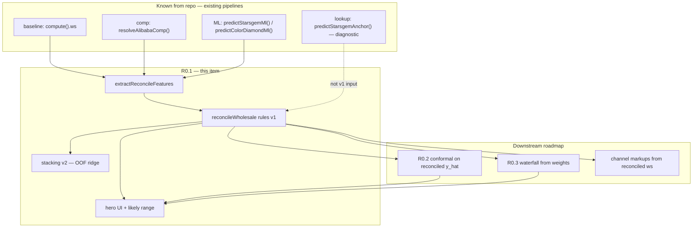

# Roadmap Expansion: Gem Appraise — Reconciliation Layer (R0.1)

**Document version:** 2026-05-28 (deep expansion pass)  
**Maintainer intent:** Living spec for implementers, PMs, reviewers, and future LLM sessions.  
**Sibling docs:** `research/roadmap-r0.2-conformal-calibration-plan.md`, `research/roadmap-r0.3-explainability-waterfall-expansion.md`, `research/claude-app-ml-improvement.md`, `research/app-improvement-analysis-2026-05.md`.

---

## Document Purpose

This document expands **one rough roadmap line** (R0.1) into a **research-backed, implementation-ready specification** for Gem Appraise’s pricing stack.

**Use it when you need to:**

| Audience | How to use this doc |
|----------|---------------------|
| **Developer** | Implement `reconcileWholesale()`, wire hero UI, write tests — follow §6–§7, Acceptance Criteria, Example JSON. |
| **PM / founder** | Decide v1 scope vs v2 stacking — read Executive Summary, Phased Plan, Open Questions. |
| **ML / methods reviewer** | Check uncertainty language, holdout protocol, leakage risks — read Research Summary + §10 Risks. |
| **Future LLM** | Reconstruct context without re-reading 5,500-line `index.html` — start at Project Context Reconstruction + concrete file map. |

**What this document is not:** It does not replace `research/current-pricing-model-how-it-works.md` (as-built baseline math) or comp-engine proposals (v3 matching). It defines the **arbiter layer** that sits above them.

---

## Input Items

| ID | Priority | Raw roadmap input (verbatim) |
|----|----------|------------------------------|
| **R0.1** | P0 | Build one reconciliation layer → one number + band. Treat baseline, comp-engine estimate, and ML guess as three features of a small **stacking meta-model** (or, as a transparent v1, a confidence-weighted blend whose weights depend on comp support and carat bucket). Output a single fair-wholesale value. Keystone: fixes competing estimates, calibration target, and hero UI. |

---

## Executive Summary

### The problem

Gem Appraise computes **multiple wholesale-related prices** and shows them at similar visual weight. Nothing learns an optimal combination. Users must mentally reconcile **baseline**, **comp market estimate**, **ML prediction**, and **lookup reconstruction** — documented spreads of **~30–45%** on commodity specs (e.g. 3ct ROUND E VS1).

**Known from input / repo reviews:** Four parallel pipelines; no arbiter (`research/claude-app-ml-improvement.md` §2; `research/app-improvement-analysis-2026-05.md` §2.1).

### What R0.1 delivers

A **reconciliation layer** — pure function + config — that outputs:

| Output | Meaning |
|--------|---------|
| `estimate` | Single **reconciled wholesale total** (USD) |
| `low`, `high` | **Heuristic spread** in v1 (not yet conformally validated) |
| `confidence` | **Subjective support tier** (`high` \| `medium` \| `low`) for UI chip |
| `weights` | How much each source contributed (for R0.3 waterfall) |
| `warnings` | Disagreement, thin comps, missing ML anchor, etc. |

**v1:** Transparent **inverse-variance blend in log space** with rule-based σ per source, caps by segment/support.  
**v2:** **Ridge stacking meta-model** on out-of-fold (OOF) base predictions ([Wolpert stacking](https://en.wikipedia.org/wiki/Conformal_prediction), [HOML Ch. 15](https://bradleyboehmke.github.io/HOML/stacking.html)).

### Why it matters (product + ML)

1. **Trust** — One headline answer + honest “likely range” copy ([NN/g on intervals](https://www.nngroup.com/articles/confidence-interval/); [pricing transparency patterns](https://www.sitepoint.com/stop-guessing-why-transparent-pricing-calculators-are-the-future-of-web-agencies/)).
2. **Calibration (R0.2)** — Conformal intervals need **one point prediction** to wrap ([Tibshirani split CP notes](https://www.stat.berkeley.edu/~ryantibs/statlearn-s23/lectures/conformal.pdf); `research/roadmap-r0.2-conformal-calibration-plan.md`).
3. **Explainability (R0.3)** — Waterfall needs stable `weights` + `inputs` (`research/roadmap-r0.3-explainability-waterfall-expansion.md`).
4. **Evaluation** — One MdAPE / coverage metric on **reconciled** output vs three uncorrelated ones.

### Recommended build order (summary)

1. Freeze `ReconcileInput` / `ReconcileResult` contract → 2. Rules v1 + unit tests → 3. Hero UI → 4. `backtest-reconciler.mjs` → 5. Tune σ → 6. OOF stacking v2 → 7. Hand off to R0.2 conformal on reconciled residuals.

### Highest-risk assumptions

| Risk | If wrong |
|------|----------|
| “Fair wholesale” = factory-list–anchored USD before channel markups | Wrong hero number for importer-sourced sellers |
| Comp + ML errors are diverse enough to blend | Meta-model gains ≈ 0; disagreement stays high |
| Heuristic band labeled honestly | Users treat range as guarantee → trust loss |
| `index.html` and `comp-engine-v3.js` stay in sync | Reconciler trained on research engine, wrong in production |

---

## Project Context Reconstruction

### Known from input

- Roadmap item names three inputs: **baseline**, **comp-engine estimate**, **ML guess**.
- Desired output: **one number + band**; v1 may be confidence-weighted blend; v2 may be stacking meta-model.
- Item is **keystone** for calibration and unified UI (stated in roadmap surrounding text and `claude-app-ml-improvement.md` R0.1).

### Known from repository (verified in code/docs)

| Fact | Evidence |
|------|----------|
| Live app is `index.html` (~5.5k lines), vanilla JS | `README.md`, file size |
| Baseline wholesale from `compute(ct)` → `ws`, `wsPerCt` | `index.html` `compute()` ~1545–1610 |
| Comp Engine v3 canonical module: `research/comp-engine-v3.js` | Module header, exports `resolveAlibabaComp` |
| Production comp calls delegate to `window._v3engine` when module loaded | `index.html` `resolveAlibabaComp(ct)` ~1495–1504 |
| UI shows separate tiles: “What they paid”, “Retail range”, “Best ML price guess”, “StarGem lookup reconstruction” | `index.html` ~667–711 |
| When comps exist, **“What they paid” shows comp range**, not baseline blend | `update()` ~2481–2502 |
| ML: `predictStarsgemMl(row)` → `{ price, method, modelName, tail, … }`; fancy may use `predictColorDiamondMl` | `index.html` ~2294–2367 |
| Comp intervals use `SIGMA_CALIBRATION_FACTOR = 2.0`, labeled uncalibrated; **~20–30% empirical P80 coverage** vs 80% label | `comp-engine-v3.js` ~310–318, ~1304–1313, ~1741 |
| Backtest harness: `research/scripts/backtest-comp-engine.mjs` (LOSO) | Script header |
| Methodology reviews document 3ct E VS1 spread ~$326–$478 | `app-improvement-analysis-2026-05.md`, `claude-app-ml-improvement.md` |

### Strong inferences

| Inference | Reasoning |
|-----------|-----------|
| Target estimand is **factory-direct fair wholesale** (USD total) before China/auction/retail multipliers | `compute()` applies channel toggles *after* `ws`; comp engine targets supplier list comps |
| Fourth pipeline (lookup reconstruction) should **not** be a v1 blend input | Highly correlated with ML anchor path (`starsgemCompareSummary`); roadmap lists three features only |
| Reconciler should live in **`research/reconcile-price.js`** tested by Node, imported by browser | Matches comp-engine pattern; avoids more duplication in HTML |
| Fancy color needs **lower comp weight caps** when support &lt; 3 | Backtest targets: fancy MdAPE ≤ 30% vs white ≤ 15% (`backtest-comp-engine.mjs` acceptance) |
| R0.2 should calibrate **reconciled** residuals once R0.1 ships | `roadmap-r0.2` open question; logical dependency |

### Weak inferences

| Inference | Reasoning |
|-----------|-----------|
| Log-space blending is appropriate | Comp engine already blends in log space; diamond errors are multiplicative |
| Ridge meta-learner is sufficient for v2 | Interpretable coefficients; low overfit risk vs GBM meta-learner |
| Browser ships weights as JSON, not server API | Current architecture is client-side calculator |
| “Fair wholesale” copy is acceptable to legal/founder | Domain language in reviews; not user-tested |

### Open questions

| # | Question | Impact |
|---|----------|--------|
| OQ1 | Apply seller toggles (China −22%, HPHT +8%, …) **inside** or **after** reconciliation? | Changes `ReconcileInput` and hero semantics |
| OQ2 | Retail range derived from **reconciled** `ws` or legacy baseline `ws`? | Retail tile behavior |
| OQ3 | Fancy: always route to `color-diamond-ml-model.json` when `!isWhite()`? | Third input selection |
| OQ4 | Kill vs demote lookup tile when hero ships? | UI clutter |
| OQ5 | Block release on `index.html` ↔ `comp-engine-v3.js` parity CI? | Drift risk |
| OQ6 | What pinned reconciled total is acceptable for 3ct ROUND E VS1? | Acceptance / regression |
| OQ7 | Is ground truth for v2 training **comp holdout price** only, or also StarGem sheet rows? | Meta-model label definition |

---

## Research Summary

### 1. Stacking / meta-ensembles

| Aspect | Detail |
|--------|--------|
| **What** | Train a **meta-learner** on base model predictions to produce a final estimate ([stacking overview](https://bradleyboehmke.github.io/HOML/stacking.html)). |
| **Why here** | Baseline, comps, and ML fail on different segments; combining reduces variance if errors are imperfectly correlated ([MetricGate diversity diagnostic](https://metricgate.com/docs/stacking-ensemble-meta-learner/)). |
| **Best practice** | Meta-train on **OOF predictions**, never in-sample base outputs ([BSE stacking review](https://thevoice.bse.eu/2023/04/18/stacking-ensemble-a-quick-review/)) — otherwise meta-model learns base overfitting. |
| **Risks** | Correlated failures (e.g. all list-price surfaces); meta-model **uninterpretable** if non-linear; **data leakage** if holdout shares supplier ladders with train. |
| **Gem Appraise choice** | v1: **no learned meta** (auditable rules). v2: **ridge** on OOF features. |

### 2. Inverse-variance / log blending (v1)

| Aspect | Detail |
|--------|--------|
| **What** | \(\hat{p} = \exp\left(\sum_i w_i \log p_i / \sum w_i\right)\), \(w_i \propto 1/\sigma_i^2\) |
| **Why here** | Same family as `blendComps()` in `comp-engine-v3.js` (~1192–1315); engineers already reason in log-price. |
| **Best practice** | Floors on σ; explicit **caps** when support thin; **envelope widening** when sources disagree. |
| **Risks** | Treating heuristic σ as calibrated precision; **false confidence** after blend. |

### 3. Uncertainty taxonomy (mandatory separation)

Use this vocabulary in code, docs, and UI:

| Term | Definition in Gem Appraise | User-facing? |
|------|---------------------------|--------------|
| **Model estimate** | Point output from baseline / comp / ML / reconciler | Yes (hero `$X`) |
| **Heuristic range** | `low`/`high` from σ rules or comp engine ×2 fudge | Yes, label **“Likely range”** |
| **Calibrated interval** | Split-conformal band with measured marginal coverage (R0.2) | Only after validation; may say “~80% of holdout comps fell in this range” |
| **Empirical coverage** | Fraction of holdout truths ∈ band | Footer / methodology panel, not headline |
| **Subjective confidence** | `high`/`medium`/`low` chip from support + disagreement rules | Yes, as **“Estimate confidence”** |
| **Validation MAPE** | Offline metric on train/val split | Methodology / model card, not seller headline |

**Do not say** “accurate”, “guaranteed”, “fair market value”, or “80% confidence” for v1 heuristic bands.

### 4. Split conformal prediction (downstream R0.2)

| Aspect | Detail |
|--------|--------|
| **What** | Holdout **calibration set** → residual quantile \( \hat{q} \) → interval \( \hat{y} \pm \hat{q} \) with marginal coverage ≥ \(1-\alpha\) ([Tibshirani lecture](https://www.stat.berkeley.edu/~ryantibs/statlearn-s23/lectures/conformal.pdf); [MAPIE SplitConformalRegressor](https://deepwiki.com/scikit-learn-contrib/MAPIE/3.1-splitconformalregressor)). |
| **Why here** | Comp engine admits P80 label is misleading today (`comp-engine-v3.js` ~311). |
| **Dependency** | Needs **one** \(\hat{y}\) from reconciler (this doc). |
| **Risks** | **Marginal** not conditional coverage; supplier correlation breaks exchangeability; truth = **list price** not transaction. |

### 5. Trust UX for pricing calculators

| Practice | Source / application |
|----------|---------------------|
| Show **breakdown** behind one headline number | [SitePoint calculators](https://www.sitepoint.com/stop-guessing-why-transparent-pricing-calculators-are-the-future-of-web-agencies/) |
| Disclaim estimates vs final quote | “Estimates — confirm with supplier before purchasing” |
| Avoid false precision (wide interval when uncertain) | [NN/g confidence intervals](https://www.nngroup.com/articles/confidence-interval/) |
| Auditable trail (weights, comps used) | [FX checkout transparency pattern](https://us.fitgap.com/stack-guides/improving-customer-trust-by-showing-transparent-fx-rates-fees-and-timestamps-at-checkout) |

### 6. Evaluation methods

| Method | Tooling | Metric |
|--------|---------|--------|
| LOSO comp backtest | `backtest-comp-engine.mjs` | MdAPE, P80 hit rate |
| Reconciler backtest (new) | `backtest-reconciler.mjs` (proposed) | MdAPE vs each base; disagreement vs error |
| Pinned regressions | `research/fixtures/parity-*.json`, T16 pink case | Boolean + bounds |
| Segment gates | white / fancy / 8ct+ / specialty cut | Per-segment MdAPE |

---

## Dependency Map



### Required order

| Step | Work | Blocker if skipped |
|------|------|-------------------|
| 1 | Feature extraction API | Reconciler duplicates mapping; tests brittle |
| 2 | `reconcileWholesale` rules v1 + tests | No hero number |
| 3 | Hero UI + copy taxonomy | Users still see 4 tiles |
| 4 | `backtest-reconciler.mjs` | Weights untuned; no proof of value |
| 5 | R0.2 on reconciled estimate | Calibrating wrong object |
| 6 | OOF stacking v2 | Premature → overfit meta-model |

### Parallelizable

- JSON schema + golden fixtures (parallel to step 2)
- UI mock with stub reconciler (parallel to step 2)
- `comp-engine-v3` parity CI (parallel; strongly recommended)
- R0.3 waterfall markup (after `weights` shape frozen)

### Do not build yet

| Item | Why |
|------|-----|
| Conformal as primary band **before** reconciler | Band centers on comp-only while hero shows something else |
| Learned channel markups | 3× noise amplification |
| Transaction-price correction inside reconciler | Needs R1.2 data |
| Deep GBM meta-learner in browser | Opaque + overfit |

### Failure modes if order is wrong

| Mistake | Symptom |
|---------|---------|
| Hero UI without reconciler | Cosmetic-only; still arbitrary comp tile |
| Stacking without OOF | Great backtest, production regression |
| Narrow band from blended σ | **False confidence** — looks tight, still wrong |
| Calibrate comp σ only, show reconciled point | Interval doesn’t bracket hero estimate |

---

## Roadmap Items

---

## [P0] R0.1 — Build One Reconciliation Layer → One Number + Band

### 1. Plain-English Goal

Jewelers enter a stone’s specs and should see **one wholesale estimate they can use** — a dollar total, a dollars-per-carat line, and a **range that widens when we’re unsure** — instead of three or four competing prices. The app still runs baseline math, market comps, and ML behind the scenes, but a **reconciler** decides how much to trust each and merges them.

### 2. Why This Matters

| Dimension | Why |
|-----------|-----|
| **User** | Pricing inventory is a decision under time pressure; cognitive load from conflicting tiles erodes trust. |
| **Product** | Moves from “research demo” to “tool I’d quote a customer with” when paired with R0.3 breakdown. |
| **ML validity** | Creates single estimand for error measurement and conformal calibration. |
| **Engineering** | One regression target for CI; ends “which number is canonical?” debates. |

**Known from input:** Explicitly labeled keystone in `claude-app-ml-improvement.md` Tier 0.

### 3. Current Problem / Failure Mode

**User-facing**

```667:711:index.html
  <div class="price-grid">
    <div class="pcell">
      <div class="pcl ws">What they paid</div>
      ...
    <div class="pricing-intel-panel">
        <div class="intel-title">Best ML price guess</div>
      ...
        <div class="intel-title">StarGem lookup reconstruction</div>
```

- **“What they paid”** becomes comp `low–high` when comps match (`update()` ~2484–2493); baseline hidden.
- ML card: **point only**, no range.
- No copy explaining disagreement or cert-load sharpening.

**Technical**

- `compute()` returns `ws` and `alibabaComp` independently — no merge.
- `resolveAlibabaComp` in production is thin wrapper to v3 module (~1495–1504) but **baseline math still duplicated** in `compute()`.
- ML silent fallback: `lookupRate = 1` when anchor missing (`predictStarsgemMl` ~2314–2318) — reconciler must treat as **low confidence**, not full weight.

**Trust / ML**

```310:318:research/comp-engine-v3.js
// Current P80 coverage is ~20% (white) and ~30% (fancy) vs the ≥60% target.
const SIGMA_CALIBRATION_FACTOR = 2.0;
```

Passing comp `low`/`high` through as “the answer” inherits **mislabeled uncertainty**.

### 4. Research Background

See **Research Summary** above. Additional project-specific notes:

- **Stacking** is the roadmap’s v2 target; **inverse-variance rules** are the industry-acceptable v1 when OOF infrastructure isn’t ready ([MetricGate](https://metricgate.com/docs/stacking-ensemble-meta-learner/)).
- Comp engine **supplier concentration** (`MAX_SUPPLIER_WEIGHT_FRAC`, `sourceConcentration` in return object ~1698–1699) should feed reconciler **meta-features**, not just comp point estimate.
- **List vs transaction:** All three bases are trained or anchored on **supplier list/sheet prices** today (`app-improvement-analysis-2026-05.md` §2.4). Reconciled output is **list-equivalent fair wholesale**, not realized paid price — disclose in methodology.

### 5. Product Behavior

#### Main UI state

| Element | Content | Notes |
|---------|---------|-------|
| Hero title | **Estimated wholesale** | Avoid “fair value” (implies market clearing) |
| Hero price | `$X,XXX` reconciled total | Round policy: nearest $1 (decide OQ) |
| Subline | `$YYY/ct · combined estimate` | |
| Band | **Likely range: $A – $B** | **Heuristic** until R0.2 |
| Chip | **Estimate confidence: High / Medium / Low** | Subjective; not statistical CI |
| Expander | **How this estimate was built** | R0.3: baseline / comps / ML weights |

#### Secondary behavior

- **Retail range:** **Strong inference:** multiply reconciled wholesale by existing `retailMult` tables unless OQ2 says otherwise.
- **“What they paid” tile:** Demote or relabel to **Your sourcing cost** when China toggle applies (post-reconciled adjustment).

#### Empty / loading / error

| State | Behavior |
|-------|----------|
| `_compsIdxReady === false` | Comp weight 0; chip “Market data loading”; widen σ_baseline |
| `_starsgemMlModel` null | ML weight 0; note in expander |
| `comp.matchType === 'none'` | Comp weight 0; warning in `warnings[]` |
| All sources unavailable | Hero error: “Can’t estimate — check carat/color/clarity” |

#### Edge cases

| Case | Rule |
|------|------|
| `disagreementRatio > 1.25` | `confidence = low`; band envelopes all non-null sources ×1.1 |
| Fancy + `supportCount < 3` | `w_comp ≤ 0.2 × sum(w)` |
| `matchType === 'model_fallback'` | Treat comp σ as ×1.5 |
| Selected-spec inference | Chip: “Load IGI report to refine estimate” |
| Specialty cut | Cap ML weight; add warning |

#### Copy (approved direction — legal review pending)

| ❌ Avoid | ✅ Prefer |
|----------|----------|
| “80% confidence interval” | “Likely range (estimated spread)” |
| “Accurate wholesale” | “Estimated wholesale” |
| “Guaranteed” | “Confirm with supplier quote” |
| “The model knows…” | “Based on N comps and supplier sheet model” |

#### Hidden from default view

- Raw `sigmaLog`, `SIGMA_CALIBRATION_FACTOR`, `calibrationNote`
- Internal supplier keys
- Lookup reconstruction (move under expander / “Supplier sheet check”)

### 6. Technical Design

#### Module layout

```text
research/reconcile-price.js          # canonical (Node + browser ESM)
research/data/reconciler-config-v1.json   # σ, caps, z-heuristic
research/schemas/reconcile-result.schema.json
research/scripts/reconcile-price.test.mjs
research/scripts/backtest-reconciler.mjs
```

#### `ReconcileInput` — example JSON

```json
{
  "reconcilerVersion": "1.0.0",
  "query": {
    "carat": 3.0,
    "segment": "white",
    "shape": "round",
    "inferenceMode": "selected_spec"
  },
  "baseline": {
    "total": 412.0,
    "perCt": 137.3,
    "sigmaLog": 0.12,
    "available": true
  },
  "comp": {
    "total": 478.0,
    "low": 390.0,
    "high": 520.0,
    "perCt": 159.3,
    "sigmaLog": 0.18,
    "confidence": "medium",
    "matchType": "nearest",
    "supportCount": 4,
    "available": true,
    "warnings": []
  },
  "ml": {
    "total": 326.0,
    "perCt": 108.7,
    "sigmaLog": 0.18,
    "confidence": "medium",
    "modelName": "s20-specialty-tail",
    "anchorHit": true,
    "available": true
  },
  "flags": {
    "chinaFactory": false,
    "specialtyCut": false,
    "disagreementRatio": 1.47
  }
}
```

#### `ReconcileResult` — example JSON

```json
{
  "reconcilerVersion": "1.0.0",
  "method": "rules_v1",
  "estimate": 425,
  "perCt": 141.7,
  "low": 360,
  "high": 510,
  "confidence": "low",
  "weights": { "baseline": 0.28, "comp": 0.45, "ml": 0.27 },
  "inputs": {
    "baseline": 412,
    "comp": 478,
    "ml": 326
  },
  "disagreementRatio": 1.47,
  "bandKind": "heuristic",
  "warnings": [
    "Sources disagree by more than 25% — range widened.",
    "Estimate confidence is low."
  ]
}
```

#### Integration points (file / function map)

| Source | Function | Field used |
|--------|----------|------------|
| Baseline | `compute(ct)` in `index.html` | `m.ws` → `baseline.total` |
| Comp | `resolveAlibabaComp(ct)` → v3 | `estimate`, `low`, `high`, `confidence`, `supportComps`, `matchType`, `warnings` |
| ML | `predictStarsgemMl` / `predictColorDiamondMl` | `.price` → `ml.total` |
| State | `state.*` | segment, toggles, IGI loaded |

Proposed extractor:

```js
// research/reconcile-price.js
export function buildReconcileInput({ carat, computeResult, compResult, mlResult, state }) { ... }
export function reconcileWholesale(input) { ... }
```

Wire in `update()` **after** comp + ML resolve:

```js
const input = buildReconcileInput({ carat: ct, computeResult: m, compResult: ac, mlResult: mlPred, state });
const reconciled = reconcileWholesale(input);
// render hero from reconciled.*
```

#### State management

- **Pure function** — no new global state; re-run on any `state` change or IGI parse completion.
- Cache last `ReconcileResult` in closure only if needed for expander animation.

#### Compatibility

- R0.2: add `bandKind: "conformal"`, `coverageLevel`, `calibrationId` without breaking v1 consumers.
- R0.3: read `weights`, `inputs`, `comp.supportComps` from parallel comp result object.

### 7. Algorithm / Logic

#### Step 0 — Availability

```text
for s in {baseline, comp, ml}:
  if not available or total_s <= 0: w_s = 0
```

#### Step 1 — Assign σ_log (rules v1; tune in backtest)

| Source | Base σ_log | Multipliers |
|--------|------------|-------------|
| baseline | 0.12 white; 0.20 fancy | ×1.15 if carat > 8 |
| comp | `max(comp.sigmaLog, 0.08)` from engine | ×1.5 if matchType ≠ exact; ×1.3 if support &lt; 3; ×1.5 if extrapolation warning |
| ml | 0.10 cert-loaded white; 0.18 selected-spec | ×2.0 if !anchorHit; ×1.5 fancy color model |

Load defaults from `reconciler-config-v1.json`.

#### Step 2 — Weights

```text
w_s = 1 / (sigma_s^2 + 1e-6)   if available else 0
if segment == fancy and comp.supportCount < 3:
  w_comp = min(w_comp, 0.2 * (w_b + w_c + w_m))
```

#### Step 3 — Log blend

```text
log_hat = sum(w_s * log(total_s)) / sum(w_s)
estimate = round(exp(log_hat))
```

#### Step 4 — Heuristic band (v1)

```text
sigma_eff = sqrt(sum(w_s^2 * sigma_s^4)) / sum(w_s)   # simplified
z = 1.28   # document as heuristic only; R0.2 replaces with conformal q
low  = round(exp(log_hat - z * sigma_eff))
high = round(exp(log_hat + z * sigma_eff))

if disagreementRatio > 1.25:
  low  = min(low, min(non-null totals))
  high = max(high, max(non-null totals))
  sigma_eff *= 1.25
  confidence = "low"
```

#### Step 5 — Confidence chip

```text
if disagreementRatio > 1.25 or comp.supportCount < 2: low
else if comp.confidence == "high" and ml.available: high
else: medium
```

#### Stacking v2 (offline + browser)

```python
# research/scripts/train-reconciler-meta.py (proposed)
# Features: log OOF baseline, log OOF comp, log OOF ml, supportCount, is_fancy, carat, disagreement
# Target: log(actual_holdout_usd)
# Model: Ridge(alpha=1.0)
# Export: research/data/reconciler-meta-v2.json
```

```js
// browser
log_hat = intercept + coef_b * log_b + coef_c * log_c + coef_m * log_m + ...
```

### 8. Acceptance Criteria

- [ ] `reconcileWholesale()` exported from `research/reconcile-price.js` with tests **≥ 25** cases.
- [ ] Hero **Estimated wholesale** renders for white + fancy paths; no JS throw when comp/ML null.
- [ ] `bandKind === "heuristic"` in result; UI **never** says “80% confidence” on v1 band.
- [ ] `disagreementRatio > 1.25` ⇒ `confidence === "low"` and widened band.
- [ ] `weights` sum to ~1.0 (±0.01) when ≥2 sources available.
- [ ] `backtest-reconciler.mjs` reports white MdAPE ≤ comp-only MdAPE **OR** documents why not with segment table.
- [ ] Pinned case 3ct ROUND E VS1: reconciled value + bounds recorded in `research/fixtures/reconciler-pinned.json`.
- [ ] `buildReconcileInput` mapping covered by integration test against frozen `compute`/`comp`/`ml` mocks.
- [ ] Methodology footer states list-price ground truth limitation.

### 9. Metrics to Track

| Metric | Type | Target direction |
|--------|------|------------------|
| `reconciled_mdape_white` | ML | ≤ comp-only |
| `reconciled_mdape_fancy` | ML | ≤ comp-only or documented exception |
| `p80_hit_rate_reconciled` | Calibration prep | Track; R0.2 sets target |
| `disagreement_rate` | Diagnostic | Monitor; high ⇒ product issue |
| `pct_queries_comp_weight_gt_0.5` | Product | Segment by carat |
| `hero_render_errors` | Reliability | 0 |
| `expander_open_rate` | UX | Informational |
| Support tickets / user feedback mentioning “conflicting prices” | Product | Decrease |

### 10. Risks and Tradeoffs

| Risk | Severity | Mitigation |
|------|----------|------------|
| False confidence after blend | High | Disagreement guard; honest copy; R0.2 conformal |
| Meta-model overfit (v2) | Medium | OOF only; ridge; segment holdouts |
| Production/engine drift | High | Shared module; parity CI |
| List-price ≠ paid price | Medium | Copy + future R1.2 layer |
| Fancy thin data | High | Comp weight caps; “request quote” warning |
| Maintenance of σ table | Low | Versioned JSON; backtest-driven tuning |

### 11. Testing Plan

| Layer | Cases |
|-------|-------|
| **Unit** | null comp; null ML; all three; disagreement; fancy cap; anchor miss; zero carat guard |
| **Integration** | `buildReconcileInput` + real v3 on fixture queries |
| **Golden** | Extend `parity-*.json` with `expectedReconciled` bounds |
| **Backtest** | LOSO reconciler vs actual comp rows; export CSV for meta training |
| **UI manual** | 1ct G VS1 round; 3ct E VS1 round; pink pear fancy; comp none; IGI load sharpens |
| **Regression** | T16 pink radiant case from `backtest-comp-engine.mjs` header |
| **Copy audit** | Grep UI for “confidence interval”, “guaranteed”, “accurate” |

### 12. Future Extensions

- Conformal band on reconciled residual (R0.2).
- Fourth feature: transaction adjustment factor (R1.2).
- Segment-specific meta-models (white / fancy / specialty).
- `reconciled.importerAdjusted` derivative for non-factory sellers.
- User correction feedback as meta-model labels (R2.4).
- Server-side reconciler if config + meta coefficients grow large.

---

## Combined Implementation Plan

### Phase 1 — Minimum viable (rules v1 + hero UI)

| Field | Value |
|-------|-------|
| **Scope** | `reconcile-price.js`, config JSON, hero DOM, demote duplicate tiles, 25+ unit tests, manual QA matrix |
| **Complexity** | **M** (3–5 eng-days) |
| **Dependencies** | Access to `compute`, `resolveAlibabaComp`, ML predict in `update()` |
| **Avoid** | Stacking; conformal claims; lookup as 4th input |

### Phase 2 — Robust (backtest + tune)

| Field | Value |
|-------|-------|
| **Scope** | `backtest-reconciler.mjs`, tune `reconciler-config-v1.json`, pinned fixtures, CI optional |
| **Complexity** | **M–L** (5–8 days) |
| **Dependencies** | Frozen v1 API |
| **Avoid** | Learned weights before OOF export exists |

### Phase 3 — Polished (stacking v2 + R0.3 handoff)

| Field | Value |
|-------|-------|
| **Scope** | OOF dataset, ridge meta JSON, feature flag, waterfall consumes `weights` |
| **Complexity** | **L** (8–12 days) |
| **Dependencies** | Phase 2 CSV |
| **Avoid** | Non-linear meta in browser |

### Phase 4 — Advanced (with R0.2 / R1.2)

| Field | Value |
|-------|-------|
| **Scope** | Conformal bands; transaction calibration; specialty gates |
| **Complexity** | **XL** |
| **Dependencies** | R0.1 in production; R0.2 design |
| **Avoid** | Bundling channel markups into core reconciler |

---

## Final Recommended Build Order

1. **Freeze `ReconcileInput` / `ReconcileResult` + JSON schema** — unblocks UI + ML tracks.
2. **Implement `buildReconcileInput` + `reconcileWholesale` rules v1** + unit tests.
3. **Add `reconciler-config-v1.json`** (σ, caps, z) — no magic numbers in HTML.
4. **Wire `update()` hero** + copy taxonomy audit.
5. **Demote ML / lookup / comp tiles** to expander.
6. **Implement `backtest-reconciler.mjs`** on LOSO pool.
7. **Tune config from backtest**; add `reconciler-pinned.json` fixtures.
8. **Export OOF matrix** for meta training.
9. **Train ridge v2** + ship behind `useStackingMeta` flag.
10. **Kick off R0.2** conformal on reconciled `estimate` ([roadmap-r0.2](roadmap-r0.2-conformal-calibration-plan.md)).

---

## Open Questions for the Team

1. **OQ1:** Toggle modifiers inside vs after reconciliation?
2. **OQ2:** Retail from reconciled or baseline `ws`?
3. **OQ3:** Fancy ML routing — color model always when `!isWhite()`?
4. **OQ4:** Fate of lookup reconstruction tile?
5. **OQ5:** Parity CI gate before ship?
6. **OQ6:** Pinned 3ct E VS1 reconciled bounds after first backtest?
7. **OQ7:** Meta-model labels — comp holdout only vs merged StarGem rows?
8. **Copy/legal:** Is “Estimated wholesale” acceptable vs “What they paid”?

---

## Copy/Paste Ticket Versions

### Ticket: GA-R0.1 — Reconciliation layer (rules v1 + hero UI)

**Title:** P0: Reconcile baseline, comps, and ML into one estimated wholesale + likely range

**Background:** Four independent pipelines surface competing prices (~30–45% spread on reference specs). No single estimand exists for calibration or trust UI. See `research/claude-app-ml-improvement.md` R0.1.

**Scope:**
- Add `research/reconcile-price.js` (`buildReconcileInput`, `reconcileWholesale`).
- Config: `research/data/reconciler-config-v1.json`.
- Hero UI: estimated wholesale + heuristic likely range + confidence chip.
- Move per-pipeline tiles under “How this estimate was built”.
- ≥25 unit tests; manual QA matrix.

**Acceptance criteria:**
- Hero works when comp and/or ML null.
- No “80% confidence” on v1 band; `bandKind: "heuristic"`.
- Disagreement &gt;25% ⇒ low confidence + widened band.
- `weights` exposed for R0.3.

**Notes:** Lookup tile diagnostic only. Stacking deferred to GA-R0.1c.

---

### Ticket: GA-R0.1b — Reconciler backtest + config tuning

**Title:** P0: Backtest reconciler; tune σ and weight caps from holdout

**Scope:** `backtest-reconciler.mjs`; MdAPE vs baselines; tune `reconciler-config-v1.json`; pinned fixtures.

**Acceptance:** White reconciled MdAPE ≤ comp-only OR documented exception with segment table.

**Blocked by:** GA-R0.1 API freeze.

---

### Ticket: GA-R0.1c — OOF ridge stacking meta-model

**Title:** P1: Ridge stacking on OOF base predictions

**Scope:** `train-reconciler-meta.py` → `reconciler-meta-v2.json`; browser flag; fallback to rules v1.

**Acceptance:** OOF protocol documented; holdout MdAPE improves ≥1% rel. on white vs rules v1 OR waived with written rationale.

**Blocked by:** GA-R0.1b OOF export.

---

## References

| Topic | Source |
|-------|--------|
| Stacking / super learner | [HOML Ch. 15](https://bradleyboehmke.github.io/HOML/stacking.html) |
| OOF meta-training | [BSE Voice — stacking review](https://thevoice.bse.eu/2023/04/18/stacking-ensemble-a-quick-review/) |
| Ensemble diversity | [MetricGate stacking doc](https://metricgate.com/docs/stacking-ensemble-meta-learner/) |
| Split conformal regression | [Tibshirani lecture notes](https://www.stat.berkeley.edu/~ryantibs/statlearn-s23/lectures/conformal.pdf); [MAPIE SplitConformalRegressor](https://deepwiki.com/scikit-learn-contrib/MAPIE/3.1-splitconformalregressor) |
| UX intervals | [NN/g — confidence intervals](https://www.nngroup.com/articles/confidence-interval/) |
| Pricing calculator trust | [SitePoint transparent calculators](https://www.sitepoint.com/stop-guessing-why-transparent-pricing-calculators-are-the-future-of-web-agencies/) |
| Gem Appraise as-built | `research/current-pricing-model-how-it-works.md` |
| Gem Appraise gaps | `research/app-improvement-analysis-2026-05.md`, `research/claude-app-ml-improvement.md` |
| R0.2 plan | `research/roadmap-r0.2-conformal-calibration-plan.md` |
| R0.3 plan | `research/roadmap-r0.3-explainability-waterfall-expansion.md` |

---

*End of document.*
