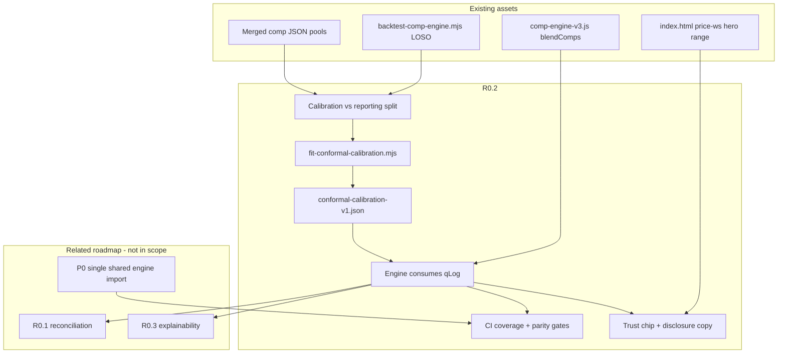

# Roadmap Expansion: Gem Appraise — R0.2 Conformal Uncertainty Calibration

## Document Purpose

This document expands **one rough roadmap item (R0.2)** into a research-backed, implementation-ready specification for **Gem Appraise** — a lab-grown diamond seller pricing calculator (`index.html` + `research/comp-engine-v3.js`).

**Use it when you need to:**

| Audience | How to use this doc |
|---|---|
| **LLM / future agent** | Start at [Project Context Reconstruction](#project-context-reconstruction), then [Algorithm / Logic](#7-algorithm--logic), then file paths in [Technical Design](#6-technical-design). |
| **Developer** | Implement from [Technical Design](#6-technical-design), [Acceptance Criteria](#8-acceptance-criteria), and [Copy/Paste Tickets](#copypaste-ticket-versions). |
| **PM / founder** | Read [Executive Summary](#executive-summary), [Combined Implementation Plan](#combined-implementation-plan), [Risks](#10-risks-and-tradeoffs). |
| **Reviewer** | Check [Research Summary](#research-summary) claims vs [Known from input](#known-from-input); verify no overstated “confidence” language in [Product Behavior](#5-product-behavior). |

**Supersedes:** `research/roadmap-r0.2-conformal-calibration-plan.md` (shorter v1). Prefer this file.

**Last updated:** 2026-05-28 · **Scope:** R0.2 only (related items R0.1, R0.3 referenced for dependencies).

---

## Input Items

| ID | Priority | Raw roadmap text |
|---|---|---|
| **R0.2** | P0 | Replace `SIGMA_CALIBRATION_FACTOR = 2.0` with **split-conformal prediction**: on a held-out set, compute the residual quantile that yields true 80% coverage, and use that. Publish the honest sentence — *"our 80% band held the true price 80% of the time on N holdout stones"* — and make the band the **primary** UI element. Cheap once a holdout exists; turns the tool from "looks confident" to "is trustworthy." |

---

## Executive Summary

### The problem

Gem Appraise shows sellers a **wholesale price range** derived from comp-engine v3. The UI labels this an “80% range,” but the underlying intervals were built from **heuristic per-axis sigmas** and a hand-tuned `SIGMA_CALIBRATION_FACTOR = 2.0` multiplier. Before that multiplier, empirical **P80 coverage** on leave-one-supplier-out (LOSO) backtests was ~**20–30%** — far below the nominal 80%. After `2.0×`, coverage rose to roughly **78–87%**, but the code still emits `calibrationNote: "intervals_sigma_inflated_2x_uncalibrated"`.

That is a **trust defect**: users interpret the band as statistical; the system knows it is not fully calibrated.

### Why R0.2 matters

- **Product:** The app’s value proposition is *defensible pricing*, not a point guess. A misleading band is worse than no band ([`estimation-algo-improvement-priorities.md`](estimation-algo-improvement-priorities.md): explainability should follow calibration).
- **Engineering:** Replacing a fudge factor with a **versioned calibration artifact** makes interval width auditable and CI-gatable.
- **Ecosystem:** R0.1 (one reconciled number + band) and R0.3 (explainability waterfall) depend on intervals that do not lie.

### Recommended build order (this item only)

1. Freeze **calibration vs reporting** holdout splits (stop double-dipping).
2. Offline `fit-conformal-calibration.mjs` → JSON artifact.
3. Engine: consume artifact; remove `SIGMA_CALIBRATION_FACTOR` from interval path.
4. CI: reporting-holdout coverage gates + browser/node parity.
5. UI: hero band + honesty disclosure (no new math in HTML).
6. Docs + recalibration playbook on comp-index updates.

### Highest-risk assumptions

| Risk | If wrong |
|---|---|
| LOSO supplier holdout ≈ exchangeable enough for conformal | Coverage on live user queries may drift; need monitoring |
| “True price” = held-out **supplier list row** in comp index | Sentence is honest for catalog, not jeweler paid price |
| `index.html` and `comp-engine-v3.js` stay in sync | Users see bands that backtest did not measure |
| Same LOSO used to pick `2.0` and to claim success | Overstated coverage until split is enforced |

---

## Project Context Reconstruction

### Known from input

- Roadmap explicitly names: `SIGMA_CALIBRATION_FACTOR = 2.0`, **split-conformal prediction**, **80% coverage**, **held-out set**, **residual quantile**, **honest sentence with N**, **band as primary UI**.
- Domain: pricing / uncertainty / trust UI for a gem appraisal product.
- Prior work in-repo references comp-engine v3, P80, holdout backtests.

### Strong inferences (verified in repo)

| Inference | Evidence |
|---|---|
| Project is **Gem Appraise** — single-page calculator for lab-grown diamonds | `index.html`, `README.md`, `research/app-improvement-analysis-2026-05.md` |
| Interval logic lives in **`research/comp-engine-v3.js`** → `blendComps()` | L1301–1313: `sigmaWithFloor * SIGMA_CALIBRATION_FACTOR`; `low/high = exp(logEstimate ± 1.28 * sigmaLog)` |
| `SIGMA_CALIBRATION_FACTOR = 2.0` at L318; comment cites pre-fix P80 ~20% / ~30% | L310–318 |
| Holdout harness exists: **`research/scripts/backtest-comp-engine.mjs`** (LOSO) | Measures `withinBand` vs `[low, high]`; targets P80 ≥ 60% |
| UI already shows comp **`low`–`high`** as hero “What they paid” when comps exist | `index.html` `update()` ~L2484–2502: `wsDisplay = fmtR(ac.low, ac.high)` |
| Result includes `calibrationNote` string | `resolveAlibabaComp` return ~L1741 |
| Production may **mirror** engine in `index.html` (drift risk) | `research/p0-remove-research-production-drift-research.md` |
| Tier-0 roadmap places R0.2 beside R0.1 reconciliation, R0.3 explainability | `research/claude-app-ml-improvement.md`, `research/app-improvement-analysis-2026-05.md` |

### Weak inferences

| Inference | Rationale |
|---|---|
| v1 uses **symmetric log-residual** conformal, not full CQR | Roadmap says “residual quantile”; engine already works in log-space |
| Separate **white / fancy** calibration | Different P80 and MdAPE in backtest docs |
| “Primary UI element” means **hero price cell**, not only market-bar footnote | UI already leads with range in `#price-ws`; R0.2 adds *calibration narrative* |
| Recalibration triggered on comp-index merges | Lab-grown list prices move fast (`app-improvement-analysis`) |

### Open questions

See [Open Questions for the Team](#open-questions-for-the-team). Material ones: Option A (fixed log-q) vs Option B (calibrate k on σ); whether to ship before R0.1; legal copy for “true price”; per-`matchType` calibration tables.

---

## Research Summary

### 1. Split conformal prediction (split CP)

**What it is.** A distribution-free procedure: fit a point predictor on training data; on a **disjoint calibration set**, compute **nonconformity scores** (e.g. absolute residuals); set interval width to the calibrated quantile of those scores; apply to new points. Under **exchangeability**, marginal coverage is finite-sample valid: \(P(Y \in \hat{C}(X)) \geq 1-\alpha\) ([Lei et al. / Tibshirani](https://www.stat.cmu.edu/~ryantibs/papers/conformal.pdf); [lecture notes](https://www.stat.berkeley.edu/~ryantibs/statlearn-s23/lectures/conformal.pdf)).

**Why it matters here.** Comp-engine σ is a useful **relative** uncertainty signal (which comp is closer?) but not a calibrated posterior. Split CP turns “we think σ means 80%” into “on this holdout protocol, 80% of held-out catalog prices fell in the band.”

**Best practice for Gem Appraise**

| Practice | Application |
|---|---|
| Hold out calibration from training **and** from reporting metrics | Avoid tuning q on the same fold you advertise |
| Use finite-sample quantile index \(k = \lceil (1-\alpha)(n+1) \rceil\) | α = 0.2 → 80% nominal ([Berkeley notes Eq. 6–7](https://www.stat.berkeley.edu/~ryantibs/statlearn-s23/lectures/conformal.pdf)) |
| **Grouped holdout** when data are supplier panels | LOSO already in `backtest-comp-engine.mjs`; random row splits leak ladders ([Barber et al., 2023](http://jmlr.org/papers/volume25/23-1553/23-1553.pdf)) |
| Monitor **conditional** coverage post-launch | Marginal 80% can hide 50% in rare pink 5ct cells |
| Version artifact with data hash + git SHA | Reproducibility when comp index changes |

**Risks**

- **Non-exchangeability:** Supplier ladders, time drift → coverage can slip below nominal; mitigate with supplier-grouped calibration + rolling recalibration ([finance conformal overview](https://chartlibrary.io/concepts/conformal-prediction-finance)).
- **Marginal vs conditional:** Guarantee is averaged over holdout distribution, not per user stone.
- **Overfitting q:** Same as tuning `2.0` without a reporting split.

**References**

- [Distribution-Free Predictive Inference for Regression (split CP)](https://www.stat.cmu.edu/~ryantibs/papers/conformal.pdf)
- [Conformal Prediction lecture notes](https://www.stat.berkeley.edu/~ryantibs/statlearn-s23/lectures/conformal.pdf)
- [Split CP & non-exchangeable data (JMLR)](http://jmlr.org/papers/volume25/23-1553/23-1553.pdf)
- [Conformalized Quantile Regression (CQR)](https://papers.neurips.cc/paper/8613-conformalized-quantile-regression.pdf) — Phase 4 extension

---

### 2. Calibration vs uncertainty quantification (UQ) vocabulary

Use distinct terms in code and UI:

| Term | Meaning in Gem Appraise |
|---|---|
| **Point estimate** | `estimate` from weighted log-blend of adjusted comps |
| **Heuristic σ** | Per-axis RMSE in `adjustCompToQuery` / pooled in `blendComps` |
| **Heuristic band** | `exp(±1.28 × σ × factor)` before conformal replacement |
| **Calibrated band** | Interval whose width was fit so **empirical coverage** ≈ 80% on declared holdout |
| **Empirical coverage** | Fraction of holdout rows with `actual ∈ [low, high]` — **measurable** |
| **Nominal coverage** | Target 80% — **design parameter** α = 0.2 |
| **Subjective confidence** | `confidence: high\|medium\|low` from match quality — **not** same as 80% band |

Do not say “80% confident” in user copy. Say: **“80% band covered holdout catalog prices X% of the time (N stones).”**

---

### 3. UX / trust patterns for pricing intervals

**What research and practice suggest** ([ACM healthcare trust survey](https://dl.acm.org/doi/full/10.1145/3716317); [confidence visualization patterns](https://agentic-design.ai/patterns/ui-ux-patterns/confidence-visualization-patterns)):

- Show **range + point**, not point alone.
- Pair intervals with **what drove width** (sparse comps, extrapolation) — aligns with future R0.3.
- Avoid **false precision** (many sig figs on wide bands).
- Provide **calibration disclosure** (N, date, holdout type) for expert users.
- Do not use alarm colors for normal uncertainty; reserve warnings for **low support** or **off-catalog**.

**Comparable products**

- Zestimate/Realtor estimates often show ranges with methodology links — users expect “model range,” not guarantee.
- Trading/fintech conformal bands emphasize **empirical coverage monitoring** and **recalibration on regime shift** ([chartlibrary finance note](https://chartlibrary.io/concepts/conformal-prediction-finance)).

---

### 4. Evaluation methods

| Metric | Definition | Tooling |
|---|---|---|
| **P80 calibration** | % holdout with `priceUsd ∈ [low, high]` | `backtest-comp-engine.mjs` |
| **MdAPE** | Median abs % error on point estimate | Same |
| **Signed bias** | Mean % error (over/under) | Same |
| **Interval width** | `(high − low) / estimate` | Add to backtest output |
| **Conditional P80** | By `matchType`, carat band, shape | `segmentReport()` already exists ~L288 |

**Acceptance philosophy:** Calibrate to **80% ± tolerance** on **reporting** holdout; do not sacrifice MdAPE targets (white ≤15%, fancy ≤30% per backtest header).

---

## Dependency Map



| Relationship | Detail |
|---|---|
| **Requires** | Queryable holdout rows, `resolveAlibabaComp`, working backtest |
| **Parallel** | P0 engine drift elimination (strongly recommended before launch) |
| **Should not precede** | Marketing “calibrated” without reporting split |
| **Blocked by R0.2** | R0.3 explainability that cites interval confidence |
| **Soft coupling** | R0.1 — v1 calibrates **comp** estimate; R0.1 may add second layer on reconciled price |

**Failure modes if order is wrong**

| Mistake | Consequence |
|---|---|
| Tune q on full LOSO, report same | Overstated coverage in honesty sentence |
| UI ships before parity | User sees uncalibrated mirrored constants |
| Remove `2.0` without q | P80 collapses toward ~20–30% again |
| Claim “transaction price” coverage | False advertising vs list-price holdout |

---

## Roadmap Items

---

## [P0] R0.2 — Calibrate uncertainty for real, then show it

### 1. Plain-English Goal

Measure how wrong the comp engine is on stones withheld from the comp pool, find how wide a price band must be so **about 80%** of those true catalog prices land inside, bake that width into the engine, and show sellers that band as the **main** wholesale answer — with a short, accurate note about how it was tested.

### 2. Why This Matters

| Stakeholder | Benefit |
|---|---|
| **Jeweler / seller** | Can quote inventory with a range that has a defined backtest meaning |
| **Founder** | Defensible differentiation vs “black box AI price” |
| **Engineer** | Removes magic `2.0`; CI catches coverage drift |
| **PM** | Clear ship criteria (P80 on reporting fold, N in copy) |

Without this, R0.1’s “one number + band” stacks on a band that code admits is `uncalibrated`.

### 3. Current Problem / Failure Mode

#### Statistical / engine

```310:318:research/comp-engine-v3.js
// ── Interval calibration ──────────────────────────────────────────────────────
// Current P80 coverage is ~20% (white) and ~30% (fancy) vs the ≥60% target.
// ...
const SIGMA_SYSTEMATIC_FLOOR = 0.10;
const SIGMA_CALIBRATION_FACTOR = 2.0;
```

```1301:1313:research/comp-engine-v3.js
  const sigmaBlend = 1 / Math.sqrt(weights.reduce((sum, w) => sum + w, 0));
  const sigmaWithFloor = Math.sqrt(sigmaBlend ** 2 + SIGMA_SYSTEMATIC_FLOOR ** 2);
  const sigmaLog = sigmaWithFloor * SIGMA_CALIBRATION_FACTOR;
  const estimate = Math.round(Math.exp(logEstimate));
  const low  = Math.round(Math.exp(logEstimate - 1.28 * sigmaLog));
  const high = Math.round(Math.exp(logEstimate + 1.28 * sigmaLog));
```

- **Pre-2.0×:** P80 ~20.8% white, ~30.5% fancy (`comp-engine-v3-p0-p1-p1b-implementation.md`).
- **Post-2.0×:** ~78–87% but label remains `uncalibrated`; critique notes **same backtest used to tune and evaluate** (`comp-engine-v3-implementation-critique.md`).
- **z = 1.28** assumes Gaussian tail for “80%”; multiplied σ is not the same as conformal 80%.

#### User-facing

| Scenario | Failure |
|---|---|
| Seller prices at point estimate | Ignores band; band was too narrow pre-P0 |
| Seller trusts “80% range” label | Believes frequentist coverage without measurement |
| Fancy pink 5ct sparse comps | Marginal 80% may hide 40% cell coverage |
| No comps — baseline path | `fmtR(m.ws*0.87, m.ws*1.13)` — **heuristic**, not calibrated (`index.html` ~L2498) |

#### Engineering

- `calibrationNote: intervals_sigma_inflated_2x_uncalibrated` (~L1741) explicitly warns downstream consumers.
- Mirrored engine in `index.html` may diverge from `comp-engine-v3.js` (`p0-remove-research-production-drift-research.md`).

### 4. Research Background

See [Research Summary](#research-summary). Additional pitfall specific to **comp blending**:

Inverse-variance pooling **rewards agreement** among correlated same-supplier comps → **under-estimated σ** → narrow bands ([`comp-engine-v3-p0-p1-p1b-implementation.md`](comp-engine-v3-p0-p1-p1b-implementation.md)). Conformal correction is appropriate precisely when the generative model (Gaussian σ) is misspecified but the **point predictor** is usable.

**Alternatives considered**

| Approach | Pros | Cons |
|---|---|---|
| **Split CP on log residuals** (recommended v1) | Simple audit; decouples from σ scale | Bands may be wide when σ already wide |
| **Calibrate k in `k × σ`** | Keeps heteroscedastic width | Harder audit; σ may still be wrong shape |
| **CQR** (two quantile models) | Asymmetric bands | 3× model complexity; Phase 4 |
| **Bayesian posterior** | Principled | No likelihood for comp adjustment; overkill |
| **Keep tuning `2.0`** | Fast | Not publishable; double-dipping risk |

### 5. Product Behavior

#### Terminology for copywriters

| UI label | Allowed | Forbidden |
|---|---|---|
| Band type | “80% holdout band” / “calibrated range” | “80% confident” / “guaranteed” |
| Truth target | “supplier catalog price” / “comp list price” | “your paid price” / “fair market value” |
| Point | “estimate” / “adjusted comp mid” | “accurate price” / “true value” |

#### Main UI state (comps available)

**Hero (`#price-ws`):** `$low – $high` (existing layout).

**Subline (`#price-ws-sub`):**  
`~$X/ct · Alibaba est. (N comps) · 80% holdout band`

**Trust chip (new):**  
`Calibrated` → disclosure: run date, N, segment coverages.

**Honesty sentence (template — fill from artifact):**

> On our last calibration run (YYYY-MM-DD), this style of **80% band** contained the held-out **supplier catalog price** for **{pct}%** of **{N}** stones in the test set (white: {Nw}%, fancy: {Nf}%).  
> It does **not** guarantee your negotiated paid price or resale price.

#### Empty / loading / error

| State | Hero | Chip / note |
|---|---|---|
| Index loading | `—` | “Loading comps…” |
| `matchType === 'none'` | Baseline `fmtR(ws×0.87, ws×1.13)` | “Uncalibrated heuristic — no comps” |
| `support < min` | Band if engine returns; else baseline | “Sparse comps — band may be wide” |
| Engine throw | Baseline | Amber weak-bar warning |

#### Edge cases

- **Exact match, one supplier:** Do not show narrow band driven by one ladder unless reporting-holdout coverage supports it; consider `matchType=exact` row in artifact.
- **Large carat extrapolation:** Keep existing warnings; band must not **narrow** because point looks smooth.
- **Fancy yellow n=1 in metrics:** Backtest drops sparse cells — UI must not imply high N globally.

#### Hidden from user

- `sigmaLog`, `SIGMA_SYSTEMATIC_FLOOR`, raw conformity scores
- Supplier names in holdout fold lists (unless disclosure panel)

### 6. Technical Design

#### Files to touch

| File | Change |
|---|---|
| `research/comp-engine-v3.js` | `blendComps`, constants, `resolveAlibabaComp` metadata |
| `research/comp-engine-v3.browser.js` | Regenerate / sync |
| `research/scripts/fit-conformal-calibration.mjs` | **New** — fit artifact |
| `research/scripts/backtest-comp-engine.mjs` | Load artifact; reporting-fold gate |
| `research/data/conformal-calibration-v1.json` | **New** — versioned output |
| `index.html` | Trust chip, disclosure, consume `ac.calibration` |
| `.github/workflows/*` or test script | CI gate (if exists; else add npm script) |

#### Data inputs

- Pools: `alibaba-comps-index.json`, `messi-comps.json`, `starsgem-comps.json`, `messi-color-comps.json`
- Per holdout prediction: `{ actual, predicted, logEstimate, sigmaWithFloor, segment, matchType, support, low, high }`

#### Artifact schema (example)

```json
{
  "version": "conformal-v1",
  "createdAt": "2026-05-28T00:00:00Z",
  "engineGitSha": "abc123def",
  "dataHash": "sha256:…",
  "alpha": 0.2,
  "method": "split_conformal_symmetric_log_residual",
  "holdoutProtocol": "LOSO_supplier_grouped",
  "calibrationSuppliers": ["messi", "…"],
  "reportingSuppliers": ["starsgem", "…"],
  "segments": {
    "white": {
      "qLog": 0.412,
      "nCal": 1204,
      "reportingCoverage": 0.802,
      "nReport": 890
    },
    "fancy": {
      "qLog": 0.531,
      "nCal": 638,
      "reportingCoverage": 0.798,
      "nReport": 410
    }
  },
  "fallback": { "qLog": 0.475, "nCal": 1842 }
}
```

#### Engine API extension

```typescript
type ConformalCalibrationMeta = {
  targetCoverage: 0.8;
  segment: 'white' | 'fancy';
  qLog: number;
  reportingCoverage: number;  // from artifact — NOT recomputed client-side
  nReport: number;
  method: string;
  runId: string;
  calibratedAt: string;  // ISO date
};

// resolveAlibabaComp return adds:
calibration: ConformalCalibrationMeta | null;
calibrationNote: string;  // e.g. "conformal_v1_white_q0.412"
```

#### `blendComps` change (Option A — recommended)

```javascript
// After logEstimate computed:
const segment = query.colorFamily; // pass through options
const qLog = loadConformalQLookup(segment) ?? loadConformalQLookup('fallback');
const low  = Math.round(Math.exp(logEstimate - qLog));
const high = Math.round(Math.exp(logEstimate + qLog));
// sigmaLog retained for diagnostics / future heteroscedastic conformal
```

Remove interval use of `SIGMA_CALIBRATION_FACTOR`; keep `sigmaLog` computation for weights/diagnostics.

#### Frontend

- Read `ac.calibration` only — **no duplicate q constants** in HTML.
- `update()` / `updateMarketBar()`: append honesty sentence when `ac.calibration` present.
- Baseline path: never say “80%” without calibration metadata.

#### Observability

Log to calibration run JSON (not browser):

- Overall / segment P80 on **reporting** fold
- MdAPE, bias, median band width
- Conditional P80 by `matchType`, carat band (reuse `segmentReport`)

### 7. Algorithm / Logic

#### Step 0 — Split suppliers

```text
SUPPLIERS = unique supplierKey(rows)
shuffle or hash-stable partition:
  CALIBRATION_SUPPLIERS = 70% of suppliers
  REPORTING_SUPPLIERS   = 30% disjoint
```

Document lists in `research/data/conformal-holdout-split-v1.json`.

#### Step 1 — Collect scores (calibration suppliers only)

```text
for s in CALIBRATION_SUPPLIERS:
  pool = all rows except supplier s
  loadIndex(pool)
  for row in queryable rows from supplier s:
    result = resolveAlibabaComp(query(row))
    if result.estimate is null or support < MIN_SUPPORT: continue
    score = abs(log(row.priceUsd) - log(result.estimate))
    record(score, segment=row.colorFamily, matchType=result.matchType)
```

#### Step 2 — Fit q (per segment)

```text
alpha = 0.2
for segment in {white, fancy}:
  scores = sorted scores for segment, n = len(scores)
  k = ceil((n + 1) * (1 - alpha))
  qLog[segment] = scores[k-1]   // 1-indexed k-th smallest
```

Finite-sample guarantee: coverage ≥ 1 − α under exchangeability ([Tibshirani CP Thm 2.2](https://www.stat.cmu.edu/~ryantibs/papers/conformal.pdf)).

#### Step 3 — Evaluate on REPORTING_SUPPLIERS only

```text
for s in REPORTING_SUPPLIERS:
  ... same loop ...
  withinBand = (actual >= low_q && actual <= high_q)
reportingCoverage = mean(withinBand)
```

CI fails if `|reportingCoverage - 0.80| > tolerance` (e.g. 0.03 per segment).

#### Step 4 — Runtime inference

```text
function conformalInterval(logEstimate, segment):
  q = qLog[segment] ?? qLog.fallback
  return (exp(logEstimate - q), exp(logEstimate + q))
```

#### Option B (alternative) — calibrate multiplier k

```text
// Search k in [0.5, 4.0] minimizing |mean(withinBand(k)) - 0.8| on CALIBRATION only
halfWidth = 1.28 * sigmaWithFloor * k
```

Ship only if Option A bands are unusably wide in QA; document k in artifact.

### 8. Acceptance Criteria

- [ ] `SIGMA_CALIBRATION_FACTOR` not used for `low`/`high` when artifact loaded.
- [ ] `conformal-calibration-v1.json` committed with `nCal`, `reportingCoverage`, `dataHash`, `engineGitSha`.
- [ ] Calibration and reporting supplier sets **disjoint** and documented.
- [ ] Reporting holdout: white P80 ∈ [77%, 83%], fancy P80 ∈ [77%, 83%] (tune tolerances).
- [ ] If segment `nCal < 50`, fallback to global `qLog` and UI shows “low calibration support.”
- [ ] `calibrationNote` contains `conformal_v1`, not `uncalibrated`.
- [ ] `node backtest-comp-engine.mjs` matches CI within 0.5% on coverage.
- [ ] Golden set (≥20 queries): `low`/`high` identical in node vs browser bundle.
- [ ] UI honesty sentence uses artifact `nReport` / `reportingCoverage` — not hand-typed marketing numbers.
- [ ] Baseline-only path does not claim 80% calibration.
- [ ] Pink T16 regression still passes (`backtest-comp-engine.mjs` header).

### 9. Metrics to Track

| Metric | Owner | Alert threshold |
|---|---|---|
| Reporting P80 white/fancy | CI | < 75% or > 85% |
| MdAPE white/fancy | CI | > 15% / > 30% |
| Median `(high-low)/estimate` | Backtest | > 60% (product review) |
| P80 by `matchType` | Dashboard | `best_available` < 70% |
| P80 by carat band | Dashboard | any band < 65% |
| Calibration artifact age | Ops | > 90 days without comp refresh |
| Production/engine parity failures | CI | any golden mismatch |

### 10. Risks and Tradeoffs

| Risk | Likelihood | Impact | Mitigation |
|---|---|---|---|
| Overclaiming in copy | Medium | Legal/trust | “Catalog holdout” language |
| Double-dipping q | Medium | False CI pass | Split suppliers |
| Bands too wide | Medium | UX “useless range” | Improve comps; conditional q in Phase 2 |
| Bands too narrow | Low | Repeat P0 failure | Coverage CI floor |
| LOSO ≠ user queries | Medium | Drift | Recalibrate on index merge |
| List ≠ paid price | High | Wrong business fit | Footnote; R1.2 transaction data |
| Engine drift | Medium | Wrong user band | P0 shared import + parity |

**Tradeoff:** Option A sacrifices σ-shaped intervals for **provable marginal calibration** on the holdout protocol — correct trade for R0.2 trust goal.

### 11. Testing Plan

| Layer | Tests |
|---|---|
| **Unit** | Quantile index k for known scores; segment fallback; artifact parse errors |
| **Integration** | `blendComps` symmetry: `low < estimate < high` (when errors small); `resolveAlibabaComp` returns `calibration` |
| **Backtest** | Full LOSO with artifact; reporting-only coverage; segment breakdowns |
| **Parity** | Golden JSON: node vs browser |
| **UI** | Manual: exact / nearest / best_available / none / loading |
| **Regression** | MdAPE gates; pink case bounds |
| **Data** | Artifact schema validation; `dataHash` matches comp files |

**Manual QA scripts (examples)**

1. 3.0ct round G VS1 — band visible, chip shows N > 0.
2. 5ct FVP pink pear — wide band + extrapolation warning; no false “high confidence.”
3. Off-catalog clarity — baseline heuristic label, no “80% holdout.”

### 12. Future Extensions

- **Mondrian conformal:** per `matchType` or carat bucket q tables.
- **CQR:** asymmetric `[q_lo(x), q_hi(x)]` for skewed fancy market ([Romano et al., 2019](https://papers.neurips.cc/paper/8613-conformalized-quantile-regression.pdf)).
- **Adaptive conformal inference (ACI):** rolling recalibration when coverage drifts ([industry practice](https://chartlibrary.io/concepts/conformal-prediction-finance)).
- **R0.1 layer:** conformal on reconciled wholesale, not raw comp mid.
- **ML cards:** same protocol on StarGem validation rows.
- **Transaction holdout:** when eBay sold / auction data exists (R1.2).

---

## Combined Implementation Plan

### Phase 1 — Minimum viable (S–M, ~3–5 eng-days)

| Scope | Deliverables |
|---|---|
| Fit script + artifact | `fit-conformal-calibration.mjs`, `conformal-calibration-v1.json` |
| Engine | Option A `qLog`; remove `SIGMA_CALIBRATION_FACTOR` from intervals |
| Backtest | Print reporting coverage |
| UI | Honesty sentence from metadata |

**Avoid:** CQR, Mondrian tables, ML bands.

**Dependencies:** Existing LOSO backtest.

### Phase 2 — Robust (M, ~5–8 days)

| Scope | Deliverables |
|---|---|
| Disjoint cal/report supplier split | `conformal-holdout-split-v1.json` |
| CI gate | Fail PR on coverage drift |
| Per-`matchType` q (optional) | Extended artifact |
| Conditional coverage report | Markdown / JSON output from backtest |

**Avoid:** Full R0.1 reconciliation.

### Phase 3 — Polished (M, ~3–5 days)

| Scope | Deliverables |
|---|---|
| Trust chip + `<details>` disclosure | `index.html` |
| P0 shared engine import | Reduce drift (`p0-remove-research-production-drift-research.md`) |
| Methodology footer update | `current-pricing-model-how-it-works.md` |
| Recalibration runbook | When comp JSON merges |

### Phase 4 — Advanced (L, research)

- Heteroscedastic scores `|log y − log ŷ| / σ`
- CQR asymmetric bands
- Transaction-price conformal layer

---

## Final Recommended Build Order

1. **Define holdout split** — `conformal-holdout-split-v1.json`; stop tuning on reporting suppliers.
2. **Implement fit script** — scores → qLog per segment → artifact.
3. **Wire engine** — `blendComps` + metadata on `resolveAlibabaComp`.
4. **Extend backtest** — reporting-only P80; segment breakdown export.
5. **CI gates** — coverage tolerance + golden parity.
6. **Sync browser bundle** — `comp-engine-v3.browser.js`.
7. **UI trust surfaces** — chip, disclosure, baseline labeling.
8. **Documentation + founder sign-off on copy**.

---

## Open Questions for the Team

1. **Option A vs B:** fixed log-q vs calibrate k on σ?
2. **Segment granularity:** white/fancy only, or also `matchType` / `singleSourceOnly`?
3. **Coverage tolerance:** ±3% vs ±5% on reporting fold?
4. **Ship before R0.1?** Comp-only calibrated band vs wait for reconciled estimate?
5. **Artifact in git vs CI-only?** Reviewability vs freshness.
6. **Copy approval:** exact sentence for non-expert sellers?
7. **Recalibration SLA:** every comp merge, weekly, or manual?
8. **Baseline ±13%:** remove “range” wording entirely when uncalibrated?

---

## Copy/Paste Ticket Versions

### Ticket: R0.2 — Split-conformal calibration for comp-engine 80% bands

**Background**  
Comp-engine v3 labels intervals “80%” using `exp(±1.28σ)` with `SIGMA_CALIBRATION_FACTOR = 2.0`. Pre-multiplier empirical P80 was ~20–30% on LOSO backtest; post-multiplier ~78–87% but still `uncalibrated`. UI hero `#price-ws` already shows `ac.low–ac.high` when comps exist.

**Scope**  
- Add `research/scripts/fit-conformal-calibration.mjs` + `research/data/conformal-calibration-v1.json`.  
- Replace `SIGMA_CALIBRATION_FACTOR` interval path with segment `qLog` (Option A).  
- Extend `resolveAlibabaComp` with `calibration` metadata.  
- Reporting-holdout coverage CI (target 80% ± tolerance per segment).  
- UI honesty sentence + calibrated chip; baseline path labeled heuristic.  
- Browser/node parity tests.

**Acceptance criteria**  
- No `uncalibrated` in shipped `calibrationNote`.  
- Reporting P80 within tolerance (white + fancy).  
- UI shows N and date from artifact only.  
- Golden parity passes.

**Notes**  
Full spec: `research/roadmap-expansion-r0.2-conformal-calibration.md`.

---

### Ticket: R0.2a — Calibration / reporting supplier split

**Background**  
Tuning interval width on the same LOSO used for metrics inflates coverage claims.

**Scope**  
- `research/data/conformal-holdout-split-v1.json`  
- Fit uses calibration suppliers only; CI uses reporting only.  
- Document in backtest + fit script headers.

**Acceptance criteria**  
- Scripts error if split file missing.  
- Reporting suppliers never appear in fit loop.

---

### Ticket: R0.2b — UI calibration disclosure

**Background**  
Band is visually primary but lacks trust narrative; risk of misleading “confidence.”

**Scope**  
- Trust chip + `<details>` with holdout sentence template.  
- `updateMarketBar` links to disclosure.  
- Baseline: no “80% holdout” language.

**Acceptance criteria**  
- Manual QA on all `matchType` paths.  
- Copy reviewed for catalog-vs-paid distinction.

---

## Appendix A — Current UI wiring (reference)

```2481:2502:index.html
  // Wire Alibaba comp data to "What they paid" (factory-direct trade cost)
  { const ac = m.alibabaComp;
    let wsDisplay, wsSub;
    if (ac && ac.matchType === 'exact' && ac.estimate) {
      wsDisplay = fmtR(ac.low, ac.high);
      wsSub = fmt(ac.perCt) + '/ct · IGI factory direct';
    } else if (ac && (ac.matchType === 'nearest' || ac.matchType === 'best_available') && ac.estimate) {
      wsDisplay = fmtR(ac.low, ac.high);
      // ...
```

R0.2 adds **calibration narrative** to `wsSub` / chip — not a new layout.

---

## Appendix B — Backtest P80 definition (reference)

```216:218:research/scripts/backtest-comp-engine.mjs
    const withinBand = result.low != null && result.high != null
      && actual >= result.low && actual <= result.high;
    if (withinBand) inBand++;
```

Post-R0.2, `low`/`high` must come from conformal q, not uncorrected σ.

---

## Appendix C — Research citations

| Topic | Source |
|---|---|
| Split conformal regression | [CMU conformal paper](https://www.stat.cmu.edu/~ryantibs/papers/conformal.pdf) |
| Finite-sample quantile | [Berkeley Stat 230 notes](https://www.stat.berkeley.edu/~ryantibs/statlearn-s23/lectures/conformal.pdf) |
| Non-exchangeable / grouped data | [JMLR 2023](http://jmlr.org/papers/volume25/23-1553/23-1553.pdf) |
| CQR extension | [NeurIPS 2019](https://papers.neurips.cc/paper/8613-conformalized-quantile-regression.pdf) |
| Finance calibration practice | [Chart Library conformal finance](https://chartlibrary.io/concepts/conformal-prediction-finance) |
| Trust / uncertainty UX | [ACM TOCHI survey](https://dl.acm.org/doi/full/10.1145/3716317) |

---

*End of document.*
