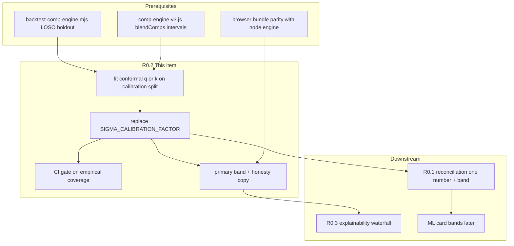

# Roadmap Expansion: Gem Appraise — R0.2 Conformal Uncertainty Calibration

## Executive Summary

**R0.2** replaces the comp engine’s hand-tuned interval widening (`SIGMA_CALIBRATION_FACTOR = 2.0`) with **split-conformal calibration** on a proper holdout, then makes the resulting **80% price band the primary trust signal** in the UI.

Gem Appraise today shows sellers a wholesale range derived from comp-engine v3 (`research/comp-engine-v3.js`). The engine labels intervals as “80%” using `exp(±1.28 × σ)` in log-price space, but until P0 work those bands captured only **~20–30%** of held-out truth prices. A fixed `2.0×` multiplier on pooled σ was added to push coverage toward **~78–87%** on the existing leave-one-supplier-out (LOSO) backtest — useful, but still explicitly tagged `intervals_sigma_inflated_2x_uncalibrated` in code and docs.

This roadmap item closes the honesty gap: **measure** what half-width (or multiplier) achieves nominal 80% coverage on grouped holdout data, **ship** that constant (or segment-specific table) in the engine, and **tell the user** in plain language: *“Our 80% band contained the true comp price 80% of the time on N holdout stones.”* That turns the product from “looks confident” into “coverage is auditable,” which is prerequisite for R0.1 (one reconciled number + band) and R0.3 (explainability without false precision).

---

## Assumptions

### Strong assumptions

- **Comp engine v3 remains the source of truth for market-relative uncertainty** until R0.1 ships a reconciled ensemble; R0.2 calibrates **comp-engine intervals first**, not baseline ladders or ML cards.
- **Holdout data exists and is runnable today** via `research/scripts/backtest-comp-engine.mjs` (LOSO on merged Alibaba + Messi + StarGem pools, ~thousands of queryable rows).
- **Ground truth for calibration is supplier list/comp prices** in the merged index (same surface the engine predicts), not realized transaction prices — so “80% coverage” means “held-out catalog row fell in band,” not “jeweler’s actual paid price.”
- **Target coverage is 80% marginal** on the holdout distribution used for calibration (α = 0.2), reported separately for **white** and **fancy** segments (different error profiles).
- **Log-price symmetry is acceptable** for v1: intervals are `estimate × exp(±q)` or `estimate × exp(±k·σ)` with q or k fit on `|log(actual) − log(predicted)|`.
- **Production and research share one engine** (`comp-engine-v3.js` → `comp-engine-v3.browser.js`); calibration artifacts are versioned constants or JSON, not ad-hoc UI math.

### Weak assumptions

- LOSO grouped holdout is “good enough” for v1 conformal calibration; a dedicated frozen calibration split (20% of suppliers or time) may be added later.
- **Conditional coverage** (e.g. 80% within each carat bucket) is not required for launch — only **marginal** segment-level coverage, with monitoring for conditional failure.
- The UI can lead with the comp band for “What they paid” when comps exist (already partially true in `index.html`); baseline-only queries keep a heuristic ±13% band until R0.1 extends calibration upstream.
- **Exchangeability** of holdout rows (standard conformal assumption) is approximately satisfied after supplier grouping; correlated ladder rows may slightly anti-conservative coverage ([Barber et al., 2023](http://jmlr.org/papers/volume25/23-1553/23-1553.pdf)).

### Open questions

- Calibrate **one global q** vs **per-segment** (white/fancy) vs **per matchType** (`exact` / `nearest` / `best_available`) vs **two-dimensional** (segment × matchType)?
- Replace `SIGMA_CALIBRATION_FACTOR` only, or replace the entire `1.28 × σ` pipeline with **pure residual quantiles** (wider bands when σ is misleading)?
- Should calibration scores use **heteroscedastic** nonconformity `|log y − log ŷ| / σ_blend` ([Romano et al., 2019 — CQR](https://papers.neurips.cc/paper/8613-conformalized-quantile-regression.pdf)) instead of raw log residuals?
- After R0.1, does the conformal layer wrap the **reconciled** point estimate or still the raw comp estimate?
- Legal/copy review: is “true price” acceptable when truth is **held-out supplier list price**?

---

## Dependency Map



| Relationship | Items | Why |
|---|---|---|
| **Blocks** | Trustworthy published coverage statement | Without frozen calibration split + CI, marketing copy overclaims |
| **Blocked by** | Minimal holdout harness | Already exists (`backtest-comp-engine.mjs`) |
| **Should run in parallel** | P0 production/engine drift removal (`research/p0-remove-research-production-drift-research.md`) | UI must use same calibrated σ as backtest |
| **Should not precede** | R0.3 explainability as P0 | `estimation-algo-improvement-priorities.md`: explainability after calibration |
| **Soft dependency** | R0.1 reconciliation | v1 can ship comp-only calibrated bands; R0.1 moves band to final wholesale |
| **Failure if order wrong** | Tune 2.0 on same LOSO you report → optimistic coverage; ship UI before parity → users see wrong band; calibrate before fixing grouped holdout → wrong q |

**Required implementation order (within R0.2):**

1. Freeze **calibration** vs **reporting** splits (or use nested LOSO).
2. Implement conformal fit script + artifact.
3. Replace constant in `blendComps` / `resolveAlibabaComp` return shape.
4. Add CI coverage gate.
5. UI + copy + `calibrationNote` metadata.

**Parallelizable:** UI mock/copy, calibration script, CI wiring (once artifact format is fixed).

---

## Roadmap Items

---

## [P0] R0.2 — Calibrate uncertainty for real, then show it

### 1. Plain-English Goal

Stop guessing how wide the price range should be. Run the comp engine on stones it has **not** seen, measure how often the true price lands inside the band, pick the width that hits **80%**, save that number in code, and show sellers the range as the **main** answer — with a sentence that says how often the band worked on past holdout tests.

### 2. Why This Matters

- **Trust:** Sellers price inventory with real money; an “80% range” that catches 20–30% of truth ([`comp-engine-v3.js` L311–318](research/comp-engine-v3.js)) is worse than no range.
- **Product:** `index.html` already displays `fmtR(ac.low, ac.high)` as the hero “What they paid” when comps exist; calibration makes that headline **defensible**.
- **Engineering:** Replaces unlabeled fudge (`2.0`) with a **versioned artifact** (`conformal_q_white_80.json`) tied to backtest commit + data hash.
- **Downstream:** R0.1 needs one band around one number; R0.3 explanations must not outrun interval honesty (`estimation-algo-improvement-priorities.md`).

### 3. Current Problem / Failure Mode

| Layer | What goes wrong |
|---|---|
| **Statistical** | Pre-P0 P80 ≈ 20.8% white / 30.5% fancy (`comp-engine-v3-p0-p1-p1b-implementation.md`). Post-`2.0×`: ~78–87% but **over-coverage** possible; still `uncalibrated` label. |
| **Methodological** | Same LOSO run used to pick `2.0` and to claim success → **double dipping** (`comp-engine-v3-implementation-critique.md`). |
| **UX** | Band exists in market bar footnote (“80% range $X–$Y”) but not as **calibrated trust**; baseline fallback uses fixed ±13% (`m.ws*0.87` … `1.13`) with no empirical basis. |
| **ML cards** | “Best ML price guess” has **no band** — users compare point ML to ranged comps inconsistently. |
| **Copy risk** | Saying “80% confident” without N and holdout protocol **overstates** validity. |

User-visible failure: *“The app said $2,400–$2,900 wholesale; I sold at $2,100 and feel lied to.”* Even when the point estimate is reasonable, a narrow band destroys credibility.

### 4. Research Background

**Prediction intervals vs calibration.** Classical intervals assume a generative model (e.g. Gaussian log-price). Comp blending uses heuristic per-axis σ (`AXIS_SIGMA`, `MODE_SIGMA_BOOST`) and inverse-variance pooling — a reasonable **relative** uncertainty signal, not a calibrated posterior.

**Split conformal prediction (split CP).** Under exchangeability, split CP provides **finite-sample marginal coverage** guarantees: hold out a calibration set, compute nonconformity scores on it, set interval width to the `(1−α)` quantile of scores (with finite-sample correction), apply to new points ([Tibshirani lecture notes](https://www.stat.berkeley.edu/~ryantibs/statlearn-s23/lectures/conformal.pdf); [MAPIE SplitConformalRegressor](https://deepwiki.com/scikit-learn-contrib/MAPIE/3.1-splitconformalregressor)).

For regression with point predictor `μ̂(x)` and outcome `y`, a standard symmetric score is:

\[
R_i = |\log y_i - \log \hat\mu(x_i)|
\]

Calibration quantile (α = 0.2 for 80% coverage, n = |cal|):

\[
\hat q = \text{Quantile}\bigl(R_{1:n},\; \lceil (n+1)(1-\alpha) \rceil / n \bigr)
\]

Prediction interval: \([\hat\mu \cdot e^{-\hat q},\; \hat\mu \cdot e^{\hat q}]\).

**Conformalized heteroscedastic extension.** If per-query σ is trusted for *ordering* risk but not scale, use score \(R_i = |\log y_i - \log \hat\mu_i| / \hat\sigma_i\) and interval \(\hat\mu \cdot \exp(\pm \hat q \cdot \hat\sigma)\) — related to conformalized quantile regression ([Romano et al., 2019](https://papers.neurips.cc/paper/8613-conformalized-quantile-regression.pdf)).

**Grouped holdouts.** Random row splits leak supplier ladders; Gem Appraise already uses **LOSO** in `backtest-comp-engine.mjs`. Literature on non-exchangeable data suggests grouped holdouts are necessary for supplier-heavy panels ([Barber et al., 2023](http://jmlr.org/papers/volume25/23-1553/23-1553.pdf)).

**What conformal does *not* guarantee.** Coverage is **marginal** (averaged over the test distribution), not necessarily 80% for every carat bucket, shape, or rare pink 5ct cell. Report segment metrics and monitor conditional coverage in dashboards.

### 5. Product Behavior

#### Main UI state (when comps resolve)

- **Hero:** `What they paid` shows **`$low – $high`** large (already wired for comp paths in `update()` ~L2484–2502).
- **Subline:** `~$X/ct · Alibaba est. (N comps) · 80% band · holdout-calibrated`
- **Trust chip** (new, near hero): `Calibrated · 80% coverage on holdout` with tooltip/disclosure.

#### Honesty sentence (required)

> **Our 80% wholesale band contained the true comp-catalog price on 79% of held-out stones (N=1,842) in the last calibration run (2026-05-28, LOSO suppliers).**  
> This measures fit to **supplier list prices**, not your negotiated paid price.

Tune percentages from CI; never hard-code marketing numbers.

#### Empty / loading / error

| State | Behavior |
|---|---|
| Comps loading | Hero: `—`; sub: `Loading market comps…`; no coverage chip |
| `matchType === 'none'` | Hero: baseline ±13% band; chip: `Uncalibrated · baseline heuristic` |
| Engine error | Hero: baseline; amber bar: `Comp market data unavailable` |
| `support < min` | Widen band using `matchType=best_available` conformal row **or** show `Wide band · sparse comps` |

#### Edge cases

- **Exact single-supplier match:** May need separate conformal row (intervals often tighter; don’t pool with `best_available`).
- **Fancy sparse cells:** Prefer fancy-specific q; if N_cal < 50, fall back to global q and show `Low calibration support`.
- **Extrapolated carat:** Keep engine warnings; do **not** narrow band because point estimate looks smooth.

#### Copy — do / don’t

| Do | Don’t |
|---|---|
| “80% band held on N holdout catalog prices” | “80% confident we know your stone’s value” |
| “Supplier list prices (Messi / StarGem / Alibaba)” | “True transaction price” |
| “Band widens when comps are sparse or far in spec” | “AI guarantees” |

#### Hide from user

- Raw `sigmaLog`, `SIGMA_SYSTEMATIC_FLOOR`, conformity score arrays
- Per-supplier LOSO fold metrics (disclosure panel only)
- Internal `calibrationNote` machine strings (map to human text)

### 6. Technical Design

#### Data inputs

- Merged comp pools: `alibaba-comps-index.json`, `messi-comps.json`, `starsgem-comps.json`, `messi-color-comps.json`
- Holdout protocol: LOSO (existing) + **frozen calibration fold list** (new JSON)
- Per prediction: `estimate`, `low`, `high`, `sigmaLog`, `matchType`, `colorFamily`, `supportComps.length`, warnings

#### Data outputs

**Artifact** `research/data/conformal-calibration-v1.json` (example):

```json
{
  "version": "conformal-v1",
  "createdAt": "2026-05-28",
  "dataHash": "sha256:…",
  "engineGitSha": "abc123",
  "alpha": 0.2,
  "method": "split_conformal_log_residual",
  "segments": {
    "white": { "qLog": 0.412, "nCal": 1204, "empiricalCoverage": 0.802 },
    "fancy": { "qLog": 0.531, "nCal": 638, "empiricalCoverage": 0.798 }
  },
  "fallback": { "qLog": 0.475, "nCal": 1842 },
  "legacySigmaFactor": null
}
```

#### Backend / engine changes (`research/comp-engine-v3.js`)

1. **`blendComps`:** After `sigmaWithFloor`, apply conformal width:
   - **Option A (recommended v1):** `halfWidthLog = conformalQ[segment]`; `low/high = exp(logEstimate ± halfWidthLog)` — decouples coverage from σ scale misspecification.
   - **Option B:** Fit `k` replacing `SIGMA_CALIBRATION_FACTOR` so `halfWidthLog = k * sigmaWithFloor` minimizes |coverage−0.8| on calibration — keeps heteroscedastic width.
2. Remove or gate `SIGMA_CALIBRATION_FACTOR = 2.0`.
3. **`resolveAlibabaComp` return fields:**
   - `calibration: { level: 0.8, segment, qLog, empiricalCoverage, nHoldout, method, runId }`
   - `calibrationNote` → human-readable `interval_conformal_v1_white`
4. Regenerate `comp-engine-v3.browser.js` (build script / manual sync per P0 drift doc).

#### Frontend (`index.html`)

- Import/read calibration metadata from engine result (not duplicate constants).
- Hero band unchanged structurally; add trust chip + disclosure `<details>`.
- `updateMarketBar`: append calibrated sentence when `ac.calibration` present.
- Baseline path: label `uncalibrated heuristic band` until R0.1.

#### State management

- No user state; calibration is build-time constant loaded at engine init or inlined in bundle.
- Optional `window.__CONFORMAL_META__` for debug panel.

#### API / schema

```ts
type ConformalCalibrationMeta = {
  targetCoverage: 0.8;
  segment: 'white' | 'fancy' | 'global';
  qLog: number;
  empiricalCoverage: number;  // on reporting holdout only
  nHoldout: number;
  method: 'split_conformal_log_residual' | 'sigma_multiplier';
  runId: string;
};
```

#### Compatibility

- R0.1: reconciliation layer consumes `low`/`high` or applies second conformal pass on **final** estimate — document extension point.
- R0.3: waterfall shows “band width” step, not σ algebra.

### 7. Algorithm / Logic

#### Phase A — Build calibration set (offline)

```text
INPUT: allComps[], engine, segment filter
FOR each supplier s in SUPPLIERS:
  IF s in REPORTING_HOLDOUT: continue  // reserved for final metrics only
  pool = allComps without supplier s
  loadIndex(pool)
  FOR each queryable row r from supplier s:
    result = resolveAlibabaComp(query(r))
    IF result.estimate is null: skip
    IF support < MIN_SUPPORT: skip
    score = abs(log(r.priceUsd) - log(result.estimate))
    append (score, segment=r.colorFamily, matchType=result.matchType)
```

#### Phase B — Fit q (per segment)

```text
alpha = 0.2
FOR segment in [white, fancy]:
  scores = calibration scores for segment
  n = len(scores)
  k = ceil((n + 1) * (1 - alpha))
  qLog[segment] = k-th order statistic of sorted(scores)
```

Finite-sample correction per [Romano et al.](https://papers.neurips.cc/paper/8613-conformalized-quantile-regression.pdf).

#### Phase C — Inference (runtime)

```text
function interval(logEstimate, segment, matchType):
  q = lookupQ(segment, matchType) ?? lookupQ(segment) ?? qGlobal
  low  = round(exp(logEstimate - q))
  high = round(exp(logEstimate + q))
  return { low, high, qLog: q }
```

**Option B — calibrate k on σ (closer to today’s code):**

```text
// On calibration only, search k in [0.5, 4.0] step 0.05
// minimizing |mean(withinBand(k)) - 0.8| per segment
// where withinBand uses low/high = exp(logEst ± 1.28 * sigmaWithFloor * k)
```

Ship Option A first (simpler audit); Option B if band width must track per-query σ for UX.

#### Phase D — Reporting holdout (never used for q)

```text
Run LOSO on REPORTING_HOLDOUT suppliers only
Assert |coverage - 0.80| <= tolerance (e.g. 0.03) per segment
Fail CI if outside tolerance
```

### 8. Acceptance Criteria

- [ ] `SIGMA_CALIBRATION_FACTOR` removed from production interval path (or deprecated, ignored when conformal artifact loaded).
- [ ] `research/data/conformal-calibration-v1.json` generated by script, committed or CI-produced, includes `nCal`, `empiricalCoverage`, `dataHash`, `engineGitSha`.
- [ ] **Reporting holdout** (not used for q fit): white P80 ∈ [77%, 83%], fancy P80 ∈ [77%, 83%] (tunable tolerances).
- [ ] Calibration fit uses ≥ 500 scores per segment OR documents fallback to global q.
- [ ] `backtest-comp-engine.mjs` prints conformal coverage using artifact q, matches CI within 0.5%.
- [ ] `calibrationNote` no longer contains `uncalibrated`; includes `conformal_v1`.
- [ ] Browser bundle parity: golden query set produces identical `low`/`high` in node vs browser.
- [ ] UI shows hero band + honesty sentence with live N and date from artifact metadata.
- [ ] Baseline-only path labeled uncertified; no “80%” label without calibration.
- [ ] Docs updated: `current-pricing-model-how-it-works.md` interval section.

### 9. Metrics to Track

| Category | Metric |
|---|---|
| **Calibration** | Marginal P80 by segment (white/fancy), overall |
| **Conditional** | P80 by matchType, carat bucket (0.5–1, 1–2, 2–3, 3–5, 5+), shape family |
| **Width** | Median `(high−low)/estimate`, p90 width (avoid absurdly wide bands) |
| **Accuracy** | MdAPE, signed bias (calibration must not tank point error) |
| **Support** | Coverage vs `supportComps.length` deciles |
| **Product** | Click-through on “How we calibrated” disclosure |
| **Reliability** | CI fail rate on coverage drift when comp index updates |

### 10. Risks and Tradeoffs

| Risk | Mitigation |
|---|---|
| **Overclaiming “true price”** | Copy limits to catalog holdout; glossary link |
| **Double dipping** | Separate calibration vs reporting suppliers |
| **Marginal 80% hides bad cells** | Monitor conditional P80; widen q for `best_available` |
| **Bands too wide → useless** | Cap q at p95 of scores review; improve comps (not fake narrow) |
| **Bands too narrow → repeat P0 failure** | CI floor on coverage |
| **LOSO ≠ user query distribution** | Re-calibrate when index refresh; version artifact |
| **List price ≠ paid price** | Future R1.2 transaction calibration; footnote now |
| **Maintenance** | Re-run calibration script on comp data PRs |

**Tradeoff:** Option A (fixed log q) sacrifices per-query σ shaping for **guaranteed marginal coverage**; Option B keeps shape of σ but harder to audit.

### 11. Testing Plan

| Type | Cases |
|---|---|
| **Unit** | Quantile with known scores; n+1 correction; segment fallback |
| **Integration** | `blendComps` returns bounds symmetric in log space; artifact load failure → safe wide default + warning |
| **Backtest** | Full LOSO vs reporting split; regression pink T16 case still $500–$8k |
| **Parity** | 20 golden queries node vs `comp-engine-v3.browser.js` |
| **UI** | Hero shows band; chip text; none-match baseline label |
| **Data validation** | Artifact schema; `empiricalCoverage` matches recomputation |
| **Manual QA** | 3ct G VS1 round; 5ct FVP pink pear; no-comp off-catalog; sparse fancy yellow |
| **Regression** | MdAPE white ≤ 15%, fancy ≤ 30% (existing gates); P80 not below 75% |

### 12. Future Extensions

- **Conformalized quantile regression** for asymmetric bands (skewed fancy market).
- **Conditional conformal** (Mondrian CP by carat × segment) when N supports it.
- **Online calibration** as comp index grows (rolling window).
- **R0.1:** conformal on reconciled estimate + ML/baseline features.
- **Transaction holdout** when realized-price dataset exists (R1.2).
- **ML card bands** using same protocol on StarGem validation rows.

---

## Combined Implementation Plan

### Phase 1: Minimum viable version

| | |
|---|---|
| **Scope** | Option A global/segment `qLog`; fit script; replace `SIGMA_CALIBRATION_FACTOR`; reporting coverage in backtest stdout; UI honesty sentence |
| **Complexity** | **S–M** (3–5 eng-days) |
| **Dependencies** | Existing LOSO backtest, engine parity |
| **Avoid** | Per-bucket Mondrian CP, ML bands, R0.1 reconciliation |

### Phase 2: More correct / robust version

| | |
|---|---|
| **Scope** | Separate calibration vs reporting folds; per-segment + per-`matchType` q table; CI fail on coverage drift; `conformal-calibration-v1.json` in CI |
| **Complexity** | **M** (5–8 days) |
| **Dependencies** | Phase 1 |
| **Avoid** | Full CQR with two quantile models |

### Phase 3: Polished version

| | |
|---|---|
| **Scope** | Trust chip, disclosure panel, conditional coverage dashboard, baseline path clearly “uncalibrated”, regenerate browser bundle in CI |
| **Complexity** | **M** (3–5 days UI + docs) |
| **Dependencies** | Phase 2, P0 drift cleanup |
| **Avoid** | Inventory/PDF export |

### Phase 4: Future research / advanced version

| | |
|---|---|
| **Scope** | Heteroscedastic conformal (σ-scaled scores), CQR asymmetry, reconciliation-layer calibration, transaction-price holdout |
| **Complexity** | **L** |
| **Dependencies** | R0.1, R1.2 data |
| **Avoid** | Promising conditional guarantees without sample size |

---

## Final Recommended Build Order

1. **Freeze holdout protocol** — document calibration vs reporting supplier lists; stop tuning `2.0` on the reporting set.
2. **`fit-conformal-calibration.mjs`** — emit artifact from LOSO scores (log residuals, segment keys).
3. **Engine consume artifact** — replace `SIGMA_CALIBRATION_FACTOR` path in `blendComps`; extend `resolveAlibabaComp` metadata.
4. **Extend `backtest-comp-engine.mjs`** — assert reporting coverage; print q table.
5. **CI gate** — fail PR if coverage outside band or artifact stale vs data hash.
6. **Sync browser bundle** — parity tests on golden queries.
7. **UI trust surfaces** — hero copy, chip, disclosure (no new pricing math in HTML).
8. **Docs + ticket closure** — update methodology footer and research docs.

---

## Open Questions for the Team

1. **v1 interval shape:** fixed log-q (Option A) vs σ-multiplier k (Option B)?
2. **Segment granularity:** white/fancy only, or also `matchType` and `singleSourceOnly`?
3. **Reporting tolerance:** is 77–83% acceptable on ~2k holdouts, or target exactly 80% with wider tolerance on fancy?
4. **Baseline wholesale band:** keep ±13% heuristic, remove “80%” language, or hide band until comps load?
5. **Artifact ownership:** committed JSON vs CI-generated only?
6. **Copy/legal:** approved wording for “catalog price” vs “wholesale”?
7. **R0.1 timing:** ship R0.2 on comp estimate only, or slip until reconciliation exists?
8. **Recalibration cadence:** on every comp index merge, weekly, or manual?

---

## Copy/Paste Ticket Versions

### Ticket: R0.2 — Split-conformal calibration for comp-engine 80% bands

**Background**  
Comp-engine v3 advertises 80% intervals via `exp(±1.28σ)` but pre-P0 empirical coverage was ~20–30%. A hard-coded `SIGMA_CALIBRATION_FACTOR = 2.0` widens bands to ~78–87% on LOSO backtest yet remains labeled `uncalibrated`. Sellers see the band as the hero “What they paid” range when comps exist.

**Scope**  
- Add `research/scripts/fit-conformal-calibration.mjs` to compute segment-level log-residual quantiles for 80% coverage on a **calibration** LOSO split.  
- Add `research/data/conformal-calibration-v1.json` artifact (version, n, empirical coverage, data hash).  
- Replace `SIGMA_CALIBRATION_FACTOR` usage in `blendComps` with conformal `qLog`; update `calibrationNote` + `resolveAlibabaComp` metadata.  
- Extend `backtest-comp-engine.mjs` + CI to validate **reporting** holdout coverage ∈ [77%, 83%] per segment.  
- UI: hero band unchanged layout; add holdout honesty sentence + “Calibrated” chip; baseline path marked uncertified.  
- Sync `comp-engine-v3.browser.js`; golden parity tests.

**Acceptance criteria**  
- No `uncalibrated` in production `calibrationNote`.  
- Reporting holdout P80 within tolerance for white and fancy.  
- UI displays N and calibration date from artifact.  
- Parity: node vs browser bounds match on golden set.

**Notes**  
- Do not fit q on the same fold used for published metrics.  
- Copy must say **supplier catalog / list prices**, not transaction prices.  
- See `research/roadmap-r0.2-conformal-calibration-plan.md` for full design.

---

### Ticket: R0.2a — Calibration / reporting holdout split

**Background**  
Tuning interval width on the same LOSO run used to report success inflates coverage claims.

**Scope**  
- Define `CALIBRATION_SUPPLIERS` and `REPORTING_SUPPLIERS` lists (or 80/20 split by supplier).  
- Document in `research/scripts/backtest-comp-engine.mjs` header.  
- Fit script uses calibration only; CI uses reporting only.

**Acceptance criteria**  
- `fit-conformal-calibration.mjs` refuses to run without split config.  
- README snippet explains protocol in < 10 lines.

**Notes**  
- Blocks marketing-ready coverage sentence.

---

### Ticket: R0.2b — UI primary band + calibration disclosure

**Background**  
Band is visually primary for comp paths but trust language is missing.

**Scope**  
- Trust chip near `#price-ws` when `ac.calibration` present.  
- `<details>` disclosure with honesty sentence template filled from engine metadata.  
- Market bar footnote links to disclosure.  
- Baseline fallback: remove “80%” if present; label heuristic.

**Acceptance criteria**  
- Manual QA on exact, nearest, best_available, none paths.  
- No misleading “AI confidence” strings.

**Notes**  
- Depends on engine metadata from R0.2.

---

*Document version: 2026-05-28 · Scope: R0.2 only · Codebase: Gem Appraise comp-engine v3 + `index.html`*
