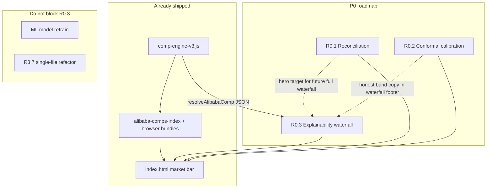

# Roadmap Expansion: Gem Appraise — Comp Explainability Waterfall (R0.3)

## Document Purpose

This document expands **one P0 roadmap item** into a research-backed, implementation-ready specification for **Gem Appraise** (Gem Cost Appraiser IGI).

**Use it when you need to:**

| Audience | How to use this doc |
|---|---|
| **Future LLM** | Start with [Project Context Reconstruction](#project-context-reconstruction) and [Known engine contract](#known-from-input); implement against JSON schemas and acceptance criteria; do not invent fields not in `resolveAlibabaComp`. |
| **Developer** | Follow [Technical Design](#6-technical-design), [Algorithm / Logic](#7-algorithm--logic), and [Testing Plan](#11-testing-plan); wire into `index.html` → `updateMarketBar`. |
| **PM** | Scope via [Phased plan](#combined-implementation-plan) and [Open Questions](#open-questions-for-the-team); v1 is comp-only, not full-stack ML explainability. |
| **Reviewer** | Check [Trust / calibration language](#research-summary) and [Risks](#10-risks-and-tradeoffs) — especially interval and “confidence” claims. |
| **Founder** | Read [Executive Summary](#executive-summary) and [Final Recommended Build Order](#final-recommended-build-order); this is high trust ROI, low modeling cost. |

**Version:** 2026-05-28 · **Item:** R0.3 only · **Related docs:** `research/claude-app-ml-improvement.md`, `research/app-improvement-analysis-2026-05.md`, `research/estimation-algo-improvement-priorities.md`

---

## Input Items

| ID | Priority | Raw roadmap text | One-line expansion |
|---|---|---|---|
| **R0.3** | P0 | Surface the explainability waterfall. The comp engine already returns `primaryComp`/`support`/`rejected`/score components. Render them as a per-result waterfall. Near-zero modeling cost, very high trust payoff. | Add a per-result, progressive-disclosure UI that walks from supplier listing price → deterministic adjustment steps → blend/rejections → comp estimate, using existing `resolveAlibabaComp` output. |

*Note: Roadmap text says `primaryComp`; **known from codebase** the field is `primary` (legacy compat object inside `resolveAlibabaComp` return).*

---

## Executive Summary

### The problem

Gem Appraise helps jewelers estimate **wholesale/fair pricing** for lab-grown IGI diamonds. The app already computes a sophisticated **comp-engine v3** estimate (Alibaba/supplier listings adjusted to the user’s spec), but the **“why” is largely invisible**: adjustment strings hide under listings, blend math sits in a collapsed `<details>`, and rejected comps never appear as structured UI. Meanwhile, the results panel still surfaces **multiple competing numbers** (baseline ladder, ML guess, comp floor, retail band) without a coherent narrative — which erodes trust precisely where the product’s value proposition is “defensible pricing.”

### Why R0.3 matters now

- **Known from input:** Engine already returns everything needed; “near-zero modeling cost.”
- **Strong inference:** This is the fastest P0 trust win independent of R0.1 (reconciliation) and R0.2 (conformal calibration).
- **Highest-risk mistake:** Explaining comp math in a way that sounds like it explains the **hero wholesale number** when that number may come from a different model path.

### How it fits the P0 trio

| Item | Role |
|---|---|
| **R0.1** Reconciliation | One headline estimate |
| **R0.2** Calibrated bands | Honest uncertainty on that headline |
| **R0.3** Explainability waterfall | Transparent **comp path** (and later, a slot for reconciled breakdown) |

### Recommended build order (this item)

1. Engine field audit (browser) → 2. `buildCompWaterfall` pure function + tests → 3. UI expander in `#market-bar` → 4. Blend + rejected sections → 5. Trust copy + instrumentation → 6. Hook to hero “Show the math” when R0.1 lands.

### Highest-risk assumptions

1. **`parts[]` strings remain stable** — UI parses `×1.082` from human-readable lines; engine refactor could break parsing.
2. **Users won’t confuse comp confidence with calibrated coverage** — `confidence: high|medium|low` is match-quality, not “80% interval contains truth.”
3. **Waterfall is comp-scoped in v1** — Full hybrid explanation deferred until R0.1 exists.

---

## Project Context Reconstruction

### Known from Input

- Project is a **pricing / appraisal-adjacent** tool for **IGI lab-grown diamonds** (white + fancy).
- Roadmap item **R0.3** is **P0**, UI-focused, **explainability waterfall**.
- Comp engine returns: **primary**, **support**, **rejected**, **score components** (roadmap wording: `primaryComp` / `support` / `rejected`).
- Intended UX pattern (from sibling docs): *“baseline $X → comps +8% → your color −12% → specialty cut +40% → estimate”* — **full-stack version is aspirational**; v1 must start with **comp adjustments only**.

### Known from Codebase (verified)

| Artifact | Role |
|---|---|
| `index.html` | Single-page app (~5.5k lines); results in `.results`, comp block in `#market-bar` via `updateMarketBar(m)` |
| `research/comp-engine-v3.js` | Canonical comp engine; exported `resolveAlibabaComp`, `loadIndex` |
| `index.html` L875–877 | ES module import: `import { loadIndex, resolveAlibabaComp } from './research/comp-engine-v3.js'` |
| `computeAll(ct)` L1607 | Sets `m.alibabaComp = resolveAlibabaComp(ct)` when comps enabled |
| `renderCompEntry`, `renderBlendBreakdown`, `updateMarketBar` | L2736–2946 — current comp UI |
| `adjustCompToQuery` | Builds `parts[]` adjustment strings (log-space multipliers) |
| `blendComps` | Populates `supportComps` / `rejectedComps`; inverse-variance weights; outlier rejection |
| `SIGMA_CALIBRATION_FACTOR = 2.0` | Inflates blend intervals; `calibrationNote` marks **uncalibrated** |
| Internal critiques | `research/app-improvement-analysis-2026-05.md` §4.4, `research/claude-app-ml-improvement.md` §5.3 |

### Strong Inferences

- **Users:** B2B jewelers / wholesalers / sourcers, not consumers; comfortable with “listing price” vs “adjusted to your stone.”
- **Trust goal:** Reduce “black box” feeling without exposing log-space math or ML internals in v1.
- **R0.1 not shipped yet:** Waterfall anchors on **Alibaba comp block** first; hero `#price-ws` may still reflect a different formula (`computeAll` baseline × modifiers).
- **Production drift risk is reduced** for comps (shared module) but **ML/baseline paths** may still diverge from research code elsewhere in `index.html`.

### Weak Inferences

- Legacy `alibabaComps` array (L1513+) may still influence some UI paths — waterfall should use **`m.alibabaComp` only**.
- PDF export / inventory save (roadmap P3) will want the structured waterfall JSON later.
- Users may want to click through to comp URLs (already partially supported via `renderCompLinks`).

### Open Questions

See [Open Questions for the Team](#open-questions-for-the-team) — material ones include blend-level vs primary-only waterfall, and whether to show `low`/`high` before R0.2.

---

## Research Summary

### 1. Explainability & trust calibration (ML UX)

**What it is:** Explainability is UI/product design that helps users decide **when to rely on** a system vs override it — not merely publishing SHAP plots.

**Why it matters here:** Pricing is high-stakes; wrong trust causes bad buys or ignored good estimates.

**Best practices (cited):**

- **Calibrate trust, don’t maximize trust** — users should know when the system is weak ([Google PAIR — Explainability + Trust](https://pair.withgoogle.com/chapter/explainability-trust/)).
- **Progressive disclosure** — minimum explanation by default; depth on demand ([Institute PM — AI Product Explainability](https://www.institutepm.com/knowledge-hub/ai-product-explainability)).
- **Avoid “trust junk”** — visuals that increase confidence without reflecting model/data quality ([Wall et al., Trust Onion, PACVIS 2024](https://emilywall.github.io/media/papers/TrustOnionPACVIS24.pdf)).
- **Technical charts ≠ better decisions** — SHAP/waterfall-style feature charts often mislead non-experts; user-test before shipping ([Institute PM](https://www.institutepm.com/knowledge-hub/ai-product-explainability)).

**Risks for Gem Appraise:**

| Risk | Mitigation in R0.3 |
|---|---|
| Over-trust in extrapolated comps | `matchType` badges + `warnings` in panel header |
| False causal attribution | Label “Comp listing adjustments”; disclaimer on ML/baseline |
| Score components read as $ breakdown | Separate “Advanced: match quality” — not dollar steps |

---

### 2. Pricing transparency & disclosure-first UI

**What it is:** Show **total (or estimate) early**, then itemized components with plain language ([fee disclosure patterns](https://botgallery.co.uk/designing-ai-fee-disclosures-a-prompt-and-ui-pattern-for-tru)).

**Why it matters here:** Sellers reconcile mentally against “factory list + adjustments,” not against abstract model scores.

**Best practices:**

- **Structured disclosure layer** — policy-controlled fields, not LLM-improvised fee text ([AI pricing transparency layer blueprint](https://askqbot.com/how-to-build-an-ai-pricing-transparency-layer-for-customer-f)).
- **Mandatory vs optional vs estimated** labels on each line.
- **Live breakdown** when inputs change ([transparent calculator pattern](https://www.sitepoint.com/stop-guessing-why-transparent-pricing-calculators-are-the-future-of-web-agencies/)).

**Application:** R0.3 is exactly a **structured disclosure layer for the comp engine** — engine emits fields; UI renders approved copy.

---

### 3. Waterfall charts for price build-up

**What it is:** Sequential steps from a **start value** (listing) to **end value** (adjusted estimate), showing intermediate multipliers or deltas.

**Why it matters here:** `parts[]` is already an ordered list of multiplicative adjustments in log-space (`carat total ×1.082`, `color ×0.912`, …).

**Best practices (general BI + product):**

- Cap at **~10–15 steps**; collapse immaterial lines.
- Show **running total** after each material step.
- Use consistent visual semantics for up/down (not red/green “good/bad” for wholesale — neutral for adjustments).
- **Multiplicative chain:** prefer showing `×1.08` **and** approximate `$ delta` with footnote “steps multiply, not add.”

**Pitfall:** Treating multiplicative comp adjustments as **additive percentages** that sum to 100% — mathematically wrong and legally/reputationally risky.

---

### 4. Uncertainty, intervals, and “confidence” (strict separation)

Gem Appraise mixes several concepts that **must not be conflated in copy**:

| Concept | Source today | User-facing name (recommended) |
|---|---|---|
| **Point estimate** | `ac.estimate`, `primary.estimatedPrice` | “Adjusted comp price” / “Blended estimate” |
| **Heuristic interval** | `blendComps` → `low`/`high` with `SIGMA_CALIBRATION_FACTOR` | “Approximate range (uncalibrated)” until R0.2 |
| **Match quality** | `ac.confidence` from `compErrorScore` | “Match: High / Medium / Low” — **not** “80% confident” |
| **Empirical coverage** | Not yet measured in production UI | Only after R0.2 holdout + conformal — “80% of holdout prices fell in this band” |
| **Model σ (log-space)** | `sigmaLog`, `scoreComponents` | Hide or “Advanced” — drives weights, not dollars |

**Research (conformal prediction):**

- Marginal **coverage ≠ user-trustworthy** if intervals are unstable or gameable ([arXiv:2601.21455 — coverage-length pitfalls](https://arxiv.org/html/2601.21455v1)).
- Prefer **bands + plain buckets** over false precision ([Probabilistic UI patterns](https://github.com/sinhaankur/Probabilistic-UI); [confidence UI patterns](https://agentic-design.ai/patterns/ui-ux-patterns/confidence-visualization-patterns)).

**Engine honesty (known from code):** `calibrationNote: intervals_sigma_inflated_2x_uncalibrated` — UI must **not** say “80% confidence interval” without empirical validation.

---

### 5. Comparable product patterns

| Pattern | Example behavior | Gem Appraise mapping |
|---|---|---|
| Progressive “Why?” | Stripe Radar, credit estimators | Collapsed “How this comp price was calculated” |
| Itemized fees | Checkout tax/shipping breakdown | `parts[]` steps |
| Source count | “Based on 12 listings” | `supportComps.length` + rejected count |
| Weak match warning | “Estimate — few comparables” | `matchType: best_available` + warnings |

---

## Dependency Map



### Required order

| Step | Depends on | Delivers |
|---|---|---|
| 1. Contract audit | `comp-engine-v3.js` stable | Field checklist |
| 2. `buildCompWaterfall` | Audit | Testable JSON |
| 3. UI expander | Mapper | User-visible v1 |
| 4. Blend/rejected UI | v1 | Complete comp story |
| 5. Analytics | UI | `comp_waterfall_open` events |

### Parallelizable

- R0.2 calibration work (different code path; coordinate copy only).
- Accessibility pass (use `<button>` + `aria-expanded` from day one).
- Golden comp regression tests in Node (already exist in engine CLI).

### Do not build yet

- Full baseline → ML → comp **reconciled** waterfall (needs R0.1 spec).
- SHAP / tree-path ML explainability (needs model registry + calibration).
- “80% confidence” marketing language (needs R0.2 empirical coverage).

### Failure modes if order is wrong

| If you… | Then… |
|---|---|
| Ship waterfall without `matchType` labels | Users treat extrapolation as factory floor |
| Parse `parts[]` without tests | Silent UI drift when engine copy changes |
| Show `scoreComponents` as % of price | False precision lawsuits / lost trust |
| Claim calibrated intervals pre-R0.2 | Misleading defensibility |

---

## Roadmap Items

---

## [P0] R0.3 — Surface the Explainability Waterfall

### 1. Plain-English Goal

When a seller sees a comp-based price in the market bar, they can expand **“How this comp price was calculated”** and see:

1. Which **supplier listing** anchored the estimate (price as captured).
2. Each **adjustment** applied to match their stone (carat, color, clarity, shape, modifiers).
3. How **multiple comps blended** (weights) and which were **excluded** (outliers).
4. The **final comp estimate** aligned with what the bar already shows.

No new ML training. No new comp data. **Render what `resolveAlibabaComp` already returns.**

---

### 2. Why This Matters

| Stakeholder | Benefit |
|---|---|
| **Seller** | Understands why their 2.01ct pear costs more than the 1.89ct listing they saw on Alibaba |
| **Product** | Closes the #1 UX gap cited in internal audits (no per-result “why”) |
| **Engineering** | Forces a stable `explainability` JSON contract for future PDF/export/API |
| **ML team** | Frees R0.1/R0.2 to focus on numbers; comp path stays explainable even before reconciliation |

**Quantified opportunity (weak inference):** Internal docs classify this as “highest user-perceived value” among P0 UI items with “near-free” cost (`research/app-improvement-analysis-2026-05.md`).

---

### 3. Current Problem / Failure Mode

#### User-facing

| Symptom | Root cause in UI |
|---|---|
| “Where did this number come from?” | Only headline price visible; steps hidden |
| Missed adjustments | `comp-mod` footnote easy to overlook |
| “Why isn’t my listing in the average?” | `rejectedComps` not rendered |
| Distrust of blend | “Show blend math” collapsed by default |
| Confusion across cards | Baseline / ML / comp shown without unified story |

#### Technical

```2736:2784:index.html
function renderCompEntry(entry, isAlt) {
  // ...
  if (modifiers && modifiers.parts && modifiers.parts.length) {
    modHtml = `<div class="comp-mod">${modifiers.parts.map(escapeHTML).join(' · ')}</div>`;
  }
}
function renderBlendBreakdown(ac) {
  const comps = (ac.supportComps || []).filter(c => c && c.row && Number.isFinite(c.sigmaLog));
  // weights recomputed in UI: w_i = 1 / (sigmaLog_i^2 + 1e-4)
}
```

- **Duplication:** `primary.modifiers.parts` vs `supportComps[i].parts`.
- **Drift risk:** UI recomputes blend weights; engine has `sourceConcentration` not shown in blend UI.
- **No structured artifact** for downstream features.

#### Engine-side (working correctly, underutilized)

```1682:1695:research/comp-engine-v3.js
    supportComps: acceptedOrdered.map(adj => ({
      row: adj.row,
      score: adj.score,
      scoreComponents: adj.scoreComponents,
      logEstimate: adj.logEstimate,
      sigmaLog: adj.sigmaLog,
      estimatedPrice: Math.round(Math.exp(adj.logEstimate)),
      parts: adj.parts,
    })),
    rejectedComps: blend.rejected.map(adj => ({
      row: adj.row,
      reason: adj.rejectReason,
      estimatedPrice: Math.round(Math.exp(adj.logEstimate)),
    })),
```

---

### 4. Research Background

Covered in [Research Summary](#research-summary). Item-specific takeaways:

1. **This is deterministic explainability** (explicit multipliers), not post-hoc ML attribution — aligns with `research/estimation-algo-improvement-priorities.md` Phase 5 direction while shippable earlier **if scoped to comps**.
2. **Progressive disclosure is mandatory** — do not dump 12 steps + σ tables on every calc.
3. **Pair explainability with match quality + warnings**, not fake probability.

---

### 5. Product Behavior

#### Information architecture

```
#market-bar
├── Headline (existing): "Alibaba factory floor" / "Closest comps — weighted blend $X"
├── Primary row (existing): renderCompEntry(primary)
├── [NEW] <button> How this comp price was calculated </button>
│   └── Panel (expanded)
│       ├── Header: matchType chip + confidence chip + comp counts
│       ├── Warnings strip (from ac.warnings)
│       ├── Tab/section A: Primary adjustment waterfall
│       ├── Tab/section B: Blend table (if N>1)
│       ├── Section C: Excluded comps (rejectedComps)
│       ├── Section D (optional): Other factories (otherFactoryExact) — not in blend
│       └── Footer disclaimer + interval note (uncalibrated until R0.2)
├── Supplier comparisons (existing)
└── Footnote (existing)
```

#### UI copy matrix (trust-safe)

| Engine state | Chip | Subtitle |
|---|---|---|
| `matchType: exact` | `Exact match` | Lowest matched listing at this spec |
| `matchType: nearest` | `Nearest comps` | Weighted blend of close listings |
| `matchType: best_available` | `Weak match` | Extrapolated — treat as rough guide |
| `matchType: none` | — | No waterfall |
| `confidence: high` | `Match quality: High` | Never “95% confident” |
| `confidence: low` | `Match quality: Low` | Suggest verifying with supplier |

**Interval footnote (pre-R0.2):**  
*“Range shown is a model spread, not a calibrated market forecast. Width may not match real-world hit rates.”*

**Interval footnote (post-R0.2):**  
*“80% interval: on holdout stones, X% of realized prices fell inside this band.”* (Only with measured X.)

#### Edge cases

| Case | Behavior |
|---|---|
| `parts.length === 0` && prices equal | Single-step “Listing already matches your spec” |
| `supportComps.length === 1` | Hide blend table; note “Single comp” |
| `rejectedComps.length > 0` | Always list with `reason` |
| `blend.rejected` but warnings only | Prefer structured list over prose warning |
| Fancy `model unknown` in parts | Amber badge on carat fallback step |
| `localCaratCurve.mode === prior_only` | Info line: “Carat scaling uses market prior (limited local data)” |
| Index not loaded | Disabled button + “Loading comp data…” |

#### Hidden from users

- `logEstimate`, `sigmaLog`, `SCORE_HARD_CUTOFF`, `SIGMA_CALIBRATION_FACTOR`
- Raw `score` float (use bands if ever shown)
- Internal `supplierKey` normalization

---

### 6. Technical Design

#### Integration point

```javascript
// index.html — extend updateMarketBar(m)
const ac = m.alibabaComp;
// ... existing headline HTML ...
html += renderCompWaterfallPanel(ac);  // NEW: collapsed by default
```

#### Example output JSON (`buildCompWaterfall`)

```json
{
  "version": 1,
  "matchType": "nearest",
  "confidence": "medium",
  "warnings": ["Carat 2.01ct is above the local comp range (1.5–1.9ct). Extrapolation uncertainty is high."],
  "primaryWaterfall": {
    "listingPrice": 4200,
    "estimatedPrice": 4890,
    "steps": [
      { "id": "listing", "label": "Supplier listing (as captured)", "runningPrice": 4200 },
      { "id": "carat", "label": "Carat adjustment", "multiplier": 1.082, "raw": "carat total ×1.082 (...)", "runningPrice": 4544 },
      { "id": "color", "label": "Color adjustment", "multiplier": 0.912, "raw": "color ×0.912 (G vs H)", "runningPrice": 4144 },
      { "id": "final", "label": "Adjusted price for your stone", "runningPrice": 4890, "reconciliationCents": 746 }
    ],
    "reconciliationNote": "Rounding and price basis may explain small difference from step product."
  },
  "blend": {
    "method": "inverse_variance",
    "finalEstimate": 4890,
    "accepted": [
      { "spec": "1.89ct pear VS1 G", "estimatedPrice": 4720, "weightPct": 62, "supplier": "messi" },
      { "spec": "2.00ct pear VS2 G", "estimatedPrice": 5100, "weightPct": 38, "supplier": "starsgem" }
    ],
    "rejected": [
      { "spec": "1.50ct pear VS1 F", "estimatedPrice": 6200, "reason": "outlier: deviation 0.312 > 2.5×σ(0.098)" }
    ]
  },
  "meta": {
    "source": "comps-index-v3",
    "localCaratCurveMode": "shrunk_extrapolated",
    "sourceConcentration": { "dominated": false }
  }
}
```

#### TypeScript contract (recommended)

```typescript
type WaterfallStep = {
  id: string;
  label: string;
  multiplier?: number;
  raw?: string;
  runningPrice: number;
  qualitative?: boolean;
};

type CompWaterfallV1 = {
  version: 1;
  matchType: 'exact' | 'nearest' | 'best_available' | 'none';
  confidence: 'high' | 'medium' | 'low' | null;
  warnings: string[];
  primaryWaterfall: {
    listingPrice: number;
    estimatedPrice: number;
    steps: WaterfallStep[];
    reconciliationNote?: string;
  } | null;
  blend: {
    method: 'inverse_variance';
    finalEstimate: number;
    accepted: Array<{ spec: string; estimatedPrice: number; weightPct: number; supplier: string }>;
    rejected: Array<{ spec: string; estimatedPrice: number; reason: string }>;
  } | null;
  meta: Record<string, unknown>;
};
```

#### Module placement

| Phase | Location |
|---|---|
| v1 | Inline in `index.html` next to `renderBlendBreakdown` |
| v2 | `research/comp-waterfall.js` imported by app + Node tests |
| v3 | Engine-native `explainability` on `resolveAlibabaComp` return |

#### Optional engine enhancement (non-breaking)

```javascript
// Add to resolveAlibabaComp return:
explainability: {
  primarySteps: [...],  // structured, not string-parsed
  blendWeights: number[], // parallel to supportComps
}
```

#### Observability

| Event | Payload |
|---|---|
| `comp_waterfall_open` | `{ matchType, confidence, nSupport, nRejected, shape, colorFamily }` |
| `comp_waterfall_tab` | `{ tab: 'primary' \| 'blend' \| 'advanced' }` |
| `comp_waterfall_reconcile_warning` | `{ deltaUsd }` when step product ≠ estimate |

Log via `console.debug` in dev; optional `localStorage` ring buffer for field debugging.

---

### 7. Algorithm / Logic

#### A. Parse `parts[]` into steps

```text
INPUT: listingPrice P0, parts[], targetPrice Pfinal
steps = [{ id:'listing', label:'Supplier listing', runningPrice:P0 }]
running = P0
FOR raw IN parts:
  m = match(raw, /×([0-9.]+)/)   // first multiplier in string
  IF m:
    running = round(running * m)
    steps.push({ label: axisFromPrefix(raw), multiplier:m, raw, runningPrice:running })
  ELSE:
    steps.push({ label: raw, qualitative:true, runningPrice:running })
delta = |running - Pfinal|
IF delta > max(2, 0.01*Pfinal):
  steps.push({ id:'reconcile', label:'Rounding / listing basis', runningPrice:Pfinal })
OUTPUT steps
```

`axisFromPrefix`: leading token before `×` → `carat`, `color`, `clarity`, `shape`, `modifier`, `intensity+carat`.

#### B. Blend weights (must match engine)

From `blendComps` (`research/comp-engine-v3.js`):

```text
medianLog = median(logEstimate_i)
ACCEPT i if |logEstimate_i - medianLog| <= 2.5 * sigmaLog_i  (else REJECT)
w_i = 1 / (sigmaLog_i² + ε)
Apply supplier cap → weights may scale down dominant supplier
logEstimate_blend = Σ w_i logEstimate_i / Σ w_i
estimate = round(exp(logEstimate_blend))
```

**UI rule:** Either import weights from engine export, or **document** that displayed weights are `1/σ²` uncapped when `sourceConcentration.capApplied === false`.

#### C. Score drivers (advanced only)

```text
INPUT scoreComponents { eCarat, eColor, eClarity, eShape, eSource, eBand }
maxE = max(components)
FOR each component:
  barPct = component / maxE   // relative only
DISPLAY as "Match uncertainty drivers" NOT "Price impact"
```

---

### 8. Acceptance Criteria

**Functional**

- [ ] Expander visible iff `ac.matchType !== 'none'` && `ac.primary` exists.
- [ ] Waterfall listing price === `ac.primary.listingPrice` (or first support comp if primary missing listing).
- [ ] Final waterfall price within **$2 or 0.5%** of `primary.estimatedPrice` (exact path) or `ac.estimate` (blend path), else show reconciliation note.
- [ ] Blend section lists all `supportComps` with weights summing to **100% ±1**.
- [ ] Rejected section lists all `rejectedComps` with `reason`.
- [ ] All `ac.warnings` visible in panel when non-empty.
- [ ] No use of “80% confidence”, “guaranteed”, “fair market value”, “accurate” without calibration footnote.

**Non-functional**

- [ ] Render < 16ms for ≤ 8 comps (no chart library).
- [ ] XSS: all text through `escapeHTML`.
- [ ] Keyboard: expander is `<button type="button" aria-expanded aria-controls="comp-waterfall-panel">`.

**Regression**

- [ ] Collapsed state: `updateMarketBar` output matches pre-feature headline prices.
- [ ] Existing `renderSupplierComparisonBlock` unchanged.

---

### 9. Metrics to Track

| Metric | Type | Target (initial) |
|---|---|---|
| `comp_waterfall_open` rate | Product | Baseline; aim >15% of comp sessions after 30d |
| Time-to-open after result | Product | Median < 10s |
| Reconciliation warning rate | Quality | <5% of opens (else fix parser) |
| Support themes “don’t understand comp” | Qualitative | Downward trend |
| JS errors in waterfall | Reliability | Zero in production |
| Misclick: comp vs hero price | Risk | Track if hero link added post-R0.1 |

---

### 10. Risks and Tradeoffs

| Risk | Likelihood | Impact | Mitigation |
|---|---|---|---|
| **Additive misunderstanding** | Medium | High | Copy + “steps multiply” |
| **String parsing fragility** | Medium | Medium | Golden tests; structured engine steps in v2 |
| **UI/engine weight drift** | Low | Medium | Export `blendWeights` from engine |
| **Trust junk** (pretty UI, weak comps) | Medium | High | `best_available` styling; warnings first |
| **Scope creep to ML SHAP** | Medium | Medium | Explicit out-of-scope in ticket |
| **Maintenance in 5.5k line HTML** | High | Low | Extract module in Phase 2 |

**Tradeoff accepted:** v1 parses human `parts[]` strings instead of waiting for engine structured steps — **ships faster**, pays tech debt later.

---

### 11. Testing Plan

#### Unit tests (`buildCompWaterfall`)

| Case | Input | Assert |
|---|---|---|
| Empty parts | `P0=1000, parts=[], Pfinal=1000` | 1 step |
| Single carat | one `carat total ×1.10` | running 1100 |
| Multi-part | carat + color | order preserved |
| Bad string | no `×` | qualitative step, no throw |
| Reconcile | product ≠ Pfinal by $50 | reconciliation step |

#### Integration

- Run `resolveAlibabaComp` on golden queries from comp-engine CLI; snapshot `buildCompWaterfall` JSON.
- Compare UI weights to manual `1/σ²` calc for 3 fixtures.

#### Manual QA (pinned scenarios)

1. White round ~2ct G VS1 — nearest or exact  
2. Fancy pink vivid pear — intensity+carat line  
3. `best_available` with warning wall  
4. 2+ comps + 1 rejected outlier  
5. Mobile 375px — no horizontal scroll on steps  
6. Keyboard-only expand/collapse  

#### Regression

- Visual diff market bar (collapsed) before/after  
- `npm`/`node research/comp-engine-v3.js` test cases still pass (unaffected)

---

### 12. Future Extensions

| Extension | Depends on |
|---|---|
| Structured `explainability` from engine | Engine PR |
| Hero-linked “Show the math” | R0.1 |
| Calibrated band on final step | R0.2 |
| Reconciled multi-source waterfall | R0.1 + meta-model spec |
| PDF / inventory export of waterfall | P3 inventory |
| ML tree path / monotonic GBM attributions | R1.1 + calibration |
| A/B copy test on expander label | Analytics |

---

## Combined Implementation Plan

### Phase 1 — MVP (S, 1–2 dev-days)

**Scope:** Primary waterfall from `primary.modifiers.parts`; expander; matchType/confidence chips; disclaimer.  
**Dependencies:** None beyond existing engine.  
**Avoid:** Chart libraries, ML steps, scoreComponents UI.

### Phase 2 — Correct blend story (S–M, 2–3 days)

**Scope:** Blend table, rejected list, warnings strip; reconcile step handling; unit tests.  
**Dependencies:** Phase 1.  
**Avoid:** Engine fork; cap logic reimplementation without tests.

### Phase 3 — Polish (M, 3–5 days)

**Scope:** `comp-waterfall.js` module; advanced score drivers; `otherFactoryExact` section; a11y; hero anchor hook.  
**Dependencies:** Phase 2; soft dependency R0.1 for hero link.  
**Avoid:** PDF export.

### Phase 4 — Advanced (L, 1–2 weeks)

**Scope:** Engine-native structured steps; reconciled waterfall; calibrated interval copy; CI snapshot tests.  
**Dependencies:** R0.1, R0.2, optional R3.7 refactor.  
**Avoid:** SHAP until model registry exists.

---

## Final Recommended Build Order

1. **Browser audit** — `console.log(resolveAlibabaComp(q))` for 3 stones; confirm `parts`, `rejectedComps`, `scoreComponents`.
2. **`buildCompWaterfall` + unit tests** — pure functions, no DOM.
3. **`renderCompWaterfallPanel`** — collapsed in `updateMarketBar`.
4. **Blend + rejected sections** — remove duplicate `renderBlendBreakdown` or merge.
5. **Trust copy review** — especially intervals and “confidence”.
6. **Golden manual QA** — align with engine CLI pinned cases.
7. **Instrumentation** — `comp_waterfall_open`.
8. **R0.1 integration** — single “Show the math” entry point.

---

## Open Questions for the Team

1. **Primary-only vs synthesized blend waterfall** when `matchType === 'nearest'`?
2. Show **dollar deltas**, **multipliers only**, or both per step?
3. **Deprecate inline `comp-mod`** when panel exists?
4. Export **`blendWeights`** from engine now vs UI recompute?
5. Display **`low`/`high`** in panel pre-R0.2 — yes with warning, or hide?
6. **`scoreComponents`**: never, advanced tab, or internal-only?
7. Should exact-match multi-factory **`otherFactoryExact`** appear inside waterfall or stay separate (current supplier block)?

---

## Rollout Plan

| Stage | Audience | Action |
|---|---|---|
| **Dev** | Team | Feature flag `?waterfall=1` or localStorage `ga.waterfall=1` |
| **Beta** | Power users | Enable by default; collect open-rate |
| **GA** | All | On by default; collapsed |
| **Rollback** | — | Hide panel via flag without removing mapper (keep tests) |

---

## Copy/Paste Ticket Versions

### R0.3 — Comp explainability waterfall

**Title:** P0: Per-result comp calculation waterfall (“How this price was calculated”)

**Background:**  
Comp engine v3 returns `primary`, `supportComps`, `rejectedComps`, and per-comp `parts` / `scoreComponents`, but the UI only shows fragmented footnotes. Sellers need a transparent adjustment ladder to trust comp-based estimates. Identified in `research/app-improvement-analysis-2026-05.md` and `research/claude-app-ml-improvement.md` as P0 R0.3.

**Scope:**
- `buildCompWaterfall(ac)` → structured JSON
- Collapsed panel in `#market-bar` via `updateMarketBar`
- Steps: listing → `parts[]` adjustments → final; blend weights; rejected comps with reasons
- Match quality chips (`matchType`, `confidence`); surface `warnings`
- Trust-safe copy (no calibrated “80%” claims until R0.2)
- Unit tests for parser; manual golden cases

**Out of scope:** ML attribution, reconciled baseline+ML waterfall (R0.1), conformal calibration (R0.2)

**Acceptance criteria:** See [§8](#8-acceptance-criteria).

**Notes:** Field name is `primary` not `primaryComp`. Prefer `<button>` + ARIA. Consider engine `blendWeights` export follow-up.

---

## References

| Topic | Source |
|---|---|
| Trust calibration & explainability | [Google PAIR — Explainability + Trust](https://pair.withgoogle.com/chapter/explainability-trust/) |
| Progressive disclosure / anti-patterns | [Institute PM — AI Product Explainability](https://www.institutepm.com/knowledge-hub/ai-product-explainability) |
| Trust junk | [Wall et al., Trust Onion, 2024](https://emilywall.github.io/media/papers/TrustOnionPACVIS24.pdf) |
| Pricing disclosure | [BotGallery fee disclosure](https://botgallery.co.uk/designing-ai-fee-disclosures-a-prompt-and-ui-pattern-for-tru); [AskQbot transparency layer](https://askqbot.com/how-to-build-an-ai-pricing-transparency-layer-for-customer-f) |
| Confidence UI buckets | [Probabilistic UI (GitHub)](https://github.com/sinhaankur/Probabilistic-UI) |
| Conformal pitfalls | [arXiv:2601.21455](https://arxiv.org/html/2601.21455v1) |
| Project engine | `research/comp-engine-v3.js` |
| Project UI | `index.html` (`updateMarketBar`, `renderCompEntry`, `renderBlendBreakdown`) |

---

*End of document.*
