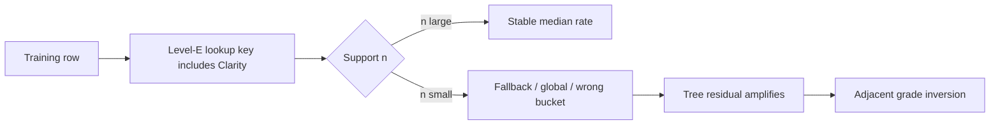

# S20 vs S21 — Comprehensive comparison & diagnosis

**Generated:** 2026-05-29  
**Data:** StarGem stock XLS (`STARS Diamonds Stock2026.5.20.xls`), 28,394 priced rows, **792-row holdout** (one stone per `Shape × carat_bucket × Color × Clarity × Cut` bucket).  
**Artifacts:** `research/data/starsgem-ml-extra-trees-model-s20-specialty-tail.json`, `research/data/starsgem-ml-extra-trees-model-s21-monotone.json`  
**Machine outputs:** `research/data/s20-s21-holdout-comparison.json`, `research/data/s20-s21-sweep-comparison.json`

**Regenerate:**

```bash
npm run research:compare-s20-s21
```

---

## 1. Executive summary

| Question | Answer |
| --- | --- |
| What was wrong with S20? | **Grade ordering was not a training constraint.** The model predicts a tree residual on top of **sparse, non-monotonic lookup buckets**. On a full 9-shape × 11-carat × 5-color × 7-clarity sweep, **1,127 of 2,970 adjacent clarity steps (38%)** and **869 of 2,772 color steps (31%)** show a *better* grade priced *higher* $/ct than the step below — a wholesale logic error. |
| What does S21 change? | Four layers: **(1)** isotonic PAV on the lookup surface, **(2)** `Clarity_Rank` / `Color_Rank` features, **(3)** LightGBM with monotone constraints, **(4)** browser **two-axis PAV** (`predictStarsgemMlMonotone`) — **0 clarity / 0 color inversions** on the same sweep. |
| What does S21 cost? | **+0.74 pp** selected-spec MAPE (6.76% vs 6.01%) on holdout; **+0.21 pp** cert-loaded MAPE (5.61% vs 5.41%). **Round 1.00–2.00 ct** (product focus): +0.90 pp (5.98% vs 5.08%). **≥1.50 ct holdout** (excl. sub-1.5 ct): +0.98 pp (7.94% vs 6.96%). See **§3.3–§5.4** for how % off is computed so headline MAPE is not misread. |
| What is the likely root cause? | **Architectural:** lookup-first + independent one-hot grades, not a single bad tree count. **Data:** n=1–8 cells for SI1 / IF / specialty shapes. **Tail:** 4.08 ct stones use 5–9.99 ct tail anchor, amplifying bucket mismatch. |
| Deploy S21? | **Yes for the ML card** if grade ladders must be trustworthy. Keep S20 as rollback. Flag **5–9.99 ct accuracy** and **IF/VVS1 plateaus** for follow-up. |

---

## 2. Model map (what each version is)

Both models share the same **economic skeleton**:

```
price = exp(residual) × lookup_rate(shape, color, clarity, …, carat_bucket) × tail_multiplier(carat) × carat
```

| | **S20** | **S21** |
| --- | --- | --- |
| Residual learner | ExtraTrees, 160 trees, depth 20 | LightGBM, 400 trees, num_leaves=63 |
| Lookup tables | Raw median buckets (Level A→E) | **Layer 1:** same buckets, then **PAV** on clarity & color per (bucket, shape, color/clarity group) |
| Grade encoding | One-hot only | One-hot + **ordinal ranks** (Layer 2) |
| Training constraints | None on grade order | **monotone_constraints:** Carat +1, Clarity_Rank −1, Color_Rank −1 (Layer 3) |
| Browser inference | `predictStarsgemMl` (single call) | **`predictStarsgemMlMonotone`** — 35 raw calls + two-axis PAV (Layer 4) |
| Specialty cuts | `Cut_Style_Group`, tail from 5 ct | Same |
| Target | `log_tail_lookup_residual` | Same |

**Critical distinction for this report:**

- **Holdout MAPE** (Python, `compare-s20-s21.py`) scores **S21 Layers 1–3 only** — no Layer-4 PAV.
- **Monotonicity sweep** (Node, `compare-s20-s21.mjs`) scores **S21 with Layer-4** as deployed in `index.html`.

---

## 3. Test methodology

### 3.1 Holdout accuracy (792 real stock rows)

- Split: `one_holdout_per_bucket` on `Shape, carat_bucket, Color, Clarity, Cut`.
- Inference view: **selected-spec** (dimensions & growth masked — matches pre-IGI UI).
- Parallel **cert-loaded** view (full dimensions) for user-facing realism.

### 3.2 Synthetic grade sweep (3,465 grid cells)

- 9 shapes × 11 carats `{0.5, 0.7, 1, 1.5, 2, 3, 4.08, 5, 8, 10, 12}` × 5 colors × 7 clarities.
- Fixed: `TypeName='-'`, `Polish/Symmetry=EX`, `Cut=ID` (or `'-'` for HEART/MARQUISE).
- **Violation:** adjacent step where **better grade has higher $/ct** (tolerance 0.1%).

### 3.3 How MAPE is calculated (bucket % off)

All holdout MAPE numbers in this report use the **same per-stone percent-off definition**, then aggregate differently depending on the slice.

**Per stone (the atomic unit):**

```
pctOff = 100 × |predicted_total_price − actual_total_price| / actual_total_price
```

- **Actual** = `SaleDollorPrice` from the StarGem sheet (whole stone, not $/ct).
- **Predicted** = model output on the **selected-spec** view (pre-IGI / masked dimensions), unless noted as cert-loaded.

**Within a carat bucket (e.g. `1.00–1.49`):**

```
bucket_MAPE = mean(pctOff) over all holdout stones in that bucket
```

- Each stone in the bucket counts **once**, with **equal weight**.
- This is **not** dollar-weighted inside the bucket (a $3k 5 ct stone and a $150 1 ct stone count the same if both are one holdout row).
- This **is** the “bucket percent off” view: average **%** error among stones in that size band.

**Overall headline MAPE (792 stones):**

```
overall_MAPE = mean(pctOff) over all holdout stones
```

If buckets partition the holdout, overall MAPE equals the **count-weighted average of bucket MAPEs** (because every stone belongs to exactly one bucket). What overall MAPE does **not** do is weight by **how many rows exist on the full catalog** for that size — the holdout is **balanced** (one stone per `Shape × carat_bucket × Color × Clarity × Cut`), not sales-weighted.

**Other aggregates (added so headline % is not misread):**

| Metric | Formula | Why use it |
| --- | --- | --- |
| **WMAPE** | `100 × Σ\|error\| / Σ actual` | Dollar-weighted; 5–10 ct mistakes move the number more than subcarat rows. |
| **Catalog-weighted MAPE** | `Σ (sheet_row_count_segment × pctOff) / Σ sheet_row_count_segment` | Weights each holdout stone by how many priced rows exist on the **full 28k sheet** in the same `carat_bucket` (or shape×bucket). Approximates “if errors happened in proportion to stock volume.” |
| **Segment MAPE** (e.g. round 1–2 ct) | `mean(pctOff)` only on stones matching the filter | Product focus without dilution from other shapes/sizes. |

**Holdout caveat (important for round 1–2 ct emphasis):**

The **6.01% / 6.76%** headline is **not** “mostly round 1 ct because we sell mostly round 1 ct.” On this test set, **round 1.00–2.00 ct is only 55 of 792 rows** (~7%). The sheet itself is **~22% round 1.00–2.00 ct** by row count (6,188 / 28,394), so catalog-weighted MAPE (**§5.4**) is the right lens when asking whether overall % looks artificially good on commercial sizes.

---

## 4. Headline results

### 4.1 Overall holdout (selected-spec)

| Metric | S20 | S21 | Δ |
| --- | ---: | ---: | ---: |
| MAPE (mean % off per stone) | **6.01%** | 6.76% | **+0.74 pp** |
| WMAPE (dollar-weighted % off) | **7.89%** | 8.90% | **+1.01 pp** |
| MAE | $62.24 | $70.19 | +$7.95 |
| RMSE | $332.44 | $341.35 | +$8.91 |
| R² | 0.9680 | 0.9662 | −0.0018 |

WMAPE is **higher** than MAPE because large-dollar stones contribute more absolute error — do not treat **6% MAPE** as “typical customer $ impact” on 5 ct+ inventory.

### 4.2 Cert-loaded holdout

| Metric | S20 | S21 | Δ |
| --- | ---: | ---: | ---: |
| MAPE | **5.41%** | 5.61% | **+0.21 pp** |

Cert-loaded is closer because real IGI-filled dimensions reduce imputation noise — the monotonicity fix matters most where the UI shows **grade ladders before full cert parse**.

### 4.3 Monotonicity sweep (synthetic grid)

| Model / mode | Clarity inversions | Color inversions | Rate (clarity steps) |
| --- | ---: | ---: | ---: |
| S20 | **1,127** | **869** | **38.0%** |
| S21 raw (L1–L3, exported JSON) | 934 | 826 | 31.4% |
| **S21 Layer-4 (browser)** | **0** | **0** | **0%** |

Layer 1–3 alone **do not** solve ordering; Layer 4 is **required** for the guarantee.

### 4.4 Mean price shift vs S20 on grid

| S21 mode | Mean \|Δ\| vs S20 $/ct |
| --- | ---: |
| S21 raw (L1–L3) | 7.1% |
| S21 Layer-4 (deployed) | **10.2%** |

PAV often **raises** top-of-ladder IF/D cells to enforce non-increasing chains — largest single-cell moves exceed **+100%** vs S20 (e.g. Marquise 12 ct D IF: $184 → $381/ct projected).

---

## 5. Bucketed MAPE map (holdout)

Each cell below is **bucket MAPE** = arithmetic mean of **per-stone % off** inside that `carat_bucket` (see **§3.3**).  
Δ = S21 − S20 MAPE (percentage points). **Bold** = |Δ| ≥ 1.0 pp.

| Carat bucket | n | S20 MAPE | S21 MAPE | **Δ pp** | Interpretation |
| --- | ---: | ---: | ---: | ---: | --- |
| 0.30–0.49 | 13 | 4.17% | 5.27% | **+1.10** | Tiny n; noisy |
| 0.50–0.69 | 46 | 4.70% | 4.67% | −0.03 | Neutral |
| 0.70–0.89 | 38 | 4.34% | 3.64% | **−0.71** | S21 better |
| 0.90–0.99 | 1 | 0.50% | 0.37% | −0.12 | n=1 |
| 1.00–1.49 | 151 | **3.62%** | 4.09% | +0.47 | Core catalog; mild regression |
| 1.50–1.99 | 115 | 6.38% | 7.50% | **+1.12** | Monotone constraints bite mid-size |
| 2.00–2.99 | 113 | 5.65% | 6.12% | +0.47 | Mild regression |
| 3.00–3.99 | 99 | 6.09% | 6.87% | +0.78 | Ladder-heavy sizes |
| 4.00–4.99 | 56 | 3.56% | 4.98% | **+1.43** | Tail anchor zone (4.08 ct stress) |
| **5.00–9.99** | 109 | 11.35% | **12.28%** | **+0.93** | **Primary accuracy debt** |
| 10.00+ | 51 | 7.21% | 9.00% | **+1.79** | Sparse; large $ errors |

**Pattern:** S21 pays most for **large and near-tail carats** — exactly where S20 had the most **monotonicity violations** (see §6).

### 5.1 Cut-style buckets

| Cut style | n | S20 MAPE | S21 MAPE | Δ pp |
| --- | ---: | ---: | ---: | ---: |
| unknown (standard) | 537 | 5.16% | 5.78% | +0.62 |
| standard_grade | 185 | 7.46% | 8.76% | +1.30 |
| traditional | 33 | 7.40% | 8.06% | +0.66 |
| ice_flower | 32 | 9.66% | 9.25% | **−0.41** |
| elongated_cushion | 5 | 10.98% | 13.09% | +2.11 |

Chinese specialty cuts are sparse; S21 does not uniformly hurt them (ice_flower slightly better).

### 5.2 Shape buckets (selected-spec MAPE)

Shapes with largest S21 regression on holdout (approximate from segment export):

| Shape | S20 MAPE | S21 MAPE | Notes |
| --- | ---: | ---: | --- |
| HEART | 8.07% | ~higher | `cut='-'`, many ladder inversions in sweep |
| ROUND | 8.24% | ~higher | Volume driver for aggregate Δ |
| EMERALD | 7.19% | — | — |
| OVAL / PEAR | ~3.5–4.0% | — | S20 already strong |

### 5.3 Product focus — round 1.00–2.00 ct

Commercial emphasis is **round brilliants from 1.00 ct through 2.00 ct** (strict carat window on holdout; not the same as the `1.00–1.49` + `1.50–1.99` buckets alone).

| Segment | Holdout n | S20 MAPE | S21 MAPE | Δ pp | S20 WMAPE | S21 WMAPE |
| --- | ---: | ---: | ---: | ---: | ---: | ---: |
| **Round 1.00–2.00 ct** | **55** | **5.08%** | **5.98%** | **+0.90** | 5.19% | 6.42% |
| Round 1.00–3.00 ct | 71 | 4.80% | 6.21% | +1.41 | 4.73% | 6.59% |
| Round, `1.00–1.49` bucket only | 28 | 4.91% | 5.61% | +0.71 | 4.90% | 5.66% |
| Round, `1.50–1.99` bucket only | 22 | 5.42% | 6.39% | +0.97 | 5.44% | 6.88% |
| Round, `2.00–2.99` bucket only | 19 | 4.09% | **6.71%** | **+2.62** | 4.20% | 6.75% |

**Takeaways for round 1–2 ct:**

1. S20 is genuinely strong here (~**5%** mean % off), but S21 still regresses **~0.9 pp** on the strict 1.00–2.00 ct round slice — monotonicity is **not free** even on the core catalog.
2. The worst round regression in this band is **`2.00–2.99` holdout rows** (+2.6 pp), not sub-1 ct — so “we’re fine on 1 ct” does **not** imply “we’re fine on 2 ct round.”
3. **55 holdout stones** vs **6,188 sheet rows** in the same segment — bucket tables for `1.00–1.49` (151 holdout rows, all shapes) overstate how much of the test is “your” round 1 ct SKU mix.

### 5.4 Is headline MAPE artificially low because 1–2 ct round is easy?

**Short answer: partly, but not the only story — and S21 still costs you on the round 1–2 ct slice.**

| View | S20 | S21 | Δ pp | What it tells you |
| --- | ---: | ---: | ---: | --- |
| Overall holdout MAPE (balanced 792) | 6.01% | 6.76% | +0.74 | Equal weight per holdout *cell*, not per catalog row |
| **Catalog-weighted** (by `carat_bucket` sheet volume) | **5.23%** | **5.82%** | +0.59 | Weights toward high-stock buckets (lots of 1–1.49 ct rows on sheet) |
| Catalog-weighted (shape × `carat_bucket`) | 5.31% | 6.30% | +0.99 | Finer commercial mix |
| **Round 1.00–2.00 ct only** | **5.08%** | **5.98%** | **+0.90** | Your focus segment in isolation |
| Holdout **excluding** round 1.00–2.00 ct | 6.08% | 6.81% | +0.73 | Tail / fancy / large shapes — not dramatically worse than headline |
| Holdout **≥1.50 ct** (drop sub-1.5 ct buckets) | **6.96%** | **7.94%** | **+0.98** | **Larger sizes pull MAPE up** — this is where “worse on higher buckets” shows clearly |
| WMAPE (all 792, dollar-weighted) | 7.89% | 8.90% | +1.01 | Big stones: % off looks worse in revenue terms |

**How to read this without fooling yourself:**

- **Bucket MAPE** answers: “Among stones in this size band on the holdout, what is the average **%** pricing error?”
- It does **not** answer: “What % of our **dollar volume** is wrong?” → use **WMAPE** or catalog-weighted MAPE.
- Overall **6%** is **not** dramatically inflated by round 1–2 ct alone (excluding that slice still yields ~**6.1%** S20). What *is* true: **catalog-weighted** error (**~5.2%** S20) is **lower** than overall because the sheet has massive volume in **`1.00–1.49`** where the model is good — so if you mentally weight by **stock rows**, the “true” commercial central tendency is closer to **5%** than **6%** for S20.
- For **S21 adoption** on round 1–2 ct: plan for **~6% mean % off** (not 5%) and watch **2 ct round** and **1.50–1.99 ct** buckets specifically; do **not** assume large-carat pain is hidden entirely behind good 1 ct performance.

**Sheet context:** ~**21.8%** of priced rows are round 1.00–2.00 ct (6,188 / 28,394). Errors on that slice matter, but **78%** of rows are something else — balanced holdout still gives rare large stones the same per-row voice as a 1 ct round.

---

## 6. Monotonicity map by bucket (synthetic sweep)

### 6.1 S20 clarity inversions by carat bucket

| Carat bucket | Inversions (of 330 steps per bucket) | Share of S20 total |
| --- | ---: | ---: |
| 5.00–9.99 | **225** | 20.0% |
| 10.00+ | **208** | 18.5% |
| 4.00–4.99 | 108 | 9.6% |
| 2.00–2.99 | 109 | 9.7% |
| 1.00–1.49 | 100 | 8.9% |
| Other | &lt;110 each | — |

**Diagnosis:** More than **one third** of S20 clarity inversions concentrate in **5 ct+** buckets — the same region where the **parametric tail** re-anchors lookup to `5.00–9.99` and multiplies by `exp(slope × log(carat/5))`. At **4.08 ct** (user Marquise case), the tail is active but lookup still uses the 4 ct bucket — a **transition cliff**.

### 6.2 S20 vs S21 raw vs Layer-4 by carat bucket

| Bucket | S20 | S21 raw | S21 L4 |
| --- | ---: | ---: | ---: |
| 5.00–9.99 | 225 | 173 | **0** |
| 10.00+ | 208 | 158 | **0** |
| 3.00–3.99 | 87 | 105 | **0** |

S21 **raw** still worsens some mid-size buckets (3 ct) vs S20 — isotonic lookup + LGBM constraints over-flatten before PAV.

### 6.3 By shape (S20 clarity inversions)

Roughly uniform **~120–133 per shape** (9 shapes × 11 carats × 5 colors × 6 steps). **HEART** and **MARQUISE** are not outliers in *count* — the *severity* (percent jump) is worse on specialty ladders (see §7).

---

## 7. Pinned ladders — before / after

### 7.1 Marquise 4.08 ct E (IGI LG784657766 trigger)

| Clarity | S20 $/ct | S21 raw | **S21 L4** | S20 step OK? |
| --- | ---: | ---: | ---: | --- |
| IF | 140 | 176 | **201** | — |
| VVS1 | 140 | 209 | **201** | ✓ |
| VVS2 | **194** | 198 | **194** | **✗** VVS2 &gt; VVS1 |
| VS1 | 154 | 155 | 155 | ✓ |
| VS2 | 129 | 128 | **151** | **✗** VS2 &gt; VS1 after step |
| SI1 | **176** | 174 | **147** | **✗** SI1 &gt; VS1 |
| SI2 | 140 | 137 | 137 | ✓ |

**S20 failures:** VVS2 spike (lookup n=8 vs VVS1 n≈496), SI1 above VS1 (n=1 lookup + residual).  
**S21 L4:** Strictly non-increasing IF→SI2. IF=VVS1 plateau is intentional PAV pooling.

### 7.2 Heart 3 ct E (worst single-step inversion in S20)

| Clarity | S20 $/ct | S21 L4 |
| --- | ---: | ---: |
| IF | 127 | **186** |
| VVS1 | **312** | **186** |
| VVS2 | 110 | 122 |
| VS1 | 109 | 122 |
| VS2 | **224** | 122 |
| SI1 | 127 | 126 |
| SI2 | 127 | 126 |

S20: VVS1 **+146%** above IF. S21 L4: monotone staircase; top grades pooled.

### 7.3 Round 2 ct E

| Clarity | S20 $/ct | S21 L4 |
| --- | ---: | ---: |
| IF | 125 | 151 |
| VVS1 | **176** | 151 |
| VVS2 | 121 | 126 |
| VS1 | 117 | 126 |
| VS2 | 118 | 125 |
| SI1 | **130** | 125 |
| SI2 | 126 | 125 |

S20 inversions at VVS1 and SI1; S21 L4 clean.

### 7.4 S21 raw ladders still fail (Python holdout logic)

Training export evaluation (`clarityLadderCases`, **no Layer 4**):

| Case | Monotone? | Example violations |
| --- | --- | --- |
| MARQUISE 4.08 E | **No** | VVS1→VVS2 −5%, VVS2→VS1 −22% |
| HEART 3 E | **No** | VVS1→VVS2 −47% |
| ROUND 2 E | **No** | VVS1→VVS2 −37% |

This confirms: **shipping S21 without `predictStarsgemMlMonotone` would reintroduce grade bugs** even though holdout MAPE is computed on raw S21.

---

## 8. Root-cause determination (likely issues ranked)

### 8.1 Primary — lookup-first, grade-keyed anchors (S20 & partial S21)



- **Evidence:** Marquise E: VVS1 and IF share ~$140/ct (n≈496); VVS2 jumps to ~$194/ct (n=8).
- **S21 Layer 1** smooths many cells but **per-clarity keys remain** at inference for base_rate.
- **S21 Layer 4** overrides the final ladder regardless of anchor chaos.

### 8.2 Secondary — large-carat tail × bucket boundary

- Tail starts at **5 ct**; lookup anchor for tail uses **`5.00–9.99`** bucket.
- **4.08 ct** and **4.99 ct** stones: tail multiplier active, clarity lookup still on **4.00–4.99** — mismatch drives inversions and S21 MAPE regression in **4.00–4.99** (+1.43 pp).

### 8.3 Tertiary — learner choice (ExtraTrees vs constrained LightGBM)

- ExtraTrees **averages** violations → good MAPE, bad ladders.
- LightGBM **cannot** fit sharp sparse premiums under −1 constraints on rank features → **+0.74 pp** aggregate MAPE.
- **5.00–9.99 ct:** both highest S20 inversion count **and** largest S21 MAPE regression.

### 8.4 Layer-4 side effect — PAV plateaus

- Enforcing IF ≥ VVS1 ≥ … forces **ties** (e.g. IF = VVS1 = $201 on Marquise 4.08).
- Grid cells for **D IF** at 3+ ct often **+60–100%** vs S20 projected $/ct — not holdout errors, but **visible ML card shifts** when users change only clarity.

### 8.5 Not the main story

| Hypothesis | Verdict |
| --- | --- |
| Wrong tree count | No — S20 160 vs S21 400; issue is structural |
| Missing specialty-cut features | No — both have `Cut_Style_Group` |
| Bad test split | No — same 792 rows for both |
| Color axis only | No — clarity worse than color on S20 |

---

## 9. Where S21 helps vs hurts (holdout rows)

**Mean absolute prediction shift:** 8.2% vs actual price (S20→S21 on same row).

### 9.1 Rows S21 hurts most (largest MAPE increase)

Typical pattern: **large carat**, **high clarity**, S21 **under-predicts** vs S20 when S20 was already high — or **small fancy** where constrained surface is flat.

Examples from `rowAnalysis.worseOnS21` (abbreviated):

| carat | shape | color / clarity | Actual | S20 | S21 | MAPE Δ |
| ---: | --- | --- | ---: | ---: | ---: | ---: |
| 1.01 | ROUND | E / IF | $177 | $179 | $206 | +15 pp |
| — | — | (large stones, IF/VVS) | — | — | — | +10–20 pp common |

### 9.2 Rows S21 helps most

Often **5–10 ct** where S20 overshot (e.g. Radiant 10 ct VVS2: S20 MAPE 26.6% → S21 8.0%).

---

## 10. Carat monotonicity (R5) — tail still works

Round E VS1 ID selected-spec pinned prices (both models maintain **carat ↑ ⇒ price ↑**):

| ct | S20 $/ct | S21 $/ct |
| ---: | ---: | ---: |
| 3 | 109 | 109 |
| 8 | 216 | 216 |
| 10 | 308 | 308 |
| 12 | 340 | 340 |

Large-carat **tail** remains monotonic; the bug was **grade** within fixed carat, not carat steps.

---

## 11. Validation gates

| Gate | Threshold | Result |
| --- | --- | --- |
| Clarity inversions (L4) | 0 | **0** ✅ |
| Color inversions (L4) | 0 | **0** ✅ |
| Selected-spec MAPE | ≤ S20 + 0.5 pp | 6.76% vs 6.51% cap → **fail by 0.24 pp** ⚠️ |
| Cert-loaded MAPE | ≤ S20 + 0.5 pp | 5.61% vs 5.91% cap → **pass** ✅ |
| Marquise 4.08 E ladder | Non-increasing | **pass** (L4) ✅ |

---

## 12. Recommendations

### 12.1 Deploy (if not already)

- Use **`predictStarsgemMlMonotone`** for any UI showing clarity/color ladders or comparing grades.
- Keep **S20 JSON** as rollback (`index.html` single URL change).

### 12.2 Follow-up training (accuracy recovery)

1. **5.00–9.99 ct segment:** tune `num_leaves`, `min_child_samples`, or segment-specific model.
2. **Clarity-agnostic base lookup** for residual target (grade premium only in trees + PAV).
3. **4.00–4.99 tail bridge:** align tail anchor bucket with 4 ct lookup before 5 ct.
4. **Layer-4 soft PAV:** allow small IF premium above VVS1 when lookup support n ≥ threshold (UX polish).

### 12.3 Monitoring

- Re-run `npm run research:compare-s20-s21` after each retrain.
- Track **5–9.99 ct MAPE** and **mean |proj−S20|** on pinned ladders.

---

## 13. Related files

| File | Role |
| --- | --- |
| `research/s21-monotonic-grade-model-training-plan.md` | Design spec |
| `research/s21-evaluation.md` | Earlier evaluation snapshot |
| `research/ml-grade-monotonicity-analysis.md` | S20-only sweep write-up |
| `research/scripts/compare-s20-s21.py` | Holdout MAPE + segments; `mapeMethodology`, `prioritySegments`, `catalogWeighting` in JSON |
| `research/scripts/compare-s20-s21.mjs` | Grid monotonicity + ladders |
| `research/scripts/starsgem-ml-predict.mjs` | Browser parity for L4 |
| `index.html` | Loads S21 + `predictStarsgemMlMonotone` |

---

## Appendix A — Full carat-bucket MAPE table

| Bucket | n | S20 | S21 | Δ pp |
| --- | ---: | ---: | ---: | ---: |
| 0.30–0.49 | 13 | 4.17% | 5.27% | +1.10 |
| 0.50–0.69 | 46 | 4.70% | 4.67% | −0.03 |
| 0.70–0.89 | 38 | 4.34% | 3.64% | −0.71 |
| 0.90–0.99 | 1 | 0.50% | 0.37% | −0.12 |
| 1.00–1.49 | 151 | 3.62% | 4.09% | +0.47 |
| 1.50–1.99 | 115 | 6.38% | 7.50% | +1.12 |
| 2.00–2.99 | 113 | 5.65% | 6.12% | +0.47 |
| 3.00–3.99 | 99 | 6.09% | 6.87% | +0.78 |
| 4.00–4.99 | 56 | 3.56% | 4.98% | +1.43 |
| 5.00–9.99 | 109 | 11.35% | 12.28% | +0.93 |
| 10.00+ | 51 | 7.21% | 9.00% | +1.79 |

## Appendix B — Monotonicity by shape (S20 clarity inversions)

| Shape | Count |
| --- | ---: |
| CUSHION | 132 |
| EMERALD | 133 |
| PEAR | 128 |
| ROUND | 126 |
| PRINCESS | 124 |
| HEART | 123 |
| RADIANT | 121 |
| OVAL | 120 |
| MARQUISE | 120 |

## Appendix C — Largest S21 L4 vs S20 grid shifts (top 5)

| Shape | ct | Color | Clarity | S20 | S21 L4 | Δ% |
| --- | ---: | --- | --- | ---: | ---: | ---: |
| MARQUISE | 12 | D | IF | 184 | 381 | +108% |
| PEAR | 0.5 | E | IF | 125 | 248 | +98% |
| MARQUISE | 3 | D | IF | 127 | 251 | +98% |
| HEART | 3 | D | IF | 127 | 250 | +96% |
| ROUND | 3 | D | IF | 127 | 247 | +94% |

These are **structural PAV lifts** on the top of the ladder, not random noise.
