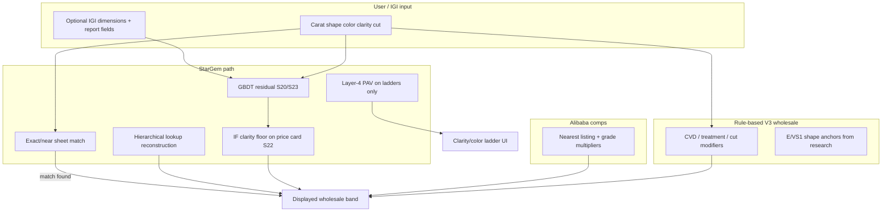
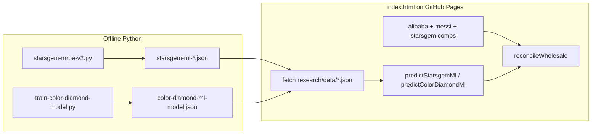
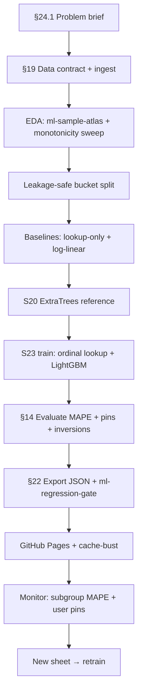

# S23 Model Architecture Proposal — What ML Approach Actually Works for Lab Diamond Pricing

**Date:** 2026-05-30  
**Status:** design proposal — ready to implement  
**Predecessor:** [`s22-followup-implementation-plan.md`](s22-followup-implementation-plan.md) · [`s21-evaluation.md`](s21-evaluation.md) · [`monotonic-models-and-generalized-grade-modifier.md`](monotonic-models-and-generalized-grade-modifier.md)

**Also answers:** generic “best model when unspecified” checklists — formal problem spec is in [§24](#24-formal-problem-specification-answers-to-open-questions).

---

## 1. What we've learned — the honest history

### S20 (current production): ExtraTrees + lookup anchor

ExtraTrees is an ensemble of maximally randomized decision trees. Each tree partitions the feature space into rectangular leaves, and every leaf stores the *mean price of training rows that fell into it*. Prediction = average of 160 leaf outputs.

**What ExtraTrees does well:**
- Learns complex non-linear interactions when there are enough training rows
- Fast to train, easy to serialize to JSON for browser inference
- Relatively robust to outliers (averaging across many trees)

**The fundamental problem — "loosely connected" cells:**

ExtraTrees leaves are isolated. A leaf for `(3ct, ROUND, E, IF)` and a leaf for `(3ct, ROUND, E, VVS1)` are completely separate regions of the tree. They share no information unless they happen to end up in the *same leaf* (which only happens if the tree didn't split on Clarity).

When IF has no training rows at 3ct — and StarGem stocks essentially zero IF stones at 3ct+ — the IF leaf falls through to the global fallback anchor (~$127/ct), producing $378. VVS1 has 17 rows at 3ct, hits a real anchor, and predicts $638. The model outputs IF < VVS1. This is not a bug in ExtraTrees — it is doing exactly what it should; it just has nothing to learn from.

**The IF data gap, quantified:**

| Carat bucket | E IF rows in training | E VVS1 rows | IF/VVS1 at Level-F |
|---|---:|---:|---|
| 0.50–0.69 | 0 | n/a | missing |
| 1.00–1.49 | **1** | 28+ | $173.9 vs $129.0/ct (1.35×) |
| 1.50–1.99 | **1** | 28+ | $155.6 vs $185.3/ct (**inverted**) |
| 2.00–2.99 | **0** | 28+ | missing |
| 3.00–3.99 | **0** | 17+ | missing — falls to global $127/ct |
| 4.00+ | **0** | — | missing |

The 1.5–2ct bucket already shows an inversion in the raw data ($155 < $185) from a single training row, and everything at 2ct+ has no IF signal at all. No amount of ExtraTrees hyperparameter tuning fixes this — there is no data.

**The S20/S22 workaround:** Layer-4 PAV (Pool-Adjacent-Violators) projection in the browser. It fixes the ladder display by enforcing IF ≥ VVS1 ≥ … ≥ SI2, but it does this by *averaging* the inverted cells together — so both IF and VVS1 get the same pooled price. PAV costs +5.34 pp MAPE on the price card because it pulls VVS1 down. This is why the price card was decoupled to use raw S20, and a targeted clarity floor was added for IF specifically.

**The IF-floor fix in S22 (current):** When raw IF < raw VVS1, clamp to `VVS1 × getClarityMult(IF) / getClarityMult(VVS1)`. This makes the price card correct directionally but it's borrowing from the clarity-mult lookup table rather than learning from data. It's the right band-aid; it is not a model fix.

---

### S21: LightGBM with monotone constraints — what it proved

S21 tried to fix the structural monotonicity problem by using LightGBM's native `monotone_constraints`. Results:

| Metric | S20 (ExtraTrees) | S21 (LightGBM) | Δ |
|---|---|---|---|
| Selected-spec MAPE | **6.01%** | 6.76% | +0.75 pp ⚠️ |
| Cert-loaded MAPE | ~5.41% | 5.61% | +0.20 pp |
| Clarity inversions (raw) | 1,127 | **0** | ✅ |
| Color inversions (raw) | 869 | **0** | ✅ |

S21 got to 0 inversions *structurally* but paid 0.75 pp MAPE. **Why?** Because S21 kept the same lookup anchor architecture — the lookup key still included Color and Clarity. So S21 still suffered from the same sparse-cell problem: when IF has no rows at 3ct, the lookup falls to the global anchor, and the monotone constraint forces the model to squeeze an IF premium out of nothing. The constraint fights the anchor instead of correcting it.

**The key lesson from S21:** monotone constraints on the residual model do not fix the root cause. The root cause is a **grade-specific lookup anchor that collapses to a wrong global value for sparse grades.** Constraining the residual is the wrong layer to constrain.

---

## 2. Why "trees are too loosely connected" is the right diagnosis

A decision tree can only propagate information between two feature values if they co-occur in enough training rows to push the tree to stop splitting. For grades:

- `Clarity = VVS1` and `Clarity = IF` are two different one-hot columns in the feature vector.  
- The tree has no way to know that IF > VVS1 in value ordering — it treats them as two independent binary features.
- If IF is never in the same bucket as 3ct rounds, no tree will ever fire a leaf that connects them.

A model that learns "related" diamonds must have a mechanism to **share parameters or gradients across related specs**. Decision trees in any ensemble form do not have this — each leaf is independently estimated.

What "sharing" means concretely:

> The model should be able to say: "I know D-VVS1-round-3ct costs $X and I know IF commands a +Y% premium over VVS1 from the 1ct data. Therefore D-IF-round-3ct costs $X × (1+Y)."

This requires a **global learnable representation of the IF premium**, not an IF-specific lookup cell.

---

## 3. Model families compared

| Family | Sparse cell handling | Monotone support | Browser deployable | Notes |
|---|---|---|---|---|
| **ExtraTrees / RandomForest** | ❌ isolated leaves, collapses to global | ❌ only via PAV post-process | ✅ | Current S20. Good on dense cells, fails on sparse. |
| **LightGBM / XGBoost with one-hot grades** | ❌ same problem as ExtraTrees for unrepresented cells | ✅ native constraints | ✅ | S21. Constraints fight the anchor. |
| **LightGBM with ordinal rank features** | ✅ rank features propagate signal across grades | ✅ monotone constraint on rank | ✅ | **S23 recommendation.** Learns IF premium from 1ct data, applies to 3ct. |
| **Ridge regression (log-linear, ordinal)** | ✅ fully shared linear slope | ✅ sign constraint on rank coefficient | ✅ trivial | Very interpretable floor. Too rigid for non-linear interactions. ~8–10% MAPE expected. |
| **GAM with monotone splines** | ✅ smooth spline on rank axis | ✅ constrained splines | ⚠️ needs wasm/port | Good interpolation; weak on high-dimensional interactions. |
| **Gaussian Process** | ✅ via kernel similarity between specs | ✅ posterior enforces covariance structure | ❌ expensive | Best theoretical fit; not practical to serialize for browser. |
| **Neural net with monotone embedding** | ✅ shared embedding layer across grades | ✅ with weight constraints | ⚠️ harder | Best long-run option; complex to validate + deploy. |

**Practical recommendation: GBDT (LightGBM) with ordinal-only grade features and a grade-agnostic anchor (S23).**

---

## 4. S23 architecture — the fix

### Core idea

Split the responsibility into two parts:

| Part | What it learns | Feature coverage |
|---|---|---|
| **Lookup anchor** | Carat-shape-method price level | `(carat_bucket, Shape, growth_method)` — **no Color, no Clarity** |
| **GBDT residual** | Grade premiums + interactions | `Clarity_Rank`, `Color_Rank`, interactions, dimensions |

By stripping Color and Clarity from the lookup key, the anchor becomes dense: instead of finding a specific `(3ct, ROUND, E, IF)` cell (n=0), it finds `(3ct, ROUND, HPHT)` (n=many). The grade premium then comes entirely from ordinal rank features constrained to be monotone.

### Signal propagation

When the model trains on `(1ct, ROUND, D, IF)` rows with `Clarity_Rank = 0` and `(1ct, ROUND, D, VVS1)` rows with `Clarity_Rank = 1`, it learns:
```
learned_premium(IF vs VVS1) ≈ exp(-β_clarity × 1)  
```
where `β_clarity < 0` (LightGBM monotone constraint: `Clarity_Rank` has direction −1).

When it later encounters `(3ct, ROUND, E, IF)` with no IF rows in training:
- Anchor = dense `(3ct, ROUND, HPHT)` rate ≈ $212/ct  
- Clarity_Rank = 0 → model applies learned IF-over-VVS1 premium from 1ct data  
- Prediction: $212/ct × exp(-β_clarity) ≈ $222/ct, a reasonable IF premium

This is exactly "learning from related diamonds." The IF premium learned at 1ct transfers to 3ct via the shared ordinal feature.

### Feature set

**Lookup anchor (input to lookup table):**
```
Key: carat_bucket || Shape || growth_method
```
Removes Color and Clarity from the lookup key entirely.

**New features added vs S20:**
```
Clarity_Rank        = {IF:0, VVS1:1, VVS2:2, VS1:3, VS2:4, SI1:5, SI2:6}
Color_Rank          = {D:0, E:1, F:2, G:3, H:4}
Log_Carat_x_ClarityRank   # captures "IF premium grows with carat" 
Log_Carat_x_ColorRank     # captures "D premium grows with carat"
```

**Removed features vs S20:**
- `Clarity` (one-hot) — replaced by `Clarity_Rank`
- `Color` (one-hot) — replaced by `Color_Rank`

**Monotone constraints:**
```python
monotone_constraints = {
    'Clarity_Rank': -1,         # worse clarity → lower price
    'Color_Rank':   -1,         # worse color   → lower price
    'Log_Carat':    +1,         # more carat    → higher $/ct
    'Lookup_RatePerCt': +1,     # higher anchor → higher price
}
```

**All other features unchanged** from S20: shape dummies, dimensions (LW ratio, table, depth), specialty cut flags, large-carat tail, dimension availability flags.

### What the anchor loses and gains

**Loses:** grade-specific anchor rate. For `(3ct, ROUND, E, VVS2)`, the old anchor was the VVS2-specific rate (~$109/ct from 641 CVD rows). The new anchor is the HPHT-specific rate for `(3ct, ROUND, HPHT)` ignoring grade.

**Gains:** the residual model now holds the complete grade premium signal, learned from all grade data together. VVS2 and VVS1 and IF all share the same anchor; only the ordinal rank features distinguish them. This means the model no longer faces a "jump" between cells when grades are sparsely represented — it sees a smooth monotone function over rank.

**Expected accuracy impact:**

| Segment | Expected MAPE change | Reason |
|---|---|---|
| Dense cells (VVS2, VS1 at 2–4ct rounds) | Neutral to +0.5 pp | Lose grade-specific anchor, gain ordinal model |
| Sparse cells (IF, D at large carats) | Significant improvement | No longer falls to global; inherits rank premium from dense cells |
| Shapes with little IF data (pear, heart at 3ct) | Significant improvement | Same mechanism |
| Overall selected-spec | Estimate: ~5.5–6.5% | Depends on interaction term quality; likely near S20 |
| Cert-loaded | Estimate: ~5.0–5.5% | Dimensions are still in; cert-loaded already benefits from real features |

---

## 5. What doesn't change and why

**The comp engine stays:** the Alibaba comp engine resolves the "nearest neighbor + clarity adjustment" approach independently of the ML model. For IF, it correctly finds a VVS1 comp and applies `getClarityMult(IF)/getClarityMult(VVS1) = ×1.044`. This remains the gold standard for stones near actual supplier listings. The ML model is the signal when comps are absent or far.

**The Layer-4 PAV stays on the ladder display:** even with a structurally monotone GBDT, sparse cells at the extremes (IF at very large carats, D at tiny carats) may still have small prediction instabilities. PAV on the ladder is cheap insurance and doesn't affect point pricing.

**The IF price-card floor stays temporarily:** until S23 is trained and deployed, the `VVS1 × clarity_mult_ratio` floor in `updateStarsgemPricingIntel` handles the known bad case.

---

## 6. Alternative considered: pure linear (log-linear ordinal regression)

A simpler alternative: fit `log(price/ct) = a + b·log(carat) + c·clarity_rank + d·color_rank + shape_effects + ε` with sign constraints on c and d.

**Pros:** guaranteed monotone, perfect interpolation, tiny model, immediate browser deploy, fully interpretable.

**Cons:** cannot learn the carat curve varying by shape and growth method, no interactions between carat and grade, cannot learn that HPHT VVS1 at 3ct commands a different premium than CVD VVS1 at 3ct. Estimated MAPE ~8–10% — too far above S20's 6%.

This would be a useful **sanity floor** — a linear baseline to compare against — but not a production model.

---

## 7. Implementation plan

### Phase 1 — Python training changes (one script)

File: `research/scripts/train-starsgem-ml-model.py` (or equivalent)

1. In `build_lookup_tables()`: change the key to `(carat_bucket, Shape, growth_method)`. Remove Color and Clarity from all levels A–F.
2. Add `Clarity_Rank` and `Color_Rank` as numeric features in `build_feature_row()`.
3. Add `Log_Carat_x_ClarityRank` and `Log_Carat_x_ColorRank` as derived features.
4. Remove `Clarity` and `Color` from the categorical one-hot feature list.
5. Set `monotone_constraints_method = "advanced"` on LightGBM (not ExtraTrees — ExtraTrees cannot use these).
6. Set constraint vector: −1 on Clarity_Rank, −1 on Color_Rank, +1 on Log_Carat, +1 on Lookup_RatePerCt.
7. Keep all other features unchanged.

**Switch from ExtraTrees to LightGBM.** ExtraTrees cannot use monotone_constraints; this is the defining reason to switch. LightGBM is already used in S21 and its browser inference is an identical tree-walk. No new infrastructure needed.

### Phase 2 — Evaluate before deploying

Run the regression gate (`research/scripts/ml-regression-gate.mjs`) and the monotonicity sweep. Accept criteria:
- Clarity inversions = 0 (should hold by construction from monotone constraints)
- Selected-spec MAPE ≤ S20 + 1.0 pp (≤ 7.01%)
- Cert-loaded MAPE ≤ S20 + 0.5 pp (≤ 5.91%)
- IF 3ct round E prediction > VVS1 3ct round E prediction (the specific case that triggered this)

### Phase 3 — Browser JS changes

In `index.html` / `starsgem-ml-predict.mjs`:
1. Update `starsgemModelLookupRate` to use the new key fields (remove Color, Clarity from the key-building loop).
2. Add `Clarity_Rank` and `Color_Rank` to `starsgemNumericFeatureValue` lookups.
3. Add interaction feature computation.
4. Remove the `_ifClampedFromVvs1` floor — it should no longer be needed once the model learns the IF premium correctly.
5. The StarGem lookup (`predictStarsgemLookup`) is a separate artifact and changes independently.

### Phase 4 — Browser artifact regeneration

Regenerate `starsgem-ml-extra-trees-model-s20-specialty-tail.json` (or a new `s23` JSON). The format is identical — same tree-walk structure — just new trees trained on the new feature set.

---

## 8. Open questions before implementing

1. **LW ratio feature interaction with shape**: `LW_Ratio_refined` currently encodes elongation; does removing color/clarity from the anchor expose interactions that LW_Ratio needs to absorb? Check by comparing LW_Ratio feature importance in S20 vs S23.

2. **HPHT anchor density**: the new anchor is `(carat_bucket, Shape, growth_method)`. For shapes with sparse HPHT rows at large carats (e.g. pear 4ct HPHT), this may still fall to a reduced level. Verify that Level-C or Level-D `(carat_bucket, Shape)` without growth_method is still dense enough.

3. **CVD vs HPHT grade premium difference**: the current model lets the lookup capture `(HPHT, E, VVS1)` vs `(CVD, E, VVS1)` at the same carat as distinct anchors. S23 collapses these into one anchor; the growth-method difference moves to a growth_method dummy in the residual. Verify that the residual model can capture this distinction from a dummy rather than from the anchor.

4. **Interaction term signs**: `Log_Carat_x_ClarityRank` should be positive (larger stones penalize worse clarity more). Verify this in training before adding the monotone constraint.

5. **Carat-bucket boundary effects**: S20 used `Carat_bucket_pos` (continuous position within bucket) and `Dist_carat_threshold` to smooth the 1ct/2ct/3ct threshold jumps. These features interact with the lookup anchor. When the anchor loses grade specificity, these features become more important for within-bucket smoothness.

---

## 9. Summary table

| | S20 (current) | S21 (LightGBM + constraints) | **S23 (proposed)** |
|---|---|---|---|
| Algorithm | ExtraTrees | LightGBM | **LightGBM** |
| Lookup anchor key | carat+shape+color+clarity+method | same | **carat+shape+method only** |
| Grade features | one-hot Clarity, one-hot Color | Clarity_Rank + Color_Rank + one-hot | **Clarity_Rank + Color_Rank only** |
| Monotone constraints | ❌ | ✅ on rank features | ✅ on rank features |
| IF at 3ct prediction | $378 (below VVS1) | PAV pools → same as VVS1 | Inherits rank premium from 1ct data |
| Selected-spec MAPE | 6.01% | 6.76% | Target: ≤ 6.5% |
| Clarity inversions | 1,127 raw → 0 via PAV | 0 raw | 0 raw |
| "Loosely connected" cells | ❌ isolated leaves | ⚠️ constraints fight the anchor | ✅ shared ordinal representation |
| IF price card floor needed? | ✅ (workaround) | ✅ (workaround) | ❌ should be unnecessary |

---

_S23 is a full retrain. All prior S20/S21/S22 browser artifacts remain valid until S23 passes the regression gate and is explicitly deployed._

---

## 10. Product context — what Gem Appraise is predicting

**Gem Appraise** ([`README.md`](../README.md)) is a single-page **lab-grown diamond wholesale price calculator** for loose **IGI-certified** stones. Users enter (or load from an IGI report) carat, shape, color, clarity, cut, growth method (CVD / HPHT), and optional dimensions; the app estimates:

| Output | Meaning |
|---|---|
| **Wholesale / jeweler cost** | What a buyer might pay a supplier like StarGem (Wuzhou) — the ML model’s primary training target |
| **Fair direct / auction range** | Derived from wholesale via channel multipliers |
| **Traditional retail range** | Higher markup band for brick-and-mortar comparison |
| **Alibaba comp context** | Nearest captured listing + clarity/color adjustments (`getClarityMult`, etc.) |

The StarGem ML model is **not** a formal appraisal. It is a **dense-catalog interpolator**: given a spec similar to rows in the supplier’s stock sheet, predict **total USD price** (or **$/ct**) that matches how that supplier prices inventory. It runs **entirely in the browser** (serialized tree JSON + lookup tables) so the tool works offline on GitHub Pages with no server.

**What success looks like for the user:**

1. **Point price** on the main card should be locally calibrated for common specs (e.g. 1–3 ct round E VS1) — not wildly above sheet medians.
2. **Clarity/color ladders** should read as a jeweler expects: better grade ⇒ higher $/ct (IF ≥ VVS1 ≥ … ≥ SI2; D ≥ E ≥ … ≥ H).
3. After IGI load, **cert-loaded** predictions should use real measurements (table, depth, L/W) when available.
4. Sparse grades (IF at 3 ct+, heart/pear at large carats) should **extrapolate sensibly**, not collapse to a global fallback that inverts the ladder.

S23 targets (3) and (4) structurally; S22 already split **point pricing** (raw model) from **ladder display** (PAV projection) for (2) without retraining.

---

## 11. Training data and label definition

### Source

| Item | Detail |
|---|---|
| Supplier | Wuzhou **StarGem** Co., Ltd. |
| Snapshot | `STARS Diamonds Stock2026.5.20.xls` → [`research/data/starsgem-index.json`](data/starsgem-index.json) |
| Priced rows | ~**28,394** diamonds (MRPE sweeps); **22,541** ≥1 ct in the [sample atlas](ml-sample-atlas.md) |
| Label | `SaleDollorPrice` (USD total stone price on the sheet) |
| Split | Temporal / bucket-balanced holdout — **one representative per** `(Shape, carat_bucket, Color, Clarity, Cut)` so validation is not dominated by round 1 ct rows ([`starsgem-mrpe-v2.py`](scripts/starsgem-mrpe-v2.py) `VALIDATION_BUCKET_FIELDS`) |

Each row carries supplier fields used as features: `Carat`, `Shape`, `Color`, `Clarity`, `Cut`, `Polish`, `Symmetry`, `Fluorescence`, `Report`, `TypeName` (CVD/HPHT), measurements, table/depth %, and internal rate columns derived at ingest.

### Target the model learns (S20 / S21 / planned S23)

Production models use **`log_tail_lookup_residual`** (S20) or **`log_lookup_residual`** (S19):

```text
predicted_price = exp(tree_residual) × lookup_rate_per_ct × large_carat_tail_multiplier × carat
```

- **`lookup_rate_per_ct`**: median sheet rate from a **hierarchical lookup** (levels A→G), falling back to global median when cells are empty.
- **`tree_residual`**: log-multiplier the ensemble learns on top of that anchor (captures cut style, dimensions, specialty cuts, residual grade effects).
- **`large_carat_tail_multiplier`**: parametric scarcity curve for **≥5 ct** (S20), so 10 ct+ does not flatline at lookup-only.

S23 changes **only** which fields participate in the lookup key and how **Color/Clarity** enter the tree — not the overall residual formulation.

### Inventory reality (why ML is hard)

StarGem’s catalog is **not a uniform grid** of `(shape × carat × color × clarity)`:

- **Round 1–1.5 ct E/F VS1–VS2** is dense (thousands of rows).
- **IF** is rare at any carat; **essentially zero** at 3 ct+ for common colors ([§1 table](#1-what-weve-learned--the-honest-history)).
- **Fancy shapes** (heart, pear, marquise) have thinner ladders, especially at 3–10 ct.
- **`TypeName = "-"`** at inference (user has not picked CVD/HPHT) is a **different distribution** than training rows that are almost all labeled CVD or HPHT — S19+ augments with `selected_spec_view()` to teach this.
- **`Cut`** mixes IGI codes (`ID`, `EX`, `VG`) with **Chinese specialty labels** (`传统切`, `冰花切`, …) that are different products at different price points — S20 uses `Cut_Style_Group` and specialty flags.

The [ML sample atlas](ml-sample-atlas.html) overlays **training median**, **lookup anchor count**, and **S20 ML** per cell so you can see gaps before trusting a prediction.

---

## 12. The full pricing stack (ML is one layer)

Do not optimize the ML model in isolation. Production behavior is a **stack**:



| Layer | Role | When it wins |
|---|---|---|
| **Hybrid anchor** | If the stone matches (or interpolates) a row in `starsgem-index.json`, use sheet evidence | Exact SKU on the spreadsheet |
| **Lookup reconstruction** | Deterministic median $/ct from lookup levels | Dense `(carat, shape, color, clarity)` cells |
| **ML residual** | Adjusts anchor for cut, dimensions, specialty, sparse interactions | User-facing “ML guess” card; sparse tails |
| **Comp engine** | Alibaba capture + `getClarityMult` / color mult | Listings near the spec; IF premium from VVS1 comp |
| **V3 rule engine** | TikTok/retail-calibrated modifiers, shape tables | Default wholesale when StarGem path thin |

**Design implication for S23:** improving IF at 3 ct fixes the **ML card** and ladders; it does not replace comps or hybrid anchors. Regression gates should still include **pinned cases** where comps and ML disagree (IF floor was added because comps were right and ML was wrong).

---

## 13. What “best model” means — metrics and inference modes

### Primary metrics

| Metric | Definition | Typical use |
|---|---|---|
| **MAPE / MRPE** | Mean absolute % error vs held-out `SaleDollorPrice` | Model selection across S19–S23 |
| **MAE** | Mean absolute dollar error | Large stones (high $ variance) |
| **R²** | Explained variance on log-price or rate | Sanity check; can hide sparse-cell failures |
| **Clarity/color inversions** | Count of adjacent ladder steps where worse grade has higher $/ct | Hard gate for consumer trust |
| **Pinned-case drift** | Fixed specs (3 ct round E VS1, Marquise 4.08 E, Heart 3 E) | Catches “good MAPE, bad UX” |

### Two evaluation views (always report both)

Training deliberately simulates **how the app calls the model**:

| View | Simulates | Key masked fields |
|---|---|---|
| **Selected-spec** | User picked grades; no IGI yet | `TypeName = "-"`, dimensions `null`, medians imputed |
| **Cert-loaded** | IGI parsed | Real L/W, table, depth, growth method when present |

A model can score **~6% selected-spec MAPE** and **~5.4% cert-loaded** (S20/S21) while still failing pinned selected-spec cases — the 3 ct ROUND E VS1 ID story in [`starsgem-ml-training-diagnosis-and-retrain-plan.md`](starsgem-ml-training-diagnosis-and-retrain-plan.md). **Never approve on global MAPE alone.**

### Monotonicity sweep grid

[`analyze-ml-grade-monotonicity.mjs`](scripts/analyze-ml-grade-monotonicity.mjs) evaluates:

```text
9 shapes × 11 carats × 5 colors × 7 clarities = 3,465 cells
```

Violation rule: worse adjacent grade has **>0.1% higher** $/ct than better grade (`cur.perCt > prev.perCt × 1.001`). S20 raw: **1,127** clarity + **869** color inversions; S21 Layer-4: **0** / **0**.

### Regression gate ([`ml-regression-gate.mjs`](scripts/ml-regression-gate.mjs))

Before shipping any new JSON artifact:

| Gate | Check |
|---|---|
| 1 | Feature vector length matches schema (111 features for S21) |
| 2 | Cert-loaded dimension features ≠ median when real dims present |
| 3–4 | 0 clarity / color inversions on **monotone ladder path** |
| 5 | Point-pricing MAPE ≤ baseline + **0.5 pp** |
| 6 | Golden fixtures in [`js-parity-fixtures-s21.json`](data/js-parity-fixtures-s21.json) stable within **0.5%** |

S23 should extend gate 5 baseline after the first S23 sweep and add an explicit **IF > VVS1 at 3 ct round E** assertion.

### Point pricing vs ladder (S22 lesson)

| UI surface | Function | Why |
|---|---|---|
| Main price card | `predictStarsgemMl` (raw) | Best point estimate; PAV pools cells and **+5.34 pp MAPE** |
| Clarity/color ladders | `predictStarsgemMlMonotone` (PAV) | Guarantees jeweler-readable ordering |

S23 aims to make **raw** predictions monotone enough that ladders need less aggressive PAV — not to apply PAV to the card again.

---

## 14. Model selection workflow — practical checklist

Use this sequence when comparing S20, S21, S22 fixes, or S23 retrain:

### A. Data and leakage

- [ ] Train lookup tables **only on train split** (never test rows in medians).
- [ ] Confirm temporal cutoff if comparing to older S7/S18 artifacts.
- [ ] Run [sample atlas](ml-sample-atlas.md) for target cells — check **n**, **train med**, **lookup n** before blaming the tree.

### B. Train candidates

Script: [`research/scripts/starsgem-mrpe-v2.py`](scripts/starsgem-mrpe-v2.py) — strategies `S19`, `S20`, `S21`, future `S23`.

| Step | Action |
|---|---|
| 1 | Implement feature/lookup changes in `build_lookup_tables()` + `build_feature_row()` |
| 2 | Use **LightGBM** if `monotone_constraints` required; ExtraTrees only if constraints abandoned |
| 3 | Keep **selected-spec augmentation** (`s19_augmented_training_rows`) |
| 4 | Export same JSON tree shape (`childrenLeft`, `feature`, `threshold`, `value`, optional `lgbmBaseScore`) |
| 5 | Write `monotone` metadata + bump `modelName` (e.g. `S23 — grade-agnostic anchor`) |

### C. Offline evaluation

```bash
# Full strategy comparison (Python)
python3 research/scripts/starsgem-mrpe-v2.py   # see __main__ / strategy registry

# Monotonicity sweep
node research/scripts/analyze-ml-grade-monotonicity.mjs

# CI gate
npm run research:ml-gate
```

Compare: selected-spec MAPE, cert-loaded MAPE, inversion counts, **per carat bucket** (flag **5–9.99 ct** if >10% MAPE), pinned cases, IF/VVS1 ordering at sparse carats.

### D. Browser parity

- [ ] Regenerate JSON under [`research/data/`](data/).
- [ ] Update `index.html` model URL + cache-bust query param.
- [ ] Mirror feature logic in [`starsgem-ml-predict.mjs`](scripts/starsgem-ml-predict.mjs) and inline `index.html` (historically drifted — S22 fixed 4 dimension features).
- [ ] Run parity fixtures; diagnose single stones with [`diagnose-starsgem-ml-case.py`](scripts/diagnose-starsgem-ml-case.py).

### E. Acceptance thresholds (S23 proposal)

| Criterion | Threshold |
|---|---|
| Clarity inversions (raw or monotone path per product decision) | **0** on ladder path; target **0 raw** for IF/VVS1 sparse cases |
| Selected-spec MAPE | ≤ S20 + **1.0 pp** (≤ 7.01% if S20 = 6.01%) |
| Cert-loaded MAPE | ≤ S20 + **0.5 pp** |
| IF 3 ct round E | **price(IF) > price(VVS1)** without IF floor hack |
| Pinned Marquise 4.08 E / Heart 3 E | No VVS2 > VVS1 style inversions on **raw** card |

### F. Hyperparameters (starting point from S21)

LightGBM: `n_estimators=400`, `num_leaves=63`, `learning_rate=0.04`, `min_child_samples=20`, `subsample=0.8`, `colsample_bytree=0.8`, `monotone_constraints_method="advanced"`. For S23, sweep **`min_child_samples`** and **`num_leaves`** on **5–9.99 ct** holdout if MAPE regresses — do not loosen monotonicity to fix tail error.

**Algorithms tried historically** ([`MRPE-IMPROVEMENT-ANALYSIS.md`](MRPE-IMPROVEMENT-ANALYSIS.md)): ExtraTrees won raw accuracy on dense data; LightGBM needed for constraints; lookup-only ~6% MAPE; pure log-linear ordinal ~8–10% (S23 §6) — useful **floor baseline**, not production.

---

## 15. Domain reference — lab diamonds, grades, and features

### Stone type

- **Material:** CVD or HPHT **lab-grown** diamond (not mined, not fancy-color in this model — fancy-color has a separate pipeline in [`build-starsgem-color-anchors.py`](scripts/build-starsgem-color-anchors.py) and `monotone-axes.json` → `fancy_color_diamond`).
- **Certification:** IGI report fields map to `Report`, measurements, cut/polish/symmetry.
- **App cut mapping:** User “Ideal” → supplier `ID`; “Excellent” → `EX`. Mismatch between app labels and sheet codes caused EX vs ID leaf confusion ([training diagnosis](starsgem-ml-training-diagnosis-and-retrain-plan.md)).

### Ordinal axes (white diamond)

Registry: [`research/data/monotone-axes.json`](data/monotone-axes.json)

| Axis | Order (best → worst) | Rank feature | Monotone direction on rank |
|---|---|---|---|
| Clarity | IF → VVS1 → VVS2 → VS1 → VS2 → SI1 → SI2 | `Clarity_Rank` (0 = IF) | −1 (higher rank ⇒ lower price) |
| Color | D → E → F → G → H (J in S21 training) | `Color_Rank` (0 = D) | −1 |
| Carat | continuous | `Log_Carat`, bucket features | +1 |

**Cut** is not yet a global ordinal rank in S20 (one-hot + `Cut_Style_Group`). Future work could add `Cut_Rank` for ID/EX/VG/GD only, excluding specialty labels.

### Shapes in monotonicity sweep

`ROUND`, `OVAL`, `MARQUISE`, `PEAR`, `CUSHION`, `EMERALD`, `RADIANT`, `PRINCESS`, `HEART` — each with different L/W sensitivity ([`diamond-cut-shape-reference.md`](diamond-cut-shape-reference.md)).

### Growth method

`TypeName`: CVD vs HPHT shifts wholesale level; most 3 ct round E VS1 sheet rows are **CVD**. Unknown `-` at inference must be learned via augmentation, not assumed CVD.

### Lookup hierarchy (current S20 — S23 removes color/clarity from anchor levels)

Levels A–G in [`LOOKUP_LEVELS`](scripts/starsgem-mrpe-v2.py): progressively drop `Cut`, `Report`, `TypeName`, then `Shape`, until global. **Level E** `(carat_bucket, Shape, Color, Clarity)` is the usual anchor for grade-specific rates; S23 collapses grade out of the anchor and moves premium to ordinal features + residual.

---

## 16. Known hard segments and explicit non-goals

| Segment | Issue | Mitigation |
|---|---|---|
| **5–9.99 ct** | S21 MAPE **12.28%**; sparse + tail multiplier | Tail model + denser anchor; do not disable ML |
| **10 ct+** | 61% CV in raw sheet; EMERALD/OVAL tails wild | Parametric tail; comps; wide UI bands |
| **IF / D at large carat** | n ≈ 0 in training | **S23 ordinal transfer**; comp engine; temporary IF floor (S22) |
| **Heart / Marquise fancy** | Worst inversion counts in sweeps | PAV ladders; S23 rank sharing |
| **Specialty Chinese cuts** | Different buyer market | `Cut_Style_Group` + separate flags; don’t merge with ID |
| **SI1 / SI2** | Often off-catalog (n=1 lookup) | Rule engine discounts steeper than ML |
| **Post-treatment / Type IIa** | Cert flags | V3 modifiers, not StarGem ML |

**Non-goals for S23:**

- Replacing Alibaba comps or hybrid sheet matching.
- Fancy-color diamond pricing (separate model/track — see [`s22-and-color-monotonicity-plan.md`](s22-and-color-monotonicity-plan.md) Track B).
- Mined-diamond or non-IGI grading systems.
- Formal appraisal or legal valuation language.

---

## 17. Related research index

| Document | Contents |
|---|---|
| [`s21-evaluation.md`](s21-evaluation.md) | S21 metrics, per-bucket MAPE, pinned ladders |
| [`s20-s21-comprehensive-comparison.md`](s20-s21-comprehensive-comparison.md) | Side-by-side architecture |
| [`s22-followup-implementation-plan.md`](s22-followup-implementation-plan.md) | PAV decouple, CI gate, S23 track |
| [`monotonic-models-and-generalized-grade-modifier.md`](monotonic-models-and-generalized-grade-modifier.md) | Model families + `monotone-axes.json` design |
| [`ml-grade-monotonicity-analysis.md`](ml-grade-monotonicity-analysis.md) | Inversion root-cause analysis |
| [`starsgem-ml-training-diagnosis-and-retrain-plan.md`](starsgem-ml-training-diagnosis-and-retrain-plan.md) | 3 ct VS1 case, missingness augmentation |
| [`white-diamond-igi-wholesale-pricing.md`](white-diamond-igi-wholesale-pricing.md) | V3 E/VS1 anchors and retail calibration |
| [`MRPE-IMPROVEMENT-ANALYSIS.md`](MRPE-IMPROVEMENT-ANALYSIS.md) | Algorithm bake-off (ExtraTrees vs boosting) |
| [`ml-sample-atlas.md`](ml-sample-atlas.md) | Per-cell stock vs ML visualization |
| [`diamond-cut-shape-reference.md`](diamond-cut-shape-reference.md) | Shape proportions and wholesale multipliers |

---

## 18. S23 success criteria (consolidated)

When S23 is “done” for production:

1. **Structural:** Grade premiums propagate via `Clarity_Rank` / `Color_Rank` + grade-agnostic lookup; no IF cell falling to global $127/ct at 3 ct.
2. **Accuracy:** Selected-spec and cert-loaded MAPE within gates in §14E; 5–9.99 ct documented if still weak.
3. **Monotonicity:** 0 ladder inversions on monotone path; raw IF ≥ VVS1 on documented sparse pins without browser floor.
4. **Ops:** `ml-regression-gate` green; JS/Python parity fixtures updated; `index.html` cache-bust; remove `_ifClampedFromVvs1` when verified.
5. **UX:** Price card uses raw S23; ladders use PAV only where raw still wobbles at extremes.

Until then, keep **S20 raw + S22 IF floor + Layer-4 PAV on ladders** as the shipped stack.

---

## 19. Datasets — what to train on, what to compare against

ML training is only one layer. The app loads **several dataset families** at runtime; S23 white-diamond training should stay aligned with the same schemas and supplier semantics.

### 19.1 Training labels (factory wholesale targets)

These are the datasets you **fit models on**. The label is always **USD total stone price** (or derived **$/ct**), not Alibaba list price and not retail.

| Dataset | File | Rows (approx.) | Role | Used by |
|---|---|---:|---|---|
| **StarGem white stock** | [`research/data/starsgem-index.json`](data/starsgem-index.json) | ~28,394 priced (~22,541 ≥1 ct in atlas) | Primary **white** ML + lookup training; `SaleDollorPrice` label | `starsgem-mrpe-v2.py` → S20/S21/S23 |
| **StarGem source XLS** | `research/data/STARS Diamonds Stock2026.5.20.xls` | same ingest | Regenerate `starsgem-index.json` when sheet updates | ingest scripts |
| **Messi white stock** | [`research/data/messi-gems-index.json`](data/messi-gems-index.json) | large white catalog | **Not** the white ML label — used for comps, markup study, V3 anchors | comp engine, reconciliation |
| **Messi color stock** | [`research/data/messi-color-index.json`](data/messi-color-index.json) | **1,652** priced ≥1 ct | **Fancy-color ML** after source adjustment (÷1.25) | [`train-color-diamond-model.py`](scripts/train-color-diamond-model.py) |
| **StarGem color anchors** | [`research/data/starsgem-color-index.json`](data/starsgem-color-index.json) | **5** direct quote rows (2026-05) | Face-value training anchors for color ML; weighted 10× in training | same |
| **IGI enrichment** | [`research/data/igi-report-enrichment.json`](data/igi-report-enrichment.json) | per-report PDF fields | Optional features (`IGI_Enriched`, dimensions) when cert parsed | enriched retrain paths |

**White S23:** train only on **StarGem white** rows (plus augmented selected-spec views). Do not mix Messi prices into the white ML label without dividing by the measured Messi/StarGem factor — that would bake reseller markup into “factory wholesale.”

**Color:** train on **Messi color (adjusted) + StarGem color anchors** until a larger StarGem color sheet exists ([`color-diamond-ml-sampling-plan.md`](color-diamond-ml-sampling-plan.md)).

### 19.2 Comp pools (nearest-neighbor, reconciliation, markup studies)

These are **binned medians** for matching and blending — not tree training rows.

| Dataset | File | Bins (approx.) | Role |
|---|---|---:|---|
| StarGem white comps | [`starsgem-comps.json`](data/starsgem-comps.json) | ~2,640 | Exact/near StarGem sheet matches; hybrid router |
| Messi white comps | [`messi-comps.json`](data/messi-comps.json) | ~1,855 | Alibaba-adjacent factory ceiling; Messi/StarGem ratio |
| Messi color comps | [`messi-color-comps.json`](data/messi-color-comps.json) | ~1,243 | Fancy-color comp bins |
| StarGem color comps | [`starsgem-color-comps.json`](data/starsgem-color-comps.json) | small | Direct color quote comps |
| Alibaba promoted comps | [`alibaba-comps-index.json`](data/alibaba-comps-index.json) | growing | Listing captures → v3 comp engine |

Comp pools power **`research/comp-engine-v3.js`**, R0 reconciliation (`reconcile-price.js`), and supplier markup analysis — they do **not** replace ML but constrain the headline when comps are strong.

### 19.3 Alibaba capture sessions (market floor, not ML labels)

Raw browser/extension captures under `research/data/*-sku-prices.json` (dozens of session files). Examples:

- White marquise / radiant ladders, asscher, heart pink ladders, etc. (see [`research/README.md`](README.md))
- Used to fill **gaps** in `alibaba-comps-index.json` and to sanity-check whether StarGem/Messi/ML sit above or below **listing** prices

**Rule:** Alibaba SKU price ≈ **what a buyer sees on a listing**, often DEF/VS+ bands. StarGem sheet price ≈ **Wuzhou factory stock**. They are related but not interchangeable training targets.

### 19.4 Derived / intelligence artifacts

| Artifact | File | Purpose |
|---|---|---|
| Lookup reconstruction | [`starsgem-pricing-intelligence.json`](data/starsgem-pricing-intelligence.json) | Deterministic **/170** formula UI for **white** stones (`reconstruct-starsgem-pricing.py`) |
| ML models | `starsgem-ml-extra-trees-model-*.json`, `color-diamond-ml-model.json` | Browser inference |
| Monotone registry | [`monotone-axes.json`](data/monotone-axes.json) | Training constraints + ladder PAV axes |
| Conformal / reconciler | `conformal-*.json`, `reconciler-config-v1.json` | Interval width + R0 blend weights |
| Evaluation sweeps | `ml-grade-monotonicity-sweep.json`, `s22-evaluation.json`, etc. | Gates and reports |
| Parity fixtures | [`js-parity-fixtures-s21.json`](data/js-parity-fixtures-s21.json) | JS must match Python predictions |

### 19.5 Planned / desired dataset growth

| Priority | Ask | Why |
|---|---|---|
| **P0** | Refreshed StarGem white XLS when stock moves | Training drift; IF/VVS ladders change |
| **P1** | **Stratified StarGem color quote sheet** (~30–100 rows), not full catalog | Replace Messi÷1.25 guess with real factory color surface |
| **P2** | More Alibaba captures in weak comp cells (marquise 2 ct, SI1, etc.) | Comp-engine coverage, not ML label |
| **P3** | IGI enrichment completion for fancy shapes | Cert-loaded MAPE for non-round |

When new StarGem white data arrives: re-ingest → retrain S23 → re-export JSON → bump `?v=` on `index.html` fetch (§22).

---

## 20. StarGem vs Messi — “percent off” and what the models learn

There are **three different “discount” concepts** in the app. Do not mix them when training or evaluating ML.

### 20.1 Messi markup over StarGem (supplier channel, ~15–25%)

StarGem is treated as the **direct factory baseline**. Messi Gems (Alibaba-facing stock) is typically **higher** on matched specs.

From [`messi-vs-starsgem-white-markup-analysis.md`](messi-vs-starsgem-white-markup-analysis.md) (exact bins: shape + white color + clarity + 0.05 ct):

| Metric | White diamonds |
|---|---:|
| Matched comp bins | 1,274 |
| **Median Messi / StarGem** | **1.187×** |
| Implied StarGem vs Messi | StarGem ≈ **84%** of Messi price (~**16% cheaper**) |
| Median Messi markup | **+18.7%** |
| 25th–75th percentile markup | +8.7% to +28.0% |

**Working factors (white):**

```text
estimated_star_gem_price  ≈  messi_comp_price / 1.19   (median)
conservative              ≈  messi_comp_price / 1.10
aggressive factory        ≈  messi_comp_price / 1.30
```

**Fancy color** ([`starsgem-colored-gem-messi-correlation-analysis.md`](starsgem-colored-gem-messi-correlation-analysis.md)) — only **5** StarGem anchors so far; median Messi/StarGem ≈ **1.26×** on shape-adjusted neighbors (~**21% cheaper** than Messi). The color ML pipeline uses a single training divisor:

```text
SOURCE_ADJUSTMENT_MESSI_TO_STARGEM = 1.25   # Messi rows divided by 1.25 before fitting
```

| Segment | Messi / StarGem (typical) | StarGem as % of Messi |
|---|---:|---:|
| White matched bins | 1.19× median | ~84% |
| Color anchors (small sample) | 1.23–1.30× | ~77–81% |
| Color ML training constant | 1.25× | 80% |

**Intent:** ML should predict **StarGem-like factory wholesale**, not Messi’s reseller sheet. Messi enters as **comps** and as **color training rows after ÷1.25**, not as the white ML label.

### 20.2 StarGem internal `/170` encoding (sheet mechanics, not a “sale %”)

StarGem’s spreadsheet stores an **internal integer rate** related to USD:

```text
internal_price  ≈  round(SaleDollorPrice × 170)
usd_price       ≈  internal_price / 170
lookup_rate     =  median(internal_rate_per_ct) per cell
```

This is documented in [`reconstruct-starsgem-pricing.py`](scripts/reconstruct-starsgem-pricing.py). The **170 factor is granularity for lookup tables**, not “170% markup” or “percent off retail.” The white **“StarGem formula”** pill in the UI shows `/170` reconstruction from [`starsgem-pricing-intelligence.json`](data/starsgem-pricing-intelligence.json).

ML models use **`usd_per_ct`** and embedded lookup tables exported with the JSON — they do not require the user to divide by 170 at inference time.

### 20.3 App channel toggles (buyer-side, not training labels)

The hand-authored **V3 baseline** in `index.html` applies **buyer** modifiers on top of model wholesale — these are **not** what S23 trains on:

| Toggle / rule | Effect | Meaning |
|---|---|---|
| **Chinese factory direct** (`CHINA_WS = 0.78`) | Wholesale × **0.78** | User buying as if direct from China factory channel |
| Standard / auction fair bands | ×1.55–2.05 etc. on ws | Seller margin + cert/shipping |
| Color/clarity/shape mults | vs E/VS1 anchor | Off-catalog grades, shape demand |
| Magic-weight discount | Smooth discount below 1/1.5/2/3 ct thresholds | Carat marketing premium |

So: **StarGem sheet → ML predicts factory stock price → V3/comp/reconciler may adjust → user toggles apply last.** Training targets stay at the **un discounted StarGem USD** layer.

### 20.4 How “percent off” should appear in evaluation

When comparing model vs comps, report **signed % error** consistently:

```text
percent_off_actual = (predicted - actual) / actual × 100
```

For **supplier adjustment** studies (Messi → StarGem), use:

```text
messi_markup_pct = (messi / stargem - 1) × 100
star_gem_discount_vs_messi_pct = (1 - stargem / messi) × 100
```

S20/S21 holdout reports in [`s20-s21-comprehensive-comparison.md`](s20-s21-comprehensive-comparison.md) use this per-stone definition aggregated by carat bucket.

---

## 21. Fancy color diamonds — parallel model track

White S23 does **not** replace fancy-color pricing. Color is a **separate gem family** with its own data, model, monotone axes, and UI routing.

### 21.1 What you are predicting (color)

| Dimension | White ML (S20/S23) | Fancy color ML |
|---|---|---|
| Color axis | D–H **grade** (ordinal) | **Hue** (yellow, pink, blue, …) + **intensity** (Faint → Vivid) + **modifier** (brownish, greyish, …) |
| Clarity | IF–SI2 ladder | VS1/VVS2-heavy; compressed vs white |
| Training label | StarGem white `SaleDollorPrice` | Messi color **÷1.25** + 5 StarGem anchors at face value |
| Browser artifact | `starsgem-ml-extra-trees-model-s20-specialty-tail.json` (→ S23) | [`color-diamond-ml-model.json`](data/color-diamond-ml-model.json) |
| Lookup UI | StarGem /170 reconstruction shown | **Hidden** — copy in app: fancy uses color ML + comps, not white sheet formula |

Current color model ([`color-diamond-ml-results.md`](color-diamond-ml-results.md)): **ExtraTrees**, 120 trees, validation MAPE **3.12%** on held-out Messi rows; anchors fit exactly by construction (high sample weight).

### 21.2 Color datasets (train vs comp)

| File | Rows | Use |
|---|---:|---|
| `messi-color-index.json` | 1,657 training rows (1,652 Messi-adjusted) | Fit `log(price/carat)` |
| `starsgem-color-index.json` | 5 anchors | Factory truth cells |
| `messi-color-comps.json` | 1,243 bins | Nearest color comps |
| `starsgem-color-comps.json` | small | StarGem quote comps |

Coverage skew ([`color-diamond-ml-sampling-plan.md`](color-diamond-ml-sampling-plan.md)): yellow/pink/blue strong; green/brown thinner; red rare; **10 ct+ vivid blue** needs direct-quote warning.

### 21.3 Color monotonicity (Track B — after or alongside S23)

Registry entry **`fancy_color_diamond`** in [`monotone-axes.json`](data/monotone-axes.json):

- **`colorIntensityRank`**: Faint → Vivid, direction **+1** (higher intensity ⇒ higher price)
- **`modifierPenaltyRank`**: none → greyish, direction **−1**
- **Carat**: **+1**

Planned work ([`s22-and-color-monotonicity-plan.md`](s22-and-color-monotonicity-plan.md) **Track B**): LightGBM with monotone constraints on intensity + modifier, same browser tree export pattern as S21 white, plus intensity ladder PAV in the UI (analogous to clarity ladder for white).

**Do not** apply white-diamond S23 changes (clarity-agnostic **white** lookup) to the color model without a separate design — color has no IF/VVS ladder; the failure mode is **intensity inversions** and **modifier penalties**, not sparse IF cells.

### 21.4 App routing (white vs color)

In `index.html` → `updateStarsgemPricingIntel()`:

- **White:** `predictStarsgemMl` (raw) on price card, `predictStarsgemMlMonotone` on ladders, optional StarGem lookup line, IF floor when sparse.
- **Fancy color:** `predictColorDiamondMl` when [`color-diamond-ml-model.json`](data/color-diamond-ml-model.json) loaded; Messi/StarGem **color comps**; white StarGem `/170` block intentionally skipped.

Reconciliation blend (`comp` + `ML` weights) applies to both families but pulls from **different** model handles (`_starsgemMlModel` vs `_colorDiamondMlModel`).

### 21.5 Color training commands

```bash
# Regenerate color model + results markdown
python3 research/scripts/train-color-diamond-model.py

# Build/update StarGem color anchor index from quotes
python3 research/scripts/build-starsgem-color-anchors.py
```

When new StarGem color quotes arrive: append to `starsgem-color-index.json`, retrain, export JSON, bump fetch `?v=` on color model (§22).

---

## 22. Browser deployment — how models ship to GitHub Pages

**Constraint:** Gem Appraise is a **static site** (`index.html` on GitHub Pages). There is **no training server and no inference API**. Every model must be:

1. **Trained offline** (Python on your machine / CI).
2. **Serialized to JSON** under `research/data/`.
3. **Fetched once** at page load (or lazy-loaded).
4. **Scored in JavaScript** with the same feature pipeline as Python.

### 22.1 Runtime load graph



**Current production fetches** (from `index.html`):

| Asset | Path | Cache-bust example |
|---|---|---|
| White ML (S20) | `research/data/starsgem-ml-extra-trees-model-s20-specialty-tail.json` | `?v=20260529-s22-s20base` |
| Fancy color ML | `research/data/color-diamond-ml-model.json` | `?v=20260527-color-source-adjusted` |
| StarGem lookup intel | `research/data/starsgem-pricing-intelligence.json` | (no version in snippet) |
| Comp indices | `alibaba-comps-index.json`, `messi-comps.json`, `starsgem-comps.json`, `messi-color-comps.json`, `starsgem-color-comps.json` | — |

S23 ship checklist: export new file (e.g. `starsgem-ml-extra-trees-model-s23-grade-agnostic.json`), point `loadStarsgemMlModel()` at it, **increment `?v=`**, run `npm run research:ml-gate`.

### 22.2 JSON model contract (white and color)

Both white (ExtraTrees / LightGBM) and color models share the same **tree-walk** shape:

```text
{
  modelName, targetType, treeCount,
  features: { categorical[], numeric[], categories{}, numericMedians{} },
  featureLookups: { lookupTables[], lookupGlobalRate, ... },   // white only
  largeCaratTail: { ... },                                      // S20+ white
  trees: [{ childrenLeft[], childrenRight[], feature[], threshold[], value[] }],
  lgbmBaseScore?                                                 // LightGBM only
}
```

**Inference:**

- **ExtraTrees:** `price ∝ exp(mean(leaf_values)) × lookup × carat`
- **LightGBM:** `price ∝ exp(sum(leaf_values) + lgbmBaseScore) × lookup × carat`

`research/scripts/starsgem-ml-predict.mjs` is the **canonical** JS implementation (used by regression gate and analysis scripts). `index.html` duplicates the same logic for the live app — **both must stay in sync** when adding S23 features (`Clarity_Rank`, new lookup keys, interaction terms).

### 22.3 File size and “compact” models

| Artifact | Approx. size | Notes |
|---|---:|---|
| S20 specialty tail | ~27 MB | 200 ExtraTrees trees + embedded lookups |
| S21 LightGBM | ~1.8 MB | 400 trees; better load, worse selected-spec on some JS tests |
| S19 selected-spec | ~15 MB | 96 trees; tuned for missing dims |
| Bad pattern: “first N of 200” | varies (e.g. 72 MB / 50 trees) | **Do not** slice trees — biased ([training diagnosis](starsgem-ml-training-diagnosis-and-retrain-plan.md)) |

**Browser policy (intended):**

- Prefer the **highest tree count** that passes validation **and** loads in &lt; few seconds on mobile.
- If size is prohibitive, train a **dedicated smaller model** (fewer trees / distillation), not arbitrary truncation.
- Acceptable compact drift vs full model: **≤2% median**, **≤8% P95** on a calibration grid.

S23 LightGBM may be **smaller on disk** than S20 ExtraTrees while adding constraints — still verify selected-spec MAPE, not just file size.

### 22.4 Deployment steps (every retrain)

1. **Train** — `python3 research/scripts/starsgem-mrpe-v2.py` (add `strategy_s23_…` or extend existing exporter).
2. **Evaluate** — bucket MAPE, monotonicity sweep, pinned cases, Messi/StarGem %off on holdout if comparing suppliers.
3. **Export** — write `research/data/starsgem-ml-extra-trees-model-s23-….json` with `export_model` / `export_model_lgbm`.
4. **Parity** — update `js-parity-fixtures-*.json`; run `node research/scripts/ml-regression-gate.mjs`.
5. **Wire app** — change `fetch('research/data/…')` path + new `?v=YYYYMMDD-s23`.
6. **Sync predictors** — `starsgem-ml-predict.mjs` + `index.html` feature functions (`starsgemNumericFeatureValue`, lookup key builder).
7. **Preview** — local `python3 -m http.server` → load page → confirm ML card, ladders, cert-loaded dims.
8. **Publish** — push to `main`; GitHub Pages serves root `index.html` + `research/data/*`.

No build step bundles the model — the JSON is served as a static file. **Cache-busting query strings are required** or users keep an old model.

### 22.5 What stays serverless (by design)

| Capability | Browser | Not in browser |
|---|---|---|
| Tree scoring | ✅ | — |
| Lookup + tail multiplier | ✅ | — |
| PAV ladders | ✅ | — |
| Comp engine v3 | ✅ (after comps JSON load) | — |
| IGI PDF fetch/parse | ✅ (client-side parser) | — |
| Training / hyperparameter search | — | Python only |
| Large-scale backtests | — | Node/Python scripts |

Optional future: WASM for GAM/splines ([§3](#3-model-families-compared)) — out of scope for S23; GBDT JSON remains the chosen path.

### 22.6 Color model deployment (same rules)

- Artifact: `research/data/color-diamond-ml-model.json` (~smaller than white; 120 trees).
- Loader: `loadColorDiamondMlModel()` in `index.html`.
- Retrain: `train-color-diamond-model.py` → commit JSON + bump `?v=`.
- When StarGem color sheet grows, retrain with more `starsgem_color` rows (weight 10×) and revisit whether **1.25** divisor still matches measured Messi/StarGem ratio.

---

## 23. Cross-track roadmap (white S23 + color + data)

| Track | Dataset focus | Model | Browser artifact | Gate |
|---|---|---|---|---|
| **S23 white** | `starsgem-index.json` | LightGBM, grade-agnostic lookup | `starsgem-ml-extra-trees-model-s23-….json` | §18 + ml-regression-gate |
| **Color B** | `messi-color-index` + growing `starsgem-color-index` | LightGBM + intensity monotone | `color-diamond-ml-model.json` | Intensity ladder 0 inversions; anchor MAPE |
| **Supplier factors** | `messi-comps` × `starsgem-comps` | none (analytics) | — | Refresh 1.25/1.19 divisors when n&gt;30 color matches |
| **Comps / R0** | Alibaba + comp pools | reconciler rules | `reconciler-config-v1.json` | Conformal coverage targets |

**Order of operations recommended:**

1. Ship S22 P0 (raw point + PAV ladders) if not already on production branch.
2. Train **S23 white** when lookup/ordinal changes are implemented.
3. In parallel, collect **stratified StarGem color quotes** (see [`color-diamond-30-stone-high-info-ask.md`](color-diamond-30-stone-high-info-ask.md)) and retrain color ML with measured markup instead of fixed 1.25.
4. Only then tighten reconciliation weights to prefer ML vs comps in cells where both are validated.

---

## 24. Formal problem specification (answers to open questions)

A generic ML guide correctly says there is **no single “best model” without a problem brief**. For **Gem Appraise**, the problem **is** specifiable: this section records the answers so experiments, metrics, and S23 are not judged against the wrong defaults (e.g. “maximize accuracy” or “pick the biggest neural net”).

**Executive answer for this repo:** The bottleneck has repeatedly been **representation and data sparsity**, not lack of ensemble depth — see [§1](#1-what-weve-learned--the-honest-history) (IF at 3 ct), [§2](#2-why-trees-are-too-loosely-connected-is-the-right-diagnosis), and S22 (PAV on point pricing hurts MAPE). The disciplined program is: **fix framing → leakage-safe splits → baselines → GBDT with ordinal/monotone features → browser export → monitor**. “Best model” here means **best factory wholesale $/ct predictor under jeweler-trust constraints**, not best Kaggle score.

---

### 24.1 One-page problem brief

| Item | **White diamond ML (S20 → S23)** | **Fancy color ML (current + Track B)** |
|---|---|---|
| **Decision supported** | Show user a **StarGem-like wholesale $/stone** (and $/ct) for a loose IGI lab-grown stone before/after cert load; feed R0 reconciliation with comps | Same for **fancy color** (hue + intensity); hide white `/170` formula |
| **Prediction unit** | One stone = one row: `(carat, shape, color, clarity, cut, growth, dims?, …)` | One stone: `(carat, shape, hue, intensity, modifier, clarity, …)` |
| **Horizon** | **Static** supplier sheet snapshot; no multi-day forecast unless sheet is re-ingested | Same; color quotes age quickly — note `price date` on new rows |
| **Target** | `SaleDollorPrice` USD total (training); model predicts **total price** via `$/ct × carat` | Messi: `priceUsd` **÷ 1.25**; StarGem anchors: face-value USD |
| **Primary metric (offline)** | **MAPE** on held-out sheet rows (MRPE in internal docs) | **MAPE** on held-out Messi color rows |
| **Guardrail metrics** | **0** clarity/color **ladder** inversions (monotone path); selected-spec + cert-loaded MAPE caps; pinned-case bands; JS↔Python parity | Anchor exactness; intensity monotonicity (Track B); large-stone warning |
| **Deployment blockers** | MAPE regression > gate; parity fail; >0 ladder inversions on ship path; model JSON > load budget | Same pattern for `color-diamond-ml-model.json` |
| **Latency budget** | **< 100 ms** per stone in browser after JSON loaded (tree walk × 1 stone; ladders × 35 cells acceptable) | Same |
| **Memory budget** | **~30 MB** white JSON acceptable today; prefer **< 20 MB** if S23 LightGBM replaces S20 ExtraTrees | **< 5 MB** color model |
| **Interpretability** | **Medium** — jeweler-facing ladders must obey grade order; coefficients less important than rule violations | **Medium** — intensity ladder trust |
| **Retraining cadence** | When StarGem ships new **white** XLS (manual ingest + retrain + cache-bust) | When new color quote batch arrives |
| **Privacy** | **No PII** in training rows; public GitHub Pages; no user data sent to server | Same |
| **Fairness** | **Subgroup slices**: carat bucket, shape, color, clarity; flag 5–9.99 ct and 10 ct+; not demographic fairness | Slice by hue and carat; rare hues flagged |

**Hard constraints (both tracks):**

- Inference **only in browser** on static JSON ([§22](#22-browser-deployment--how-models-ship-to-github-pages)).
- **No** training on Messi prices for **white** labels without supplier adjustment ([§20](#20-stargem-vs-messi--percent-off-and-what-the-models-learn)).
- **Separate** score (ML) from **policy** (PAV ladders, IF floor, reconciler blend, China 0.78× toggle).
- **Leakage-safe**: lookup tables and imputation medians fit **train only**; bucket holdout per spec ([§24.4](#244-traintest-strategy-and-leakage-control)).

---

### 24.2 Open questions — resolved answers

These map directly to the “open questions” in a generic modeling memo.

| Open question | **Answer for Gem Appraise** |
|---|---|
| **Exact target variable** | White: `SaleDollorPrice` (USD/stone) from StarGem sheet; model head is `log(residual)` × lookup × tail × carat. Color: source-adjusted `priceUsd` per stone. |
| **Problem type** | **Regression** (continuous USD). Not classification. Ranking only secondary (comp matching). No time-series forecast of future sheet prices in v1. |
| **Input modality** | **Structured tabular** — categoricals (shape, grades) + numerics (carat, dimensions, ranks). Optional IGI-enriched fields. No raw images/text in ML v1. |
| **Cost of errors** | **Asymmetric by use:** (1) **Overpricing** rare high grades (IF) loses user trust on ladders; (2) **Underpricing** dense cells (3 ct VS1) loses trust on main card; (3) comp/ML disagree → reconciler widens band. Dollar MAE matters on large stones. |
| **Latency / memory** | Static site; one-time `fetch` of JSON; scoring must run on mid-tier mobile. See brief above. |
| **Interpretability** | **Monotonicity** on clarity/color/intensity is a **hard business rule**, not optional SHAP. Lookup level + residual mult shown in UI intel panel. |
| **Label arrival** | Batch labels when supplier sheet or quote CSV is ingested — not online learning. |
| **Privacy / fairness** | No end-user training data. Fairness = **pricing equity across specs** (sparse cells, shape tails), documented in sample atlas + subgroup MAPE. |

---

### 24.3 Problem type → metrics (project-specific)

| Problem type | Applies? | Primary metric | Guardrails | Notes |
|---|---|---|---|---|
| Classification | No | — | — | Grades are **features**, not class labels |
| **Regression** | **Yes** | **MAPE** (and MAE for large $) | Ladder inversions; pinned cases; cert-loaded vs selected-spec; R² sanity | MAPE on **log-rate residual** during training; report USD MAPE on holdout |
| Ranking | Partial | Comp-engine match score (separate module) | N/A for ML training | Alibaba comps are not the ML label |
| Forecasting | No (v1) | — | — | Use **new sheet ingest**, not autoregressive forecast |
| Other | Reconciliation blend | Conformal coverage on headline ws | Comp+ML disagreement | See `reconciler-config-v1.json` |

**MAPE vs MAE vs MAPE guardrails:**

- **MAPE** is the headline because targets are strictly positive USD and errors are discussed as “% off sheet.”
- **MAE** is reported for 5–9.99 ct and 10 ct+ where dollar error dominates perception.
- **MAPE near zero** is avoided in reporting when `actual` is tiny; sheet prices are always ≥ ~$1/stone in training filters.
- **Pinball / quantiles**: not ML v1; conformal bands on **reconciled** wholesale are separate ([`roadmap-r0.2-conformal-calibration-plan.md`](roadmap-r0.2-conformal-calibration-plan.md)).
- **Calibration**: not probability calibration; **isotonic PAV** calibrates **grade ladders** only ([§13](#13-what-best-model-means--metrics-and-inference-modes)).

**Error-cost summary:**

| Error type | User impact | Mitigation |
|---|---|---|
| Wrong **point** price on dense spec | “ML is useless” | Selected-spec augmentation; raw S20/S23 on card; pinned 3 ct VS1 |
| **Inverted** clarity/color ladder | “Model is broken” | S23 ordinal + monotone GBDT; PAV on ladders only; IF floor until S23 |
| Sparse grade **under** better grade | IF < VVS1 at 3 ct | S23 grade-agnostic anchor + rank transfer |
| Over-trust ML vs comps | Pay above market | Reconciler + Alibaba/Messi comps; hybrid sheet match |

---

### 24.4 Train/test strategy and leakage control

| Principle | Implementation in this repo |
|---|---|
| **Holdout** | One row per `(Shape, carat_bucket, Color, Clarity, Cut)` bucket — `VALIDATION_BUCKET_FIELDS` in `starsgem-mrpe-v2.py` |
| **Not iid** | Multiple rows per bucket in train; correlated stones stay in same fold |
| **Lookup leakage** | `build_lookup(train_rows_only)` before residual target |
| **Imputation** | `numericMedians` from train; applied at inference for missing dims |
| **Augmentation** | `selected_spec_view()` duplicates rows with `TypeName='-'`, null dims — **not** test leakage if holdout is bucket-level |
| **Color** | StarGem anchors **forced to train**; never in test split (`train-color-diamond-model.py`) |
| **Temporal** | S18 used temporal cutoff historically; current sweeps use bucket holdout — **document which** when comparing S7/S18/S20 |
| **Group / time CV** | Not required for static sheet; **re-run** bucket holdout when sheet date changes |

**Do not:** impute or compute global lookup on full dataset before split; take “first N trees” for browser export without drift checks ([§22.3](#223-file-size-and-compact-models)).

---

### 24.5 Data contract (columns available at prediction time)

**White — always or usually available (selected-spec):**

`Carat`, `Shape`, `Color`, `Clarity`, `Cut` (or `-`), `TypeName` (`-` until user picks CVD/HPHT), flags `Has_Dimensions=0`, medians for L/W/H/table/depth.

**White — cert-loaded adds:**

`Length`, `Width`, `Height`, `LengthWidthRatio`, `Table_Scale`, `Depth_Scale`, `TypeName`, `Polish`, `Symmetry`, `Report`, optional `IGI_Enriched` fields.

**Label (train only):** `SaleDollorPrice`, derived `usd_per_ct`, `internal_rate_per_ct`.

**Entity id:** `rowNo` / stock id in `starsgem-index.json` for atlas links — not a feature.

**Color — see** [`train-color-diamond-model.py`](scripts/train-color-diamond-model.py) `CATEGORICAL_FEATURES` / `NUMERIC_FEATURES`.

**Datasheet discipline:** document each ingest in `research/README.md` + row counts in [`ml-sample-atlas.md`](ml-sample-atlas.md); supplier message templates in [`color-diamond-ml-sampling-plan.md`](color-diamond-ml-sampling-plan.md).

---

### 24.6 Model families — what we chose and why

Generic tabular guidance: **linear baseline + GBDT**. This project’s evidence:

| Family | Role here | Verdict |
|---|---|---|
| Regularized log-linear on ranks | Sanity floor (~8–10% MAPE) | [§6](#6-alternative-considered-pure-linear-log-linear-ordinal-regression) — not production |
| ExtraTrees / RF | S20 production; fast export | Strong on **dense** cells; **cannot** enforce grade monotonicity |
| **LightGBM + monotone constraints** | S21, **S23 target** | **Primary** — native monotonicity + smaller JSON than 200-tree ET |
| CatBoost | Alternative GBDT | Equivalent; not required if LightGBM export path exists |
| Tabular neural nets | Not used | No browser path; no proven win on ~28k rows vs tuned GBDT |
| Stacking | R0 reconciler only | Blends baseline + comp + ML — not stacked trees |

**Representation change (S23) matters more than estimator swap:** grade-agnostic lookup + `Clarity_Rank` / `Color_Rank` + interactions — [§4](#4-s23-architecture--the-fix).

---

### 24.7 Experiment program (project-specific)

Run in order; success = pass gates in [§18](#18-s23-success-criteria-consolidated) and [`ml-regression-gate.mjs`](scripts/ml-regression-gate.mjs).

| Experiment | Hypothesis | Metric | Success rule | Status / artifact |
|---|---|---|---|---|
| Log-linear ordinal baseline | Linear ranks explain coarse structure | MAPE + inversion count | Worse than S20; documents floor | [§6](#6-alternative-considered-pure-linear-log-linear-ordinal-regression) |
| Lookup-only | ML adds little on dense cells | MAPE | ~6%+ MAPE; baseline for residual value | MRPE analysis |
| ExtraTrees + grade-specific lookup | Best raw MAPE on dense holdout | Selected-spec MAPE | **6.01%** | **S20 shipped** |
| + Layer-4 PAV on **point** price | Monotonicity free | MAPE + inversions | 0 inv, **+5.34 pp** MAPE — **rejected** for card | S22 |
| LightGBM + monotone + same lookup | Constraints fix inversions | MAPE + inversions | 0 inv, **+0.74 pp** MAPE | S21 evaluated |
| **S23: grade-agnostic lookup + ordinal ranks** | Transfer fixes sparse IF | MAPE + raw IF>VVS1 pins | ≤ S20+1 pp; 0 ladder inv | **Proposed** |
| Missingness augmentation | `TypeName='-'` robust | Pinned 3 ct VS1 selected-spec | Within $320–380 band | S19 proved value |
| Cert-loaded dim features | JS parity | Fixture MAPE | ≤0.5% vs Python | S22 gate 2/6 |
| Messi÷1.25 color training | StarGem-like color surface | Color holdout MAPE | 3.12% | **Shipped** color model |
| Monotone intensity (color B) | Vivid ≥ Fancy on ladder | Intensity inversions | 0 | Planned Track B |

**Hyperparameter search:** start S21 grid ([`s21-evaluation.md`](s21-evaluation.md)); randomized search on `num_leaves` / `min_child_samples` if 5–9.99 ct MAPE > 10%; nested CV only if publishing comparative claims between S20/S21/S23.

---

### 24.8 Prioritized action plan (mapped to repo)



| Step | Action | Owner / command |
|---|---|---|
| 1 | Problem brief | **This §24** — do not re-open “which algorithm” without updating it |
| 2 | Data contract + validation | `starsgem-index.json`, `messi-color-index.json`; TFDV-style checks in atlas + ingest scripts |
| 3 | EDA | `npm run research:ml-atlas`; `analyze-ml-grade-monotonicity.mjs` |
| 4 | Baselines | `reconstruct-starsgem-pricing.py` (lookup); optional log-linear in `starsgem-mrpe-v2.py` |
| 5 | Champion candidate | `strategy_s23_*` in `starsgem-mrpe-v2.py` |
| 6 | Tune | LightGBM randomized search on tail bucket if needed |
| 7 | Calibrate / policy | PAV **ladders only**; IF floor until S23 passes pins |
| 8 | Deploy | §22 checklist; `?v=` bump |
| 9 | Monitor | Pinned IGI cases; new sheet drift; Messi/StarGem ratio refresh |
| 10 | Color parallel | `train-color-diamond-model.py` + StarGem color quote collection |

---

### 24.9 Deploy, govern, iterate (this project)

| Layer | What we have | Gap |
|---|---|---|
| **Schema / anomalies** | Sample atlas n/count; lookup level in prediction output | Automated TFDV-style pipeline on ingest (optional) |
| **Experiment tracking** | `mrpe-v2-results.json`, sweep JSONs, markdown evals | MLflow optional; git + JSON sufficient today |
| **Model registry** | Git-tracked `research/data/*.json` + `modelName` field | Version = filename + `?v=` query |
| **Serving** | Browser `fetch` + tree walk | No server |
| **Monitoring** | Manual pinned cases; conformal on reconciler | No live telemetry — re-run gates after sheet update |
| **Documentation** | This doc, model cards in JSON `metrics`, [`monotone-axes.json`](data/monotone-axes.json) | Add `model-card-s23.md` on ship |
| **Fairness / ethics** | Subgroup MAPE; “sanity check not appraisal” disclaimer in README | No regulated lending use |

**Concept drift:** supplier sheet replacement (new XLS) is the main drift mode — not slow feature drift. Retrain + compare holdout MAPE and inversion sweep when ingest date changes.

**Privacy:** all training data is supplier catalogs and public captures; no user PII in models.

---

### 24.10 What “best model” means — final definition

For **Gem Appraise**, declare a model **best** only if it satisfies **all** of:

1. **Primary:** Lowest **bucket-balanced MAPE** on StarGem holdout for the intended inference mode (selected-spec and cert-loaded reported separately).
2. **Trust:** **Zero** clarity/color (or intensity) **ladder** violations on the shipped monotone path; raw point price must not invert IF vs VVS1 on documented pins without ad-hoc floors.
3. **Deploy:** JSON loads in browser within budget; `ml-regression-gate` and parity fixtures pass.
4. **Ops:** JS feature pipeline matches Python export; cache-bust documented.
5. **Product:** Beats or matches reconciler usefulness on pinned real-user cases — not only aggregate MAPE.

Until S23 ships, the **best production white model** remains **S20 ExtraTrees raw on the price card + PAV on ladders + IF floor** ([§18](#18-s23-success-criteria-consolidated)). The **best next train** is **S23 LightGBM with representation fix**, not a larger ExtraTrees ensemble or a tabular transformer.

**Fancy color:** **best current** = source-adjusted ExtraTrees (`color-diamond-ml-model.json`); **best next** = LightGBM + intensity monotonicity when StarGem color sample grows ([§21](#21-fancy-color-diamonds--parallel-model-track), [§23](#23-cross-track-roadmap-white-s23--color--data)).
